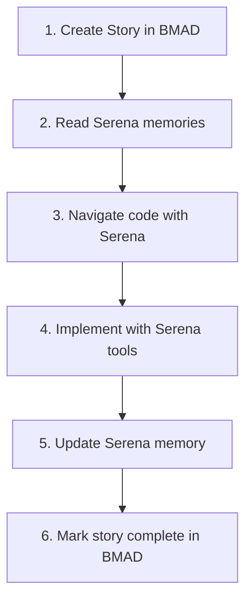

# FilterMate - Serena + BMAD Integration Guide

## 📋 Overview

FilterMate utilizes both **Serena** (code-level AI assistance) and **BMAD** (project methodology) to provide comprehensive development support.

## 🔗 System Mapping

### Serena Memories ↔ BMAD Documents

| Serena Memory | BMAD Document | Purpose |
|---------------|---------------|---------|
| `project_overview` | `project.bmad.md` | Project vision & status |
| `architecture_overview` | `architecture.md` | Technical architecture |
| `backend_architecture` | `architecture.md` | Multi-backend details |
| `code_style_conventions` | `quality.md` | Coding standards |
| `testing_documentation` | `quality.md` | Test guidelines |
| `undo_redo_system` | `epics.md` (EPIC-002) | Feature documentation |
| `performance_optimizations` | `prd.md` (NFR-PERF) | Performance specs |
| `known_issues_bugs` | `roadmap.md` | Issue tracking |

### When to Use Each

| Task | Use Serena | Use BMAD |
|------|:----------:|:--------:|
| Navigate code | ✅ `find_symbol()` | ❌ |
| Edit code | ✅ `replace_symbol_body()` | ❌ |
| Understand feature | ✅ `read_memory()` | ✅ `epics.md` |
| Plan new feature | ❌ | ✅ Add to `epics.md` |
| Track progress | ✅ `write_memory()` | ✅ Update `roadmap.md` |
| Check requirements | ❌ | ✅ `prd.md` |
| Review architecture | ✅ `architecture_overview` | ✅ `architecture.md` |

## 🔄 Development Workflow

### New Feature Development



### Step-by-Step

1. **Plan** → Add user story to `.bmad-core/epics.md`
2. **Context** → Read relevant `.serena/memories/*.md`
3. **Navigate** → Use `get_symbols_overview()`, `find_symbol()`
4. **Edit** → Use `replace_symbol_body()`, `insert_after_symbol()`
5. **Document** → Update/create Serena memory with `write_memory()`
6. **Complete** → Update BMAD status to ✅

## 📁 File Locations

### Serena Files
```
.serena/
├── project.yml           # Project config
├── project_memory.md     # Main project context
├── optimization_rules.md # Token efficiency rules
├── serena_rules.md       # Copilot integration rules
└── memories/             # Detailed memories
    ├── architecture_overview.md
    ├── backend_architecture.md
    ├── code_quality_improvements_2025.md
    └── ... (18 memory files)
```

### BMAD Files
```
.bmad-core/
├── README.md             # Documentation index
├── project.bmad.md       # Project definition
├── prd.md                # Product requirements
├── architecture.md       # Technical architecture
├── epics.md              # Epics & user stories
├── roadmap.md            # Development roadmap
├── quality.md            # Quality standards
├── personas.md           # User personas
└── tech-stack.md         # Technology stack
```

### Copilot Configuration
```
.github/
└── copilot-instructions.md  # Coding guidelines

.vscode/
├── settings.json            # Copilot settings
└── mcp.json                 # MCP server config
```

## 🎯 Quick Reference Commands

### Start of Session
```
# Copilot automatically loads:
# 1. .github/copilot-instructions.md
# 2. .serena/project_memory.md  
# 3. Serena MCP tools

# Check status:
mcp_oraios_serena_get_current_config()
```

### Feature Development
```python
# Read BMAD requirements
# → Check .bmad-core/prd.md for requirements

# Read Serena context
mcp_oraios_serena_read_memory("architecture_overview")

# Navigate code
mcp_oraios_serena_get_symbols_overview("modules/appTasks.py")
mcp_oraios_serena_find_symbol("FilterTask", depth=1)

# Edit code
mcp_oraios_serena_replace_symbol_body(...)

# Update memory
mcp_oraios_serena_write_memory("feature_name", content)
```

### After Feature Complete
```
# Update BMAD:
# 1. Mark story ✅ in epics.md
# 2. Update roadmap.md if needed

# Update Serena:
# 1. Update relevant memory
# 2. Add to project_overview if significant
```

## 📊 Integration Status

| Component | Status | Notes |
|-----------|--------|-------|
| Serena MCP | ✅ Active | Auto-starts with Copilot Chat |
| Serena Memories | ✅ 18 files | Complete project context |
| BMAD Core | ✅ 9 files | Full methodology docs |
| Copilot Rules | ✅ Updated | Integrated guidelines |
| VSCode Config | ✅ Configured | Auto-loads context |

## 🔧 Maintenance

### Weekly Tasks
- [ ] Sync Serena memories with recent changes
- [ ] Update BMAD roadmap status
- [ ] Review and archive completed stories

### After Major Release
- [ ] Update `project.bmad.md` version
- [ ] Update `roadmap.md` completed phases
- [ ] Archive old memories if obsolete
- [ ] Refresh `project_overview` memory
