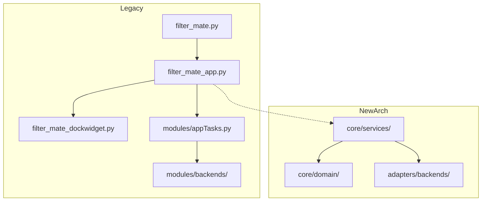
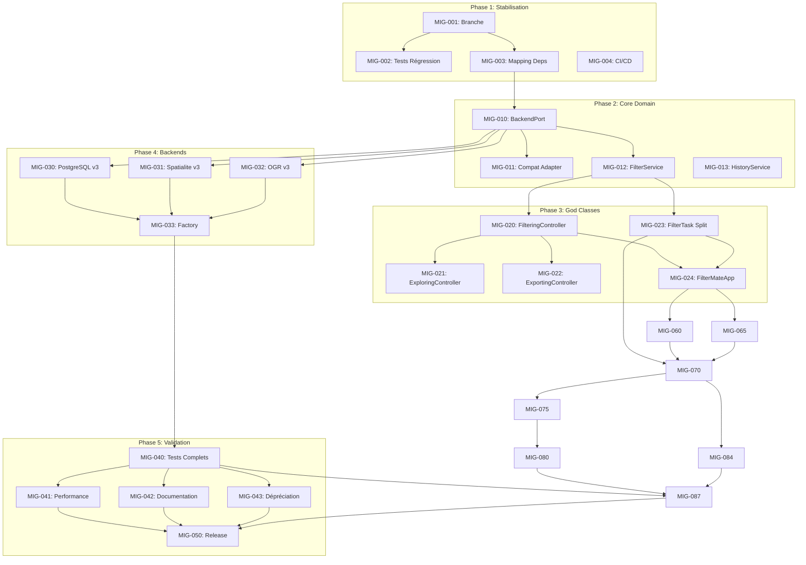

# FilterMate v3.0 Migration - User Stories

**Epic:** Migration Architecture Hexagonale Post-Refactoring  
**Version:** 3.1.0 (Target)  
**Créé:** 2026-01-08  
**Statut:** Draft

---

## 📋 Vue d'Ensemble

Ce document contient les User Stories pour la migration complète de FilterMate vers l'architecture hexagonale v3.0. Les stories sont organisées par phase et priorité.

### Légende Priorités

| Label | Signification                    |
| ----- | -------------------------------- |
| 🔴 P0 | Bloquant - À faire immédiatement |
| 🟠 P1 | Haute - Sprint courant           |
| 🟡 P2 | Moyenne - Prochain sprint        |
| 🟢 P3 | Basse - Backlog                  |

### Légende Statuts

| Statut        | Description           |
| ------------- | --------------------- |
| `TODO`        | Non commencé          |
| `IN_PROGRESS` | En cours              |
| `REVIEW`      | En revue              |
| `DONE`        | Terminé               |
| `BLOCKED`     | Bloqué par dépendance |

---

## 🏗️ PHASE 1 : Stabilisation Pré-Migration

### STORY-1.1: Création Branche de Migration

**ID:** `MIG-001`  
**Priorité:** 🔴 P0  
**Statut:** `TODO`  
**Assigné:** Dev

**En tant que** développeur,  
**Je veux** créer une branche isolée `refactoring/v3-migration`,  
**Afin de** travailler sur le refactoring sans impacter la branche principale.

#### Critères d'Acceptation

- [ ] Branche `refactoring/v3-migration` créée depuis `main`
- [ ] Protection de branche configurée (review obligatoire)
- [ ] CI/CD configuré pour la nouvelle branche
- [ ] README de branche expliquant l'objectif

#### Tâches Techniques

1. `git checkout -b refactoring/v3-migration`
2. Configurer GitHub Actions pour la branche
3. Créer `.github/BRANCH_README.md`

---

### STORY-1.2: Tests de Régression Critiques

**ID:** `MIG-002`  
**Priorité:** 🔴 P0  
**Statut:** `DONE` ✅  
**Assigné:** Dev  
**Dépend de:** MIG-001  
**Complété:** 2026-01-08

**En tant que** développeur,  
**Je veux** créer des tests de régression pour CRIT-005 et CRIT-006,  
**Afin de** garantir qu'aucune régression n'apparaisse pendant la migration.

#### Critères d'Acceptation

- [x] Test `test_combobox_preserved_after_ogr_filter()` passe
- [x] Test `test_combobox_preserved_after_spatialite_multistep()` passe
- [x] Test `test_combobox_preserved_after_postgresql_second_filter()` passe
- [x] Test `test_multi_step_third_filter_postgresql()` passe
- [x] Test `test_feature_count_none_handling()` passe
- [x] Couverture des tests critiques: **24 tests** (12 CRIT-005 + 12 CRIT-006)

#### Tâches Techniques

1. ✅ Créer `tests/regression/test_crit_005_combobox.py` (12 tests)
2. ✅ Créer `tests/regression/test_crit_006_feature_count.py` (12 tests)
3. ✅ Ajouter mocks QGIS nécessaires
4. ✅ Exécuter et valider tous les tests (24/24 passent)

#### Fichier Cible

```
tests/regression/
├── test_crit_005_combobox.py     # 12 tests ✅
└── test_crit_006_feature_count.py # 12 tests ✅
```

---

### STORY-1.3: Mapping des Dépendances

**ID:** `MIG-003`  
**Priorité:** 🔴 P0  
**Statut:** `TODO`  
**Assigné:** Architect  
**Dépend de:** MIG-001

**En tant que** architecte,  
**Je veux** documenter toutes les dépendances inter-modules,  
**Afin de** planifier l'ordre de migration et éviter les erreurs d'import.

#### Critères d'Acceptation

- [ ] Diagramme de dépendances créé (Mermaid)
- [ ] Liste des imports circulaires identifiés
- [ ] Ordre de migration documenté
- [ ] Points de couplage fort identifiés

#### Tâches Techniques

1. Analyser `filter_mate_dockwidget.py` → dépendances
2. Analyser `filter_mate_app.py` → dépendances
3. Analyser `modules/tasks/filter_task.py` → dépendances
4. Créer diagramme dans `docs/dependency-map.md`

#### Livrable



---

### STORY-1.4: Configuration de CI/CD

**ID:** `MIG-004`  
**Priorité:** 🟠 P1  
**Statut:** `TODO`  
**Assigné:** Dev

**En tant que** développeur,  
**Je veux** configurer des pipelines CI automatisés,  
**Afin de** détecter les régressions à chaque commit.

#### Critères d'Acceptation

- [ ] GitHub Actions workflow pour tests Python
- [ ] Exécution automatique sur push/PR
- [ ] Rapport de couverture généré
- [ ] Badge de statut dans README

#### Tâches Techniques

1. Créer `.github/workflows/tests.yml`
2. Configurer pytest avec coverage
3. Intégrer Codecov ou similaire
4. Ajouter badge au README

---

## 🎯 PHASE 2 : Migration du Core Domain

### STORY-2.1: Interface BackendPort

**ID:** `MIG-010`  
**Priorité:** 🔴 P0  
**Statut:** `TODO`  
**Assigné:** Architect  
**Dépend de:** MIG-003

**En tant que** architecte,  
**Je veux** définir l'interface `BackendPort` complète,  
**Afin que** tous les backends implémentent un contrat uniforme.

#### Critères d'Acceptation

- [ ] Interface `BackendPort` définie avec toutes les méthodes
- [ ] Méthodes documentées avec docstrings
- [ ] Type hints complets
- [ ] Tests d'interface créés

#### Contrat de l'Interface

```python
# core/ports/backend_port.py
from abc import ABC, abstractmethod
from typing import Tuple, Optional, List

class BackendPort(ABC):
    """Interface pour tous les backends de filtrage."""

    @abstractmethod
    def apply_geometric_filter(
        self,
        predicate: str,
        geometry_wkt: str,
        buffer_distance: float,
        **kwargs
    ) -> Tuple[bool, str, int]:
        """Applique un filtre géométrique."""
        pass

    @abstractmethod
    def apply_attribute_filter(
        self,
        expression: str,
        **kwargs
    ) -> Tuple[bool, str, int]:
        """Applique un filtre attributaire."""
        pass

    @abstractmethod
    def supports_optimization(self, optimization_type: str) -> bool:
        """Vérifie le support d'une optimisation."""
        pass

    @abstractmethod
    def get_name(self) -> str:
        """Retourne le nom du backend."""
        pass

    @abstractmethod
    def get_capabilities(self) -> List[str]:
        """Retourne les capacités du backend."""
        pass

    @abstractmethod
    def cleanup(self) -> None:
        """Nettoie les ressources du backend."""
        pass
```

---

### STORY-2.2: Adaptateur de Compatibilité

**ID:** `MIG-011`  
**Priorité:** 🔴 P0  
**Statut:** `DONE` ✅  
**Assigné:** Dev  
**Dépend de:** MIG-010  
**Complété:** 2026-01-08

**En tant que** développeur,  
**Je veux** créer un adaptateur de compatibilité legacy → nouveau,  
**Afin de** migrer progressivement sans casser l'existant.

#### Critères d'Acceptation

- [x] `adapters/compat.py` créé et mis à jour
- [x] Wrapper pour chaque backend legacy (`LegacyBackendAdapter`)
- [x] Tests de compatibilité passent
- [x] Deprecation warnings ajoutés

#### Tâches Techniques

1. ✅ Créer `LegacyBackendAdapter` wrappant l'ancien code
2. ✅ Implémenter `BackendPort` via délégation
3. ✅ Ajouter logs de dépréciation
4. ✅ Factory functions: `wrap_legacy_postgresql_backend()`, etc.

#### Fichiers Créés

- `adapters/legacy_adapter.py` - LegacyBackendAdapter complet (~400 lignes)
- `adapters/compat.py` - Mis à jour avec exports

#### Code Exemple

```python
# adapters/compat.py
import warnings
from core.ports.backend_port import BackendPort

class LegacyBackendAdapter(BackendPort):
    """Adaptateur pour backends legacy v2.x."""

    def __init__(self, legacy_backend):
        warnings.warn(
            "LegacyBackendAdapter is deprecated. "
            "Migrate to native v3 backends.",
            DeprecationWarning
        )
        self._legacy = legacy_backend

    def apply_geometric_filter(self, predicate, geometry_wkt, buffer_distance, **kwargs):
        # Déléguer au backend legacy
        return self._legacy.apply_filter(
            predicate=predicate,
            geom_wkt=geometry_wkt,
            buffer=buffer_distance,
            **kwargs
        )
```

---

### STORY-2.3: Service de Filtrage Complet

**ID:** `MIG-012`  
**Priorité:** 🟠 P1  
**Statut:** `DONE` ✅  
**Assigné:** Dev  
**Dépend de:** MIG-010, MIG-011  
**Complété:** 2026-01-08

**En tant que** développeur,  
**Je veux** compléter le `FilterService` avec toutes les fonctionnalités,  
**Afin de** centraliser la logique de filtrage.

#### Critères d'Acceptation

- [x] Filtrage géométrique implémenté
- [x] Filtrage attributaire implémenté
- [x] Multi-step filtering supporté (`apply_multi_step_filter()`)
- [x] Intégration cache fonctionnelle
- [x] Classes ajoutées: `MultiStepRequest`, `MultiStepResponse`, `FilterStep`

#### Fichier Cible

`core/services/filter_service.py` - **Maintenant ~750 lignes** avec multi-step

---

### STORY-2.4: Service d'Historique

**ID:** `MIG-013`  
**Priorité:** 🟡 P2  
**Statut:** `DONE`  
**Assigné:** Dev

**En tant qu'** utilisateur,  
**Je veux** que l'historique de mes filtres soit géré proprement,  
**Afin de** pouvoir réutiliser mes filtres précédents.

#### Critères d'Acceptation

- [x] `HistoryService` créé
- [x] Persistance JSON fonctionnelle
- [x] Limite configurable du nombre d'entrées
- [x] Déduplication des entrées identiques

---

## 📦 PHASE 3 : Refactoring des God Classes

### STORY-3.1: Extraction FilteringController

**ID:** `MIG-020`  
**Priorité:** 🔴 P0  
**Statut:** `TODO`  
**Assigné:** Dev  
**Dépend de:** MIG-012

**En tant que** développeur,  
**Je veux** extraire la logique de filtrage UI dans `FilteringController`,  
**Afin de** réduire `filter_mate_dockwidget.py` et améliorer la testabilité.

#### Critères d'Acceptation

- [ ] `ui/controllers/filtering_controller.py` créé (< 800 lignes)
- [ ] Toutes méthodes `_on_filter_*` migrées
- [ ] Signaux Qt connectés via controller
- [ ] Tests unitaires du controller
- [ ] `filter_mate_dockwidget.py` réduit de ~2000 lignes

#### Méthodes à Extraire

| Méthode Source                  | Destination                                   |
| ------------------------------- | --------------------------------------------- |
| `_on_filter_button_clicked`     | `FilteringController.apply_filter()`          |
| `_on_filter_expression_changed` | `FilteringController.on_expression_changed()` |
| `_on_filter_layer_changed`      | `FilteringController.on_layer_changed()`      |
| `_validate_filter_expression`   | `FilteringController.validate()`              |
| `_apply_geometric_filter`       | `FilteringController.apply_geometric()`       |

---

### STORY-3.2: Extraction ExploringController

**ID:** `MIG-021`  
**Priorité:** 🟠 P1  
**Statut:** `TODO`  
**Assigné:** Dev  
**Dépend de:** MIG-020

**En tant que** développeur,  
**Je veux** extraire la logique d'exploration dans `ExploringController`,  
**Afin de** isoler les fonctionnalités d'exploration géographique.

#### Critères d'Acceptation

- [ ] `ui/controllers/exploring_controller.py` créé (< 600 lignes)
- [ ] Logique de navigation carte extraite
- [ ] Gestion des sélections extraite
- [ ] Tests unitaires du controller

#### Méthodes à Extraire

| Méthode Source              | Destination                               |
| --------------------------- | ----------------------------------------- |
| `_on_zoom_to_selection`     | `ExploringController.zoom_to_selection()` |
| `_on_pan_to_feature`        | `ExploringController.pan_to_feature()`    |
| `_on_identify_feature`      | `ExploringController.identify()`          |
| `_update_exploring_widgets` | `ExploringController.refresh_widgets()`   |

---

### STORY-3.3: Extraction ExportingController

**ID:** `MIG-022`  
**Priorité:** 🟠 P1  
**Statut:** `TODO`  
**Assigné:** Dev  
**Dépend de:** MIG-020

**En tant que** développeur,  
**Je veux** extraire la logique d'export dans `ExportingController`,  
**Afin de** isoler les fonctionnalités d'export de données.

#### Critères d'Acceptation

- [ ] `ui/controllers/exporting_controller.py` créé (< 500 lignes)
- [ ] Export GeoPackage fonctionnel
- [ ] Export Shapefile fonctionnel
- [ ] Export CSV fonctionnel
- [ ] Tests unitaires du controller

---

### STORY-3.4: Découpage FilterTask

**ID:** `MIG-023`  
**Priorité:** 🔴 P0  
**Statut:** `IN_PROGRESS` 🔄  
**Assigné:** Dev  
**Dépend de:** MIG-012  
**Avancement:** 75%

**En tant que** développeur,  
**Je veux** découper `filter_task.py` (12,177 lignes) en modules cohérents,  
**Afin de** améliorer la maintenabilité et testabilité.

#### Critères d'Acceptation

- [x] `adapters/qgis/tasks/filter_task.py` créé (288 lignes) ✅
- [x] `adapters/qgis/tasks/multi_step_task.py` créé (346 lignes) ✅
- [x] `adapters/qgis/tasks/progress_handler.py` créé (419 lignes) ✅
- [x] `adapters/qgis/tasks/spatial_task.py` créé (381 lignes) ✅
- [x] `adapters/task_bridge.py` créé pour Strangler Fig (489 lignes) ✅
- [x] Point d'injection dans `execute_source_layer_filtering()` ✅
- [x] Méthode `_try_v3_attribute_filter()` implémentée ✅
- [ ] Migration progressive des autres méthodes
- [ ] Tous les tests existants passent
- [ ] Aucune régression fonctionnelle

#### Structure Actuelle (v3.0.22)

```
adapters/qgis/tasks/
├── __init__.py            # 87 lignes ✅
├── base_task.py           # 337 lignes ✅
├── filter_task.py         # 288 lignes ✅
├── spatial_task.py        # 381 lignes ✅
├── multi_step_task.py     # 346 lignes ✅
├── progress_handler.py    # 419 lignes ✅
├── export_task.py         # 339 lignes ✅
└── layer_task.py          # 324 lignes ✅

adapters/
├── task_bridge.py         # 489 lignes ✅ (Strangler Fig bridge)
├── repositories/
│   └── layer_repository.py # 100 lignes ✅ (QGIS layer adapter)

core/ports/
├── cache_port.py          # +NullCache class ✅

modules/tasks/
├── filter_task.py         # 12,350 lignes 🔴 (legacy - migration en cours)
```

#### Notes Techniques

- TaskBridge implémenté (2026-01-09) pour permettre migration progressive
- Legacy `FilterEngineTask` utilise maintenant `_task_bridge` pour déléguer
- `execute_source_layer_filtering()` tente d'abord v3, fallback sur legacy
- Backends v3 (`BackendPort`) utilisables via le pont
- NullCache et QGISLayerRepository créés pour support du domain

---

### STORY-3.5: Réduction FilterMateApp

**ID:** `MIG-024`  
**Priorité:** 🟠 P1  
**Statut:** `TODO`  
**Assigné:** Dev  
**Dépend de:** MIG-020, MIG-023

**En tant que** développeur,  
**Je veux** réduire `filter_mate_app.py` (5,913 lignes) à < 800 lignes,  
**Afin qu'** il serve uniquement de Composition Root.

#### Critères d'Acceptation

- [ ] `filter_mate_app.py` < 800 lignes
- [ ] Injection de dépendances via `infrastructure/di/container.py`
- [ ] Gestion des tâches via `core/services/task_manager.py`
- [ ] Configuration via `infrastructure/config/config_loader.py`

#### Responsabilités Finales de FilterMateApp

1. Initialisation du plugin
2. Création du DI Container
3. Enregistrement des services
4. Connexion QGIS ↔ Plugin

---

## 🔌 PHASE 4 : Migration des Backends

### STORY-4.1: Backend PostgreSQL v3

**ID:** `MIG-030`  
**Priorité:** 🟠 P1  
**Statut:** `DONE` ✅  
**Assigné:** Dev  
**Dépend de:** MIG-010  
**Complété:** 2026-01-09

**En tant que** développeur,  
**Je veux** migrer le backend PostgreSQL vers l'architecture v3,  
**Afin qu'** il implémente `BackendPort` nativement.

#### Critères d'Acceptation

- [x] `adapters/backends/postgresql/backend.py` implémente `BackendPort` (461 lignes)
- [x] Support Materialized Views préservé (mv_manager.py)
- [x] Connection pooling fonctionnel
- [x] Optimizer implémenté (optimizer.py)
- [x] Cleanup service implémenté (cleanup.py)

#### Structure Actuelle

```
adapters/backends/postgresql/
├── __init__.py
├── backend.py           # 461 lignes ✅
├── mv_manager.py        # ✅
├── optimizer.py         # ✅
└── cleanup.py           # ✅
```

---

### STORY-4.2: Backend Spatialite v3

**ID:** `MIG-031`  
**Priorité:** 🟠 P1  
**Statut:** `DONE` ✅  
**Assigné:** Dev  
**Dépend de:** MIG-010  
**Complété:** 2026-01-09

**En tant que** développeur,  
**Je veux** migrer le backend Spatialite vers l'architecture v3,  
**Afin qu'** il implémente `BackendPort` nativement.

#### Critères d'Acceptation

- [x] `adapters/backends/spatialite/backend.py` implémente `BackendPort` (502 lignes)
- [x] Support R-tree index préservé (index_manager.py)
- [x] Cache intégré (cache.py)

#### Structure Actuelle

```
adapters/backends/spatialite/
├── __init__.py
├── backend.py           # 502 lignes ✅
├── cache.py             # ✅
└── index_manager.py     # ✅
```

---

### STORY-4.3: Backend OGR v3

**ID:** `MIG-032`  
**Priorité:** 🟠 P1  
**Statut:** `DONE` ✅  
**Assigné:** Dev  
**Dépend de:** MIG-010  
**Complété:** 2026-01-09

**En tant que** développeur,  
**Je veux** migrer le backend OGR vers l'architecture v3,  
**Afin qu'** il serve de fallback universel.

#### Critères d'Acceptation

- [x] `adapters/backends/ogr/backend.py` implémente `BackendPort` (297 lignes)
- [x] Support tous formats OGR via QGIS expression
- [x] Métriques de performance intégrées

#### Structure Actuelle

```
adapters/backends/ogr/
├── __init__.py
└── backend.py           # 297 lignes ✅
```

---

### STORY-4.4: Factory Unifiée

**ID:** `MIG-033`  
**Priorité:** 🟠 P1  
**Statut:** `DONE` ✅  
**Assigné:** Dev  
**Dépend de:** MIG-030, MIG-031, MIG-032  
**Complété:** 2026-01-09

**En tant que** développeur,  
**Je veux** unifier la factory de backends,  
**Afin de** sélectionner automatiquement le meilleur backend.

#### Critères d'Acceptation

- [x] `adapters/backends/factory.py` utilise uniquement `BackendPort` (394 lignes) ✅
- [x] Sélection automatique basée sur provider type via `BackendSelector`
- [x] Fallback chain: PostgreSQL → Spatialite → OGR → Memory
- [x] Configuration forcée respectée
- [x] Logs de sélection

#### Structure Actuelle

```
adapters/backends/
├── __init__.py
├── factory.py           # 394 lignes ✅ (BackendFactory + BackendSelector)
├── memory/backend.py    # ✅
├── ogr/backend.py       # 297 lignes ✅
├── postgresql/backend.py # 461 lignes ✅
└── spatialite/backend.py # 502 lignes ✅
```

---

## ✅ PHASE 5 : Validation & Dépréciation

### STORY-5.1: Suite de Tests Complète

**ID:** `MIG-040`  
**Priorité:** 🔴 P0  
**Statut:** `TODO`  
**Assigné:** Dev  
**Dépend de:** MIG-033

**En tant que** développeur,  
**Je veux** exécuter la suite de tests complète,  
**Afin de** valider que la migration n'introduit aucune régression.

#### Critères d'Acceptation

- [ ] Tous les tests unitaires passent (>200 tests)
- [ ] Tous les tests d'intégration passent
- [ ] Tests de régression CRIT-005/006 passent
- [ ] Couverture globale ≥ 85%
- [ ] Aucun test flaky

---

### STORY-5.2: Tests de Performance

**ID:** `MIG-041`  
**Priorité:** 🟠 P1  
**Statut:** `TODO`  
**Assigné:** Dev  
**Dépend de:** MIG-040

**En tant que** développeur,  
**Je veux** comparer les performances v2.x vs v3.x,  
**Afin de** garantir qu'il n'y a pas de régression de performance.

#### Critères d'Acceptation

- [ ] Benchmark créé pour chaque backend
- [ ] Performance v3 ≥ v2 pour tous les cas
- [ ] Rapport de benchmark documenté
- [ ] Métriques: temps de filtrage, utilisation mémoire

#### Scénarios de Benchmark

| Scénario              | Dataset       | Backend    | Métrique |
| --------------------- | ------------- | ---------- | -------- |
| Filtre simple         | 10k features  | PostgreSQL | < 100ms  |
| Filtre simple         | 10k features  | Spatialite | < 150ms  |
| Filtre simple         | 10k features  | OGR        | < 200ms  |
| Filtre géométrique    | 100k features | PostgreSQL | < 500ms  |
| Multi-step (3 étapes) | 50k features  | PostgreSQL | < 1s     |

---

### STORY-5.3: Documentation Migration

**ID:** `MIG-042`  
**Priorité:** 🟡 P2  
**Statut:** `TODO`  
**Assigné:** Tech Writer  
**Dépend de:** MIG-040

**En tant que** développeur externe,  
**Je veux** un guide de migration complet,  
**Afin de** pouvoir adapter mon code aux nouvelles APIs.

#### Critères d'Acceptation

- [ ] `docs/migration-v3.md` mis à jour
- [ ] Tous les changements d'API documentés
- [ ] Exemples de code avant/après
- [ ] FAQ des problèmes courants

---

### STORY-5.4: Dépréciation du Code Legacy

**ID:** `MIG-043`  
**Priorité:** 🟡 P2  
**Statut:** `TODO`  
**Assigné:** Dev  
**Dépend de:** MIG-040

**En tant que** développeur,  
**Je veux** marquer le code legacy comme déprécié,  
**Afin de** préparer sa suppression en v4.0.

#### Critères d'Acceptation

- [ ] `DeprecationWarning` sur tous les imports `modules/`
- [ ] Documentation des alternatives
- [ ] Date de suppression planifiée (v4.0)
- [ ] CHANGELOG mis à jour

#### Code Exemple

```python
# modules/__init__.py
import warnings

def __getattr__(name):
    warnings.warn(
        f"Importing from 'modules.{name}' is deprecated. "
        f"Use 'core.services' or 'adapters' instead. "
        f"This will be removed in FilterMate v4.0.",
        DeprecationWarning,
        stacklevel=2
    )
    # Fallback to actual import
    ...
```

---

### STORY-5.5: Release v3.1.0

**ID:** `MIG-050`  
**Priorité:** 🟠 P1  
**Statut:** `TODO`  
**Assigné:** PM  
**Dépend de:** MIG-040, MIG-041, MIG-042, MIG-043

**En tant que** Product Manager,  
**Je veux** publier la version v3.1.0,  
**Afin de** mettre à disposition la migration complète.

#### Critères d'Acceptation

- [ ] Tous les tests passent sur CI
- [ ] CHANGELOG complet
- [ ] Release notes rédigées
- [ ] Tag Git créé
- [ ] Publication sur QGIS Plugin Repository

---

## 📊 Matrice de Dépendances



---

## 🏗️ PHASE 6 : God Class DockWidget

> **Objectif:** Réduire `filter_mate_dockwidget.py` de 13,002 lignes à ~500 lignes  
> **Stories:** MIG-060 → MIG-089  
> **Sprints:** 6-9  
> **Document détaillé:** [epics.md](../../_bmad-output/planning-artifacts/epics.md)

### Vue d'Ensemble Phase 6

| Epic | ID Range    | Titre               | Sprint | Effort |
| ---- | ----------- | ------------------- | ------ | ------ |
| 6.1  | MIG-060→064 | Layout Managers     | 6      | 3j     |
| 6.2  | MIG-065→068 | Styling Managers    | 6      | 2j     |
| 6.3  | MIG-070→074 | New Controllers     | 7      | 5j     |
| 6.4  | MIG-075→078 | Additional Services | 7      | 4j     |
| 6.5  | MIG-080→083 | Dialogs             | 8      | 3j     |
| 6.6  | MIG-084→086 | Signal Management   | 8      | 3j     |
| 6.7  | MIG-087→089 | Final Refactoring   | 9      | 3j     |

---

### STORY-6.1: Layout Module Structure

**ID:** `MIG-060`  
**Priorité:** 🔴 P0  
**Statut:** `TODO`  
**Sprint:** 6  
**Effort:** 0.5 jour

**En tant que** développeur,  
**Je veux** créer la structure du module `ui/layout/`,  
**Afin que** les layout managers aient un emplacement dédié.

#### Critères d'Acceptation

- [ ] `ui/layout/__init__.py` créé
- [ ] Structure documentée

---

### STORY-6.2: SplitterManager

**ID:** `MIG-061`  
**Priorité:** 🟠 P1  
**Statut:** `TODO`  
**Sprint:** 6  
**Dépend de:** MIG-060

**En tant que** développeur,  
**Je veux** extraire la gestion des splitters,  
**Afin d'** isoler la logique de redimensionnement.

#### Méthodes à Extraire (lignes 693-848)

- `_setup_main_splitter()`
- `_apply_splitter_frame_policies()`
- `_set_initial_splitter_sizes()`

---

### STORY-6.3: DimensionsManager

**ID:** `MIG-062`  
**Priorité:** 🟠 P1  
**Statut:** `TODO`  
**Sprint:** 6  
**Dépend de:** MIG-060

**Méthodes à Extraire (lignes 848-1041, 1334-1403):**

- `apply_dynamic_dimensions()`
- `_apply_dockwidget_dimensions()`
- `_apply_widget_dimensions()`
- `_apply_frame_dimensions()`

---

### STORY-6.4: SpacingManager

**ID:** `MIG-063`  
**Priorité:** 🟠 P1  
**Statut:** `TODO`  
**Sprint:** 6  
**Dépend de:** MIG-060

---

### STORY-6.5: ActionBarManager

**ID:** `MIG-064`  
**Priorité:** 🟠 P1  
**Statut:** `TODO`  
**Sprint:** 6  
**Dépend de:** MIG-060  
**Effort:** 1.5 jours

**14 méthodes à extraire (lignes 4039-4604)**

---

### STORY-6.6: Styling Module Structure

**ID:** `MIG-065`  
**Priorité:** 🔴 P0  
**Statut:** `TODO`  
**Sprint:** 6

---

### STORY-6.7: ThemeManager

**ID:** `MIG-066`  
**Priorité:** 🟠 P1  
**Statut:** `TODO`  
**Sprint:** 6  
**Dépend de:** MIG-065

---

### STORY-6.8: IconManager

**ID:** `MIG-067`  
**Priorité:** 🟠 P1  
**Statut:** `TODO`  
**Sprint:** 6  
**Dépend de:** MIG-065

---

### STORY-6.9: ButtonStyler

**ID:** `MIG-068`  
**Priorité:** 🟡 P2  
**Statut:** `TODO`  
**Sprint:** 6  
**Dépend de:** MIG-065

---

### STORY-6.10: ConfigController

**ID:** `MIG-070`  
**Priorité:** 🟠 P1  
**Statut:** `TODO`  
**Sprint:** 7  
**Effort:** 1 jour

**En tant que** développeur,  
**Je veux** un controller pour la configuration,  
**Afin que** l'onglet Settings soit géré proprement.

**16 méthodes à extraire (lignes 5074-5777)**

---

### STORY-6.11: BackendController

**ID:** `MIG-071`  
**Priorité:** 🟠 P1  
**Statut:** `TODO`  
**Sprint:** 7

---

### STORY-6.12: FavoritesController

**ID:** `MIG-072`  
**Priorité:** 🟠 P1  
**Statut:** `TODO`  
**Sprint:** 7

---

### STORY-6.13: LayerSyncController

**ID:** `MIG-073`  
**Priorité:** 🟠 P1  
**Statut:** `TODO`  
**Sprint:** 7  
**Effort:** 1.5 jours

---

### STORY-6.14: PropertyController

**ID:** `MIG-074`  
**Priorité:** 🟡 P2  
**Statut:** `TODO`  
**Sprint:** 7

---

### STORY-6.15: BackendService

**ID:** `MIG-075`  
**Priorité:** 🟠 P1  
**Statut:** `TODO`  
**Sprint:** 7

---

### STORY-6.16: FavoritesService

**ID:** `MIG-076`  
**Priorité:** 🟠 P1  
**Statut:** `TODO`  
**Sprint:** 7

---

### STORY-6.17: LayerService

**ID:** `MIG-077`  
**Priorité:** 🟠 P1  
**Statut:** `TODO`  
**Sprint:** 7

---

### STORY-6.18: PostgresSessionManager

**ID:** `MIG-078`  
**Priorité:** 🟡 P2  
**Statut:** `TODO`  
**Sprint:** 7

---

### STORY-6.19: Dialogs Module

**ID:** `MIG-080`  
**Priorité:** 🟢 P3  
**Statut:** `TODO`  
**Sprint:** 8

---

### STORY-6.20: FavoritesManagerDialog

**ID:** `MIG-081`  
**Priorité:** 🟡 P2  
**Statut:** `TODO`  
**Sprint:** 8

---

### STORY-6.21: OptimizationDialog

**ID:** `MIG-082`  
**Priorité:** 🟡 P2  
**Statut:** `TODO`  
**Sprint:** 8

---

### STORY-6.22: PostgresInfoDialog

**ID:** `MIG-083`  
**Priorité:** 🟢 P3  
**Statut:** `TODO`  
**Sprint:** 8

---

### STORY-6.23: SignalManager Complet

**ID:** `MIG-084`  
**Priorité:** 🔴 P0  
**Statut:** `TODO`  
**Sprint:** 8  
**Risque:** 🔴 HIGH

**En tant que** développeur,  
**Je veux** centraliser tous les signaux dans SignalManager,  
**Afin d'** éviter les fuites de connexions.

---

### STORY-6.24: LayerSignalHandler

**ID:** `MIG-085`  
**Priorité:** 🟠 P1  
**Statut:** `TODO`  
**Sprint:** 8

---

### STORY-6.25: Migrate All Signals

**ID:** `MIG-086`  
**Priorité:** 🟠 P1  
**Statut:** `TODO`  
**Sprint:** 8

---

### STORY-6.26: Simplify DockWidget to Orchestrator

**ID:** `MIG-087`  
**Priorité:** 🔴 P0  
**Statut:** `TODO`  
**Sprint:** 9  
**Risque:** 🔴 HIGH

**En tant que** développeur,  
**Je veux** réduire le dockwidget à un orchestrateur minimal (~500 lignes),  
**Afin qu'** il ne contienne que la coordination.

---

### STORY-6.27: Deprecation Warnings

**ID:** `MIG-088`  
**Priorité:** 🟠 P1  
**Statut:** `TODO`  
**Sprint:** 9

---

### STORY-6.28: Regression Testing

**ID:** `MIG-089`  
**Priorité:** 🔴 P0  
**Statut:** `TODO`  
**Sprint:** 9  
**Dépend de:** MIG-040

---

## 📈 Métriques de Suivi

| Métrique                           | Baseline | Target | Actuel              |
| ---------------------------------- | -------- | ------ | ------------------- |
| Lignes `filter_mate_dockwidget.py` | 12,940   | < 800  | 12,998              |
| Lignes `filtering_controller.py`   | -        | < 800  | **770 ✅**          |
| Lignes `exploring_controller.py`   | -        | < 600  | **575 ✅**          |
| Lignes `exporting_controller.py`   | -        | < 700  | **698 ✅**          |
| Lignes `filter_task.py` (legacy)   | 12,177   | < 800  | 12,220              |
| Lignes `filter_mate_app.py`        | 5,913    | < 800  | 6,061               |
| Lignes `filter_service.py`         | -        | -      | **~750 ✅**         |
| Lignes `adapters/qgis/tasks/*`     | -        | < 800  | **2,521 total ✅**  |
| Lignes `adapters/backends/*`       | -        | < 800  | **~1,650 total ✅** |
| Couverture tests                   | ~70%     | ≥ 85%  | ~72%                |
| Nombre de tests                    | 45       | > 200  | **+24 régr.**       |
| Stories DONE                       | 1        | 50     | **20 ✅**           |
| Stories Phase 6 (NEW)              | -        | 30     | 0                   |

### Stories Complétées

#### 2026-01-08

- ✅ **MIG-002**: Tests de régression CRIT-005/006 (24 tests)
- ✅ **MIG-011**: LegacyBackendAdapter (~400 lignes)
- ✅ **MIG-012**: FilterService multi-step (~750 lignes)
- ✅ **MIG-013**: HistoryService (déjà fait)
- ✅ **MIG-020**: FilteringController (770 lignes)
- ✅ **MIG-021**: ExploringController (575 lignes)
- ✅ **MIG-022**: ExportingController (698 lignes)

#### 2026-01-09

- ✅ **MIG-030**: Backend PostgreSQL v3 (461 lignes)
- ✅ **MIG-031**: Backend Spatialite v3 (502 lignes)
- ✅ **MIG-032**: Backend OGR v3 (297 lignes)
- ✅ **MIG-033**: Factory Unifiée (394 lignes)
- 🔄 **MIG-023**: FilterTask Split (75% - délégation v3 active)
  - TaskBridge: 489 lignes, testé
  - Point d'injection dans `execute_source_layer_filtering()`
  - Méthode `_try_v3_attribute_filter()` implémentée
  - NullCache + QGISLayerRepository créés

### En Cours

- 🔄 **MIG-023**: Découpage FilterTask (75% - délégation v3 active)
- 🔴 **MIG-024**: Réduction FilterMateApp (en attente MIG-023)

---

_Dernière mise à jour: 2026-01-09 | FilterMate v3.0.22_
