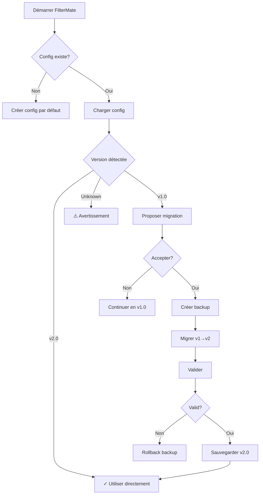

# Configuration Migration Guide

## 🔄 Vue d'ensemble

Le module de migration permet de mettre à jour automatiquement les anciennes configurations FilterMate vers la dernière version.

**Versions supportées :**
- ✅ **v1.0** → v2.0 (structure `APP.DOCKWIDGET` → `app.ui`)
- 🔮 Futures versions : support extensible

## 🚀 Utilisation rapide

### 1. Migration automatique (recommandé)

```python
from modules.config_migration import migrate_config_file

# Migrer la configuration par défaut
success = migrate_config_file()

# Ou spécifier un fichier
success = migrate_config_file('/chemin/vers/config.json')
```

### 2. Migration manuelle avec contrôle

```python
from modules.config_migration import ConfigMigration

migrator = ConfigMigration()

# Vérifier si migration nécessaire
with open('config.json', 'r') as f:
    config = json.load(f)

if migrator.needs_migration(config):
    print("Migration nécessaire!")
    
    # Effectuer la migration
    migrated, warnings = migrator.migrate(config)
    
    # Sauvegarder
    migrator.save_migrated_config(migrated)
    
    if warnings:
        for warning in warnings:
            print(f"⚠ {warning}")
```

### 3. Ligne de commande

```bash
# Migration interactive
python -m modules.config_migration

# Ou directement
cd /path/to/filter_mate
python modules/config_migration.py

# Avec un fichier spécifique
python modules/config_migration.py /path/to/config.json
```

## 📋 Fonctionnalités

### Détection automatique de version

```python
migrator = ConfigMigration()

version = migrator.detect_version(config_data)
# Retourne: "1.0", "2.0", ou "unknown"

needs_update = migrator.needs_migration(config_data)
# Retourne: True si migration nécessaire
```

### Backup automatique

Avant chaque migration, un backup est créé automatiquement :

```
config/backups/
├── config_backup_v1.0_20251217_143022.json
├── config_backup_v1.0_20251217_142010.json
└── ...
```

**Lister les backups :**

```python
backups = migrator.list_backups()
for backup in backups:
    print(f"{backup['filename']} - {backup['date']} - v{backup['version']}")
```

### Rollback vers un backup

```python
# Lister les backups disponibles
backups = migrator.list_backups()

# Rollback vers le plus récent
if backups:
    migrator.rollback_to_backup(backups[0]['path'])
```

### Validation après migration

```python
migrated, warnings = migrator.migrate(config_data, validate=True)

if warnings:
    print("Avertissements de validation:")
    for warning in warnings:
        print(f"  ⚠ {warning}")
```

## 🔀 Mapping v1.0 → v2.0

### Configuration générale

| v1.0 | v2.0 | Description |
|------|------|-------------|
| `APP.AUTO_ACTIVATE` | `app.auto_activate` | Auto-activation du plugin |

### Interface utilisateur

| v1.0 | v2.0 | Description |
|------|------|-------------|
| `APP.DOCKWIDGET.FEEDBACK_LEVEL` | `app.ui.feedback.level` | Niveau de feedback |
| `APP.DOCKWIDGET.LANGUAGE` | `app.ui.language` | Langue de l'interface |
| `APP.DOCKWIDGET.UI_PROFILE` | `app.ui.profile` | Profil UI (compact/normal) |
| `APP.DOCKWIDGET.ACTION_BAR.POSITION` | `app.ui.action_bar.position` | Position barre d'actions |
| `APP.DOCKWIDGET.ACTION_BAR.VERTICAL_ALIGNMENT` | `app.ui.action_bar.vertical_alignment` | Alignement vertical |
| `APP.DOCKWIDGET.COLORS.ACTIVE_THEME` | `app.ui.theme.active` | Thème actif |
| `APP.DOCKWIDGET.COLORS.THEME_SOURCE` | `app.ui.theme.source` | Source du thème |
| `APP.DOCKWIDGET.COLORS.THEMES` | `app.themes` | Définitions des thèmes |

### Boutons

| v1.0 | v2.0 | Description |
|------|------|-------------|
| `APP.DOCKWIDGET.BUTTONS.STYLE` | `app.buttons.style` | Style des boutons |
| `APP.DOCKWIDGET.BUTTONS.ICON_SIZE.ACTION_BUTTONS` | `app.buttons.icon_sizes.action` | Taille icônes action |
| `APP.DOCKWIDGET.BUTTONS.ICON_SIZE.OTHERS` | `app.buttons.icon_sizes.others` | Taille autres icônes |
| `APP.DOCKWIDGET.BUTTONS.ICONS` | `app.buttons.icons` | Chemins des icônes |

### Export

| v1.0 | v2.0 | Description |
|------|------|-------------|
| `APP.DOCKWIDGET.EXPORT.STYLE` | `app.export.style.format` | Format d'export des styles |
| `APP.DOCKWIDGET.EXPORT.DATA_FORMAT` | `app.export.data.format` | Format d'export des données |
| `APP.DOCKWIDGET.EXPORT.LAYERS_ENABLED` | `app.export.layers_enabled` | Export de couches activé |
| `APP.DOCKWIDGET.EXPORT.PROJECTION_ENABLED` | `app.export.projection_enabled` | Reprojection activée |
| `APP.DOCKWIDGET.EXPORT.PROJECTION_EPSG` | `app.export.projection_epsg` | Code EPSG cible |

### Projet

| v1.0 | v2.0 | Description |
|------|------|-------------|
| `CURRENT_PROJECT.OPTIONS.FEATURE_COUNT_LIMIT` | `app.project.feature_count_limit` | Limite de features |
| `CURRENT_PROJECT.OPTIONS.LAYER_PROPERTIES_COUNT` | `app.project.layer_properties_count` | Nb propriétés couches |
| `CURRENT_PROJECT.OPTIONS.LAYERS.LINK_LEGEND_LAYERS_AND_CURRENT_LAYER_FLAG` | `app.project.link_legend_layers` | Lien légende/couches |

## 📝 Exemple complet

```python
import json
from modules.config_migration import ConfigMigration

# Initialiser le migrateur
migrator = ConfigMigration('/path/to/config.json')

# Charger la config actuelle
with open('/path/to/config.json', 'r') as f:
    current_config = json.load(f)

# Détecter la version
version = migrator.detect_version(current_config)
print(f"Version détectée: {version}")

# Vérifier si migration nécessaire
if migrator.needs_migration(current_config):
    print("Migration nécessaire!")
    
    # Créer un backup
    backup_path = migrator.create_backup(current_config)
    print(f"Backup créé: {backup_path}")
    
    # Effectuer la migration
    migrated_config, warnings = migrator.migrate(
        current_config,
        create_backup=False,  # Déjà fait manuellement
        validate=True
    )
    
    # Afficher les avertissements
    if warnings:
        print("\nAvertissements:")
        for warning in warnings:
            print(f"  ⚠ {warning}")
    
    # Sauvegarder la config migrée
    if migrator.save_migrated_config(migrated_config):
        print("✓ Migration réussie!")
    else:
        print("✗ Échec de la sauvegarde")
        
        # Rollback si nécessaire
        if input("Rollback? (y/n): ") == 'y':
            migrator.rollback_to_backup(backup_path)
else:
    print("✓ Configuration déjà à jour")
```

## 🔧 Intégration dans le plugin

### Au démarrage du plugin

```python
# Dans filter_mate.py ou filter_mate_app.py

def initGui(self):
    """Initialize plugin GUI."""
    from modules.config_migration import ConfigMigration
    
    # Vérifier et migrer si nécessaire
    try:
        migrator = ConfigMigration()
        performed, warnings = migrator.auto_migrate_if_needed()
        
        if performed:
            from qgis.utils import iface
            iface.messageBar().pushInfo(
                "FilterMate",
                "Configuration mise à jour vers la dernière version"
            )
        
        if warnings:
            for warning in warnings:
                print(f"Config warning: {warning}")
    
    except Exception as e:
        print(f"Migration error: {e}")
    
    # Continuer l'initialisation normale
    # ...
```

### Menu de migration manuelle

```python
def add_migration_menu_item(self):
    """Add migration option to menu."""
    from qgis.PyQt.QtWidgets import QAction
    
    migrate_action = QAction("Update Configuration...", self.iface.mainWindow())
    migrate_action.triggered.connect(self.run_migration_dialog)
    self.iface.addPluginToMenu("FilterMate", migrate_action)

def run_migration_dialog(self):
    """Show migration dialog."""
    from modules.config_migration import ConfigMigration
    from qgis.PyQt.QtWidgets import QMessageBox
    
    migrator = ConfigMigration()
    
    # Charger config
    with open(migrator.config_path, 'r') as f:
        config = json.load(f)
    
    version = migrator.detect_version(config)
    
    if not migrator.needs_migration(config):
        QMessageBox.information(
            self.iface.mainWindow(),
            "Configuration",
            f"Configuration déjà à jour (v{version})"
        )
        return
    
    reply = QMessageBox.question(
        self.iface.mainWindow(),
        "Migration de configuration",
        f"Migrer de v{version} vers v{migrator.CURRENT_VERSION}?\n\n"
        "Un backup sera créé automatiquement.",
        QMessageBox.Yes | QMessageBox.No
    )
    
    if reply == QMessageBox.Yes:
        performed, warnings = migrator.auto_migrate_if_needed()
        
        if performed:
            msg = "✓ Migration réussie!"
            if warnings:
                msg += f"\n\n{len(warnings)} avertissement(s):"
                for w in warnings[:5]:  # Limit to 5 warnings
                    msg += f"\n• {w}"
            
            QMessageBox.information(
                self.iface.mainWindow(),
                "Migration",
                msg
            )
        else:
            QMessageBox.critical(
                self.iface.mainWindow(),
                "Migration",
                "Échec de la migration"
            )
```

## 🧪 Tests

Exécuter les tests de migration :

```bash
# Tests unitaires
cd /path/to/filter_mate
python tests/test_config_migration.py

# Ou avec pytest si installé
pytest tests/test_config_migration.py -v
```

## ⚠️ Cas particuliers

### Config personnalisée non standard

Si votre configuration contient des clés personnalisées non standard, elles seront **préservées** mais **non migrées**.

```python
# v1.0 avec clé personnalisée
config_v1 = {
    "APP": {...},
    "MY_CUSTOM_KEY": {"custom": "data"}
}

# Après migration v2.0
config_v2 = {
    "_schema_version": "2.0",
    "app": {...},
    # MY_CUSTOM_KEY est perdu ⚠️
}
```

**Solution** : Sauvegarder manuellement les clés personnalisées avant migration.

### Config corrompue

Si la config est corrompue ou invalide :

```python
migrator = ConfigMigration()

try:
    with open('config.json', 'r') as f:
        config = json.load(f)
except json.JSONDecodeError as e:
    print(f"Config corrompue: {e}")
    
    # Restaurer depuis backup
    backups = migrator.list_backups()
    if backups:
        migrator.rollback_to_backup(backups[0]['path'])
    else:
        # Utiliser config par défaut
        from config.config import reset_config_to_default
        reset_config_to_default()
```

## 📊 Workflow complet



## 🔗 Ressources

- **Module**: [modules/config_migration.py](../modules/config_migration.py)
- **Tests**: [tests/test_config_migration.py](../tests/test_config_migration.py)
- **Documentation config**: [CONFIG_SYSTEM.md](CONFIG_SYSTEM.md)
- **Schéma v2**: [config/config_schema.json](../config/config_schema.json)

## 📞 Support

En cas de problème avec la migration :

1. Vérifier les backups : `config/backups/`
2. Consulter les logs de migration
3. Restaurer manuellement un backup si nécessaire
4. Contacter l'équipe FilterMate

---

**Auteur** : Équipe FilterMate  
**Date** : 17 décembre 2025  
**Version module** : 1.0
