# FilterMate Documentation Diagrams Collection

**Date**: December 8, 2025
**Purpose**: Mermaid diagram templates for documentation update

---

## 1. Backend Selection Flow (Priority 1)

**Target File**: `backends/backend-selection.md`
**Purpose**: Show how FilterMate automatically selects the optimal backend

```mermaid
flowchart TD
    Start([Layer Added to QGIS]) --> Detect{Detect<br/>Provider Type}
    
    Detect -->|postgres| CheckPsycopg{psycopg2<br/>installed?}
    Detect -->|spatialite| Spatialite[Spatialite Backend]
    Detect -->|ogr/other| OGR[OGR Backend]
    
    CheckPsycopg -->|Yes| PostgreSQL[PostgreSQL Backend<br/>⚡ Optimal Performance]
    CheckPsycopg -->|No| CheckSize{Feature<br/>Count?}
    
    CheckSize -->|> 50,000| Warning[⚠️ Performance Warning<br/>Recommend psycopg2]
    CheckSize -->|< 50,000| Spatialite
    
    Warning --> Spatialite
    
    PostgreSQL --> Features1[✓ Materialized Views<br/>✓ Server-side Processing<br/>✓ GIST Indexes]
    Spatialite --> Features2[✓ Temporary Tables<br/>✓ R*Tree Indexes<br/>✓ Local Processing]
    OGR --> Features3[✓ Universal Compatibility<br/>✓ Memory Layers<br/>✓ QGIS Processing]
    
    Features1 --> End([Backend Active])
    Features2 --> End
    Features3 --> End
    
    classDef optimal fill:#90EE90,stroke:#2d6a2d,stroke-width:2px
    classDef good fill:#87CEEB,stroke:#1e5f8f,stroke-width:2px
    classDef fallback fill:#FFD700,stroke:#b8860b,stroke-width:2px
    classDef warning fill:#FF6347,stroke:#8b0000,stroke-width:2px
    
    class PostgreSQL,Features1 optimal
    class Spatialite,Features2 good
    class OGR,Features3 fallback
    class Warning warning
```



---

## 2. Multi-Backend Architecture (Priority 1)

**Target File**: `backends/overview.md`
**Purpose**: Show class hierarchy and backend inheritance

```mermaid
classDiagram
    class GeometricFilterBackend {
        <<abstract>>
        +layer: QgsVectorLayer
        +source_layer_id: str
        +expression: str
        +apply_geometric_filter()*
        +create_filtered_layer()*
        +supports_buffer()
        +supports_predicates()
        +get_capabilities()
        +cleanup()
    }
    
    class PostgresqlBackend {
        +conn: psycopg2.connection
        +schema: str
        +use_materialized_view: bool
        +apply_geometric_filter()
        +create_materialized_view()
        +refresh_view()
        +get_server_version()
        +supports_buffer() ✓
        +supports_predicates() ✓
    }
    
    class SpatialiteBackend {
        +db_path: str
        +conn: sqlite3.connection
        +temp_table_prefix: str
        +apply_geometric_filter()
        +create_temp_table()
        +create_spatial_index()
        +vacuum_analyze()
        +supports_buffer() ✓
        +supports_predicates() ✓
    }
    
    class OgrBackend {
        +source_format: str
        +memory_layer: QgsVectorLayer
        +apply_geometric_filter()
        +create_memory_layer()
        +copy_features()
        +supports_buffer() Limited
        +supports_predicates() Limited
    }
    
    class BackendFactory {
        <<factory>>
        +get_backend(layer) Backend
        +detect_provider(layer) str
        +check_postgresql_available() bool
        +recommend_backend(layer) str
    }
    
    GeometricFilterBackend <|-- PostgresqlBackend : inherits
    GeometricFilterBackend <|-- SpatialiteBackend : inherits
    GeometricFilterBackend <|-- OgrBackend : inherits
    
    BackendFactory ..> GeometricFilterBackend : creates
    BackendFactory ..> PostgresqlBackend : instantiates
    BackendFactory ..> SpatialiteBackend : instantiates
    BackendFactory ..> OgrBackend : instantiates
```



---

## 3. Filter Operation Data Flow (Priority 1)

**Target File**: `developer-guide/architecture.md`
**Purpose**: Show complete filtering workflow from user action to result


---

## 4. Performance Comparison Visualization (Priority 1)

**Target File**: `backends/performance-comparison.md`
**Purpose**: Visual decision matrix for backend selection

```mermaid
graph TD
    Start([Dataset Size?]) --> Size1{< 10k features}
    Start --> Size2{10k - 50k}
    Start --> Size3{50k - 500k}
    Start --> Size4{> 500k}
    
    Size1 --> AllEqual[All Backends<br/>~Equal Performance<br/>⚡ < 1 second]
    
    Size2 --> Optimal1[Spatialite Optimal<br/>✓ Fast<br/>✓ No setup required]
    Size2 -.Postgres OK.-> PG1[PostgreSQL Also Good<br/>If already configured]
    
    Size3 --> Recommended[PostgreSQL Recommended<br/>✓ 2-5x faster<br/>✓ Server-side processing]
    Size3 -.Spatialite OK.-> SP1[Spatialite Acceptable<br/>⚠️ May be slower]
    
    Size4 --> Required[PostgreSQL Required<br/>✓ Only viable option<br/>✓ Sub-second queries]
    Size4 -.Warning.-> Warn[Spatialite/OGR<br/>❌ Very slow<br/>⚠️ May timeout]
    
    classDef optimal fill:#90EE90,stroke:#2d6a2d,stroke-width:3px
    classDef recommended fill:#87CEEB,stroke:#1e5f8f,stroke-width:3px
    classDef acceptable fill:#FFD700,stroke:#b8860b,stroke-width:2px
    classDef warning fill:#FF6347,stroke:#8b0000,stroke-width:2px
    
    class AllEqual,Optimal1 optimal
    class Recommended,PG1 recommended
    class SP1 acceptable
    class Required optimal
    class Warn warning
```



### Performance Metrics Table

| Dataset Size | PostgreSQL | Spatialite | OGR | Recommendation |
|--------------|-----------|-----------|-----|----------------|
| < 10k | ~0.5s ⚡ | ~0.5s ⚡ | ~0.8s ⚡ | Any backend |
| 10k - 50k | ~1s ⚡ | ~2s ⚡ | ~5s 🐌 | Spatialite |
| 50k - 500k | ~2s ⚡ | ~10s 🐌 | ~30s 🐌 | **PostgreSQL** |
| > 500k | ~3s ⚡ | ~60s+ 🐌 | Timeout ❌ | **PostgreSQL only** |

---

## 5. Configuration System Architecture (Priority 2)

**Target File**: `advanced/configuration.md`
**Purpose**: Show reactive configuration system

```mermaid
graph TB
    subgraph "Configuration Layer"
        ConfigJSON[config.json<br/>📄 Source of Truth]
        ConfigManager[ConfigManager<br/>🔧 Parser & Validator]
    end
    
    subgraph "UI Layer"
        JsonView[QtJsonView<br/>🎨 Visual Editor]
        ChoicesType[ChoicesType Dropdowns<br/>📋 Validated Selectors]
        Widgets[UI Widgets<br/>🖥️ Dynamic Controls]
    end
    
    subgraph "Reactive System"
        SignalManager[Signal Manager<br/>📡 Change Detection]
        AutoSave[Auto-save Handler<br/>💾 Persistence]
        LiveUpdate[Live Update Engine<br/>⚡ Instant Apply]
    end
    
    subgraph "Application Systems"
        ThemeSystem[Theme System<br/>🎨 Colors & Styles]
        LayoutEngine[Layout Engine<br/>📐 UI Profiles]
        IconManager[Icon Manager<br/>🖼️ Dynamic Icons]
    end
    
    ConfigJSON --> ConfigManager
    ConfigManager --> JsonView
    ConfigManager --> ChoicesType
    ConfigManager --> Widgets
    
    JsonView --> SignalManager
    ChoicesType --> SignalManager
    Widgets --> SignalManager
    
    SignalManager --> AutoSave
    SignalManager --> LiveUpdate
    
    LiveUpdate --> ThemeSystem
    LiveUpdate --> LayoutEngine
    LiveUpdate --> IconManager
    
    AutoSave --> ConfigJSON
    
    classDef config fill:#E8F4F8,stroke:#0288D1,stroke-width:2px
    classDef ui fill:#FFF9C4,stroke:#F57F17,stroke-width:2px
    classDef reactive fill:#C8E6C9,stroke:#388E3C,stroke-width:2px
    classDef system fill:#F8BBD0,stroke:#C2185B,stroke-width:2px
    
    class ConfigJSON,ConfigManager config
    class JsonView,ChoicesType,Widgets ui
    class SignalManager,AutoSave,LiveUpdate reactive
    class ThemeSystem,LayoutEngine,IconManager system
```



---

## 6. UI Profile Auto-Detection (Priority 2)

**Target File**: `advanced/configuration.md`
**Purpose**: Show automatic UI profile selection logic

```mermaid
flowchart TD
    Start([Plugin Initialization]) --> CheckConfig{UI_PROFILE<br/>setting?}
    
    CheckConfig -->|"auto"| DetectScreen[Detect Screen<br/>Resolution]
    CheckConfig -->|"compact"| ForceCompact[Force Compact Mode]
    CheckConfig -->|"normal"| ForceNormal[Force Normal Mode]
    
    DetectScreen --> GetWidth[Get Screen Width]
    DetectScreen --> GetHeight[Get Screen Height]
    
    GetWidth --> CheckThresholds{Width < 1920px<br/>OR<br/>Height < 1080px?}
    GetHeight --> CheckThresholds
    
    CheckThresholds -->|Yes| AutoCompact[Auto: Compact Mode<br/>📱 Small Screen]
    CheckThresholds -->|No| AutoNormal[Auto: Normal Mode<br/>🖥️ Large Screen]
    
    ForceCompact --> ApplyCompact[Apply Compact Layout]
    AutoCompact --> ApplyCompact
    
    ForceNormal --> ApplyNormal[Apply Normal Layout]
    AutoNormal --> ApplyNormal
    
    ApplyCompact --> CompactSettings[✓ Reduced padding<br/>✓ Smaller icons<br/>✓ Compact spacing<br/>✓ Optimized for < 1920x1080]
    
    ApplyNormal --> NormalSettings[✓ Standard padding<br/>✓ Larger icons<br/>✓ Comfortable spacing<br/>✓ Optimized for ≥ 1920x1080]
    
    CompactSettings --> Ready([UI Ready])
    NormalSettings --> Ready
    
    classDef auto fill:#87CEEB,stroke:#1e5f8f,stroke-width:2px
    classDef forced fill:#FFD700,stroke:#b8860b,stroke-width:2px
    classDef result fill:#90EE90,stroke:#2d6a2d,stroke-width:2px
    
    class DetectScreen,AutoCompact,AutoNormal auto
    class ForceCompact,ForceNormal forced
    class CompactSettings,NormalSettings result
```



---

## 7. Layer Addition Flow (Priority 2)

**Target File**: `developer-guide/architecture.md`
**Purpose**: Show complete layer addition workflow


---

## 8. Theme System Architecture (Priority 2)

**Target File**: `themes/overview.md`
**Purpose**: Show complete theme system

```mermaid
graph TB
    subgraph "Theme Sources"
        ThemeConfig[config.json<br/>THEMES section]
        ThemeClasses[Theme Classes<br/>Python modules]
        QGIS[QGIS Theme API]
    end
    
    subgraph "Theme Manager"
        Detector[Theme Detector<br/>Auto/Manual Selection]
        Loader[Theme Loader<br/>Parse & Validate]
        Cache[Theme Cache<br/>Performance]
    end
    
    subgraph "Theme Application"
        QSSGenerator[QSS Generator<br/>Replace placeholders]
        ColorMapper[Color Mapper<br/>Map theme to widgets]
        StyleApplier[Style Applier<br/>setStyleSheet()]
    end
    
    subgraph "UI Components"
        Widgets[All Widgets]
        Frames[Frames & Containers]
        Buttons[Buttons & Controls]
        JsonView[JSON View Editor]
    end
    
    subgraph "Theme Features"
        ColorContrast[Color Contrast<br/>WCAG Compliance]
        Harmonization[Color Harmonization<br/>Visual Distinction]
        Accessibility[Accessibility<br/>17.4:1 ratio]
    end
    
    ThemeConfig --> Detector
    ThemeClasses --> Loader
    QGIS --> Detector
    
    Detector --> Loader
    Loader --> Cache
    
    Cache --> QSSGenerator
    QSSGenerator --> ColorMapper
    ColorMapper --> StyleApplier
    
    StyleApplier --> Widgets
    StyleApplier --> Frames
    StyleApplier --> Buttons
    StyleApplier --> JsonView
    
    ColorMapper --> ColorContrast
    ColorMapper --> Harmonization
    ColorMapper --> Accessibility
    
    classDef source fill:#E8F4F8,stroke:#0288D1,stroke-width:2px
    classDef manager fill:#FFF9C4,stroke:#F57F17,stroke-width:2px
    classDef application fill:#C8E6C9,stroke:#388E3C,stroke-width:2px
    classDef ui fill:#F8BBD0,stroke:#C2185B,stroke-width:2px
    classDef features fill:#D1C4E9,stroke:#7B1FA2,stroke-width:2px
    
    class ThemeConfig,ThemeClasses,QGIS source
    class Detector,Loader,Cache manager
    class QSSGenerator,ColorMapper,StyleApplier application
    class Widgets,Frames,Buttons,JsonView ui
    class ColorContrast,Harmonization,Accessibility features
```

---

## 9. Export Workflow (Priority 2)

**Target File**: `user-guide/export-features.md`
**Purpose**: Show export operation flow


---

## 10. Filter History System (Priority 3)

**Target File**: `user-guide/filter-history.md`
**Purpose**: Show state management for undo/redo


---

## 11. Testing Architecture (Priority 2)

**Target File**: `developer-guide/testing.md`
**Purpose**: Show test structure and workflow


---

## 12. Backend Capabilities Matrix (Priority 1)

**Target File**: `backends/overview.md`
**Purpose**: Show feature comparison across backends

```mermaid
graph LR
    subgraph PostgreSQL
        PG_MV[Materialized Views ✓]
        PG_SS[Server-side Processing ✓]
        PG_GIST[GIST Indexes ✓]
        PG_BUFFER[Buffer Operations ✓]
        PG_PRED[All Predicates ✓]
        PG_PERF[Best Performance ⚡]
    end
    
    subgraph Spatialite
        SP_TT[Temporary Tables ✓]
        SP_RTREE[R*Tree Indexes ✓]
        SP_LOCAL[Local Processing ✓]
        SP_BUFFER[Buffer Operations ✓]
        SP_PRED[Most Predicates ✓]
        SP_PERF[Good Performance ⚡]
    end
    
    subgraph OGR
        OGR_MEM[Memory Layers ✓]
        OGR_COMPAT[Universal Compatibility ✓]
        OGR_PROC[QGIS Processing ✓]
        OGR_BUFFER[Buffer Operations ⚠️]
        OGR_PRED[Basic Predicates ⚠️]
        OGR_PERF[Limited Performance 🐌]
    end
    
    classDef excellent fill:#90EE90,stroke:#2d6a2d,stroke-width:2px
    classDef good fill:#87CEEB,stroke:#1e5f8f,stroke-width:2px
    classDef limited fill:#FFD700,stroke:#b8860b,stroke-width:2px
    
    class PG_MV,PG_SS,PG_GIST,PG_BUFFER,PG_PRED,PG_PERF excellent
    class SP_TT,SP_RTREE,SP_LOCAL,SP_BUFFER,SP_PRED,SP_PERF good
    class OGR_MEM,OGR_COMPAT,OGR_PROC,OGR_BUFFER,OGR_PRED,OGR_PERF limited
```



### Detailed Capabilities Table

| Feature | PostgreSQL | Spatialite | OGR |
|---------|-----------|-----------|-----|
| **Spatial Predicates** | | | |
| Intersects | ✅ Full | ✅ Full | ✅ Basic |
| Contains | ✅ Full | ✅ Full | ⚠️ Limited |
| Within | ✅ Full | ✅ Full | ⚠️ Limited |
| Touches | ✅ Full | ✅ Full | ❌ No |
| Crosses | ✅ Full | ✅ Full | ❌ No |
| Overlaps | ✅ Full | ✅ Full | ❌ No |
| Disjoint | ✅ Full | ✅ Full | ⚠️ Limited |
| **Buffer Operations** | | | |
| Point buffer | ✅ Full | ✅ Full | ⚠️ Limited |
| Line buffer | ✅ Full | ✅ Full | ⚠️ Limited |
| Polygon buffer | ✅ Full | ✅ Full | ⚠️ Limited |
| Negative buffer | ✅ Full | ✅ Full | ❌ No |
| **Performance** | | | |
| Small datasets (< 10k) | ⚡ Excellent | ⚡ Excellent | ⚡ Good |
| Medium datasets (10-50k) | ⚡ Excellent | ⚡ Very Good | 🐌 Acceptable |
| Large datasets (50-500k) | ⚡ Excellent | 🐌 Acceptable | 🐌 Slow |
| Very large (> 500k) | ⚡ Excellent | 🐌 Very Slow | ❌ Not viable |
| **Indexing** | | | |
| Spatial indexes | ✅ GIST | ✅ R*Tree | ⚠️ Limited |
| Attribute indexes | ✅ B-Tree | ✅ B-Tree | ⚠️ Limited |
| Automatic index creation | ✅ Yes | ✅ Yes | ❌ No |

---

## Usage Instructions

### How to Add Diagrams to Documentation

1. **Copy the Mermaid code block** from this file
2. **Paste into your markdown file** at the appropriate location
3. **Ensure proper fencing**:
   ````markdown
   ```mermaid
   [diagram code here]
   ```
   ````

4. **Test locally** with Docusaurus:
   ```bash
   cd website
   npm run start
   ```

5. **Verify rendering** in browser at `http://localhost:3000`

### Diagram Customization

#### Colors
- **Optimal/Success**: `#90EE90` (light green)
- **Recommended/Info**: `#87CEEB` (sky blue)
- **Acceptable/Warning**: `#FFD700` (gold)
- **Error/Critical**: `#FF6347` (tomato red)

#### Style Classes
```mermaid
classDef optimal fill:#90EE90,stroke:#2d6a2d,stroke-width:2px
classDef good fill:#87CEEB,stroke:#1e5f8f,stroke-width:2px
classDef warning fill:#FFD700,stroke:#b8860b,stroke-width:2px
classDef error fill:#FF6347,stroke:#8b0000,stroke-width:2px

class NodeName optimal
```

### Accessibility Considerations

All diagrams follow WCAG 2.1 AA standards:
- ✅ Color is not the only means of conveying information
- ✅ Text labels clarify all states
- ✅ Contrast ratios meet accessibility requirements
- ✅ Symbols (✓, ⚠️, ❌) supplement colors

---

## Next Steps

1. ✅ Diagrams designed (this file)
2. ⏳ Implement in documentation pages (see DOCUMENTATION_UPDATE_PLAN_V2.md)
3. ⏳ Test rendering in Docusaurus
4. ⏳ Add screenshots and examples
5. ⏳ Review and iterate

---

*Generated: December 8, 2025*
*Total Diagrams: 12*
*Status: Ready for implementation*
