```mermaid
graph TD
    Start[Choose Backend] --> Q1{Data Source?}
    
    Q1 -->|PostgreSQL DB| Auto1[PostgreSQL Backend ⚡]
    Q1 -->|Spatialite DB| Auto2[Spatialite Backend 📦]
    Q1 -->|File-based| Q2{Install PostgreSQL?}
    
    Q2 -->|Yes| Convert[Convert to PostGIS]
    Q2 -->|No| Q3{< 50K features?}
    
    Q3 -->|Yes| Auto2
    Q3 -->|No| Warn[⚠️ Performance Warning<br/>Consider PostgreSQL]
    
    Convert --> Auto1
    Warn --> Auto3[OGR Backend 📄]
    
    style Auto1 fill:#4CAF50
    style Auto2 fill:#8BC34A
    style Auto3 fill:#FFC107
    style Warn fill:#FF9800
```

# FilterMate Docusaurus Documentation Update Plan

**Date:** December 8, 2025  
**Current Version:** v2.2.4  
**Status:** MVP deployed, 24 placeholder pages identified

---

## 📊 Executive Summary

### Current State
- ✅ **7 Complete Pages:** Homepage, Intro, Installation, Quick Start, First Filter, Backends Overview, Backend API Reference
- ✅ **6 Substantial Pages:** Interface Overview, Architecture, Code Style, Configuration, Configuration Reactivity, Accessibility
- ⚠️ **24 Placeholder Pages:** Need full content development
- ✅ **Site Structure:** Complete with navigation, theme, deployment pipeline

### Priority Matrix

| Priority | Pages | Effort | Impact | Target Users |
|----------|-------|--------|--------|--------------|
| **P0 - Critical** | 8 pages | High | High | End Users |
| **P1 - High** | 6 pages | Medium | High | Power Users |
| **P2 - Medium** | 7 pages | Medium | Medium | Developers |
| **P3 - Low** | 3 pages | Low | Low | Advanced Developers |

### Estimated Effort
- **Total:** ~40-60 hours
- **P0 (Critical):** 16-24 hours
- **P1 (High):** 12-16 hours
- **P2 (Medium):** 8-12 hours
- **P3 (Low):** 4-8 hours

---

## 🎯 Priority 0 - Critical User-Facing Pages

### Target: End users learning FilterMate basics

#### 1. **Filtering Basics** (`user-guide/filtering-basics.md`)
**Status:** Placeholder  
**Effort:** 2-3 hours  
**Dependencies:** None

**Content Outline:**
- Introduction to QGIS expressions
- Attribute filtering examples
  - Simple conditions (`population > 100000`)
  - Text matching (`name LIKE '%Park%'`)
  - NULL handling (`area IS NOT NULL`)
  - Date/time filtering
- Combining conditions (AND, OR, NOT)
- Expression builder tool integration
- Common filtering patterns
- Performance tips for large datasets

**Diagrams Needed:**


**Examples Required:**
- 5-7 practical filtering scenarios
- Before/after screenshots
- Common error messages and solutions

---

#### 2. **Geometric Filtering** (`user-guide/geometric-filtering.md`)
**Status:** Placeholder  
**Effort:** 3-4 hours  
**Dependencies:** Filtering Basics

**Content Outline:**
- What is geometric filtering?
- Available spatial predicates:
  - `intersects` - Most common, finds any overlap
  - `contains` - Source completely contains target
  - `within` - Source completely within target
  - `crosses` - Lines crossing polygons
  - `disjoint` - No spatial overlap
  - `touches` - Boundaries touching
  - `overlaps` - Partial overlap
- Single vs. multi-predicate filtering
- Performance characteristics of each predicate
- Buffer operations with geometric filtering
- Real-world use cases

**Diagrams Needed:**


**Interactive Examples:**
- Visual guide showing each predicate with diagrams
- Step-by-step tutorial filtering cities within regions
- Complex multi-layer scenario

---

#### 3. **Buffer Operations** (`user-guide/buffer-operations.md`)
**Status:** Placeholder  
**Effort:** 2-3 hours  
**Dependencies:** Geometric Filtering

**Content Outline:**
- What are buffers in GIS?
- Buffer distance units
  - Map units vs. meters
  - CRS considerations
- Positive vs. negative buffers
- Buffer + spatial predicates
- Performance with different buffer sizes
- Common use cases:
  - Proximity analysis
  - Service area calculation
  - Risk zone mapping

**Diagrams Needed:**


**Examples:**
- Find all buildings within 500m of a highway
- Calculate flood risk zones (negative buffer from river)
- Service area analysis around facilities

---

#### 4. **Export Features** (`user-guide/export-features.md`)
**Status:** Placeholder  
**Effort:** 2-3 hours  
**Dependencies:** Filtering Basics

**Content Outline:**
- Export tab overview
- Supported formats:
  - GeoPackage (GPKG) - Recommended
  - Shapefile (SHP) - Legacy
  - GeoJSON - Web mapping
  - KML - Google Earth
  - DXF - CAD software
  - CSV - Tabular data with coordinates
- Field selection
  - All fields vs. selected fields
  - Field ordering
- CRS transformation during export
- Export filtered vs. all features
- Batch export workflows
- File size considerations

**Diagrams Needed:**


**Examples:**
- Export filtered cities to GeoJSON for web map
- Save selection as shapefile for colleague
- Convert data to different CRS while exporting

---

#### 5. **Filter History** (`user-guide/filter-history.md`)
**Status:** Placeholder  
**Effort:** 2 hours  
**Dependencies:** Filtering Basics

**Content Outline:**
- What is filter history?
- History panel location
- Viewing past filters
- Reapplying previous filters
- Undo/redo functionality
- History persistence (session vs. project)
- Clearing history
- Searching filter history
- Best practices for complex projects

**Diagrams Needed:**


**Examples:**
- Navigating through filter history
- Comparing results of different filters
- Saving favorite filters for reuse

---

#### 6. **Advanced Features** (`user-guide/advanced-features.md`)
**Status:** Placeholder  
**Effort:** 2-3 hours  
**Dependencies:** All basic user-guide pages

**Content Outline:**
- Multi-layer filtering strategies
- Complex expression building
- Custom QGIS expression functions
- Integration with Processing framework
- Keyboard shortcuts
- Automation with Python console
- Performance optimization tips
- Working with very large datasets
- Network analysis integration
- Custom themes

**Diagrams Needed:**


---

#### 7. **User Stories** (`user-guide/user-stories.md`)
**Status:** Placeholder  
**Effort:** 2-3 hours  
**Dependencies:** None (can be done anytime)

**Content Outline:**
- Real-world use cases from different domains
- Story format:
  - Context/Challenge
  - Solution with FilterMate
  - Results/Benefits
  - Screenshots/Data
- Stories to include:
  - Urban planning: Finding developable parcels
  - Environmental: Wildlife habitat analysis
  - Emergency response: Calculating evacuation zones
  - Transportation: Route planning with constraints
  - Real estate: Property search with multiple criteria
  - Utilities: Infrastructure maintenance planning

**Visual Structure:**
- Each story: 300-500 words
- Screenshots showing before/after
- Performance metrics where relevant

---

#### 8. **Workflows** (`user-guide/workflows.md`)
**Status:** Placeholder  
**Effort:** 2 hours  
**Dependencies:** All user-guide pages

**Content Outline:**
- Common workflow patterns
- Step-by-step procedures for typical tasks
- Workflows to document:
  1. **Quick Filter & Export**
  2. **Multi-Layer Analysis**
  3. **Buffer-Based Selection**
  4. **Iterative Refinement**
  5. **Batch Processing Multiple Projects**
  6. **Integration with Other QGIS Tools**
- Workflow templates
- Efficiency tips
- Automation opportunities

**Diagrams Needed:**


---

## 🎯 Priority 1 - High Value Backend Documentation

### Target: Power users optimizing performance

#### 9. **PostgreSQL Backend** (`backends/postgresql.md`)
**Status:** Placeholder  
**Effort:** 3-4 hours  
**Dependencies:** Backends Overview

**Content Outline:**
- When to use PostgreSQL backend
- Requirements:
  - PostgreSQL server
  - PostGIS extension
  - psycopg2 Python package
- Installation & setup
- Connection configuration
- Performance characteristics
- Materialized views explained
- GIST spatial indexes
- Server-side operations
- Optimization tips:
  - Connection pooling
  - Query planning
  - Index maintenance
- Troubleshooting common issues
- Security considerations

**Diagrams Needed:**


**Technical Deep Dive:**
```sql
-- Example materialized view creation
CREATE MATERIALIZED VIEW filtermate_temp_result AS
SELECT t.id
FROM target_layer t
WHERE ST_Intersects(
    t.geometry,
    (SELECT ST_Buffer(s.geometry, 1000)
     FROM source_layer s
     WHERE s.id = 123)
);

CREATE INDEX idx_filtermate_temp_gist 
ON filtermate_temp_result 
USING GIST(geometry);
```

---

#### 10. **Spatialite Backend** (`backends/spatialite.md`)
**Status:** Placeholder  
**Effort:** 3-4 hours  
**Dependencies:** Backends Overview

**Content Outline:**
- When to use Spatialite backend
- Built-in to QGIS (no extra requirements)
- Performance characteristics
- Temporary table strategy
- R-tree spatial indexes
- Database lock handling
- Retry mechanism with exponential backoff
- Memory vs. disk-based operations
- 90% PostGIS compatibility
- Function mapping (PostGIS → Spatialite)
- Best practices for Spatialite files
- Optimization tips

**Diagrams Needed:**


**Technical Details:**
```python
# Retry mechanism
max_retries = 5
for attempt in range(max_retries):
    try:
        conn = sqlite3.connect(db_path)
        # operation
        break
    except sqlite3.OperationalError as e:
        if "locked" in str(e) and attempt < max_retries - 1:
            time.sleep(0.1 * (2 ** attempt))
        else:
            raise
```

---

#### 11. **OGR Backend** (`backends/ogr.md`)
**Status:** Placeholder  
**Effort:** 2-3 hours  
**Dependencies:** Backends Overview

**Content Outline:**
- Universal fallback backend
- Supported formats:
  - Shapefile
  - GeoPackage
  - GeoJSON
  - KML
  - Any OGR-readable format
- QGIS Processing integration
- Memory layer operations
- Performance characteristics
- When OGR is selected automatically
- Spatial index (.qix) generation
- Optimization for large shapefiles
- Limitations compared to DB backends

**Diagrams Needed:**


---

#### 12. **Performance Comparison** (`backends/performance-comparison.md`)
**Status:** Placeholder  
**Effort:** 3-4 hours  
**Dependencies:** PostgreSQL, Spatialite, OGR pages

**Content Outline:**
- Benchmark methodology
- Test datasets:
  - 1K features
  - 10K features
  - 100K features
  - 1M features
- Performance metrics:
  - Query execution time
  - Memory usage
  - Index build time
  - Overall time to result
- Charts and tables
- Backend recommendations by:
  - Dataset size
  - Geometry type
  - Query complexity
  - Hardware resources
- Cost-benefit analysis
- When to migrate to PostgreSQL

**Diagrams/Charts Needed:**


**Performance Table:**
| Features | PostgreSQL | Spatialite | OGR | Winner |
|----------|------------|------------|-----|--------|
| 1K | 0.1s | 0.2s | 0.5s | PostgreSQL |
| 10K | 0.2s | 1.0s | 5.0s | PostgreSQL |
| 100K | 0.5s | 8.0s | 50s | PostgreSQL |
| 1M | 1.0s | 60s | 500s+ | PostgreSQL |

---

#### 13. **Backend Selection Guide** (`backends/backend-selection.md`)
**Status:** Placeholder  
**Effort:** 2 hours  
**Dependencies:** All backend pages

**Content Outline:**
- Decision tree for backend selection
- Factors to consider:
  - Data source type
  - Dataset size
  - Query complexity
  - Available infrastructure
  - Performance requirements
  - Team expertise
- Migration strategies
- Setting up PostgreSQL for first time
- Troubleshooting backend issues
- Override automatic selection (if needed)

**Diagrams Needed:**


---

#### 14. **Visual Backend Comparison** (`backends/visual-comparison.md`)
**Status:** Empty (needs creation)  
**Effort:** 2-3 hours  
**Dependencies:** All backend pages

**Content Outline:**
- Side-by-side visual comparison
- Feature matrix table
- Performance charts
- Architecture diagrams for each backend
- Pros/cons comparison
- Quick reference guide
- When to use each backend (visual flowchart)

**Visual Assets:**
- Comparison table with icons
- Performance bar charts
- Architecture diagrams
- Feature availability matrix

---

## 🎯 Priority 2 - Medium Priority Developer Documentation

### Target: Developers extending or contributing to FilterMate

#### 15. **Testing Guide** (`developer-guide/testing.md`)
**Status:** Placeholder  
**Effort:** 2-3 hours  
**Dependencies:** Development Setup

**Content Outline:**
- Testing philosophy
- Test structure overview
- Running tests:
  - All tests
  - Specific test files
  - Individual tests
- Test categories:
  - Unit tests
  - Integration tests
  - Performance benchmarks
- Writing new tests
- Mocking QGIS dependencies
- Test fixtures and helpers
- Coverage reporting
- CI/CD integration
- Manual testing checklist

**Test Examples:**
```python
import unittest
from unittest.mock import Mock, patch

class TestFilterEngine(unittest.TestCase):
    def setUp(self):
        # Mock QGIS layer
        self.layer = Mock(spec=QgsVectorLayer)
        self.layer.featureCount.return_value = 1000
        
    def test_filter_execution(self):
        # Test implementation
        pass
```

---

#### 16. **Backend Development** (`developer-guide/backend-development.md`)
**Status:** Placeholder  
**Effort:** 3-4 hours  
**Dependencies:** Architecture

**Content Outline:**
- Creating custom backends
- Extending BaseBackend
- Required methods to implement
- Optional methods to override
- Registering with BackendFactory
- Testing custom backends
- Performance considerations
- Error handling patterns
- Example: Creating a custom backend for Oracle Spatial

**Code Template:**
```python
from modules.backends.base_backend import BaseBackend

class MyCustomBackend(BaseBackend):
    def __init__(self, layer):
        super().__init__(layer)
        # Custom initialization
    
    def execute_filter(self, expression, predicates, buffer):
        # Implementation
        pass
    
    def get_feature_count(self):
        # Implementation
        pass
    
    def create_export_layer(self, output_path, fields):
        # Implementation
        pass
    
    def cleanup(self):
        # Implementation
        pass
```

---

#### 17. **Contributing Guide** (`developer-guide/contributing.md`)
**Status:** Placeholder  
**Effort:** 2 hours  
**Dependencies:** None

**Content Outline:**
- How to contribute
- Code of conduct
- Development workflow:
  - Fork repository
  - Create feature branch
  - Make changes
  - Write tests
  - Submit pull request
- Commit message conventions
- Pull request checklist
- Code review process
- Documentation requirements
- Release process
- Community guidelines

---

#### 18. **Performance Tuning** (`advanced/performance-tuning.md`)
**Status:** Placeholder  
**Effort:** 2-3 hours  
**Dependencies:** Backend pages

**Content Outline:**
- Performance optimization strategies
- Backend-specific optimizations
- Query optimization
- Index management
- Memory management
- Large dataset handling
- Parallel processing opportunities
- Caching strategies
- Profiling and benchmarking
- Real-world optimization examples

---

#### 19. **Troubleshooting** (`advanced/troubleshooting.md`)
**Status:** Needs expansion (currently minimal)  
**Effort:** 2-3 hours  
**Dependencies:** None

**Content Outline:**
- Common issues and solutions
- Error message guide
- Debug mode activation
- Log file analysis
- Connection issues
- Performance problems
- UI issues
- Installation problems
- Compatibility issues
- Getting help resources

**Troubleshooting Table:**
| Issue | Symptoms | Solution |
|-------|----------|----------|
| Database locked | "OperationalError: locked" | Wait and retry, close other connections |
| Slow filtering | Long wait times | Check backend, consider PostgreSQL |
| Memory issues | QGIS crash | Reduce dataset size, use PostgreSQL |

---

#### 20. **Known Issues** (`advanced/known-issues.md`)
**Status:** Needs expansion  
**Effort:** 1-2 hours  
**Dependencies:** None

**Content Outline:**
- Current known limitations
- Platform-specific issues
- Compatibility notes
- Planned fixes
- Workarounds
- Reporting new issues

---

#### 21. **API Tasks Reference** (`api/tasks.md`)
**Status:** Needs creation  
**Effort:** 2-3 hours  
**Dependencies:** Backend API

**Content Outline:**
- QgsTask-based architecture
- Available task classes:
  - FilterEngineTask
  - LayersManagementEngineTask
  - PopulateListEngineTask
  - ExportEngineTask
- Task lifecycle
- Progress reporting
- Cancellation handling
- Error handling
- Creating custom tasks

**Diagrams Needed:**


---

## 🎯 Priority 3 - Low Priority Polish

### Target: Advanced users and completeness

#### 22. **UI Components API** (`api/ui-components.md`)
**Status:** Placeholder  
**Effort:** 2 hours

**Content Outline:**
- Custom Qt widgets
- Widget hierarchy
- Signal/slot system
- Custom checkable combobox
- JSON tree view
- Theme management
- Widget creation patterns

---

#### 23. **Utilities API** (`api/utilities.md`)
**Status:** Placeholder  
**Effort:** 2 hours

**Content Outline:**
- Helper functions reference
- Database connection utilities
- Geometry utilities
- Icon management
- Signal utilities
- State management
- Configuration helpers

---

#### 24. **Available Themes** (`themes/available-themes.md`)
**Status:** Placeholder  
**Effort:** 1 hour

**Content Outline:**
- Built-in themes showcase
- Theme screenshots
- When to use each theme
- Theme characteristics
- Accessibility ratings

---

#### 25. **Custom Themes** (`themes/custom-themes.md`)
**Status:** Placeholder  
**Effort:** 2 hours

**Content Outline:**
- Creating custom themes
- Theme JSON structure
- Color palette definition
- QSS styling
- Testing custom themes
- Sharing themes

---

## 📐 Diagram Inventory

### Diagrams to Create/Add

#### Architecture Diagrams (8)
1. ✅ **System Architecture** - Already exists in architecture.md
2. ✅ **Backend Selection Flow** - Already in backends/overview.md
3. 🆕 **Data Flow Diagram** - User action → Result (user-guide/)
4. 🆕 **Task Execution Sequence** - QgsTask lifecycle (api/tasks.md)
5. 🆕 **Signal/Slot Architecture** - Component communication (developer-guide/)
6. 🆕 **State Management** - Layer state tracking (developer-guide/)
7. ✅ **Layer Addition Flow** - Already in architecture memory
8. ✅ **Filtering Operation Flow** - Already in architecture memory

#### User Interface Diagrams (5)
1. ✅ **Interface Layout** - Already in interface-overview.md
2. 🆕 **Filtering Tab Workflow** - Step-by-step (user-guide/filtering-basics.md)
3. 🆕 **Exploring Tab Workflow** - Feature selection (user-guide/interface-overview.md)
4. 🆕 **Export Tab Workflow** - Export process (user-guide/export-features.md)
5. 🆕 **Configuration Tab** - Config tree interaction (advanced/configuration.md)

#### Backend Diagrams (6)
1. 🆕 **PostgreSQL Backend Sequence** - Materialized view creation (backends/postgresql.md)
2. 🆕 **Spatialite Backend Sequence** - Temp table + retry (backends/spatialite.md)
3. 🆕 **OGR Backend Sequence** - QGIS processing flow (backends/ogr.md)
4. 🆕 **Backend Comparison Matrix** - Visual comparison (backends/visual-comparison.md)
5. 🆕 **Performance Charts** - Time vs. features (backends/performance-comparison.md)
6. 🆕 **Backend Selection Decision Tree** - Which backend to use (backends/backend-selection.md)

#### Workflow Diagrams (4)
1. 🆕 **Quick Filter & Export** - Simple workflow (user-guide/workflows.md)
2. 🆕 **Multi-Layer Analysis** - Complex workflow (user-guide/workflows.md)
3. 🆕 **Buffer-Based Selection** - Spatial workflow (user-guide/workflows.md)
4. 🆕 **Iterative Refinement** - Feedback loop (user-guide/workflows.md)

#### Conceptual Diagrams (6)
1. 🆕 **Spatial Predicates Visual** - Geometric relationships (user-guide/geometric-filtering.md)
2. 🆕 **Buffer Visualization** - Buffer types and effects (user-guide/buffer-operations.md)
3. 🆕 **Expression Evaluation** - Expression → SQL conversion (user-guide/filtering-basics.md)
4. 🆕 **Filter History Timeline** - Undo/redo visualization (user-guide/filter-history.md)
5. 🆕 **Export Format Decision** - Format selection guide (user-guide/export-features.md)
6. 🆕 **Advanced Workflow Map** - Complete feature interaction (user-guide/advanced-features.md)

**Total New Diagrams Needed:** 23

---

## 📋 Content Requirements

### Recurring Elements Needed Across Pages

#### Screenshots
- [ ] Main interface (all tabs)
- [ ] Layer selector with different geometries
- [ ] Expression builder in action
- [ ] Spatial predicates selector
- [ ] Buffer configuration
- [ ] Feature explorer populated
- [ ] Export tab with options
- [ ] Configuration JSON tree
- [ ] Theme preview
- [ ] Filter history panel

#### Code Examples
- [ ] Python scripts for automation
- [ ] QGIS expression examples
- [ ] SQL query examples (PostgreSQL/Spatialite)
- [ ] Backend implementation templates
- [ ] Test case examples
- [ ] Configuration JSON examples

#### Tables
- [ ] Feature comparison matrix
- [ ] Performance benchmark results
- [ ] Backend capabilities comparison
- [ ] Export format comparison
- [ ] Spatial predicates reference
- [ ] Configuration options reference
- [ ] Error codes and solutions

---

## 🎨 Style Guidelines for New Content

### Writing Style
- **Tone:** Professional but friendly
- **Level:** Assume intermediate GIS knowledge
- **Format:** Short paragraphs, bullet points, examples
- **Voice:** Active voice, direct instructions

### Documentation Structure
```markdown
---
sidebar_position: X
---

# Page Title

Brief introduction (1-2 paragraphs)

## Overview

Context and when to use this feature

## Key Concepts

[Diagrams here if applicable]

## Step-by-Step Guide

Practical instructions with examples

## Advanced Usage

(if applicable)

## Common Issues

FAQ and troubleshooting

## Related Pages

- [Link to related content]
```

### Diagram Style
- **Tool:** Mermaid.js (already configured)
- **Colors:** Use FilterMate theme colors
- **Complexity:** Keep diagrams focused on single concept
- **Labels:** Clear, concise, avoid jargon

### Code Block Style
```python
# Always include comments
# Show complete, runnable examples
# Highlight key lines

from modules.backends.factory import BackendFactory

# Get backend for layer
backend = BackendFactory.get_backend(layer)
```

---

## 📅 Suggested Implementation Phases

### Phase 1: User Essentials (Week 1)
**Goal:** Enable users to effectively use FilterMate

- [ ] Filtering Basics
- [ ] Geometric Filtering
- [ ] Buffer Operations
- [ ] Export Features
- [ ] User Stories

**Deliverable:** Complete user guide for basic operations

### Phase 2: Performance Understanding (Week 2)
**Goal:** Help users optimize performance

- [ ] PostgreSQL Backend
- [ ] Spatialite Backend
- [ ] OGR Backend
- [ ] Performance Comparison
- [ ] Backend Selection Guide
- [ ] Visual Backend Comparison

**Deliverable:** Complete backend documentation

### Phase 3: Power User Features (Week 3)
**Goal:** Document advanced capabilities

- [ ] Filter History
- [ ] Advanced Features
- [ ] Workflows
- [ ] Performance Tuning
- [ ] Troubleshooting

**Deliverable:** Advanced user documentation

### Phase 4: Developer Resources (Week 4)
**Goal:** Enable contribution and extension

- [ ] Testing Guide
- [ ] Backend Development
- [ ] Contributing Guide
- [ ] API Tasks Reference
- [ ] UI Components API
- [ ] Utilities API

**Deliverable:** Complete developer documentation

### Phase 5: Polish & Themes (Week 5)
**Goal:** Complete remaining pages

- [ ] Known Issues (update)
- [ ] Available Themes
- [ ] Custom Themes
- [ ] Final review and cross-linking
- [ ] Add missing diagrams

**Deliverable:** 100% complete documentation

---

## ✅ Quality Checklist

### Before Marking Page Complete

- [ ] Content follows structure guidelines
- [ ] All diagrams rendering correctly
- [ ] Code examples tested and working
- [ ] Screenshots current (v2.2.4+)
- [ ] Internal links working
- [ ] External links valid
- [ ] Spelling/grammar checked
- [ ] Technical accuracy reviewed
- [ ] Accessibility considerations
- [ ] Mobile-responsive
- [ ] Cross-browser tested (if interactive)

---

## 🔄 Maintenance Plan

### Regular Updates Needed

**Monthly:**
- Update changelog with new releases
- Check for broken links
- Update version numbers

**Per Release:**
- Add release notes
- Update screenshots if UI changed
- Update code examples if API changed
- Review known issues

**Quarterly:**
- Review analytics for popular pages
- Update performance benchmarks
- Refresh user stories
- Check community feedback

---

## 📊 Success Metrics

### Documentation Quality KPIs

- **Completeness:** 0 placeholder pages
- **Accuracy:** < 5% reported inaccuracies
- **Usability:** Avg. time to find info < 3 minutes
- **Engagement:** Low bounce rate on docs pages
- **Support:** Reduced support tickets (doc-related)

### User Feedback

- GitHub issues tagged "documentation"
- Community forum questions
- Direct user feedback
- Analytics (page views, time on page, bounce rate)

---

## 🛠️ Tools & Resources

### Documentation Tools
- **Docusaurus:** v3.x (already configured)
- **Mermaid.js:** For diagrams (configured)
- **VS Code:** With Markdown extensions
- **GitHub:** Version control and deployment
- **GitHub Actions:** Auto-deployment on push

### Reference Materials
- FilterMate source code (especially docstrings)
- `docs/` folder with detailed technical docs
- Serena memory files for architecture
- Test files for examples
- GitHub issues for known problems

### Assets Needed
- Screenshots: Use QGIS with FilterMate v2.2.4
- Sample data: Create reusable test datasets
- Icons: FilterMate icon set
- Theme colors: From config.json

---

## 📝 Notes for Documentation Writers

### Best Practices

1. **Start with User Stories:** Understand who will read this page
2. **Show, Don't Just Tell:** Use examples, screenshots, diagrams
3. **Test Everything:** Run code examples, verify steps
4. **Cross-Reference:** Link to related pages
5. **Keep Updated:** Note version numbers, update with releases
6. **Accessibility:** Alt text for images, clear language
7. **Mobile-Friendly:** Test on smaller screens

### Common Pitfalls to Avoid

- ❌ Assuming too much prior knowledge
- ❌ Overly technical language without context
- ❌ Outdated screenshots
- ❌ Broken internal links
- ❌ Code examples that don't run
- ❌ Missing context for "why" something works
- ❌ Too much text without visual breaks
- ❌ Inconsistent terminology

### Getting Help

- **Architecture Questions:** Check Serena memories first
- **Code Examples:** Look at test files
- **Visual Design:** Follow existing pattern in complete pages
- **Technical Accuracy:** Review source code docstrings
- **User Perspective:** Think "what would a new user need to know?"

---

## 📞 Contact & Review

**Documentation Lead:** Simon Ducourneau  
**GitHub:** https://github.com/sducournau/filter_mate  
**Review Process:** Pull request to `main` branch

---

**Document Version:** 1.0  
**Last Updated:** December 8, 2025  
**Status:** Planning Phase  
**Next Review:** After Phase 1 completion
