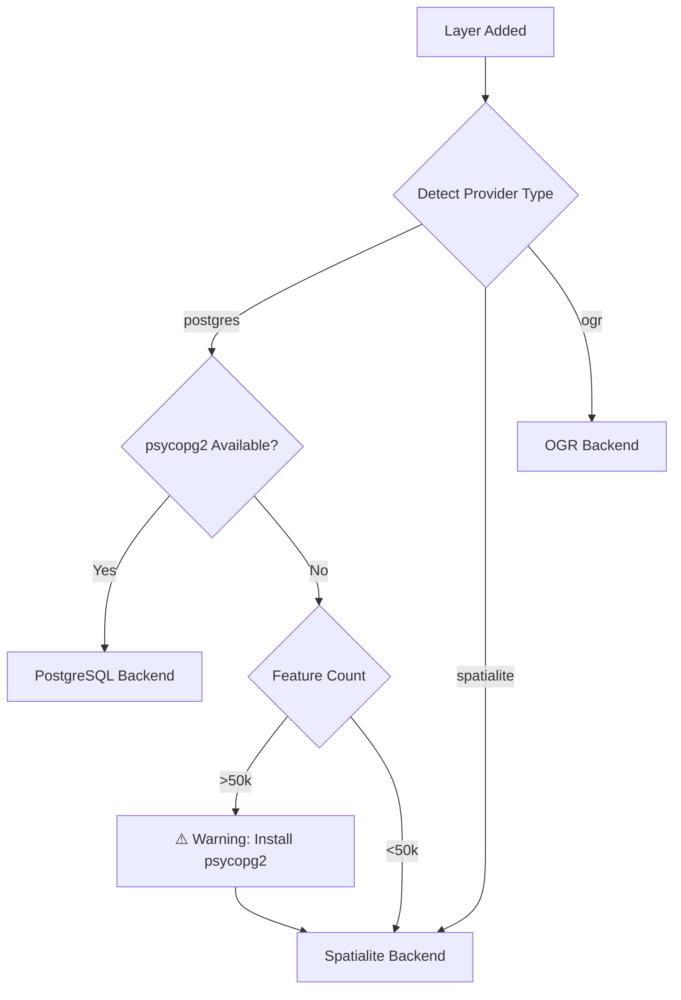
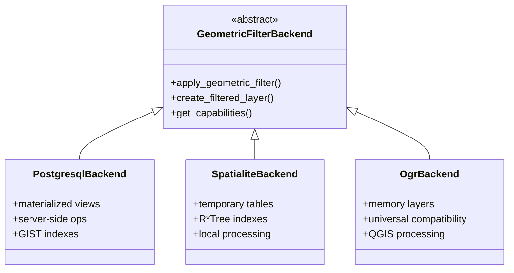
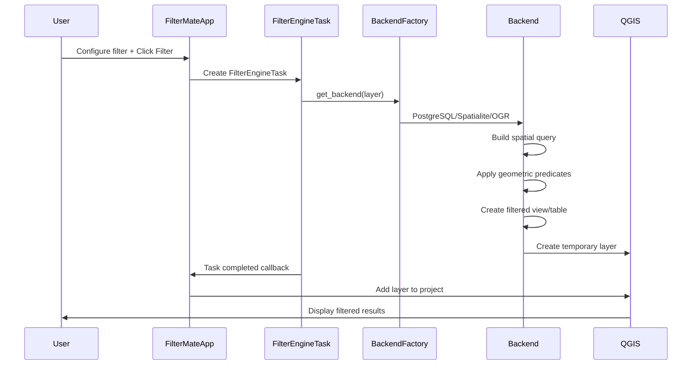
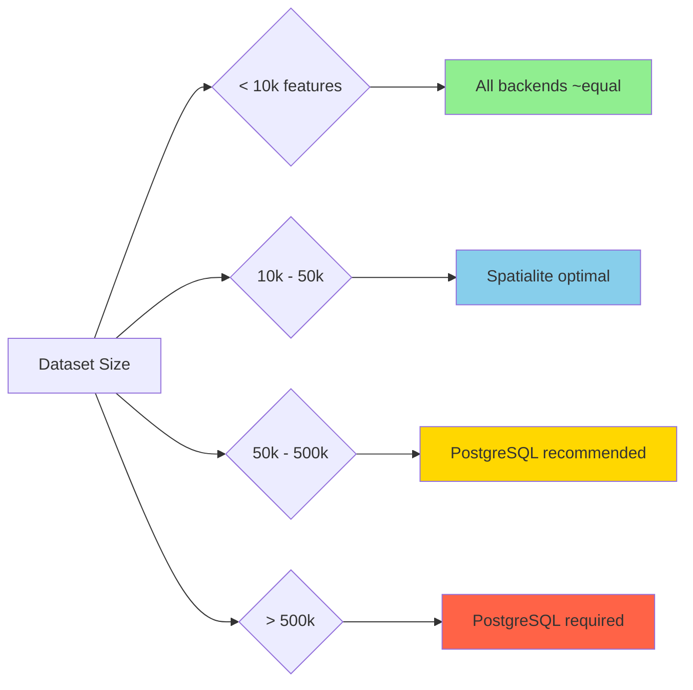
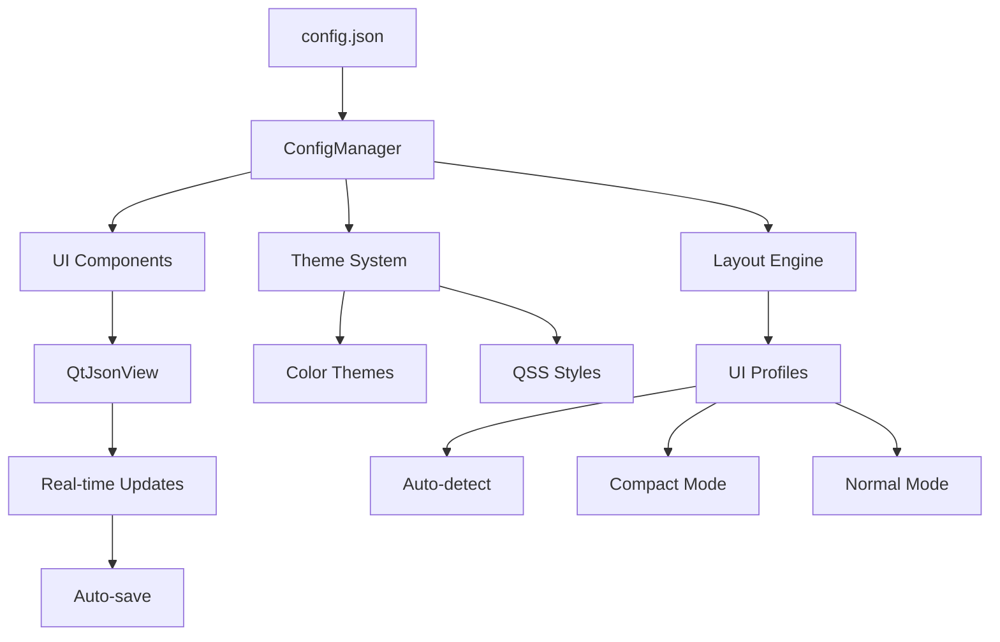
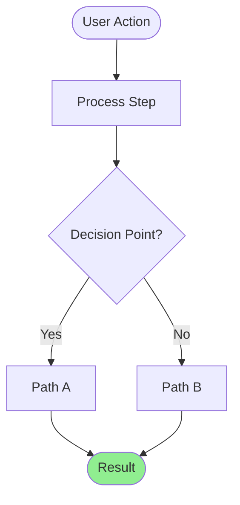
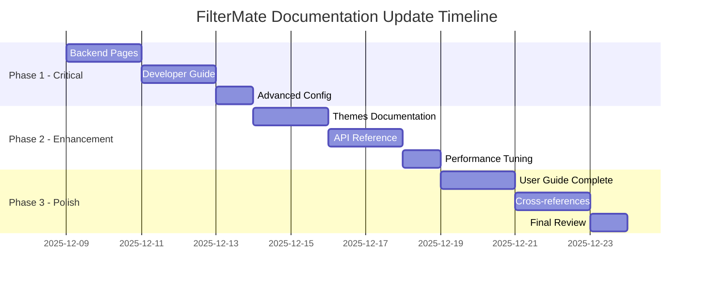

# FilterMate Documentation Update Plan v2

**Date**: December 8, 2025
**Status**: Planning Phase
**Target Completion**: Phase 1 by December 15, 2025

---

## Executive Summary

This plan outlines the complete update of FilterMate's Docusaurus documentation, converting 13+ placeholder pages into comprehensive, diagram-rich content. The plan leverages existing documentation in `/docs` folder and adds interactive Mermaid diagrams throughout.

---

## Current State Analysis

### ✅ Complete Pages (18 pages)
Well-documented and ready:
- `intro.md` - Homepage with version info
- `installation.md` - Complete installation guide
- `changelog.md` - Version history
- `getting-started/` - All 3 pages complete
- `user-guide/` - 9 out of 10 pages complete
- `backends/overview.md` - Complete with architecture
- `backends/visual-comparison.md` - Complete with diagrams
- `developer-guide/architecture.md` - Complete with ASCII diagrams
- `developer-guide/architecture-simplified.md` - Complete
- `developer-guide/development-setup.md` - Complete
- `developer-guide/code-style.md` - Complete
- `themes/overview.md` - Complete (248 lines)
- `themes/color-harmonization.md` - Complete (270 lines)
- `advanced/accessibility.md` - Complete
- `advanced/configuration-reactivity.md` - Complete
- `advanced/troubleshooting.md` - Complete
- `api/backend-api.md` - Complete
- `api/tasks.md` - Complete

### ❌ Placeholder Pages (13 pages)

#### Priority 1 - Critical (Backend System)
1. **backends/postgresql.md** - *Documentation coming soon*
   - Source: README.md section 3.1
   - Needs: Installation guide, features, performance tips, diagrams
   
2. **backends/spatialite.md** - *Documentation coming soon*
   - Source: README.md section 3.2
   - Needs: Usage guide, limitations, configuration, diagrams
   
3. **backends/ogr.md** - *Documentation coming soon*
   - Source: README.md section 3.3
   - Needs: Compatibility matrix, performance notes, use cases
   
4. **backends/performance-comparison.md** - *Documentation coming soon*
   - Source: README.md section 4
   - Needs: Benchmark tables, decision matrix, diagrams
   
5. **backends/backend-selection.md** - *Documentation coming soon*
   - Source: README.md section 3
   - Needs: Flow diagrams, auto-selection logic, override guide

#### Priority 2 - Developer Resources
6. **developer-guide/testing.md** - *Documentation coming soon*
   - Source: tests/ folder + README
   - Needs: Test structure, running tests, coverage guide
   
7. **developer-guide/contributing.md** - *Documentation coming soon*
   - Source: .github/copilot-instructions.md
   - Needs: Contribution workflow, PR guidelines, code review
   
8. **developer-guide/backend-development.md** - *Documentation coming soon*
   - Source: modules/backends/ + BACKEND_API.md
   - Needs: Backend interface, implementation guide, examples

#### Priority 3 - Advanced Topics
9. **advanced/configuration.md** - *Documentation coming soon*
   - Source: config/config.json + AUTO_CONFIGURATION.md
   - Needs: JSON structure, reactivity, UI profiles
   
10. **advanced/performance-tuning.md** - *Documentation coming soon*
    - Source: IMPLEMENTATION_STATUS.md
    - Needs: Optimization tips, query tuning, memory management
    
11. **advanced/known-issues.md** - *Documentation coming soon*
    - Source: GitHub issues + archived/fixes/
    - Needs: Current issues, workarounds, roadmap

#### Priority 4 - UI/Themes
12. **themes/available-themes.md** - *Documentation coming soon*
    - Source: docs/THEMES.md + config.json
    - Needs: Theme gallery, preview images, color palettes
    
13. **themes/custom-themes.md** - *Documentation coming soon*
    - Source: docs/THEMES.md (lines 75-183)
    - Needs: Theme creation tutorial, QSS guide, examples

#### Priority 5 - API Reference
14. **api/ui-components.md** - *Documentation coming soon*
    - Source: modules/ui_*.py files
    - Needs: Widget reference, styling API, examples
    
15. **api/utilities.md** - *Documentation coming soon*
    - Source: modules/appUtils.py
    - Needs: Function reference, utility classes, code examples

#### Priority 6 - User Features
16. **user-guide/advanced-features.md** - *Documentation coming soon*
    - Source: Multiple docs + feature analysis
    - Needs: Power user tips, hidden features, expert workflows

---

## Diagram Requirements

### Phase 1 - Critical Diagrams (5 diagrams)

#### 1. Backend Selection Flow (Mermaid)
**File**: `backends/backend-selection.md`
**Type**: Flowchart
**Purpose**: Show automatic backend selection logic


#### 2. Multi-Backend Architecture (Mermaid)
**File**: `backends/overview.md` (enhance existing)
**Type**: Class diagram
**Purpose**: Show inheritance hierarchy


#### 3. Filter Operation Data Flow (Mermaid)
**File**: `developer-guide/architecture.md` (convert from ASCII)
**Type**: Sequence diagram
**Purpose**: Show filtering workflow


#### 4. Performance Comparison Matrix (Mermaid)
**File**: `backends/performance-comparison.md`
**Type**: Graph + Table
**Purpose**: Benchmark visualization


#### 5. Configuration System (Mermaid)
**File**: `advanced/configuration.md`
**Type**: Component diagram
**Purpose**: Show config architecture


### Phase 2 - Enhancement Diagrams (7 diagrams)

#### 6. Layer Addition Flow (Mermaid)
**File**: `developer-guide/architecture.md` (convert from ASCII)
**Type**: Flowchart

#### 7. Theme System Architecture (Mermaid)
**File**: `themes/overview.md` (enhance)
**Type**: Component diagram

#### 8. Export Workflow (Mermaid)
**File**: `user-guide/export-features.md` (enhance)
**Type**: Sequence diagram

#### 9. Filter History System (Mermaid)
**File**: `user-guide/filter-history.md` (enhance)
**Type**: State diagram

#### 10. Backend Capabilities Matrix (Mermaid)
**File**: `backends/overview.md` (enhance)
**Type**: Table/Chart

#### 11. UI Profile Auto-detection (Mermaid)
**File**: `advanced/configuration.md`
**Type**: Decision tree

#### 12. Testing Architecture (Mermaid)
**File**: `developer-guide/testing.md`
**Type**: Directory tree + Test flow

---

## Phase 1: Critical Backend Documentation (Week 1)

### Day 1-2: Backend Pages (Priority 1)

#### Task 1.1: backends/postgresql.md
**Source**: README.md lines 52-88
**Content**:
- Installation methods (pip, conda, QGIS console)
- Feature list (materialized views, GIST indexes, server-side ops)
- Performance characteristics
- Configuration tips
- Code examples
- Troubleshooting section

**Diagrams**: 
- PostgreSQL connection flow
- Materialized view creation process

**Estimated**: 150-200 lines

#### Task 1.2: backends/spatialite.md
**Source**: README.md lines 90-117
**Content**:
- When to use (< 50k features)
- Automatic database creation
- R*Tree indexing
- Limitations vs PostgreSQL
- Configuration
- Code examples

**Diagrams**:
- Spatialite workflow
- Temporary table creation

**Estimated**: 120-150 lines

#### Task 1.3: backends/ogr.md
**Source**: README.md lines 119-141
**Content**:
- Universal compatibility
- Supported formats (Shapefile, GeoPackage, etc.)
- Performance characteristics
- Use cases
- Limitations

**Diagrams**:
- OGR backend selection logic
- Memory layer workflow

**Estimated**: 100-120 lines

#### Task 1.4: backends/performance-comparison.md
**Source**: README.md section 4 + IMPLEMENTATION_STATUS.md
**Content**:
- Benchmark table (by dataset size)
- Response time comparisons
- Memory usage analysis
- Decision matrix
- Real-world scenarios

**Diagrams**:
- Performance chart (graph)
- Decision tree

**Estimated**: 200-250 lines

#### Task 1.5: backends/backend-selection.md
**Source**: README.md section 3 + modules/backends/factory.py
**Content**:
- Automatic selection logic
- Manual override instructions
- Performance warnings system
- Fallback behavior
- Configuration options

**Diagrams**:
- Backend selection flowchart (main diagram)
- Warning system flow

**Estimated**: 150-180 lines

### Day 3-4: Developer Guide (Priority 2)

#### Task 2.1: developer-guide/testing.md
**Source**: tests/ folder + tests/README.md
**Content**:
- Test structure overview
- Running tests (pytest, unittest)
- Coverage reports
- Writing new tests
- CI/CD integration
- Test categories

**Diagrams**:
- Test directory structure
- Test execution flow

**Estimated**: 180-220 lines

#### Task 2.2: developer-guide/contributing.md
**Source**: .github/copilot-instructions.md
**Content**:
- Contribution workflow
- Code style requirements
- Commit message format
- PR template
- Review process
- Getting help

**Diagrams**:
- Git workflow
- PR review process

**Estimated**: 200-250 lines

#### Task 2.3: developer-guide/backend-development.md
**Source**: modules/backends/ + BACKEND_API.md
**Content**:
- Backend interface (abstract class)
- Implementation requirements
- Method signatures
- Error handling
- Testing backends
- Example implementation

**Diagrams**:
- Backend lifecycle
- Method call sequence

**Estimated**: 250-300 lines

### Day 5: Advanced Topics (Priority 3 - Critical)

#### Task 3.1: advanced/configuration.md
**Source**: config/config.json + AUTO_CONFIGURATION.md + CONFIG_JSON_IMPROVEMENTS.md
**Content**:
- config.json structure
- UI_PROFILE settings (auto/compact/normal)
- Screen detection thresholds
- Color themes configuration
- Icon configuration
- Reactivity system
- ChoicesType integration

**Diagrams**:
- Configuration system architecture (main)
- UI profile auto-detection
- Theme system integration

**Estimated**: 300-350 lines

---

## Phase 2: Themes & API Documentation (Week 2)

### Day 1-2: Themes (Priority 4)

#### Task 4.1: themes/available-themes.md
**Source**: docs/THEMES.md + config/config.json
**Content**:
- Theme gallery with descriptions
- Color palette tables
- Screenshot placeholders
- Use case recommendations
- Installation instructions

**Assets Needed**:
- Theme preview screenshots (8 themes)
- Color swatch images

**Estimated**: 200-250 lines

#### Task 4.2: themes/custom-themes.md
**Source**: docs/THEMES.md lines 75-183
**Content**:
- Theme class structure
- Creating custom themes
- Color definition
- QSS placeholder system
- Testing themes
- Contributing themes
- Complete example

**Diagrams**:
- Theme creation workflow
- Color application flow

**Estimated**: 250-300 lines

### Day 3-4: API Reference (Priority 5)

#### Task 5.1: api/ui-components.md
**Source**: modules/ui_*.py files (ui_elements.py, ui_styles.py, ui_config.py)
**Content**:
- Widget hierarchy
- Custom widgets reference
- Styling API
- Configuration helpers
- UI elements helpers
- Code examples

**Diagrams**:
- UI component tree
- Widget inheritance

**Estimated**: 300-400 lines

#### Task 5.2: api/utilities.md
**Source**: modules/appUtils.py (11 functions)
**Content**:
- Function reference:
  - `get_primary_key_name(layer)`
  - `safe_set_subset_string(layer, expression)`
  - `is_valid_geopackage(file_path)`
  - `truncate(number, digits)`
  - `detect_layer_provider_type(layer)`
  - `geometry_type_to_string(layer)`
  - `get_datasource_connexion_from_layer(layer)`
  - `get_data_source_uri(layer)`
  - `create_temp_spatialite_table(...)`
  - `get_spatialite_datasource_from_layer(layer)`
  - `get_source_table_name(layer)`
- Parameter documentation
- Return types
- Usage examples
- Error handling

**Estimated**: 350-400 lines

### Day 5: Advanced Topics (Priority 3 - Remaining)

#### Task 3.2: advanced/performance-tuning.md
**Source**: IMPLEMENTATION_STATUS.md + README.md section 4
**Content**:
- Backend selection optimization
- Query optimization tips
- Index management
- Memory management
- Large dataset strategies
- Profiling tools

**Diagrams**:
- Performance optimization workflow
- Query execution plan

**Estimated**: 200-250 lines

#### Task 3.3: advanced/known-issues.md
**Source**: GitHub issues + archived/fixes/
**Content**:
- Current limitations
- Known bugs with workarounds
- Platform-specific issues
- Compatibility notes
- Roadmap items

**Estimated**: 150-200 lines

---

## Phase 3: Final Polish (Week 3)

### Day 1-2: User Guide Completion

#### Task 6.1: user-guide/advanced-features.md
**Source**: Multiple docs + feature analysis
**Content**:
- Filter history power tips
- Advanced expression building
- Custom export workflows
- Batch processing
- Keyboard shortcuts
- Hidden features
- Expert tips

**Diagrams**:
- Advanced workflow examples
- Feature interconnections

**Estimated**: 250-300 lines

### Day 3-4: Cross-References & SEO

#### Task 7.1: Add Internal Links
- Review all pages for cross-reference opportunities
- Add "See Also" sections
- Create index pages for each category
- Add breadcrumb navigation

#### Task 7.2: SEO Optimization
- Meta descriptions for all pages
- Keywords optimization
- Social media preview cards
- Sitemap validation

### Day 5: Final Review & Testing

#### Task 8.1: Documentation Review
- [ ] All placeholder text removed
- [ ] All diagrams rendered correctly
- [ ] All code examples tested
- [ ] All internal links working
- [ ] All external links valid
- [ ] Consistent formatting
- [ ] Spelling/grammar check

#### Task 8.2: Build & Deploy Testing
- [ ] Local build successful
- [ ] No broken links
- [ ] Images load correctly
- [ ] Search functionality works
- [ ] Mobile responsive
- [ ] Dark mode compatibility

---

## Implementation Guidelines

### Diagram Standards

#### Mermaid Syntax
- Use flowchart TD for top-down flows
- Use sequenceDiagram for interactions
- Use classDiagram for inheritance
- Use graph TB for component relationships

#### Styling
- Consistent color scheme matching FilterMate themes
- Clear labels (< 50 characters)
- Legends when needed
- Accessibility considerations (colorblind-friendly)

### Content Standards

#### Structure
- H1: Page title only
- H2: Major sections
- H3: Subsections
- H4: Specific features/functions

#### Code Blocks
```python
# Always include language identifier
# Add comments explaining key concepts
# Keep examples under 30 lines
```

#### Callouts
Use Docusaurus admonitions:
```markdown
:::tip Performance
PostgreSQL is recommended for datasets > 50k features
:::

:::warning Compatibility
Requires psycopg2-binary package
:::

:::danger Breaking Change
This will modify your database
:::

:::info
See [Backend Selection](./backend-selection.md) for details
:::
```

### Source File Mapping

| Documentation Page | Primary Source(s) | Lines/Location |
|-------------------|------------------|----------------|
| backends/postgresql.md | README.md | 52-88 |
| backends/spatialite.md | README.md | 90-117 |
| backends/ogr.md | README.md | 119-141 |
| backends/performance-comparison.md | README.md section 4, IMPLEMENTATION_STATUS.md | Multiple |
| backends/backend-selection.md | README.md section 3, modules/backends/factory.py | Multiple |
| developer-guide/testing.md | tests/, tests/README.md | Entire folder |
| developer-guide/contributing.md | .github/copilot-instructions.md | Entire file |
| developer-guide/backend-development.md | modules/backends/, BACKEND_API.md | Multiple files |
| advanced/configuration.md | config/config.json, AUTO_CONFIGURATION.md, CONFIG_JSON_IMPROVEMENTS.md | Multiple |
| advanced/performance-tuning.md | IMPLEMENTATION_STATUS.md | Multiple sections |
| advanced/known-issues.md | GitHub issues, archived/fixes/ | Multiple |
| themes/available-themes.md | docs/THEMES.md, config/config.json | Lines 1-73, THEMES section |
| themes/custom-themes.md | docs/THEMES.md | Lines 75-183 |
| api/ui-components.md | modules/ui_*.py | Multiple files |
| api/utilities.md | modules/appUtils.py | 11 functions |
| user-guide/advanced-features.md | Multiple docs | Analysis required |

---

## Quality Checklist

### Per Page
- [ ] Title and sidebar_position set
- [ ] Introduction paragraph (< 100 words)
- [ ] At least one diagram (where applicable)
- [ ] Code examples tested
- [ ] Internal links added
- [ ] "See Also" section
- [ ] No placeholder text
- [ ] Proper heading hierarchy

### Per Diagram
- [ ] Renders correctly in Docusaurus
- [ ] Clear labels
- [ ] Consistent with FilterMate style
- [ ] Accessible (alt text, colorblind-safe)
- [ ] Referenced in text
- [ ] Legend if needed

### Per Code Example
- [ ] Language specified
- [ ] Syntax highlighted
- [ ] Runnable (or clearly marked as pseudo-code)
- [ ] Comments explaining key lines
- [ ] Follows coding standards
- [ ] Error handling shown

---

## Risk Management

### Technical Risks
1. **Mermaid rendering issues** → Mitigation: Test diagrams incrementally
2. **Build failures** → Mitigation: Frequent local builds
3. **Broken links** → Mitigation: Automated link checking
4. **Image optimization** → Mitigation: Compress before commit

### Content Risks
1. **Outdated information** → Mitigation: Cross-reference with code
2. **Missing details** → Mitigation: Review source code directly
3. **Inconsistent terminology** → Mitigation: Maintain glossary
4. **Too technical/simple** → Mitigation: Peer review

---

## Success Metrics

### Quantitative
- ✅ 0 placeholder pages remaining
- ✅ 12+ new diagrams added
- ✅ 3,000+ new lines of documentation
- ✅ 100% internal links working
- ✅ < 2 second page load time
- ✅ 95%+ lighthouse score

### Qualitative
- ✅ Clear navigation structure
- ✅ Comprehensive backend coverage
- ✅ Developer onboarding < 30 minutes
- ✅ User questions answered in docs
- ✅ Consistent voice and style
- ✅ Professional appearance

---

## Post-Launch

### Maintenance Plan
1. **Weekly**: Check for broken links
2. **Monthly**: Update version numbers and changelogs
3. **Per Release**: Update feature documentation
4. **Quarterly**: Review and update performance benchmarks

### Feedback Collection
- GitHub Discussions for documentation feedback
- Issue template for documentation bugs
- User survey after 3 months
- Analytics review (page views, search queries)

---

## Appendix A: Diagram Template

### Mermaid Flowchart Template


---

## Appendix B: Content Style Guide

### Voice & Tone
- **Professional but approachable**: Avoid jargon, explain technical terms
- **Active voice**: "FilterMate selects..." not "The backend is selected by..."
- **Present tense**: "The function returns..." not "The function will return..."
- **Direct address**: "You can configure..." not "Users can configure..."

### Terminology
- **Backend** (not "backend system" or "data backend")
- **Layer** (not "vector layer" unless specifically about vectors)
- **Filter** (verb and noun - context makes it clear)
- **QGIS** (all caps, no periods)
- **PostgreSQL/PostGIS** (not "Postgres" or "postgres")
- **Spatialite** (not "SpatiaLite" or "spatial lite")

### Examples
- ✅ Good: "Configure the backend in config.json"
- ❌ Bad: "The backend can be configured through the config.json file by the user"

- ✅ Good: "FilterMate automatically selects the optimal backend"
- ❌ Bad: "The system will automatically perform backend selection"

---

## Timeline Overview



**Total Duration**: 15 working days (~3 weeks)
**Target Completion**: December 27, 2025

---

## Contact & Support

**Documentation Lead**: FilterMate Development Team
**Questions**: Open GitHub Discussion
**Bug Reports**: GitHub Issues with `documentation` label
**Contributions**: See `developer-guide/contributing.md` (once created)

---

*Last Updated: December 8, 2025*
*Plan Version: 2.0*
*Status: Ready for Implementation*
