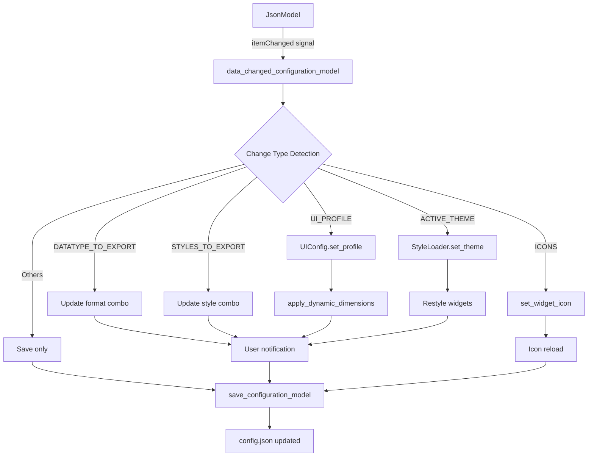

# Configuration Reactivity

**Version:** 2.2.2+  
**Status:** ✅ Implemented

FilterMate v2.2.2+ features real-time configuration updates through an interactive JSON tree view. Changes are automatically detected, saved, and applied to the interface without requiring a restart.

## Overview

The configuration reactivity system allows users to:
- **Modify settings** directly in the JSON tree view
- **See changes applied instantly** to the UI
- **Switch profiles** (compact/normal/auto) on the fly
- **Change themes** without restart
- **Update export formats** in real-time
- **Auto-save** all configuration changes

## Key Features

### 1. Automatic Change Detection

When a value is modified in the JSON Tree View:
1. The `itemChanged` signal is emitted by `JsonModel`
2. Handler `data_changed_configuration_model()` is called automatically
3. Changes are saved to `config.json`
4. UI is updated accordingly

### 2. Dynamic UI Profile Switching

The `UI_PROFILE` parameter supports 3 values:
- **`auto`**: Automatic detection based on screen size
- **`compact`**: Compact mode for small screens (laptops, tablets)
- **`normal`**: Normal mode for large screens

**When `UI_PROFILE` is modified:**
1. New value is detected
2. `UIConfig` profile is updated
3. `apply_dynamic_dimensions()` applies new dimensions
4. Confirmation message displays to user

**Example:**
```json
{
  "APP": {
    "DOCKWIDGET": {
      "UI_PROFILE": "compact"  // Change from "auto" or "normal"
    }
  }
}
```

**Result:** All widget dimensions instantly adjust to compact mode.

### 3. Automatic Theme Application

The `ACTIVE_THEME` parameter in `COLORS` supports 4 values:
- **`auto`**: Automatic detection based on active QGIS theme
- **`default`**: Default light theme
- **`dark`**: Dark theme
- **`light`**: Light theme

**When `ACTIVE_THEME` is modified:**
1. New value is detected
2. Theme is applied via `StyleLoader.set_theme_from_config()`
3. All widgets are restyled automatically
4. Confirmation message displays to user

**Example:**
```json
{
  "APP": {
    "DOCKWIDGET": {
      "COLORS": {
        "ACTIVE_THEME": "dark"  // Switch to dark theme
      }
    }
  }
}
```

**Result:** Entire interface switches to dark theme instantly.

### 4. Export Format Updates

The parameters `DATATYPE_TO_EXPORT` and `STYLES_TO_EXPORT` can be modified:

**DATATYPE_TO_EXPORT** (file format):
- `GPKG`, `SHP`, `GEOJSON`, `KML`, `DXF`, `CSV`

**STYLES_TO_EXPORT** (style format):
- `QML`, `SLD`, `None`

**When these values are modified:**
1. New value is detected
2. Corresponding combobox in Export tab is updated
3. Informative message displays to user

### 5. Icon Management

Changes to paths containing `ICONS` trigger:
- Automatic widget icon updates
- Icon reloading from `icons/` folder

## ChoicesType Integration

### What is ChoicesType?

ChoicesType is a special configuration field type that provides **dropdown selectors** in the JSON tree view instead of text fields.

### Format

```json
{
  "value": "compact",
  "choices": ["auto", "compact", "normal"]
}
```

### Enhanced Fields

Five configuration fields use ChoicesType:

1. **UI_PROFILE**
   ```json
   {
     "UI_PROFILE": {
       "value": "auto",
       "choices": ["auto", "compact", "normal"]
     }
   }
   ```

2. **ACTIVE_THEME**
   ```json
   {
     "ACTIVE_THEME": {
       "value": "auto",
       "choices": ["auto", "default", "dark", "light"]
     }
   }
   ```

3. **THEME_SOURCE**
   ```json
   {
     "THEME_SOURCE": {
       "value": "config",
       "choices": ["config", "qgis", "system"]
     }
   }
   ```

4. **STYLES_TO_EXPORT**
   ```json
   {
     "STYLES_TO_EXPORT": {
       "value": "QML",
       "choices": ["QML", "SLD", "None"]
     }
   }
   ```

5. **DATATYPE_TO_EXPORT**
   ```json
   {
     "DATATYPE_TO_EXPORT": {
       "value": "GPKG",
       "choices": ["GPKG", "SHP", "GEOJSON", "KML", "DXF", "CSV"]
     }
   }
   ```

### Benefits

- ✅ **Type Safety**: Invalid values prevented at UI level
- ✅ **No Typing Errors**: Select from valid options only
- ✅ **Better UX**: Visual dropdown instead of text input
- ✅ **Documentation**: Available choices shown in UI

## Technical Architecture

### Signal Flow



### Code Implementation

#### Signal Connection

```python
# In connect_widgets_signals() - filter_mate_dockwidget.py
self.widgets["DOCK"]["CONFIGURATION_MODEL"]["WIDGET"].itemChanged.connect(
    self.data_changed_configuration_model
)
```

#### Main Handler

```python
def data_changed_configuration_model(self, input_data=None):
    if self.widgets_initialized is True:
        # Get modified key path
        index = input_data.index()
        item = input_data
        item_key = self.config_view.model.itemFromIndex(index.siblingAtColumn(0))
        
        items_keys_values_path = []
        while item_key != None:
            items_keys_values_path.append(item_key.data(QtCore.Qt.DisplayRole))
            item_key = item_key.parent()
        items_keys_values_path.reverse()
        
        # Handle specific change types
        
        # 1. UI Profile changes
        if 'UI_PROFILE' in items_keys_values_path:
            # Extract value (handle ChoicesType format)
            value_item = self.config_view.model.itemFromIndex(index.siblingAtColumn(1))
            value_data = value_item.data(QtCore.Qt.UserRole)
            
            if isinstance(value_data, dict) and 'value' in value_data:
                new_profile_value = value_data['value']
            else:
                new_profile_value = value_item.data(QtCore.Qt.DisplayRole)
            
            # Apply new profile
            if new_profile_value == 'compact':
                UIConfig.set_profile(DisplayProfile.COMPACT)
            elif new_profile_value == 'normal':
                UIConfig.set_profile(DisplayProfile.NORMAL)
            elif new_profile_value == 'auto':
                UIConfig.set_profile(UIConfig.detect_optimal_profile())
            
            # Update dimensions
            self.apply_dynamic_dimensions()
            
            # User feedback
            iface.messageBar().pushSuccess(
                "FilterMate",
                f"UI profile changed to {new_profile_value.upper()}. Dimensions updated.",
                3
            )
        
        # 2. Theme changes
        if 'ACTIVE_THEME' in items_keys_values_path:
            # Similar handling...
            pass
        
        # Save configuration
        self.save_configuration_model()
```

## Configuration Helpers

FilterMate v2.2.2+ includes a new module `config_helpers.py` with utility functions:

### Reading Values

```python
from modules.config_helpers import get_config_value, get_ui_profile, get_active_theme

# Generic value getter (handles ChoicesType)
value = get_config_value(config, ['APP', 'DOCKWIDGET', 'UI_PROFILE'])

# Convenience functions
profile = get_ui_profile(config)  # Returns: "auto", "compact", or "normal"
theme = get_active_theme(config)  # Returns: "auto", "default", "dark", or "light"
```

### Writing Values

```python
from modules.config_helpers import set_config_value

# Set value with validation
success = set_config_value(
    config, 
    ['APP', 'DOCKWIDGET', 'UI_PROFILE'], 
    'compact'
)
```

### Available Functions

- `get_config_value()`: Read values with automatic ChoicesType extraction
- `set_config_value()`: Write values with validation
- `get_config_choices()`: Get available options for a field
- `validate_config_value()`: Validate before setting
- `get_ui_profile()`: Get current UI profile
- `get_active_theme()`: Get active theme
- `get_theme_source()`: Get theme source
- `get_export_format()`: Get export data format
- `get_export_style()`: Get export style format

## User Experience

### Immediate Feedback

When you change configuration:
1. ✅ **Instant UI update** - No restart required
2. ✅ **Clear notifications** - Success messages confirm changes
3. ✅ **Visual dropdown** - ChoicesType fields show selectors
4. ✅ **Error prevention** - Invalid values blocked
5. ✅ **Auto-save** - Changes saved automatically

### Example Workflow

**Change UI Profile:**
1. Open Configuration tab
2. Navigate to `APP` → `DOCKWIDGET` → `UI_PROFILE`
3. Click dropdown, select "compact"
4. **Instant**: All widgets resize to compact dimensions
5. **Notification**: "UI profile changed to COMPACT mode. Dimensions updated."

**Switch Theme:**
1. Open Configuration tab
2. Navigate to `APP` → `DOCKWIDGET` → `COLORS` → `ACTIVE_THEME`
3. Click dropdown, select "dark"
4. **Instant**: Entire interface switches to dark theme
5. **Notification**: "Theme changed to DARK. UI updated."

## Testing

### Test Suite

FilterMate includes comprehensive tests for reactivity:

```bash
# Test reactivity
pytest tests/test_config_json_reactivity.py -v

# Test ChoicesType
pytest tests/test_choices_type_config.py -v
```

**Coverage:** 28 tests for reactivity and ChoicesType (100% pass rate ✅)

### Test Cases

- ✅ UI profile switching (auto/compact/normal)
- ✅ Theme switching (auto/default/dark/light)
- ✅ Export format changes
- ✅ ChoicesType validation
- ✅ Invalid value prevention
- ✅ Config helper functions
- ✅ Backward compatibility

## Backward Compatibility

The reactivity system is **fully backward compatible**:

✅ **Old config format still works**:
```json
{
  "UI_PROFILE": "compact"  // Simple string
}
```

✅ **New config format preferred**:
```json
{
  "UI_PROFILE": {
    "value": "compact",
    "choices": ["auto", "compact", "normal"]
  }
}
```

The system automatically handles both formats.

## Benefits

### For Users
- ⚡ **Faster workflow** - No restart needed
- 🎨 **Visual feedback** - See changes instantly
- 🔒 **Error prevention** - Invalid values blocked
- 📝 **Auto-save** - Changes persist automatically

### For Developers
- 🏗️ **Extensible** - Easy to add new reactive fields
- 🧪 **Testable** - Comprehensive test coverage
- 📚 **Documented** - Clear architecture
- 🔄 **Maintainable** - Clean signal/slot pattern

## Future Enhancements

Planned improvements for configuration reactivity:

1. **More Reactive Fields**
   - Language switching
   - Performance settings
   - Debug mode toggle

2. **Enhanced Validation**
   - Range validation for numeric values
   - Pattern validation for strings
   - Cross-field validation

3. **Configuration Profiles**
   - Save/load configuration presets
   - Share configurations between users
   - Import/export configuration

4. **Live Preview**
   - Preview theme changes before applying
   - Preview UI dimensions before switching
   - Undo/redo for configuration changes

## References

- [Configuration Guide](./configuration.md)
- [Themes Overview](../themes/overview.md)
- [Color Harmonization](../themes/color-harmonization.md)
- [Backend API](../api/backend-api.md)

## Related Documentation

- **Implementation Details**: `docs/CONFIG_JSON_REACTIVITY.md`
- **Improvements Roadmap**: `docs/CONFIG_JSON_IMPROVEMENTS.md`
- **Test Suite**: `tests/test_config_json_reactivity.py`
- **Helper Functions**: `modules/config_helpers.py`

---

**Version:** 2.2.2+  
**Last Updated:** December 8, 2025  
**Status:** ✅ Production Ready
