# Performance Tuning

Optimize FilterMate for maximum performance on your datasets. This guide covers backend selection, query optimization, indexing strategies, and system tuning.

## Quick Wins

### 1. Use the Right Backend

**Most important decision for performance!**

```mermaid
graph LR
    A[Dataset Size?] --> B{< 10k features}
    A --> C{10k - 50k}
    A --> D{50k - 500k}
    A --> E{> 500k}
    
    B --> F[Any Backend<br/>⚡ < 1s]
    C --> G[Spatialite<br/>⚡ 2-5s]
    D --> H[PostgreSQL<br/>⚡ 3-10s]
    E --> I[PostgreSQL Only<br/>⚡ 10-30s]
    
    style F fill:#90EE90,stroke:#2d6a2d,stroke-width:2px
    style G fill:#90EE90,stroke:#2d6a2d,stroke-width:2px
    style H fill:#87CEEB,stroke:#1e5f8f,stroke-width:2px
    style I fill:#FFD700,stroke:#b8860b,stroke-width:2px
```



**Action**: Install psycopg2 for datasets > 50k features
```bash
pip install psycopg2-binary
```

### 2. Create Spatial Indexes

**PostgreSQL**:
```sql
CREATE INDEX idx_your_table_geom ON your_table USING GIST(geometry);
ANALYZE your_table;
```

**Spatialite**:
```sql
SELECT CreateSpatialIndex('your_table', 'geometry');
```

**Gain**: 10-100× faster spatial queries

### 3. Enable Performance Warnings

Let FilterMate alert you to optimization opportunities:

```json
{
    "PERFORMANCE": {
        "enable_performance_warnings": true,
        "large_dataset_warning_threshold": 50000
    }
}
```

## Backend Optimization

### PostgreSQL Performance

#### Server Configuration

Edit `postgresql.conf` for spatial workloads:

```ini
# Memory Settings
shared_buffers = 4GB              # 25% of RAM
effective_cache_size = 12GB       # 75% of RAM
work_mem = 256MB                  # Per query

# Query Planning
random_page_cost = 1.1            # SSD
effective_io_concurrency = 200    # SSD

# Parallel Query
max_parallel_workers_per_gather = 4
max_parallel_workers = 8
```

**Restart PostgreSQL** after changes:
```bash
sudo systemctl restart postgresql
```

#### Table Optimization

```sql
-- Create spatial index (if missing)
CREATE INDEX IF NOT EXISTS idx_table_geom 
ON your_table USING GIST(geometry);

-- Create attribute indexes
CREATE INDEX IF NOT EXISTS idx_table_type 
ON your_table(type);

-- Update statistics
ANALYZE your_table;

-- Vacuum to reclaim space
VACUUM ANALYZE your_table;

-- Check index usage
SELECT schemaname, tablename, indexname, idx_scan 
FROM pg_stat_user_indexes 
WHERE tablename = 'your_table';
```

#### Connection Pooling

Use PgBouncer for multiple FilterMate instances:

```ini
# pgbouncer.ini
[databases]
your_db = host=localhost port=5432 dbname=your_db

[pgbouncer]
pool_mode = transaction
max_client_conn = 100
default_pool_size = 20
```

**Gain**: 30-50% faster on concurrent operations

#### Query Optimization

**Check query plan**:
```sql
EXPLAIN ANALYZE
SELECT * FROM your_table
WHERE ST_Intersects(
    geometry, 
    ST_Buffer(ST_GeomFromText('POINT(0 0)', 4326), 1000)
);
```

**Look for**:
- ✅ "Index Scan using GIST" (good)
- ❌ "Seq Scan" (bad - missing index)

#### Materialized Views

FilterMate creates materialized views automatically. Monitor them:

```sql
-- List FilterMate materialized views
SELECT matviewname, size 
FROM pg_matviews 
WHERE matviewname LIKE 'filtermate_%';

-- Refresh manually if needed
REFRESH MATERIALIZED VIEW filtermate_temp_view;

-- Drop old views
DROP MATERIALIZED VIEW IF EXISTS filtermate_old_view;
```

### Spatialite Performance

#### Enable R*Tree Indexes

```sql
-- Check if spatial index exists
SELECT * FROM geometry_columns 
WHERE f_table_name = 'your_table';

-- Create spatial index
SELECT CreateSpatialIndex('your_table', 'geometry');

-- Verify index
SELECT * FROM sqlite_master 
WHERE name LIKE 'idx_your_table_geometry%';
```

**Gain**: 15-40× faster spatial queries

#### Optimize Database

```sql
-- Vacuum to compact database
VACUUM;

-- Analyze for query optimizer
ANALYZE;

-- Check database size
SELECT page_count * page_size / 1024.0 / 1024.0 AS size_mb 
FROM pragma_page_count(), pragma_page_size();
```

#### Cache Settings

```python
# In QGIS Python Console
import sqlite3

conn = sqlite3.connect('/path/to/your.db')
conn.execute('PRAGMA cache_size = 10000')  # ~40MB cache
conn.execute('PRAGMA temp_store = MEMORY')  # Temp tables in RAM
conn.close()
```

#### Geometry Simplification

For large, complex polygons:

```sql
-- Create simplified geometry column
ALTER TABLE your_table ADD COLUMN geom_simple GEOMETRY;

UPDATE your_table 
SET geom_simple = SimplifyPreserveTopology(geometry, 0.0001);

-- Create index on simplified geometry
SELECT CreateSpatialIndex('your_table', 'geom_simple');
```

**Gain**: 2-5× faster on complex geometries

### OGR Backend Performance

#### Spatial Indexing

OGR backend automatically creates spatial indexes. Verify:

```python
# In QGIS Python Console
layer = iface.activeLayer()
provider = layer.dataProvider()

# Check for spatial index
has_index = provider.capabilities() & provider.CreateSpatialIndex
print(f"Spatial index: {has_index}")
```

If missing, create manually:
```python
processing.run("native:createspatialindex", {
    'INPUT': layer,
    'OUTPUT': 'memory:'
})
```

#### Format Selection

Performance by format (10k features):

| Format | Read Time | Filter Time | Notes |
|--------|-----------|-------------|-------|
| **GeoPackage** | 0.2s ⚡ | 0.5s ⚡ | Best choice |
| **Shapefile** | 0.3s ⚡ | 0.8s | Legacy |
| **GeoJSON** | 0.5s | 1.5s | Large files slow |
| **KML** | 0.8s 🐌 | 2.0s 🐌 | Avoid for large data |

**Recommendation**: Convert to GeoPackage for best performance
```python
processing.run("native:package", {
    'LAYERS': [layer],
    'OUTPUT': 'output.gpkg'
})
```

## Query Optimization

### Predicate Selection

Choose the right spatial predicate:

| Predicate | Speed | Use Case |
|-----------|-------|----------|
| **intersects** | ⚡⚡⚡ Fastest | General overlap detection |
| **contains** | ⚡⚡ Fast | Point-in-polygon |
| **within** | ⚡⚡ Fast | Reverse contains |
| **touches** | ⚡ Medium | Boundary analysis |
| **crosses** | ⚡ Medium | Line intersections |
| **overlaps** | 🐌 Slow | Partial overlap only |

**Tip**: Use `intersects` when possible - it's the fastest!

### Predicate Ordering

FilterMate automatically orders predicates for performance (Spatialite):

```python
# Automatic optimization - fastest predicates first
predicates = ['intersects', 'contains', 'within']
# FilterMate orders as: intersects OR contains OR within
# Not: within OR contains OR intersects (slower)
```

**Gain**: 2-3× faster on multiple predicates

### Buffer Optimization

#### Fixed Buffers

```python
# ✅ Good - Computed once
buffer_distance = 100.0
apply_filter(layer, buffer_distance=buffer_distance)

# ❌ Bad - Computed for every feature
buffer_expression = "CASE WHEN type='A' THEN 100 ELSE 200 END"
```

#### Projected CRS

Always use projected CRS for buffers:

```python
# ✅ Good - Meters (EPSG:3857)
layer_3857 = processing.run("native:reprojectlayer", {
    'INPUT': layer,
    'TARGET_CRS': 'EPSG:3857'
})

# ❌ Bad - Degrees (EPSG:4326)
# Buffer of 100 degrees makes no sense!
```

#### Negative Buffers

Use carefully - expensive operation:

```python
# Negative buffer = inward erosion
buffer_distance = -10.0  # 10m inward

# Alternative: Simplify first
simplified_layer = processing.run("native:simplifygeometries", {
    'INPUT': layer,
    'TOLERANCE': 1.0
})
```

## Memory Management

### Large Datasets

#### Chunk Processing

For very large datasets (> 1M features):

```python
# Process in chunks
chunk_size = 100000

for offset in range(0, total_features, chunk_size):
    features = layer.getFeatures(
        QgsFeatureRequest()
        .setLimit(chunk_size)
        .setOffset(offset)
    )
    # Process chunk
```

#### Memory Layers

Avoid memory layers for large data:

```python
# ❌ Bad - 500k features in memory
memory_layer = QgsVectorLayer("Point", "temp", "memory")

# ✅ Good - Use GeoPackage
temp_gpkg = processing.run("native:package", {
    'LAYERS': [layer],
    'OUTPUT': 'temp.gpkg'
})
```

### FilterMate Cache

Configure caching in config.json:

```json
{
    "PERFORMANCE": {
        "cache_layer_metadata": true,
        "max_cache_entries": 200,
        "cache_geometry_sources": true
    }
}
```

**Geometry Source Cache**: 5× faster when filtering multiple layers against the same source

## Monitoring Performance

### Enable Logging

```python
import logging

logger = logging.getLogger('FilterMate')
logger.setLevel(logging.DEBUG)

# View timing information
# Check QGIS Python Console
```

### Benchmark Your Workflow

Use FilterMate's benchmark tool:

```bash
python tests/benchmark_simple.py
```

Output:
```
Testing Spatialite optimization (10,000 features):
  Without optimization: 1.38s
  With optimization: 0.03s
  Speed improvement: 44.6×

Testing OGR spatial index (10,000 features):
  Without index: 0.80s
  With index: 0.04s
  Speed improvement: 19.5×
```

### PostgreSQL Query Analysis

Monitor slow queries:

```sql
-- Enable query logging
ALTER SYSTEM SET log_min_duration_statement = 1000;  -- Log > 1s
SELECT pg_reload_conf();

-- View slow queries
SELECT 
    query,
    calls,
    total_time,
    mean_time
FROM pg_stat_statements
WHERE query LIKE '%ST_%'
ORDER BY mean_time DESC
LIMIT 10;
```

## Performance Checklist

### Before Filtering

- [ ] **Backend selected** - Right backend for dataset size
- [ ] **Spatial indexes** - Created on geometry columns
- [ ] **Statistics updated** - ANALYZE run recently
- [ ] **CRS projected** - Using meters, not degrees
- [ ] **Format optimized** - GeoPackage preferred
- [ ] **Geometry valid** - No invalid geometries
- [ ] **Cache enabled** - Performance settings configured

### During Filtering

- [ ] **Progress visible** - QGIS progress bar shows activity
- [ ] **Memory usage** - Check system monitor
- [ ] **No errors** - Check QGIS message bar
- [ ] **Query time** - Should be reasonable for dataset size

### After Filtering

- [ ] **Results correct** - Verify feature count
- [ ] **Performance acceptable** - Note timing
- [ ] **Cleanup done** - Temp tables removed
- [ ] **Cache hit** - Subsequent filters faster

## Troubleshooting Slow Performance

### Symptom: Filtering Takes Forever

**Check**: Dataset size
```python
layer.featureCount()  # How many features?
```

**Solutions**:
1. **Install PostgreSQL** if > 50k features
2. **Create spatial index** if missing
3. **Simplify geometries** if very complex
4. **Use faster predicate** (intersects vs overlaps)

### Symptom: QGIS Freezes

**Cause**: Operation in main thread

**Solution**: Ensure async tasks enabled:
```python
# FilterMate uses QgsTask automatically
# If freezing, check QGIS task manager
```

### Symptom: Out of Memory

**Cause**: Too many features in memory

**Solutions**:
1. **Use PostgreSQL** - server-side processing
2. **Enable spatial index** - reduces memory usage
3. **Chunk processing** - process in batches
4. **Close other applications** - free up RAM

### Symptom: Slow on First Run, Fast After

**Cause**: Cache warming, index creation

**Expected**: First run slower as FilterMate:
- Creates spatial indexes
- Caches geometry sources
- Analyzes layer structure

**Subsequent runs**: 2-5× faster due to caching

## Advanced Optimization

### Custom PostgreSQL Functions

Create optimized functions for repeated operations:

```sql
CREATE OR REPLACE FUNCTION fast_buffer_intersects(
    geom geometry,
    target geometry,
    buffer_dist numeric
) RETURNS boolean AS $$
BEGIN
    -- Bounding box check first (fast)
    IF NOT ST_Intersects(
        ST_Expand(geom, buffer_dist),
        ST_Envelope(target)
    ) THEN
        RETURN FALSE;
    END IF;
    
    -- Actual intersection (if bbox test passed)
    RETURN ST_Intersects(
        ST_Buffer(geom, buffer_dist),
        target
    );
END;
$$ LANGUAGE plpgsql IMMUTABLE;
```

### Parallel Processing

For multiple layers, use Python multiprocessing:

```python
from multiprocessing import Pool

def filter_layer(layer_name):
    layer = QgsProject.instance().mapLayersByName(layer_name)[0]
    # Apply filter
    return result

# Process layers in parallel
with Pool(4) as pool:
    results = pool.map(filter_layer, layer_names)
```

### Pre-computed Geometries

Store frequently used geometries:

```sql
-- Create lookup table
CREATE TABLE admin_boundaries (
    id serial PRIMARY KEY,
    name text,
    geometry geometry(POLYGON, 4326),
    simplified_geom geometry(POLYGON, 4326)
);

-- Pre-compute simplified versions
UPDATE admin_boundaries
SET simplified_geom = ST_Simplify(geometry, 0.001);

-- Create indexes
CREATE INDEX idx_admin_geom ON admin_boundaries USING GIST(geometry);
CREATE INDEX idx_admin_simple ON admin_boundaries USING GIST(simplified_geom);
```

## Performance Goals

### Target Response Times

| Dataset Size | Target Time | Backend |
|--------------|-------------|---------|
| < 1k | < 0.5s ⚡ | Any |
| 1k - 10k | < 1s ⚡ | Any |
| 10k - 50k | < 3s ⚡ | Spatialite |
| 50k - 500k | < 10s ⚡ | PostgreSQL |
| > 500k | < 30s ⚡ | PostgreSQL |

### Measuring Performance

```python
import time

start = time.time()
# Apply filter
elapsed = time.time() - start

print(f"Filter applied in {elapsed:.2f}s")

# Compare to target
target = 3.0  # seconds
if elapsed > target:
    print(f"⚠️ Slower than target ({target}s)")
else:
    print(f"✅ Within target")
```

## See Also

- [Backend Selection](../backends/choosing-backend.md) - Choose optimal backend
- [PostgreSQL Backend](../backends/postgresql.md) - PostgreSQL optimization
- [Spatialite Backend](../backends/spatialite.md) - Spatialite tuning
- [Performance Comparison](../backends/performance-benchmarks.md) - Benchmark data

## Resources

- [PostgreSQL Performance](https://wiki.postgresql.org/wiki/Performance_Optimization)
- [PostGIS Performance Tips](https://postgis.net/docs/performance_tips.html)
- [Spatialite Cookbook](https://www.gaia-gis.it/fossil/libspatialite/wiki?name=Spatialite+Cookbook)
- [QGIS Performance](https://docs.qgis.org/latest/en/docs/user_manual/introduction/qgis_configuration.html#performance)

---

*Last updated: December 8, 2025*