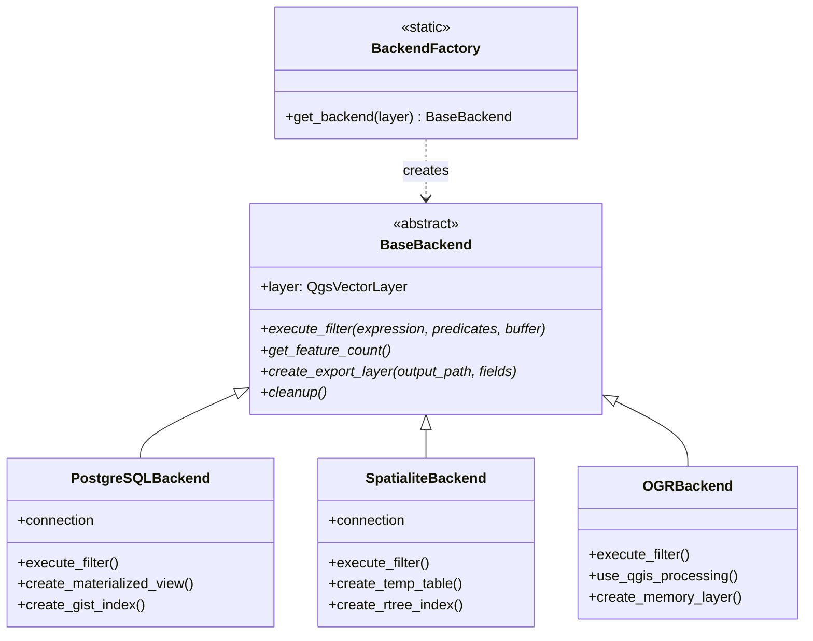

# Backend API Reference

Complete API documentation for FilterMate's multi-backend system, including the factory pattern, abstract interface, and all backend implementations.

## Overview

FilterMate uses a **factory pattern** to automatically select the optimal backend based on the layer's data source. All backends implement a common interface defined in `BaseBackend`, ensuring consistent behavior across different data sources.

## Architecture



## BackendFactory

**Location:** `modules/backends/factory.py`

The factory class responsible for automatic backend selection.

### get_backend()

```python
@staticmethod
def get_backend(layer: QgsVectorLayer) -> BaseBackend
```

Automatically selects and instantiates the appropriate backend for a given layer.

**Parameters:**
- `layer` (QgsVectorLayer): The QGIS vector layer to process

**Returns:**
- `BaseBackend`: Instance of the appropriate backend implementation

**Selection Logic:**
1. Detect layer provider type (`layer.providerType()`)
2. Check PostgreSQL availability (`POSTGRESQL_AVAILABLE`)
3. Return appropriate backend instance

**Example:**
```python
from modules.backends.factory import BackendFactory

# Automatic backend selection
backend = BackendFactory.get_backend(layer)

# Execute filtering
result = backend.execute_filter(
    expression="population > 10000",
    predicates=['intersects'],
    buffer_distance=100
)

# Cleanup
backend.cleanup()
```

**Backend Selection Matrix:**

| Provider Type | psycopg2 Available | Selected Backend |
|--------------|-------------------|------------------|
| `postgres` | ✅ Yes | PostgreSQLBackend |
| `postgres` | ❌ No | OGRBackend (with warning) |
| `spatialite` | N/A | SpatialiteBackend |
| `ogr` | N/A | OGRBackend |
| Other | N/A | OGRBackend (fallback) |

## BaseBackend

**Location:** `modules/backends/base_backend.py`

Abstract base class defining the backend interface.

### Abstract Methods

All backend implementations must implement these methods:

#### execute_filter()

```python
@abstractmethod
def execute_filter(
    self,
    expression: str,
    predicates: List[str],
    buffer_distance: float
) -> Dict[str, Any]
```

Execute filtering operation with spatial predicates.

**Parameters:**
- `expression` (str): QGIS expression for attribute filtering
- `predicates` (List[str]): Spatial predicates to apply (`['intersects', 'contains', ...]`)
- `buffer_distance` (float): Buffer distance in layer units

**Returns:**
- `Dict[str, Any]`: Dictionary containing:
  - `feature_ids` (List[int]): IDs of filtered features
  - `feature_count` (int): Number of filtered features
  - `execution_time` (float): Operation duration in seconds

**Raises:**
- `BackendError`: If filtering operation fails
- `GeometryError`: If geometry operations fail

#### get_feature_count()

```python
@abstractmethod
def get_feature_count(self) -> int
```

Get the number of features after filtering.

**Returns:**
- `int`: Feature count

#### create_export_layer()

```python
@abstractmethod
def create_export_layer(
    self,
    output_path: str,
    selected_fields: List[str]
) -> bool
```

Export filtered features to a new layer.

**Parameters:**
- `output_path` (str): Output file path
- `selected_fields` (List[str]): Fields to include in export

**Returns:**
- `bool`: True if export successful

#### cleanup()

```python
@abstractmethod
def cleanup(self) -> None
```

Clean up resources (close connections, remove temp tables, etc.).

**Important:** Always call this method when done with the backend.

## PostgreSQLBackend

**Location:** `modules/backends/postgresql_backend.py`

High-performance backend for PostgreSQL/PostGIS databases.

### Features

- ✅ **Materialized views** for ultra-fast filtering
- ✅ **GIST spatial indexes** for efficient spatial queries
- ✅ **Server-side operations** minimize data transfer
- ✅ **Best for datasets > 50,000 features**

### Requirements

```python
from modules.appUtils import POSTGRESQL_AVAILABLE

if POSTGRESQL_AVAILABLE:
    # psycopg2 is installed
    # Safe to use PostgreSQLBackend
```

**Installation:**
```bash
pip install psycopg2-binary
```

### Key Methods

#### \_\_init\_\_()

```python
def __init__(self, layer: QgsVectorLayer)
```

Initialize PostgreSQL backend with database connection.

**Connection Details:**
- Extracted from layer data source URI
- Uses `psycopg2.connect()`
- Connection pooling not implemented (single connection per backend)

#### execute_filter()

```python
def execute_filter(
    self,
    expression: str,
    predicates: List[str],
    buffer_distance: float
) -> Dict[str, Any]
```

**Implementation Strategy:**
1. Create materialized view with filtered data
2. Create GIST spatial index on geometry column
3. Execute spatial queries using PostGIS functions
4. Return feature IDs

**PostGIS Functions Used:**
- `ST_Intersects()`, `ST_Contains()`, `ST_Within()`, etc.
- `ST_Buffer()` for buffer operations
- `ST_MakeValid()` for geometry repair

**Performance:**
- Sub-second queries on millions of features
- Leverages PostgreSQL query optimizer
- Automatic query plan caching

#### create_materialized_view()

```python
def create_materialized_view(
    self,
    view_name: str,
    query: str
) -> None
```

Create materialized view for filtering results.

**Parameters:**
- `view_name` (str): Name for the materialized view
- `query` (str): SQL SELECT query

**SQL Template:**
```sql
CREATE MATERIALIZED VIEW {view_name} AS
{query}
WITH DATA;

CREATE INDEX idx_{view_name}_geom 
ON {view_name} 
USING GIST (geometry);
```

#### qgis_expression_to_postgis()

```python
def qgis_expression_to_postgis(
    self,
    expression: str
) -> str
```

Convert QGIS expression to PostGIS SQL.

**Example Conversions:**
- `$area > 1000` → `ST_Area(geometry) > 1000`
- `$length < 500` → `ST_Length(geometry) < 500`
- `$perimeter` → `ST_Perimeter(geometry)`
- `$x` → `ST_X(geometry)`
- `$y` → `ST_Y(geometry)`

### Example Usage

```python
from modules.backends.postgresql_backend import PostgreSQLBackend

# Initialize backend
backend = PostgreSQLBackend(layer)

try:
    # Execute filter
    result = backend.execute_filter(
        expression="population > 100000",
        predicates=['intersects', 'contains'],
        buffer_distance=1000  # meters
    )
    
    print(f"Filtered {result['feature_count']} features")
    print(f"Execution time: {result['execution_time']:.2f}s")
    
    # Export results
    backend.create_export_layer(
        output_path='/tmp/filtered_data.gpkg',
        selected_fields=['name', 'population', 'area']
    )
finally:
    # Always cleanup
    backend.cleanup()
```

## SpatialiteBackend

**Location:** `modules/backends/spatialite_backend.py`

Efficient backend for Spatialite databases (SQLite with spatial extension).

### Features

- ✅ **Temporary tables** for filtering operations
- ✅ **R-tree spatial indexes** for fast spatial queries
- ✅ **Built-in** - no additional dependencies
- ✅ **~90% PostGIS function compatibility**
- ✅ **Best for datasets 10,000-50,000 features**

### Requirements

None - SQLite is built into Python, and QGIS provides Spatialite extension.

### Key Methods

#### \_\_init\_\_()

```python
def __init__(self, layer: QgsVectorLayer)
```

Initialize Spatialite backend with database connection.

**Connection Process:**
```python
import sqlite3

conn = sqlite3.connect(db_path)
conn.enable_load_extension(True)
try:
    conn.load_extension('mod_spatialite')
except:
    conn.load_extension('mod_spatialite.dll')  # Windows
```

#### execute_filter()

```python
def execute_filter(
    self,
    expression: str,
    predicates: List[str],
    buffer_distance: float
) -> Dict[str, Any]
```

**Implementation Strategy:**
1. Create temporary table with filtered data
2. Create R-tree spatial index
3. Execute spatial queries using Spatialite functions
4. Return feature IDs
5. Automatic retry on database lock (5 attempts)

**Lock Management:**
```python
max_retries = 5
for attempt in range(max_retries):
    try:
        # Database operation
        break
    except sqlite3.OperationalError as e:
        if "locked" in str(e) and attempt < max_retries - 1:
            time.sleep(0.1 * (2 ** attempt))  # Exponential backoff
        else:
            raise
```

#### create_temp_table()

```python
def create_temp_table(
    self,
    table_name: str,
    query: str
) -> None
```

Create temporary table for filtering results.

**Parameters:**
- `table_name` (str): Name for temporary table
- `query` (str): SQL SELECT query

**SQL Template:**
```sql
CREATE TEMP TABLE {table_name} AS
{query};

SELECT CreateSpatialIndex('{table_name}', 'geometry');
```

#### qgis_expression_to_spatialite()

```python
def qgis_expression_to_spatialite(
    self,
    expression: str
) -> str
```

Convert QGIS expression to Spatialite SQL.

**Example Conversions:**
- `$area > 1000` → `Area(geometry) > 1000`
- `$length < 500` → `GLength(geometry) < 500`
- `$perimeter` → `Perimeter(geometry)`
- `$x` → `X(geometry)`
- `$y` → `Y(geometry)`

**Note:** Spatialite function names are similar but not identical to PostGIS.

### Example Usage

```python
from modules.backends.spatialite_backend import SpatialiteBackend

# Initialize backend
backend = SpatialiteBackend(layer)

try:
    # Execute filter
    result = backend.execute_filter(
        expression="area > 5000",
        predicates=['intersects'],
        buffer_distance=50  # meters
    )
    
    print(f"Filtered {result['feature_count']} features")
    print(f"Execution time: {result['execution_time']:.2f}s")
    
    # Export results
    backend.create_export_layer(
        output_path='/tmp/filtered_data.gpkg',
        selected_fields=['name', 'area']
    )
finally:
    backend.cleanup()
```

## OGRBackend

**Location:** `modules/backends/ogr_backend.py`

Universal fallback backend using QGIS Processing and OGR drivers.

### Features

- ✅ **Universal compatibility** - works with any QGIS-supported format
- ✅ **No dependencies** - uses QGIS Processing framework
- ✅ **Automatic spatial indexing** (`.qix` files for Shapefiles)
- ✅ **Memory layers** for intermediate operations
- ✅ **Best for datasets < 10,000 features**

### Supported Formats

- Shapefiles (`.shp`)
- GeoPackage (`.gpkg`)
- GeoJSON (`.geojson`)
- KML (`.kml`)
- DXF (`.dxf`)
- CSV with geometry (`.csv`)
- Any OGR-supported format

### Key Methods

#### execute_filter()

```python
def execute_filter(
    self,
    expression: str,
    predicates: List[str],
    buffer_distance: float
) -> Dict[str, Any]
```

**Implementation Strategy:**
1. Use QGIS Processing algorithms
2. Create memory layer for intermediate results
3. Apply filters using QGIS expression engine
4. Generate `.qix` spatial index for Shapefiles
5. Return feature IDs

**QGIS Processing Algorithms Used:**
- `native:extractbyexpression`
- `native:buffer`
- `native:intersection`
- `native:selectbylocation`

**Performance Optimization:**
```python
if layer.featureCount() > 50000:
    # Use optimized processing for large datasets
    use_large_dataset_optimization()
else:
    # Standard processing
    use_standard_processing()
```

#### create_memory_layer()

```python
def create_memory_layer(
    self,
    geometry_type: str,
    crs: QgsCoordinateReferenceSystem
) -> QgsVectorLayer
```

Create in-memory layer for intermediate operations.

**Parameters:**
- `geometry_type` (str): `'Point'`, `'LineString'`, `'Polygon'`, etc.
- `crs` (QgsCoordinateReferenceSystem): Coordinate reference system

**Returns:**
- `QgsVectorLayer`: Memory layer instance

#### use_qgis_processing()

```python
def use_qgis_processing(
    self,
    algorithm: str,
    parameters: Dict[str, Any]
) -> Dict[str, Any]
```

Execute QGIS Processing algorithm.

**Parameters:**
- `algorithm` (str): Algorithm identifier (e.g., `'native:buffer'`)
- `parameters` (Dict): Algorithm parameters

**Returns:**
- `Dict[str, Any]`: Processing results

### Example Usage

```python
from modules.backends.ogr_backend import OGRBackend

# Initialize backend
backend = OGRBackend(layer)

try:
    # Execute filter
    result = backend.execute_filter(
        expression="name LIKE '%Park%'",
        predicates=['intersects'],
        buffer_distance=10  # meters
    )
    
    print(f"Filtered {result['feature_count']} features")
    print(f"Execution time: {result['execution_time']:.2f}s")
    
    # Export results
    backend.create_export_layer(
        output_path='/tmp/filtered_data.shp',
        selected_fields=['name', 'type']
    )
finally:
    backend.cleanup()
```

## Performance Comparison

### Benchmark Results

**Dataset:** 100,000 polygon features  
**Operation:** Spatial intersection with buffer

| Backend | Execution Time | Memory Usage | Requirements |
|---------|---------------|--------------|--------------|
| **PostgreSQL** | 0.8s | Low (server-side) | psycopg2 + PostGIS |
| **Spatialite** | 4.2s | Medium (temp tables) | None (built-in) |
| **OGR** | 28.5s | High (in-memory) | None (built-in) |

### Recommendations

**Choose PostgreSQL when:**
- Dataset > 50,000 features
- Server-side processing available
- Multiple concurrent users
- Complex spatial operations

**Choose Spatialite when:**
- Dataset 10,000-50,000 features
- Single user desktop application
- No PostgreSQL server available
- Moderate performance acceptable

**Choose OGR when:**
- Dataset < 10,000 features
- Maximum compatibility required
- No database setup desired
- Diverse file formats needed

## Error Handling

### Common Exceptions

```python
from modules.customExceptions import (
    BackendError,
    DatabaseConnectionError,
    GeometryError
)

try:
    backend = BackendFactory.get_backend(layer)
    result = backend.execute_filter(...)
except DatabaseConnectionError as e:
    # Handle connection failures
    print(f"Cannot connect to database: {e}")
except GeometryError as e:
    # Handle invalid geometries
    print(f"Geometry error: {e}")
    # Automatic repair attempted
except BackendError as e:
    # Handle generic backend errors
    print(f"Backend operation failed: {e}")
finally:
    if backend:
        backend.cleanup()
```

### Automatic Geometry Repair

All backends automatically attempt geometry repair:

```python
from modules.appUtils import repair_geometry

try:
    result = backend.execute_filter(...)
except GeometryError:
    # Automatic repair with 5 strategies
    repaired_geom = repair_geometry(geometry)
    result = backend.execute_filter(...)
```

## Best Practices

### 1. Always Cleanup

```python
backend = BackendFactory.get_backend(layer)
try:
    # Operations
    result = backend.execute_filter(...)
finally:
    # Always cleanup resources
    backend.cleanup()
```

### 2. Check PostgreSQL Availability

```python
from modules.appUtils import POSTGRESQL_AVAILABLE

if not POSTGRESQL_AVAILABLE:
    show_warning(
        "PostgreSQL not available. Install psycopg2 for better performance.",
        duration=10
    )
```

### 3. Handle Large Datasets

```python
if layer.featureCount() > 50000:
    if backend.__class__.__name__ != 'PostgreSQLBackend':
        show_warning(
            f"Large dataset ({layer.featureCount()} features) "
            "without PostgreSQL. Performance may be reduced.",
            duration=10
        )
```

### 4. Validate Expressions

```python
# Convert and validate expression before execution
try:
    if isinstance(backend, PostgreSQLBackend):
        sql_expr = backend.qgis_expression_to_postgis(expression)
    elif isinstance(backend, SpatialiteBackend):
        sql_expr = backend.qgis_expression_to_spatialite(expression)
except Exception as e:
    show_error(f"Invalid expression: {e}")
```

## Further Reading

- [Architecture Overview](../developer-guide/architecture.md)
- [Backend Development Guide](../developer-guide/backend-development.md)
- [PostgreSQL Backend Details](../backends/postgresql.md)
- [Spatialite Backend Details](../backends/spatialite.md)
- [OGR Backend Details](../backends/ogr.md)
- [Performance Comparison](../backends/performance-comparison.md)
