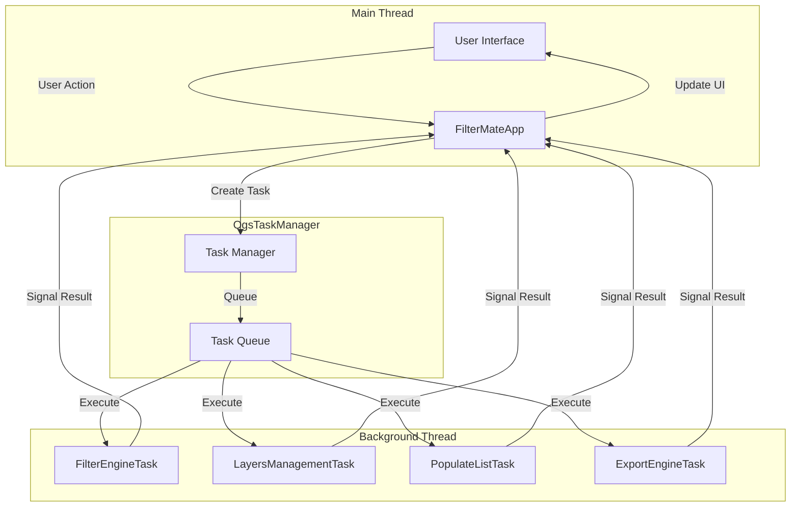

# Tasks API Reference

Complete API documentation for FilterMate's asynchronous task system based on QGIS's `QgsTask` framework.

## Overview

FilterMate uses **QgsTask** for all heavy operations to keep the UI responsive. Tasks run in background threads and communicate results through signals, providing a smooth user experience even with large datasets.

## Task Architecture



## Base Task Pattern

All FilterMate tasks follow this pattern:

```python
from qgis.core import QgsTask

class MyTask(QgsTask):
    def __init__(self, description, parameters):
        super().__init__(description, QgsTask.CanCancel)
        self.parameters = parameters
        self.result_data = None
        self.exception = None
    
    def run(self):
        \"\"\"Executed in background thread.\"\"\"
        try:
            # Heavy operations here
            self.result_data = perform_operation(self.parameters)
            return True
        except Exception as e:
            self.exception = e
            return False
    
    def finished(self, result):
        \"\"\"Executed in main thread.\"\"\"
        if result:
            # Success handling
            self.taskCompletedSignal.emit(self.result_data)
        else:
            # Error handling
            if self.exception:
                show_error(f\"Task failed: {str(self.exception)}\")
    
    def cancel(self):
        \"\"\"Called when user cancels.\"\"\"
        super().cancel()
```

## FilterEngineTask

**Location:** `modules/appTasks.py`

Executes filtering operations with spatial predicates.

### Key Methods

- `run()`: Execute filtering in background thread
- `finished()`: Handle results in main thread
- `cancel()`: Cleanup on cancellation

### Task Parameters

```python
task_parameters = {
    'layer': QgsVectorLayer,
    'expression': str,
    'predicates': List[str],
    'buffer_distance': float,
    'source_layer': QgsVectorLayer,
    'selected_fields': List[str],
}
```

### Usage Example

```python
from modules.appTasks import FilterEngineTask

params = {
    'layer': my_layer,
    'expression': 'population > 10000',
    'predicates': ['intersects'],
    'buffer_distance': 100
}

task = FilterEngineTask('Filtering features', params)
task.taskCompletedSignal.connect(handle_result)
QgsApplication.taskManager().addTask(task)
```

## LayersManagementEngineTask

Handles layer metadata extraction.

### Extracted Information

- Layer ID and name
- Geometry type
- Provider type
- CRS
- Primary key
- Field list

## PopulateListEngineTask

Non-blocking feature list population.

### Features

- Expression filtering
- Field selection
- Progress reporting
- Cancellation support

## ExportEngineTask

Asynchronous feature export.

### Supported Formats

- GPKG, SHP, GEOJSON, KML, DXF, CSV

### Features

- CRS transformation
- Field selection
- Style export (QML/SLD)

## Best Practices

1. **Always support cancellation**
2. **Report progress regularly**
3. **Handle exceptions gracefully**
4. **Cleanup resources in finished()**
5. **Use signals for communication**

## Further Reading

- [Architecture Overview](../developer-guide/architecture.md)
- [Backend API Reference](./backend-api.md)
