# Backend Selection

FilterMate automatically selects the optimal backend for your data source using intelligent detection and performance analysis. Understanding this process helps you get the best performance from the plugin.

:::tip Automatic & Smart
FilterMate's backend selection is **fully automatic** - you don't need to configure anything. The plugin analyzes your layer and chooses the best backend, displaying performance warnings when helpful.
:::

## Automatic Selection Process

### Selection Flow Diagram

```mermaid
flowchart TD
    Start([Layer Added to QGIS]) --> Detect{Detect<br/>Provider Type}
    
    Detect -->|postgres| CheckPsycopg{psycopg2<br/>installed?}
    Detect -->|spatialite| Spatialite[Spatialite Backend]
    Detect -->|ogr/other| OGR[OGR Backend]
    
    CheckPsycopg -->|Yes| PostgreSQL[PostgreSQL Backend<br/>⚡ Optimal Performance]
    CheckPsycopg -->|No| CheckSize{Feature<br/>Count?}
    
    CheckSize -->|> 50,000| Warning[⚠️ Performance Warning<br/>Recommend psycopg2]
    CheckSize -->|< 50,000| Spatialite
    
    Warning --> Spatialite
    
    PostgreSQL --> Features1[✓ Materialized Views<br/>✓ Server-side Processing<br/>✓ GIST Indexes]
    Spatialite --> Features2[✓ Temporary Tables<br/>✓ R*Tree Indexes<br/>✓ Local Processing]
    OGR --> Features3[✓ Universal Compatibility<br/>✓ Memory Layers<br/>✓ QGIS Processing]
    
    Features1 --> End([Backend Active])
    Features2 --> End
    Features3 --> End
    
    classDef optimal fill:#90EE90,stroke:#2d6a2d,stroke-width:2px
    classDef good fill:#87CEEB,stroke:#1e5f8f,stroke-width:2px
    classDef fallback fill:#FFD700,stroke:#b8860b,stroke-width:2px
    classDef warning fill:#FF6347,stroke:#8b0000,stroke-width:2px
    
    class PostgreSQL,Features1 optimal
    class Spatialite,Features2 good
    class OGR,Features3 fallback
    class Warning warning
```



## Selection Criteria

### 1. Provider Type Detection

FilterMate first examines the **layer's provider type**:

```python
# Internal detection logic
provider_type = layer.providerType()

if provider_type == 'postgres':
    # PostgreSQL layer detected
    layer_provider = 'postgresql'
elif provider_type == 'spatialite':
    # Spatialite layer detected
    layer_provider = 'spatialite'
elif provider_type == 'ogr':
    # OGR layer (Shapefile, GeoPackage, etc.)
    layer_provider = 'ogr'
else:
    # Unknown provider - fallback to OGR
    layer_provider = 'ogr'
```

**Supported Provider Types:**

| QGIS Provider | FilterMate Backend | Detection Method |
|--------------|-------------------|------------------|
| `postgres` | PostgreSQL | Provider type |
| `spatialite` | Spatialite | Provider type |
| `ogr` | OGR | Provider type + format |
| `memory` | OGR | Fallback |
| `delimitedtext` | OGR | Fallback |
| Others | OGR | Universal fallback |

### 2. Capability Check

For **PostgreSQL layers**, FilterMate checks if `psycopg2` is available:

```python
# Capability detection
try:
    import psycopg2
    POSTGRESQL_AVAILABLE = True
except ImportError:
    POSTGRESQL_AVAILABLE = False
    # Will fallback to Spatialite or OGR
```

**Decision Logic:**

- ✅ **PostgreSQL + psycopg2** → Use PostgreSQL backend
- ❌ **PostgreSQL without psycopg2** → Use Spatialite or OGR with warning

:::warning Missing psycopg2
If you have PostgreSQL layers but don't have psycopg2 installed, FilterMate will display a warning and use a slower backend. See [PostgreSQL Installation](./postgresql.md#installation) to fix this.
:::

### 3. Performance Analysis

FilterMate considers the **feature count** to issue warnings:

```python
# Performance check
feature_count = layer.featureCount()

if feature_count > 50000 and not POSTGRESQL_AVAILABLE:
    # Display performance warning
    show_warning(
        "Large dataset detected without PostgreSQL backend. "
        "Consider installing psycopg2 for better performance."
    )
```

**Warning Thresholds:**

| Feature Count | Spatialite | OGR | Warning |
|--------------|-----------|-----|---------|
| < 10,000 | ✅ Excellent | ✅ Good | None |
| 10,000 - 50,000 | ✅ Good | ⚠️ Acceptable | Info message |
| 50,000 - 500,000 | ⚠️ Slow | ❌ Very slow | PostgreSQL recommended |
| > 500,000 | ❌ Timeout | ❌ Timeout | PostgreSQL required |

## Backend Indicators

FilterMate displays the active backend in the UI:

### Visual Indicators

| Backend | Indicator | Color | Tooltip |
|---------|----------|-------|---------|
| PostgreSQL | **[PG]** | 🟢 Green | PostgreSQL backend - Optimal performance |
| Spatialite | **[SQLite]** | 🔵 Blue | Spatialite backend - Good performance |
| OGR | **[OGR]** | 🟡 Yellow | OGR backend - Universal compatibility |

**Where to See:**
- Layer combo box suffix: `My Layer [PG]`
- Status bar message on filter apply
- Plugin log messages

### Log Messages

FilterMate logs backend selection:

```
[FilterMate] Layer 'cities' loaded
[FilterMate] Backend: PostgreSQL (optimal)
[FilterMate] Features: 125,473
[FilterMate] Spatial index: Available (GIST)
```

```
[FilterMate] Layer 'parcels' loaded
[FilterMate] Backend: Spatialite (good)
[FilterMate] Features: 23,851
[FilterMate] Spatial index: Available (R-tree)
```

```
[FilterMate] Layer 'points' loaded
[FilterMate] Backend: OGR (fallback)
[FilterMate] Features: 8,234
[FilterMate] Warning: Large PostgreSQL layer without psycopg2
[FilterMate] Recommendation: Install psycopg2 for 10x better performance
```

## Performance Warnings

### Warning Types

#### 1. Missing psycopg2 for PostgreSQL

**Trigger:** PostgreSQL layer without psycopg2 package

**Message:**
```
⚠️ PostgreSQL layer detected but psycopg2 not installed
Performance will be reduced. Install psycopg2-binary for optimal performance.
```

**Solution:** Install psycopg2 (see [Installation Guide](./postgresql.md#installation))

#### 2. Large Dataset Without PostgreSQL

**Trigger:** > 50,000 features on non-PostgreSQL backend

**Message:**
```
⚠️ Large dataset (78,234 features) without PostgreSQL backend
Consider migrating to PostgreSQL for 5-10x better performance.
```

**Solution:** Migrate to PostgreSQL or accept slower performance

#### 3. Very Large Dataset on OGR

**Trigger:** > 100,000 features on OGR backend

**Message:**
```
❌ Very large dataset (234,567 features) on OGR backend
Filtering may be very slow or timeout. PostgreSQL strongly recommended.
```

**Solution:** Migrate to PostgreSQL immediately

#### 4. No Spatial Index

**Trigger:** Missing spatial index on any backend

**Message:**
```
⚠️ No spatial index detected on layer 'my_layer'
Queries will be 10-100x slower. Create a spatial index.
```

**Solution:** Create spatial index (automatic on PostgreSQL/Spatialite)

### Suppressing Warnings

If you want to suppress performance warnings:

```json
// In config/config.json
{
  "PERFORMANCE_WARNINGS": {
    "enabled": false,
    "threshold_features": 50000,
    "show_psycopg2_warning": true
  }
}
```

:::caution Not Recommended
Disabling warnings may result in poor user experience with large datasets. Only disable if you understand the performance implications.
:::

## Manual Backend Override

While automatic selection is recommended, you can manually override in specific cases:

### Configuration Override

Edit `config/config.json`:

```json
{
  "BACKEND": {
    "auto_select": false,
    "force_backend": "spatialite",  // 'postgresql', 'spatialite', or 'ogr'
    "override_warnings": false
  }
}
```

:::danger Use With Caution
Manual override disables intelligent selection. You may get worse performance if you choose incorrectly.
:::

### Per-Layer Override

For advanced users, override in code:

```python
# In QGIS Python Console
from filter_mate.modules.backends.factory import BackendFactory

layer = iface.activeLayer()

# Force OGR backend
backend = BackendFactory.create_backend(
    layer,
    force_type='ogr'
)

# Use backend
backend.apply_geometric_filter(...)
```

**Use Cases for Override:**
- Testing different backends
- Debugging performance issues
- Special deployment scenarios
- Working around bugs

## Decision Matrix

FilterMate uses this decision matrix internally:

### Priority 1: Provider Type

| Provider Type | Default Backend | Requires |
|--------------|----------------|----------|
| `postgres` | PostgreSQL | psycopg2 |
| `spatialite` | Spatialite | Nothing |
| `ogr` | OGR | Nothing |

### Priority 2: Capability

| Condition | Backend | Reason |
|-----------|---------|--------|
| PostgreSQL + psycopg2 | PostgreSQL | Best performance |
| PostgreSQL without psycopg2 | Spatialite/OGR | Fallback |
| Spatialite available | Spatialite | Good performance |
| Other | OGR | Universal |

### Priority 3: Performance

| Feature Count | PostgreSQL | Spatialite | OGR | Warning |
|--------------|-----------|-----------|-----|---------|
| < 10k | ⚡ Optimal | ⚡ Optimal | ⚡ Good | None |
| 10k - 50k | ⚡ Optimal | ⚡ Optimal | ⚠️ Acceptable | Info |
| 50k - 500k | ⚡ Optimal | ⚠️ Slow | ❌ Very slow | PostgreSQL recommended |
| > 500k | ⚡ Optimal | ❌ Timeout | ❌ Timeout | PostgreSQL required |

## Real-World Examples

### Example 1: PostgreSQL Layer with psycopg2

**Scenario:**
- Layer: PostgreSQL cities table
- Features: 125,000
- psycopg2: Installed

**Selection:**
```
✅ PostgreSQL backend selected (optimal)
📊 Features: 125,000
⚡ Performance: Excellent
🔍 Spatial index: GIST (active)
```

**Result:** Best performance, no warnings

### Example 2: PostgreSQL Layer without psycopg2

**Scenario:**
- Layer: PostgreSQL parcels table
- Features: 78,000
- psycopg2: **Not installed**

**Selection:**
```
⚠️ Spatialite backend selected (fallback)
📊 Features: 78,000
⚠️ Performance: Reduced
💡 Recommendation: Install psycopg2 for 10x speedup
```

**Result:** Works but slower, warning displayed

### Example 3: Spatialite Database

**Scenario:**
- Layer: Spatialite database
- Features: 23,000
- psycopg2: N/A

**Selection:**
```
✅ Spatialite backend selected (optimal)
📊 Features: 23,000
⚡ Performance: Excellent
🔍 Spatial index: R-tree (active)
```

**Result:** Excellent performance, no warnings

### Example 4: Shapefile

**Scenario:**
- Layer: Shapefile
- Features: 8,200
- Spatial index: .qix file exists

**Selection:**
```
✅ OGR backend selected (good)
📊 Features: 8,200
⚡ Performance: Good
🔍 Spatial index: .qix (active)
```

**Result:** Good performance for small dataset

### Example 5: Large GeoPackage

**Scenario:**
- Layer: GeoPackage
- Features: 187,000
- R-tree: Available

**Selection:**
```
⚠️ OGR backend selected
📊 Features: 187,000
⚠️ Performance: Will be slow
💡 Recommendation: Convert to PostgreSQL for better performance
```

**Result:** Will work but slow, warning displayed

## Troubleshooting

### Issue: Wrong Backend Selected

**Symptom:** FilterMate selects Spatialite for PostgreSQL layer

**Diagnosis:**
1. Check if psycopg2 is installed:
   ```python
   import psycopg2
   print(psycopg2.__version__)
   ```

2. Check QGIS Python Console for errors

3. Verify layer connection in QGIS

**Solution:** Install psycopg2 and restart QGIS

### Issue: Performance Warning Despite Small Dataset

**Symptom:** Warning shown for small dataset

**Diagnosis:**
1. Check actual feature count:
   ```python
   layer = iface.activeLayer()
   print(f"Features: {layer.featureCount()}")
   ```

2. Verify layer metadata is correct

**Solution:** Refresh layer or check data source

### Issue: No Backend Indicator Shown

**Symptom:** Can't see which backend is active

**Diagnosis:**
1. Check if indicator is enabled in config
2. Verify UI profile settings

**Solution:** Enable in `config.json`:
```json
{
  "UI": {
    "show_backend_indicator": true,
    "backend_indicator_position": "suffix"
  }
}
```

### Issue: Override Not Working

**Symptom:** Manual override ignored

**Diagnosis:**
1. Check config file syntax (valid JSON)
2. Verify auto_select is false
3. Check QGIS Python Console for errors

**Solution:** Fix JSON syntax or check permissions

## Best Practices

### ✅ Do

- **Trust automatic selection** - it's smart and well-tested
- **Install psycopg2** if using PostgreSQL
- **Monitor performance warnings** - they're helpful
- **Check backend indicator** to understand what's being used
- **Create spatial indexes** on your layers

### ❌ Don't

- **Don't manually override** unless you have a specific reason
- **Don't ignore warnings** - they indicate real performance issues
- **Don't suppress warnings** without understanding implications
- **Don't use OGR for large datasets** - migrate to PostgreSQL
- **Don't skip spatial indexes** - they're critical for performance

## See Also

- [Performance Comparison](./performance-comparison.md) - Detailed benchmarks
- [PostgreSQL Backend](./postgresql.md) - PostgreSQL setup and features
- [Spatialite Backend](./spatialite.md) - Spatialite usage and limitations
- [OGR Backend](./ogr.md) - OGR compatibility and formats
- [Backends Overview](./overview.md) - Multi-backend architecture

## Technical Details

### Backend Factory

FilterMate uses a **factory pattern** for backend creation:

```python
# modules/backends/factory.py

class BackendFactory:
    @staticmethod
    def get_backend(layer):
        """
        Automatically select and create optimal backend.
        
        Returns:
            GeometricFilterBackend: Instantiated backend
        """
        provider_type = layer.providerType()
        
        if provider_type == 'postgres' and POSTGRESQL_AVAILABLE:
            from .postgresql_backend import PostgresqlBackend
            return PostgresqlBackend(layer)
        
        elif provider_type == 'spatialite':
            from .spatialite_backend import SpatialiteBackend
            return SpatialiteBackend(layer)
        
        else:
            from .ogr_backend import OgrBackend
            return OgrBackend(layer)
```

### Capability Detection

```python
# modules/appUtils.py

# Global flag for PostgreSQL availability
try:
    import psycopg2
    POSTGRESQL_AVAILABLE = True
except ImportError:
    POSTGRESQL_AVAILABLE = False

def check_backend_capabilities(layer):
    """
    Analyze layer and return capabilities.
    
    Returns:
        dict: Capabilities and recommendations
    """
    return {
        'provider': layer.providerType(),
        'feature_count': layer.featureCount(),
        'has_spatial_index': layer.hasSpatialIndex(),
        'postgresql_available': POSTGRESQL_AVAILABLE,
        'recommended_backend': determine_optimal_backend(layer)
    }
```

### Performance Threshold Configuration

Default thresholds in `modules/constants.py`:

```python
# Performance warning thresholds
PERFORMANCE_THRESHOLDS = {
    'INFO_THRESHOLD': 10000,      # Show info message
    'WARNING_THRESHOLD': 50000,   # Show warning
    'CRITICAL_THRESHOLD': 500000, # Show critical warning
}

# Backend recommendations by size
BACKEND_RECOMMENDATIONS = {
    (0, 10000): ['postgresql', 'spatialite', 'ogr'],
    (10000, 50000): ['spatialite', 'postgresql'],
    (50000, 500000): ['postgresql'],
    (500000, float('inf')): ['postgresql'],  # Required
}
```

---

**Last Updated:** December 8, 2025  
**Plugin Version:** 2.2.3  
**Backend Selection:** Automatic with intelligent warnings
