# Choosing the Right Backend

Interactive guide to help you select the optimal backend for your data and workflow.

## Quick Decision Tree

```mermaid
flowchart TD
    Start[What's your data source?] --> Type{Data Source Type?}
    
    Type -->|PostgreSQL/PostGIS| HasPsycopg{psycopg2<br/>installed?}
    Type -->|Spatialite| Spatial[Use Spatialite Backend]
    Type -->|Shapefile/GPKG/Other| OGR[Use OGR Backend]
    
    HasPsycopg -->|Yes| Postgres[✅ Use PostgreSQL Backend]
    HasPsycopg -->|No| InstallPsycopg[Install psycopg2<br/>for best performance]
    
    InstallPsycopg --> Postgres
    
    Postgres --> Size1{Dataset Size?}
    Spatial --> Size2{Dataset Size?}
    OGR --> Size3{Dataset Size?}
    
    Size1 -->|Any size| PG_Best[⚡ OPTIMAL<br/>Sub-second queries<br/>even on 500k+ features]
    
    Size2 -->|< 50K features| SP_Good[✅ Good Performance<br/>1-10` second queries]
    Size2 -->|> 50K features| SP_Warn[⚠️ Consider PostgreSQL<br/>5-30` second queries]
    
    Size3 -->|< 10K features| OGR_OK[✅ Adequate<br/>5-15` seconds]
    Size3 -->|10-50K features| OGR_Slow[⚠️ Slow<br/>30-120` seconds]
    Size3 -->|> 50K features| OGR_Critical[🔴 Very Slow<br/>2-10+` minutes<br/>Migrate to PostgreSQL!]
    
    SP_Warn --> MigrateOption1[Consider migrating<br/>to PostgreSQL]
    OGR_Slow --> MigrateOption2[Consider migrating<br/>to PostgreSQL or Spatialite]
    OGR_Critical --> MigrateOption3[Strongly recommend<br/>PostgreSQL migration]
    
    style PG_Best fill:#4CAF50,color:#fff
    style SP_Good fill:#8BC34A,color:#fff
    style SP_Warn fill:#FFC107,color:#000
    style OGR_OK fill:#8BC34A,color:#fff
    style OGR_Slow fill:#FF9800,color:#fff
    style OGR_Critical fill:#F44336,color:#fff
```



---

## Decision Factors

### 1. Data Source Type

**This is usually determined for you** - FilterMate detects your layer's provider automatically.

| Your Layer Is | Backend Used | Control |
|---------------|--------------|---------|
| PostgreSQL/PostGIS connection | PostgreSQL (if psycopg2 installed) | ⚙️ Install psycopg2 |
| Spatialite file (.sqlite) | Spatialite | ✓ Automatic |
| Shapefile (.shp) | OGR | 💡 Can migrate |
| GeoPackage (.gpkg) | OGR or Spatialite | 💡 Can optimize |
| GeoJSON, KML, etc. | OGR | 💡 Can migrate |

---

### 2. Dataset Size

**Most important factor** for performance:

```
< 10,000 features    → Any backend works fine
10,000 - 50,000      → Spatialite recommended
50,000 - 500,000     → PostgreSQL recommended
> 500,000            → PostgreSQL required
```

**How to Check Feature Count**:
1. Right-click layer → **Properties**
2. **Information** tab
3. Look for "Feature count"

Or in FilterMate:
- Feature count displayed in layer info panel

---

### 3. Query Complexity

**Simple Queries** (either/or):
- Attribute filtering only
- Single spatial predicate
- Small buffer distances

→ Any backend adequate

**Complex Queries** (multiple):
- Combined attribute + spatial filtering
- Multiple spatial predicates
- Large buffer distances (>1km`)
- Multi-layer joins

→ PostgreSQL strongly recommended

---

### 4. Frequency of Use

**Occasional Use** (monthly):
- Current backend likely fine
- Performance less critical

**Regular Use** (weekly):
- Optimize with Spatialite or PostgreSQL
- Time savings add up

**Daily Use** (production workflows):
- **Definitely use PostgreSQL**
- 10-50× speedup = hours saved per week

---

## Backend Comparison Matrix

### Performance

| Backend | 10K Features | 50K Features | 100K Features | 500K Features |
|---------|--------------|--------------|---------------|---------------|
| **PostgreSQL** | 0.1s ⚡ | 0.3s ⚡ | 0.8s ⚡ | 2.5s ⚡ |
| **Spatialite** | 0.4s ✓ | 4.5s ⏱️ | 18s ⏱️ | 120s ⚠️ |
| **OGR (GPKG)** | 2.1s | 25s ⏱️ | 95s 🐌 | 600s 🔴 |
| **OGR (SHP)** | 3.8s | 45s ⚠️ | 180s 🐌 | 1200s 🔴 |

*Typical query times for spatial filter with 500m buffer*

---

### Features

| Feature | PostgreSQL | Spatialite | OGR |
|---------|------------|------------|-----|
| Spatial Indexing | GIST ✅ | R-Tree ✅ | Limited ⚠️ |
| Materialized Views | ✅ | Temp Tables ✅ | Memory ⚠️ |
| Server-Side Processing | ✅ | Client ⚠️ | Client ⚠️ |
| Concurrent Access | ✅ | Single User ⚠️ | File Locking ⚠️ |
| Max Dataset Size | Unlimited ✅ | ~1M features ✓ | ~100K ⚠️ |
| Installation | Requires Server | Built-in ✅ | Built-in ✅ |
| psycopg2 Required | ✅ | No | No |

---

### Pros & Cons

#### PostgreSQL Backend

**Pros** ✅:
- Fastest performance (10-50× vs OGR)
- Handles huge datasets (millions of features)
- Server-side spatial operations
- Automatic spatial indexes
- Production-ready
- Concurrent access

**Cons** ⚠️:
- Requires PostgreSQL server
- Needs psycopg2 Python package
- More complex setup
- Database management knowledge helpful

**Best For**:
- Large datasets (>50k` features)
- Production workflows
- Multi-user environments
- Regular/daily use
- Complex spatial queries

---

#### Spatialite Backend

**Pros** ✅:
- Good performance for medium datasets
- File-based (portable)
- No server required
- Built into QGIS
- Spatial indexes supported
- Easy to share

**Cons** ⚠️:
- Slower than PostgreSQL on large datasets
- Single-user (file locking)
- Memory limitations
- Not ideal for >100k` features

**Best For**:
- Medium datasets (10k-50k features)
- Portable projects
- Personal workflows
- No database server available
- Occasional use

---

#### OGR Backend

**Pros** ✅:
- Universal compatibility
- Works with any file format
- No dependencies
- Simple setup
- Built into QGIS

**Cons** ⚠️:
- Slowest performance
- Limited spatial optimization
- Memory-intensive
- Not recommended for >50k` features
- File format limitations

**Best For**:
- Small datasets (`<10k` features)
- Quick one-off queries
- Legacy file formats
- Compatibility requirements
- Testing/prototyping

---

## Migration Paths

### Shapefile → PostgreSQL

**Why Migrate**:
- 10-50× faster queries
- No file size limits
- Better data types
- Concurrent access

**How**:
```bash
1. Install PostgreSQL + PostGIS
2. QGIS: Database → DB Manager → Import Layer
3. Source: Your Shapefile
4. Destination: PostgreSQL database
5. Enable spatial index
6. Load PostgreSQL layer in QGIS
```

**Estimated Time**: 5-15 minutes
**Performance Gain**: 10-50×

See: [PostgreSQL Setup Guide](../backends/postgresql.md)

---

### Shapefile → Spatialite

**Why Migrate**:
- 3-5× faster than Shapefile
- Single-file portability
- Spatial indexing
- Better attribute names (no 10-char limit)

**How**:
```bash
1. Processing Toolbox → Vector general → Package Layers
2. Output: Spatialite (.sqlite)
3. Check "Save layer styles"
4. Load .sqlite file in QGIS
```

**Estimated Time**: 2-5 minutes
**Performance Gain**: 3-5×

---

### Spatialite → PostgreSQL

**Why Migrate**:
- 5-10× faster on large datasets
- Better scalability
- Multi-user support

**How**:
```bash
1. DB Manager → Import Layer
2. Source: Spatialite layer
3. Destination: PostgreSQL
4. Enable spatial index
```

**Estimated Time**: 5-10 minutes
**Performance Gain**: 5-10×

---

## Real-World Scenarios

### Scenario 1: City Parcel Analysis

**Data**:
- 150,000 parcels (polygons)
- 5,000 roads (lines)
- Regular filtering (daily)

**Recommendation**: PostgreSQL ⚡

**Why**:
- Large dataset
- Complex spatial queries
- Daily use = hours saved

**Alternative**: Spatialite would work but 20-30× slower

---

### Scenario 2: Environmental Site Assessment

**Data**:
- 2,500 sample points
- 50 protection zones (polygons)
- Occasional use (monthly)

**Recommendation**: Spatialite ✓ or current format

**Why**:
- Small dataset
- Occasional use
- Setup overhead not justified

**Alternative**: OGR (Shapefile/GPKG) perfectly adequate

---

### Scenario 3: Regional Transportation Network

**Data**:
- 75,000 road segments
- 12,000 intersections
- Weekly analysis

**Recommendation**: PostgreSQL ⚡

**Why**:
- Medium-large dataset
- Regular use
- Complex network analysis

**Alternative**: Spatialite possible but slower (10-30s vs 1-2s)

---

### Scenario 4: Small Project Boundaries

**Data**:
- 150 project sites
- 500 reference features
- One-time export

**Recommendation**: Current format (OGR) ✓

**Why**:
- Tiny dataset
- One-time use
- Migration not worth effort

---

## Installation Guides

### Install psycopg2 for PostgreSQL Backend

import Tabs from '@theme/Tabs';
import TabItem from '@theme/TabItem';

<Tabs>
  <TabItem value="windows" label="Windows" default>
    ```bash
    # OSGeo4W Shell (Recommended)
    # Open OSGeo4W Shell as Administrator
    # Run:
    py3_env
    pip install psycopg2-binary
    
    # Restart QGIS
    ```
  </TabItem>
  
  <TabItem value="linux" label="Linux">
    ```bash
    # Ubuntu/Debian
    sudo apt-get install python3-psycopg2
    
    # Or via pip
    pip3 install psycopg2-binary
    ```
  </TabItem>
  
  <TabItem value="macos" label="macOS">
    ```bash
    # Using pip
    /Applications/QGIS.app/Contents/MacOS/bin/pip3 install psycopg2-binary
    ```
  </TabItem>
</Tabs>

**Verification**:
```python
# QGIS Python Console
import psycopg2
print(psycopg2.__version__)
# Should print version number
```

---

## Performance Checklist

Before complaining about slow performance, verify:

### PostgreSQL Users
- [ ] psycopg2 is installed
- [ ] Spatial index exists on geometry column
- [ ] VACUUM ANALYZE run recently
- [ ] Connection is local (not remote server)
- [ ] Database has adequate RAM

### Spatialite Users
- [ ] Using .sqlite file (not Shapefile)
- [ ] Spatial index created (usually automatic)
- [ ] Dataset is `<100`k` features
- [ ] File is on local drive (not network)

### OGR Users
- [ ] Dataset is `<50k` features (if not, migrate!)
- [ ] Using GeoPackage instead of Shapefile
- [ ] File is on SSD (not HDD or network)
- [ ] Consider Spatialite or PostgreSQL migration

---

## Quick Tips

### When PostgreSQL Isn't Available

**Option 1**: Use Spatialite
```bash
# Convert to Spatialite for 3-5× speedup
Processing → Package Layers → Spatialite
```

**Option 2**: Pre-filter with QGIS
```bash
# Reduce dataset before FilterMate
Layer Properties → Source → Query Builder
```

**Option 3**: Split large files
```bash
# Divide by region/attribute
Processing → Split Vector Layer
```

---

### Optimize Existing Backend

**PostgreSQL**:
```sql
-- Create missing spatial index
CREATE INDEX idx_geom ON table_name USING GIST(geom);

-- Update statistics
VACUUM ANALYZE table_name;

-- Check index usage
EXPLAIN ANALYZE SELECT ... ;
```

**Spatialite**:
```sql
-- Create spatial index
SELECT CreateSpatialIndex('table_name', 'geom');

-- Vacuum database
VACUUM;
```

---

## Summary

### Backend Selection Logic

```
1. Check data source type (automatic detection)
2. Count features in dataset
3. Consider usage frequency
4. Choose backend:
   
   > 50k features + regular use → PostgreSQL
   10-50k features → Spatialite
   < 10k features → Current format fine
```

### Key Takeaways

- **PostgreSQL**: Best performance, worth setup for >50k` features
- **Spatialite**: Good balance for 10-50k features, no server needed
- **OGR**: Universal compatibility but slowest, fine for `<10k` features
- **Migration**: Easy and worth it for large/frequently-used datasets

### Time Investment vs Savings

| Migration | Setup Time | Time Saved Per Query | Break-Even Point |
|-----------|------------|---------------------|------------------|
| SHP → Spatialite | 5 min | 5-15 seconds | ~20 queries |
| SHP → PostgreSQL | 30 min | 30-120 seconds | ~15 queries |
| Spatialite → PostgreSQL | 15 min | 10-30 seconds | ~30 queries |

---

## Need Help?

- 📖 [PostgreSQL Setup](../backends/postgresql.md)
- 📖 [Spatialite Guide](../backends/spatialite.md)
- 📖 [OGR Backend](../backends/ogr.md)
- 📖 [Configuration](../advanced/configuration.md)
- 💬 [Ask on GitHub](https://github.com/sducournau/filter_mate/discussions)
