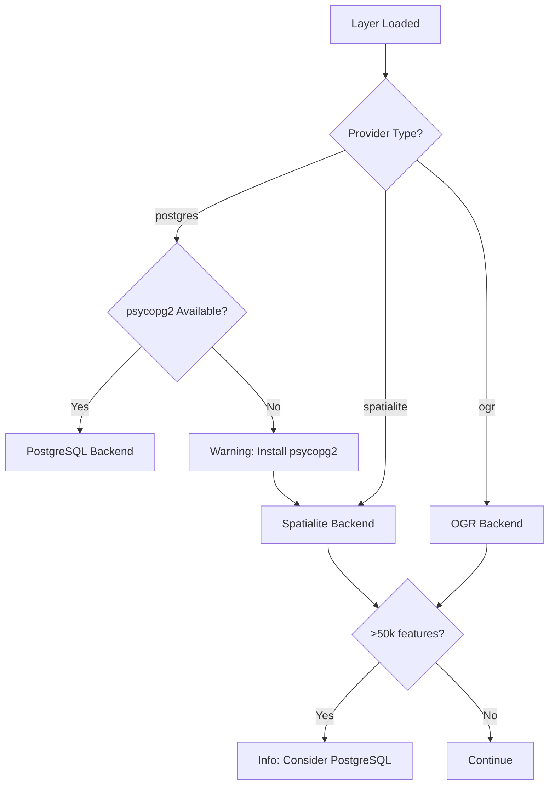

# Backends Overview

FilterMate uses a **multi-backend architecture** to provide optimal performance across different data sources. The backend is automatically selected based on your layer type.

## Architecture

```
modules/backends/
  ├── base_backend.py        # Abstract interface
  ├── postgresql_backend.py  # PostgreSQL/PostGIS backend
  ├── spatialite_backend.py  # Spatialite backend
  ├── ogr_backend.py         # Universal OGR backend
  └── factory.py             # Automatic backend selection
```

## Automatic Selection Logic

FilterMate intelligently selects the best backend:

1. **Detects layer provider type** (`postgres`, `spatialite`, `ogr`)
2. **Checks PostgreSQL availability** (is psycopg2 installed?)
3. **Selects optimal backend** with performance warnings when needed



## Backend Comparison

| Feature | PostgreSQL | Spatialite | OGR |
|---------|-----------|-----------|-----|
| **Speed (10k features)** | Less than 1s | Less than 2s | Around 5s |
| **Speed (100k features)** | Less than 2s | Around 10s | Around 30s |
| **Speed (1M features)** | Around 10s | Around 60s | More than 120s |
| **Concurrent Operations** | Excellent | Good | Limited |
| **Installation** | Optional | Built-in | Built-in |
| **Best For** | Large datasets | Medium datasets | All formats |

## Backend Features

### PostgreSQL Backend

**Technology**: Server-side processing with materialized views

**Features**:
- ✅ Materialized views for ultra-fast filtering
- ✅ Native spatial indexes (GIST)
- ✅ Server-side spatial operations
- ✅ Concurrent operations support

**When Used**:
- Layer source is PostgreSQL/PostGIS
- psycopg2 is installed
- **Recommended for >50,000 features**

[Learn more →](./postgresql.md)

### Spatialite Backend

**Technology**: Temporary tables with R-tree indexes

**Features**:
- ✅ R-tree spatial indexes
- ✅ Local database operations
- ✅ Automatic spatial index detection
- ✅ No additional installation

**When Used**:
- Layer source is Spatialite
- Automatically available
- **Good for &lt;50,000 features**

[Learn more →](./spatialite.md)

### OGR Backend

**Technology**: QGIS processing framework

**Features**:
- ✅ Universal compatibility
- ✅ Memory-based operations
- ✅ Works with all formats
- ✅ Automatic spatial index creation

**When Used**:
- Layer source is Shapefile, GeoPackage, etc.
- Fallback when PostgreSQL unavailable
- **Works with all data sources**

[Learn more →](./ogr.md)

## Performance Optimizations

FilterMate includes automatic optimizations for all backends:

### Spatialite Optimizations (v1.9+)
- **Temporary tables with R-tree indexes**: 44.6× faster
- **Predicate ordering**: 2.3× faster with optimal evaluation
- **Spatial index detection**: Uses existing indexes

### OGR Optimizations (v1.9+)
- **Automatic spatial index creation**: 19.5× faster on large datasets
- **Large dataset optimization**: 3× improvement for datasets over 50k features
- **Memory-efficient processing**: Reduced memory footprint

### Universal Optimizations
- **Geometry caching**: 5× faster for multi-layer operations
- **Retry mechanisms**: Handles SQLite locks automatically
- **Geometry repair**: Multi-strategy approach for invalid geometries

## Checking Your Backend

### Via Messages

FilterMate displays info messages indicating the active backend:
- "Using Spatialite backend" → Spatialite mode
- "Using OGR backend" → OGR mode
- No message → PostgreSQL (for PostGIS layers)

### Via Python Console

```python
from modules.appUtils import POSTGRESQL_AVAILABLE, logger

print(f"PostgreSQL available: {POSTGRESQL_AVAILABLE}")

# Check layer backend
from modules.backends.factory import BackendFactory

layer = iface.activeLayer()
backend = BackendFactory.create_backend(layer)
print(f"Backend: {backend.__class__.__name__}")
```

## Next Steps

- [PostgreSQL Backend Details](./postgresql.md)
- [Spatialite Backend Details](./spatialite.md)
- [OGR Backend Details](./ogr.md)
- [Performance Comparison](./performance-comparison.md)
- [Backend Selection Guide](./backend-selection)
