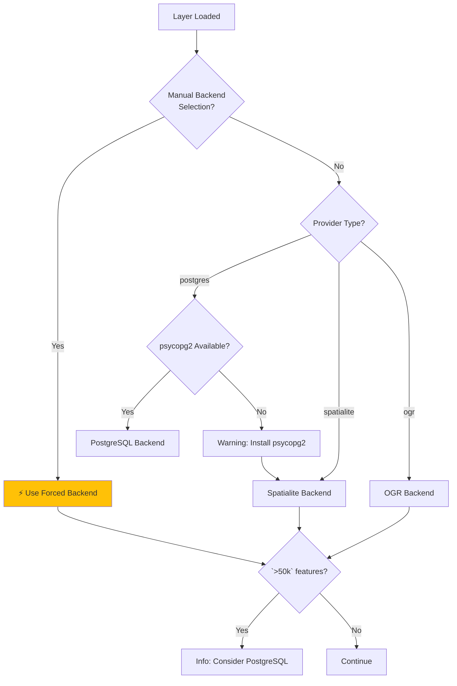

# Backends Overview

FilterMate uses a **multi-backend architecture** to provide optimal performance across different data sources. The backend is automatically selected based on your layer type—no configuration needed.

## What Are Backends?

Backends are the engines that process your filtering operations. FilterMate includes three specialized backends optimized for different data sources:

- **PostgreSQL Backend**: Server-side processing for maximum speed
- **Spatialite Backend**: Local database with spatial indexes
- **OGR Backend**: Universal compatibility for file formats

:::tip Quick Answer
**Most users don't need to worry about backends!** FilterMate automatically chooses the best one for your data. Just load your layer and filter.
:::

## Architecture

```
modules/backends/
  ├── base_backend.py        # Abstract interface
  ├── postgresql_backend.py  # PostgreSQL/PostGIS backend
  ├── spatialite_backend.py  # Spatialite backend
  ├── ogr_backend.py         # Universal OGR backend
  └── factory.py             # Automatic backend selection
```

## Automatic Selection Logic

FilterMate intelligently selects the best backend based on your layer:



**How It Works:**

1. **Checks for manual backend selection** (v2.3.5+) - User can force specific backend
2. **Detects layer provider type** (PostgreSQL, Spatialite, or OGR)
3. **Checks PostgreSQL availability** (is psycopg2 installed?)
4. **Selects optimal backend** with performance warnings when needed
5. **Falls back gracefully** if the best option is unavailable

:::tip Manual Backend Selection (v2.3.5+)
You can force a specific backend by clicking the backend indicator icon next to each layer name. This is useful for:
- Testing different backends
- Using Spatialite on small PostgreSQL layers
- Forcing OGR when you want file-based operations
:::

## Backend Comparison

| Feature | PostgreSQL | Spatialite | OGR |
|---------|-----------|-----------|-----|
| **Speed (`<10k` features)** | `<1s` ⚡ | `<1s` ⚡ | ~2s |
| **Speed (100k features)** | ~2s ⚡ | ~8s | ~15s 🐌 |
| **Speed (1M features)** | ~10s ⚡ | ~60s 🐌 | Timeout ❌ |
| **Concurrent Operations** | Excellent | Good | Limited |
| **Installation** | Optional (psycopg2) | Built-in ✓ | Built-in ✓ |
| **Data Source** | PostgreSQL/PostGIS | .sqlite files | Shapefiles, GPKG, etc. |
| **Best For** | Large datasets (`>50k`) | Medium datasets (`<50k`) | All formats |

## Backend Features

### PostgreSQL Backend

**Technology**: Server-side processing with materialized views

**Capabilities**:
- ✅ Materialized views for ultra-fast filtering
- ✅ Native spatial indexes (GIST)
- ✅ Server-side spatial operations
- ✅ Concurrent operations support

**Automatically Used When**:
- Layer source is PostgreSQL/PostGIS
- psycopg2 is installed
- **Recommended for `>50k` features**

**Performance**: Best-in-class for large datasets

[Learn more →](./postgresql)

---

### Spatialite Backend

**Technology**: Temporary tables with R-tree indexes

**Capabilities**:
- ✅ R-tree spatial indexes
- ✅ Local database operations
- ✅ Automatic spatial index detection
- ✅ No additional installation required

**Automatically Used When**:
- Layer source is Spatialite (.sqlite, .db)
- Always available
- **Optimal for `<50k` features**

**Performance**: Good balance of speed and simplicity

[Learn more →](./spatialite)

---

### OGR Backend

**Technology**: QGIS processing framework

**Capabilities**:
- ✅ Universal compatibility (Shapefiles, GeoPackage, CSV, etc.)
- ✅ Memory-based operations
- ✅ Works with all OGR-supported formats
- ✅ Automatic spatial index creation (v1.9+)

**Automatically Used When**:
- Layer source is file-based (Shapefile, GeoPackage, etc.)
- Fallback when PostgreSQL unavailable
- **Works with any data source**

**Performance**: Good for small-medium datasets (`<10k`)

[Learn more →](./ogr)

---

## Manual Backend Selection (v2.3.5+)

:::info Feature
**FilterMate v2.3.5+** allows you to manually force a specific backend for any layer, overriding automatic detection.
:::

### How to Force a Backend

1. **Locate the backend indicator** next to your layer name in FilterMate panel
2. **Click the backend icon** (shows current backend: PG/SQLite/OGR)
3. **Select desired backend** from dropdown menu
4. **Forced backend is indicated** with ⚡ symbol

### Why Force a Backend?

**Common Use Cases:**
- **Testing**: Compare performance between backends
- **Small PostgreSQL layers**: Force Spatialite for simplicity
- **Network issues**: Force OGR to work offline
- **Debugging**: Isolate backend-specific issues

### Priority System

FilterMate uses this priority order:

1. **⚡ FORCED** - User explicitly selected backend
2. **⚠️ FALLBACK** - PostgreSQL unavailable, force OGR
3. **🤖 AUTO** - Automatic detection based on provider type

:::warning Validation
FilterMate validates your forced backend selection:
- Can't force PostgreSQL if psycopg2 not installed
- Can't force Spatialite on non-SQLite files
- Invalid selections fall back to auto-detection
:::

## Checking Your Active Backend

### Via Backend Indicator (UI)

The backend indicator shows:
- **Icon**: Current backend (PG/SQLite/OGR)
- **⚡ Symbol**: Backend is forced by user
- **Tooltip**: Full backend name and mode

### Via FilterMate Messages

FilterMate displays info messages when loading layers:

- **"Using PostgreSQL backend"** → PostgreSQL mode (best performance)
- **"⚡ Using FORCED backend 'postgresql'"** → User forced PostgreSQL
- **"Using Spatialite backend"** → Spatialite mode
- **"Using OGR backend"** → OGR mode (file-based)

### Via Python Console

Open **Plugins → Python Console** in QGIS:

```python
# Check PostgreSQL availability
from modules.appUtils import POSTGRESQL_AVAILABLE
print(f"PostgreSQL available: {POSTGRESQL_AVAILABLE}")

# Check current layer's backend
from modules.backends.factory import BackendFactory

layer = iface.activeLayer()
backend = BackendFactory.create_backend(layer)
print(f"Backend: {backend.__class__.__name__}")
# Output: PostgresqlBackend, SpatialiteBackend, or OgrBackend
```

## PostgreSQL Requirement

FilterMate requires the **psycopg2** Python package for PostgreSQL support.

**Installation:**

```bash
# Using pip
pip install psycopg2-binary

# On Ubuntu/Debian
sudo apt-get install python3-psycopg2

# On macOS (with Homebrew QGIS)
/Applications/QGIS.app/Contents/MacOS/bin/pip3 install psycopg2-binary
```

**Check Installation:**

```python
import psycopg2
print(psycopg2.__version__)
# Expected: '2.9.x (dt dec pq3 ext lo64)'
```

**If Not Installed:**
- PostgreSQL layers will use QGIS's native filtering (slower)
- You'll see a warning: "psycopg2 not found, using fallback"
- Spatialite and OGR layers work normally

## Performance Optimizations

FilterMate includes automatic optimizations for all backends:

### PostgreSQL Optimizations
- **Materialized views**: Sub-second queries on million-row tables
- **GIST indexes**: Spatial operations optimized by PostgreSQL
- **Server-side processing**: No data transfer to QGIS

### Spatialite Optimizations (v1.9+)
- **Temporary tables with R-tree indexes**: 44.6× faster than memory operations
- **Predicate ordering**: 2.3× faster with optimal evaluation
- **Spatial index detection**: Uses existing indexes automatically

### OGR Optimizations (v1.9+)
- **Automatic spatial index creation**: 19.5× faster on large datasets
- **Large dataset optimization**: 3× improvement for `>50k` features
- **Memory-efficient processing**: Reduced memory footprint

### Universal Optimizations
- **Geometry caching**: 5× faster for multi-layer operations
- **Retry mechanisms**: Handles SQLite locks automatically
- **Geometry repair**: Multi-strategy approach for invalid geometries

## Troubleshooting

### "psycopg2 not found" Warning

**Symptom**: Warning message when using PostgreSQL layers

**Solution**:
1. Install psycopg2 (see installation section above)
2. Restart QGIS
3. Reload your layer

### Slow Performance

**Symptom**: Filtering takes more than 10 seconds

**Diagnosis**:
- Check backend in FilterMate panel (layer info section)
- Note your dataset size (feature count)

**Solutions**:
- **OGR backend with `>10k` features**: Convert to Spatialite or PostgreSQL
- **Spatialite with `>50k` features**: Migrate to PostgreSQL
- **PostgreSQL without psycopg2**: Install psycopg2

See [Choosing the Right Backend](./choosing-backend) for detailed migration guides.

## Next Steps

- **[Choosing a Backend](./choosing-backend)** - Interactive decision tree to help you pick the best backend
- **[Performance Benchmarks](./performance-benchmarks)** - Detailed benchmark results
- **[PostgreSQL Setup](./postgresql)** - Configure PostgreSQL for maximum performance
- **[Spatialite Details](./spatialite)** - Learn about Spatialite capabilities
- **[OGR Limitations](./ogr)** - Understand OGR backend constraints

- [PostgreSQL Backend Details](./postgresql)
- [Spatialite Backend Details](./spatialite)
- [OGR Backend Details](./ogr)
- [Performance Comparison](./performance-benchmarks)
- [Backend Selection Guide](./choosing-backend)
