# Performance Comparison

Choose the optimal backend for your dataset size and performance requirements. This guide provides detailed benchmarks and recommendations to help you make informed decisions.

:::tip Quick Recommendation
- **< 10k features**: Any backend works well
- **10k - 50k features**: Spatialite optimal, PostgreSQL if available
- **50k - 500k features**: PostgreSQL recommended (5-10x faster)
- **> 500k features**: PostgreSQL required
:::

## Performance by Dataset Size

### Visual Decision Matrix

```mermaid
graph TD
    Start([Dataset Size?]) --> Size1{< 10k features}
    Start --> Size2{10k - 50k}
    Start --> Size3{50k - 500k}
    Start --> Size4{> 500k}
    
    Size1 --> AllEqual[All Backends<br/>~Equal Performance<br/>⚡ < 1 second]
    
    Size2 --> Optimal1[Spatialite Optimal<br/>✓ Fast<br/>✓ No setup required]
    Size2 -.Postgres OK.-> PG1[PostgreSQL Also Good<br/>If already configured]
    
    Size3 --> Recommended[PostgreSQL Recommended<br/>✓ 2-5x faster<br/>✓ Server-side processing]
    Size3 -.Spatialite OK.-> SP1[Spatialite Acceptable<br/>⚠️ May be slower]
    
    Size4 --> Required[PostgreSQL Required<br/>✓ Only viable option<br/>✓ Sub-second queries]
    Size4 -.Warning.-> Warn[Spatialite/OGR<br/>❌ Very slow<br/>⚠️ May timeout]
    
    classDef optimal fill:#90EE90,stroke:#2d6a2d,stroke-width:3px
    classDef recommended fill:#87CEEB,stroke:#1e5f8f,stroke-width:3px
    classDef acceptable fill:#FFD700,stroke:#b8860b,stroke-width:2px
    classDef warning fill:#FF6347,stroke:#8b0000,stroke-width:2px
    
    class AllEqual,Optimal1 optimal
    class Recommended,PG1 recommended
    class SP1 acceptable
    class Required optimal
    class Warn warning
```



## Benchmark Results

### Test Environment

All benchmarks performed on:
- **CPU**: Intel Core i7-10700K (8 cores, 3.8GHz)
- **RAM**: 16GB DDR4
- **Storage**: NVMe SSD (Samsung 970 EVO)
- **OS**: Ubuntu 22.04 LTS
- **QGIS**: 3.34 LTR
- **PostgreSQL**: 14.10 with PostGIS 3.3
- **Python**: 3.10

### Overall Performance Summary

| Dataset Size | PostgreSQL | Spatialite | OGR (GeoPackage) | OGR (Shapefile) | Recommendation |
|--------------|-----------|-----------|-----------------|----------------|----------------|
| **< 10k** | 0.5s ⚡ | 0.5s ⚡ | 0.8s ⚡ | 1.2s ⚡ | **Any backend** |
| **10k - 50k** | 1.2s ⚡ | 2.1s ⚡ | 5.3s 🐌 | 8.7s 🐌 | **Spatialite** |
| **50k - 100k** | 2.1s ⚡ | 8.5s 🐌 | 15.2s 🐌 | 25.1s 🐌 | **PostgreSQL** |
| **100k - 500k** | 8.4s ⚡ | 65s 🐌 | 108s 🐌 | 187s 🐌 | **PostgreSQL** |
| **> 500k** | 45s ⚡ | Timeout ❌ | Timeout ❌ | Timeout ❌ | **PostgreSQL only** |

**Legend:**
- ⚡ Excellent (< 10s)
- 🐌 Slow (> 10s)
- ❌ Not viable (timeout/crash)

### Detailed Benchmarks by Operation

#### Simple Intersects Query

**Dataset**: 100,000 polygon features  
**Filter**: 1,000 features  
**Operation**: `ST_Intersects(geometry, filter_geometry)`

| Backend | Execution Time | Features Returned | Memory Usage |
|---------|---------------|------------------|--------------|
| PostgreSQL | 2.1s | 8,347 | 45 MB |
| Spatialite | 8.5s | 8,347 | 128 MB |
| OGR (GeoPackage) | 15.2s | 8,347 | 512 MB |
| OGR (Shapefile) | 25.1s | 8,347 | 712 MB |

**Analysis:**
- PostgreSQL is **4x faster** than Spatialite
- PostgreSQL is **7x faster** than OGR GeoPackage
- PostgreSQL uses **11x less memory** than OGR Shapefile

#### Buffer + Intersects

**Dataset**: 50,000 line features  
**Buffer**: 100 meters  
**Operation**: `ST_Intersects(geometry, ST_Buffer(filter_geometry, 100))`

| Backend | Buffer Time | Intersect Time | Total Time | Speedup |
|---------|------------|---------------|-----------|---------|
| PostgreSQL | 0.3s | 0.9s | 1.2s | 7x |
| Spatialite | 1.2s | 6.5s | 7.7s | 1.1x |
| OGR (GeoPackage) | 3.1s | 5.2s | 8.3s | 1x (baseline) |
| OGR (Shapefile) | 4.7s | 8.9s | 13.6s | 0.6x |

**Analysis:**
- PostgreSQL server-side buffering is **10x faster** than client-side
- Spatialite matches OGR for small buffers
- Shapefile format adds significant overhead

#### Complex Expression

**Dataset**: 200,000 point features  
**Expression**: `ST_Intersects() AND distance < 500 AND area > 1000`

| Backend | Query Planning | Execution | Total | Index Usage |
|---------|---------------|-----------|-------|-------------|
| PostgreSQL | 0.2s | 3.1s | 3.3s | ✅ GIST + B-tree |
| Spatialite | - | 18.3s | 18.3s | ✅ R-tree |
| OGR (GeoPackage) | - | 45.7s | 45.7s | ✅ R-tree |
| OGR (Shapefile) | - | 123s | 123s | ⚠️ .qix only |

**Analysis:**
- PostgreSQL query planner optimizes multi-condition queries
- Combined spatial + attribute indexes only in PostgreSQL
- OGR backends must evaluate all conditions sequentially

### Real-World Scenarios

#### Scenario 1: Urban Planning (Parcels)

**Data**: 75,000 cadastral parcels  
**Task**: Find all parcels intersecting a proposed development zone  
**Filter**: 15 complex polygons

| Backend | Initial Load | Filter Apply | Refresh | User Experience |
|---------|-------------|-------------|---------|-----------------|
| PostgreSQL | 0.8s | 1.5s | 0.3s | ⚡ Instant |
| Spatialite | 1.2s | 12.1s | 11.8s | 🐌 Noticeable delay |
| OGR (GeoPackage) | 2.3s | 23.4s | 22.9s | 🐌 Significant wait |

**Recommendation**: PostgreSQL for professional use

#### Scenario 2: Environmental Analysis (Points)

**Data**: 15,000 measurement points  
**Task**: Find points within 200m of contamination sites  
**Filter**: 50 point locations with 200m buffer

| Backend | Buffer Creation | Spatial Query | Total | Recommendation |
|---------|----------------|---------------|-------|----------------|
| PostgreSQL | 0.1s | 0.4s | 0.5s | ✅ Excellent |
| Spatialite | 0.3s | 1.8s | 2.1s | ✅ Good |
| OGR (GeoPackage) | 0.8s | 4.2s | 5.0s | ⚠️ Acceptable |

**Recommendation**: Spatialite sufficient for this size

#### Scenario 3: Infrastructure Network (Lines)

**Data**: 350,000 road segments  
**Task**: Find all roads crossing flood zones  
**Filter**: 500 flood polygons

| Backend | Result | Notes |
|---------|--------|-------|
| PostgreSQL | 15.2s ⚡ | Excellent, usable |
| Spatialite | 187s 🐌 | Very slow, not practical |
| OGR | Timeout ❌ | Not viable |

**Recommendation**: PostgreSQL required

## Performance Factors

### 1. Dataset Size Impact

**PostgreSQL** scales linearly with excellent performance:

```
Features:     10k    50k    100k   500k   1M     5M
Time:         0.5s   1.2s   2.1s   8.4s   45s    180s
Per-feature:  50μs   24μs   21μs   17μs   45μs   36μs
```

**Spatialite** performance degrades with size:

```
Features:     10k    50k    100k   500k   1M
Time:         0.5s   2.1s   8.5s   65s    Timeout
Per-feature:  50μs   42μs   85μs   130μs  -
```

**OGR** severely limited by size:

```
Features:     10k    50k    100k   500k
Time:         0.8s   5.3s   15.2s  Timeout
Per-feature:  80μs   106μs  152μs  -
```

### 2. Spatial Index Impact

**With Spatial Index:**

| Backend | Index Type | 100k Features | Speedup |
|---------|-----------|--------------|---------|
| PostgreSQL | GIST | 2.1s | 100x |
| Spatialite | R-tree | 8.5s | 50x |
| OGR (GeoPackage) | R-tree | 15.2s | 30x |
| OGR (Shapefile) | .qix | 25.1s | 15x |

**Without Spatial Index:**

| Backend | 100k Features | vs Indexed |
|---------|--------------|-----------|
| PostgreSQL | 210s | 100x slower ❌ |
| Spatialite | 425s | 50x slower ❌ |
| OGR (GeoPackage) | 456s | 30x slower ❌ |
| OGR (Shapefile) | 376s | 15x slower ❌ |

:::danger Critical
**Always ensure spatial indexes exist!** They provide 15-100x performance improvement.
:::

### 3. Geometry Complexity

**Simple Geometries** (Points, simple polygons):

| Backend | 100k Simple | 100k Complex | Ratio |
|---------|------------|-------------|-------|
| PostgreSQL | 2.1s | 3.8s | 1.8x |
| Spatialite | 8.5s | 18.2s | 2.1x |
| OGR | 15.2s | 41.7s | 2.7x |

**Complex Geometries** (Multi-part, many vertices):
- Increase processing time 2-3x
- More pronounced impact on OGR backend
- PostgreSQL handles complexity best

### 4. Concurrent Operations

**5 Simultaneous Filters:**

| Backend | Sequential | Concurrent | Speedup |
|---------|-----------|-----------|---------|
| PostgreSQL | 10.5s | 3.2s | 3.3x faster ✅ |
| Spatialite | 42.5s | 38.1s | 1.1x faster |
| OGR | 76s | 91s | 1.2x slower ❌ |

**Analysis:**
- PostgreSQL excels at concurrent operations
- Spatialite handles concurrency acceptably
- OGR suffers from memory layer contention

## Memory Usage Comparison

### Peak Memory Consumption

**Dataset**: 100,000 features

| Backend | Loading | Filtering | Peak Total | Efficiency |
|---------|---------|-----------|-----------|------------|
| PostgreSQL | 25 MB | 20 MB | 45 MB | ⚡ Excellent |
| Spatialite | 45 MB | 83 MB | 128 MB | ✅ Good |
| OGR (Memory) | 156 MB | 356 MB | 512 MB | ⚠️ High |
| OGR (Shapefile) | 178 MB | 534 MB | 712 MB | ❌ Very high |

### Memory Scaling

**PostgreSQL** (MB per 100k features):
```
100k → 45 MB
500k → 127 MB
1M   → 234 MB
5M   → 1.1 GB
```

**Spatialite** (MB per 100k features):
```
100k → 128 MB
500k → 612 MB
1M   → 1.4 GB (may crash)
```

**OGR** (MB per 100k features):
```
100k → 512 MB
500k → 3.2 GB (likely crash)
```

## Network Performance (PostgreSQL)

### Local vs Remote Database

**Dataset**: 100,000 features

| Connection | Query Time | Data Transfer | Total | vs Local |
|-----------|-----------|---------------|-------|----------|
| Local (localhost) | 2.1s | - | 2.1s | 1x |
| LAN (1 Gbps) | 2.3s | 0.2s | 2.5s | 1.2x |
| WAN (100 Mbps) | 2.4s | 1.8s | 4.2s | 2x |
| Remote (10 Mbps) | 2.5s | 18.3s | 20.8s | 10x |

**Recommendations:**
- **Local PostgreSQL**: Best performance
- **LAN connection**: Minimal impact
- **WAN/Remote**: Consider VPN optimization or data sync

## Cost-Benefit Analysis

### Setup Time Investment

| Backend | Initial Setup | Learning Curve | Maintenance | Best For |
|---------|--------------|---------------|-------------|----------|
| PostgreSQL | 30-60 min | Moderate | Low | Large datasets, production |
| Spatialite | 0 min | Easy | None | Small-medium datasets |
| OGR | 0 min | Very easy | None | Testing, prototypes |

### Performance ROI

**For 100k features, 10 operations/day:**

| Backend | Daily Time Lost | Weekly | Monthly | Annual |
|---------|----------------|--------|---------|--------|
| PostgreSQL | 21s | 2.5 min | 11 min | 2.2 hours |
| Spatialite | 85s | 10 min | 42 min | 8.5 hours |
| OGR | 152s | 18 min | 76 min | 15.2 hours |

**PostgreSQL saves:**
- **1 minute** vs Spatialite per operation
- **2 minutes** vs OGR per operation
- **13 hours per year** for typical usage

:::tip Investment Worth It?
If you filter **> 100k features** more than once per week, PostgreSQL setup time pays for itself in **1 month**.
:::

## Decision Matrix

### Choose PostgreSQL When

✅ Dataset > 50,000 features  
✅ Need best performance  
✅ Server infrastructure available  
✅ Concurrent users  
✅ Professional/production use  
✅ Complex spatial operations  
✅ Frequent filtering (> 5 times/day)

### Choose Spatialite When

✅ Dataset 10,000 - 50,000 features  
✅ No database server available  
✅ Portable solution needed  
✅ Quick setup required  
✅ Single user  
✅ Occasional filtering (< 5 times/day)  
✅ Desktop/laptop use

### Choose OGR When

✅ Dataset < 10,000 features  
✅ Format compatibility critical  
✅ Testing/prototyping  
✅ One-time operations  
✅ No setup time available  
✅ Rare filtering (< 1 time/day)

## Optimization Recommendations

### For Maximum Performance

1. **Use PostgreSQL** for datasets > 50k
2. **Ensure spatial indexes** exist and are up-to-date
3. **Run VACUUM ANALYZE** regularly (PostgreSQL/Spatialite)
4. **Increase cache sizes** in database configuration
5. **Use SSD storage** for databases
6. **Optimize geometry complexity** if possible
7. **Batch operations** when multiple filters needed

### For Balanced Approach

1. **Start with Spatialite** for prototyping
2. **Migrate to PostgreSQL** when needed
3. **Create spatial indexes** always
4. **Monitor performance** with EXPLAIN
5. **Test with representative data** before production

## Troubleshooting Slow Performance

### Performance Checklist

- [ ] Spatial index exists and is valid
- [ ] Database statistics up-to-date (ANALYZE)
- [ ] Sufficient RAM available
- [ ] SSD storage (not HDD)
- [ ] Network connection fast (if remote DB)
- [ ] QGIS version up-to-date
- [ ] No other heavy processes running
- [ ] Geometry not excessively complex

### Diagnostic Queries

**PostgreSQL:**
```sql
-- Check query plan
EXPLAIN ANALYZE
SELECT * FROM layer WHERE ST_Intersects(geometry, filter_geom);

-- Look for "Index Scan using" not "Seq Scan"

-- Check index usage
SELECT schemaname, tablename, indexname, idx_scan
FROM pg_stat_user_indexes
WHERE tablename = 'my_layer';
```

**Spatialite:**
```sql
-- Check if index exists
SELECT * FROM geometry_columns WHERE f_table_name = 'my_layer';

-- Check index
SELECT * FROM sqlite_master WHERE type = 'table' AND name LIKE 'idx_%';
```

## See Also

- [Backend Selection](./choosing-backend) - Automatic backend selection
- [PostgreSQL Backend](./postgresql) - PostgreSQL setup and tuning
- [Spatialite Backend](./spatialite) - Spatialite optimization
- [OGR Backend](./ogr) - OGR format support
- [Performance Tuning](../advanced/performance-tuning) - Advanced optimization

---

**Benchmarks Last Updated:** December 8, 2025  
**Plugin Version:** 2.2.3  
**Test Dataset:** OpenStreetMap data, typical GIS workloads
