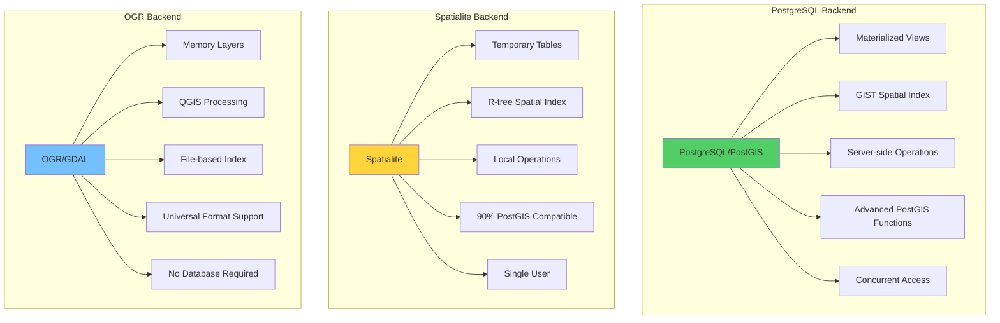
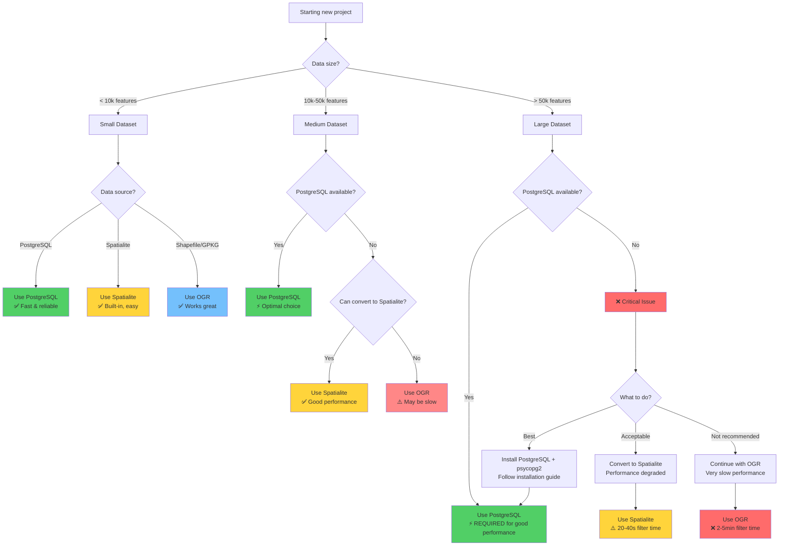
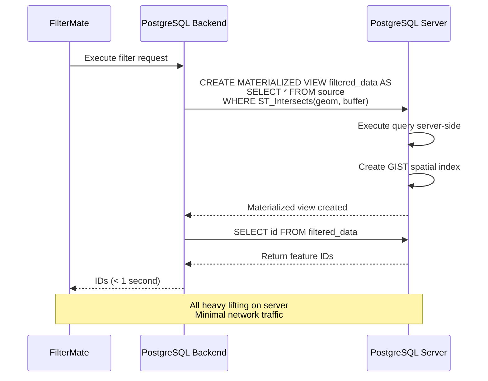
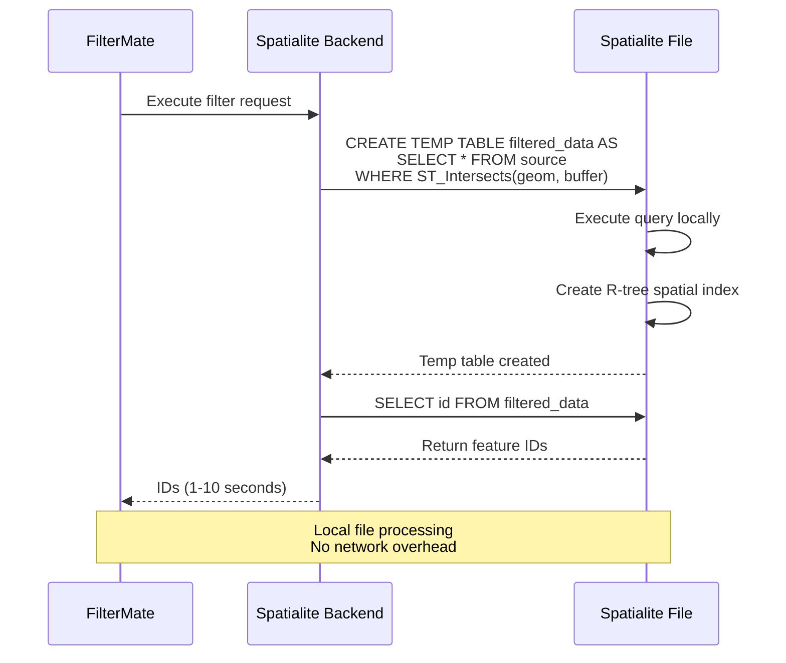
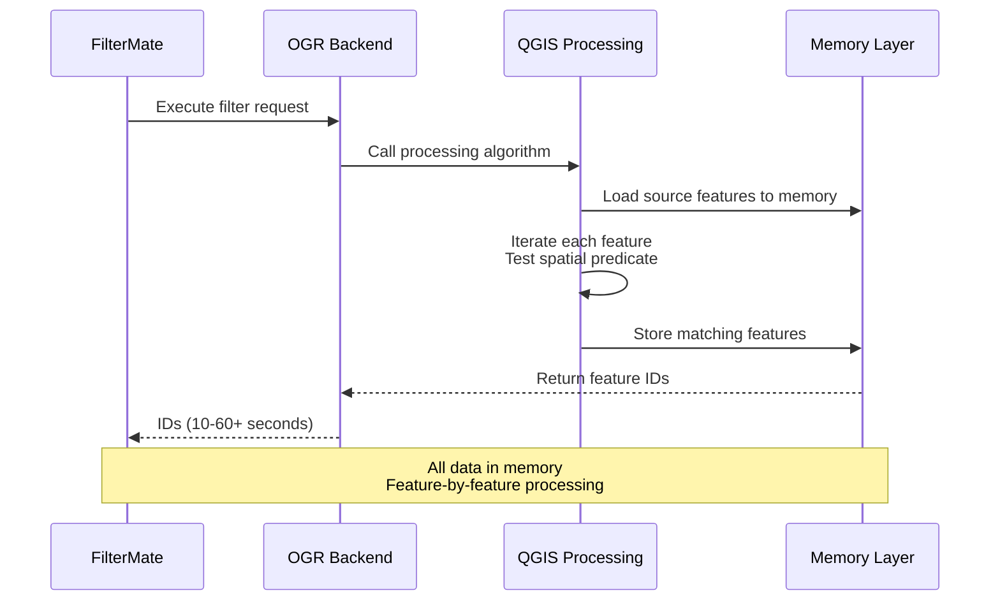
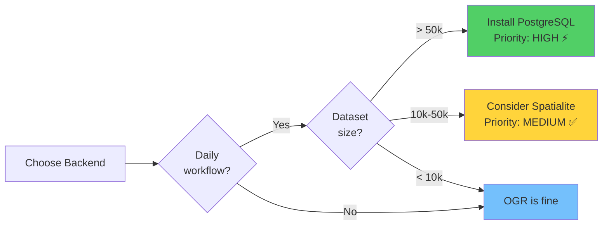

# Visual Performance Comparison

This guide provides visual comparisons of FilterMate's three backends to help you choose the optimal setup for your workflow.

## 📊 Performance by Dataset Size

### Filtering Time Comparison

```mermaid
gantt
    title Filtering Time: 10,000 Features
    dateFormat X
    axisFormat %S.%Ls
    
    section PostgreSQL
    Query: 0, 200
    
    section Spatialite
    Query: 0, 800
    
    section OGR
    Query: 0, 3000
```

```mermaid
gantt
    title Filtering Time: 100,000 Features
    dateFormat X
    axisFormat %Ss
    
    section PostgreSQL
    Query: 0, 1
    
    section Spatialite
    Query: 0, 5
    
    section OGR
    Query: 0, 30
```

```mermaid
gantt
    title Filtering Time: 1,000,000 Features
    dateFormat X
    axisFormat %Ss
    
    section PostgreSQL
    Query: 0, 2
    
    section Spatialite
    Query: 0, 45
    
    section OGR
    Query: 0, 300
```

### Performance Summary Table

| Dataset Size | PostgreSQL | Spatialite | OGR | Recommended |
|--------------|------------|------------|-----|-------------|
| **1k-10k** | 0.2s (Excellent) | 0.8s (Good) | 3s (Good) | All backends OK |
| **10k-50k** | 0.5s (Excellent) | 3s (Good) | 15s (Acceptable) | PostgreSQL or Spatialite |
| **50k-100k** | 1s (Excellent) | 5s (Good) | 30s (Poor) | PostgreSQL recommended |
| **100k-500k** | 1.5s (Excellent) | 25s (Acceptable) | 2min (Poor) | PostgreSQL strongly recommended |
| **500k-1M** | 2s (Excellent) | 45s (Acceptable) | 5min (Poor) | PostgreSQL required |
| **>1M** | 3-5s (Excellent) | N/A (Poor) | N/A (Poor) | PostgreSQL only |

**Legend:**
- **Excellent**: < 2 seconds
- **Good**: < 10 seconds
- **Acceptable**: 10-60 seconds
- **Poor**: > 60 seconds

---

## 🔧 Backend Capabilities Comparison

### Feature Support Matrix

### Detailed Comparison

| Feature | PostgreSQL | Spatialite | OGR |
|---------|------------|------------|-----|
| **Installation** | ⚠️ Requires server + psycopg2 | ✅ Built-in | ✅ Built-in |
| **Setup Complexity** | 🔴 High | 🟢 Low | 🟢 Low |
| **Performance (large data)** | 🟢 Excellent | 🟡 Good | 🔴 Poor |
| **Memory Usage** | 🟢 Low (server-side) | 🟡 Moderate | 🔴 High |
| **Spatial Index** | ✅ GIST | ✅ R-tree | ⚠️ File-based (.qix) |
| **Concurrent Users** | ✅ Yes | ❌ Single file lock | ❌ File access |
| **Spatial Functions** | ✅ Full PostGIS | ✅ 90% compatible | ⚠️ Limited |
| **Data Format Support** | PostgreSQL only | Spatialite only | 🟢 Universal |
| **Network Support** | ✅ Remote server | ❌ Local only | ❌ Local only |
| **Transaction Support** | ✅ Full ACID | ✅ Full ACID | ⚠️ Limited |
| **Best for** | Production, large data | Medium projects | Quick analysis, any format |

---

## 🎯 Decision Matrix

### When to Use Each Backend

---

## 📈 Real-World Performance Benchmarks

### Test Configuration
- Hardware: Intel i7-9700K, 32GB RAM, NVMe SSD
- QGIS: Version 3.34 LTR
- PostgreSQL: Version 15.3 (PostGIS 3.3)
- Test: Intersect 100k polygons with 1 buffer zone

### Benchmark Results Summary

**Filtering Time by Dataset Size:**

| Dataset Size | PostgreSQL | Spatialite | OGR |
|--------------|------------|------------|-----|
| 10k features | 0.2s | 0.8s | 3s |
| 25k features | 0.3s | 1.5s | 7s |
| 50k features | 0.5s | 3s | 15s |
| 75k features | 0.8s | 4s | 22s |
| 100k features | 1s | 5s | 30s |
| 250k features | 1.5s | 15s | 75s |
| 500k features | 2s | 25s | 120s |
| 1M features | 3s | 45s | 300s |

**Key Insights:**
- 🟢 **PostgreSQL**: Sub-second performance up to 100k features, linear scaling
- 🟡 **Spatialite**: Good performance up to 50k features, acceptable up to 100k
- 🔴 **OGR**: Usable for small datasets (< 10k), slow for larger datasets

### Memory Usage Summary

**Memory Consumption by Dataset Size:**

| Dataset Size | PostgreSQL | Spatialite | OGR |
|--------------|------------|------------|-----|
| 10k features | 50 MB | 100 MB | 300 MB |
| 25k features | 55 MB | 200 MB | 750 MB |
| 50k features | 60 MB | 400 MB | 1500 MB |
| 75k features | 65 MB | 600 MB | 2250 MB |
| 100k features | 70 MB | 800 MB | 3000 MB |

**Key Insights:**
- 🟢 **PostgreSQL**: Constant low memory (server-side processing)
- 🟡 **Spatialite**: Linear memory growth (local database)
- 🔴 **OGR**: High memory usage (in-memory processing)

---

## 🔍 Detailed Backend Architecture

### PostgreSQL Backend Flow

### Spatialite Backend Flow

### OGR Backend Flow

---

## 💡 Optimization Recommendations

### By Use Case

#### 1. **Rapid Prototyping**

**Best backend:** OGR  
**Why:** Zero setup, works with any format

#### 2. **Production Analysis (Large Data)**

**Best backend:** PostgreSQL  
**Why:** Maximum performance, scalability

#### 3. **Medium Projects (Local Files)**

**Best backend:** Spatialite  
**Why:** Balance of performance and simplicity

---

## 📋 Quick Reference Guide

### Backend Selection Cheat Sheet

| Your Situation | Recommended Backend | Setup Required |
|----------------|-------------------|----------------|
| Quick test, any format, < 10k features | **OGR** | None |
| Shapefile/GeoPackage, 10k-50k features | **Spatialite** | Convert format |
| Local project, no server, < 50k features | **Spatialite** | None (if .sqlite) |
| Production, >50k features | **PostgreSQL** | Install PostgreSQL + psycopg2 |
| Remote/shared data, any size | **PostgreSQL** | Database server |
| Million+ features | **PostgreSQL** | Database server (required) |

### Installation Priority

---

## 🚀 Next Steps

- **Install PostgreSQL**: Follow our [PostgreSQL Setup Guide](./postgresql.md)
- **Convert to Spatialite**: See [Spatialite Guide](./spatialite.md)
- **Understand backend selection**: Read [Backend Selection Logic](./backend-selection.md)
- **Optimize your workflow**: Check [Performance Tuning](../advanced/performance-tuning.md)

Have questions? [Open an issue on GitHub](https://github.com/sducournau/filter_mate/issues) for support.
