# Simplified Architecture Guide

This guide provides a user-friendly explanation of FilterMate's architecture, designed for developers who want to understand or contribute to the project.

## 🏗️ High-Level Architecture

FilterMate follows a layered architecture with clear separation of concerns:

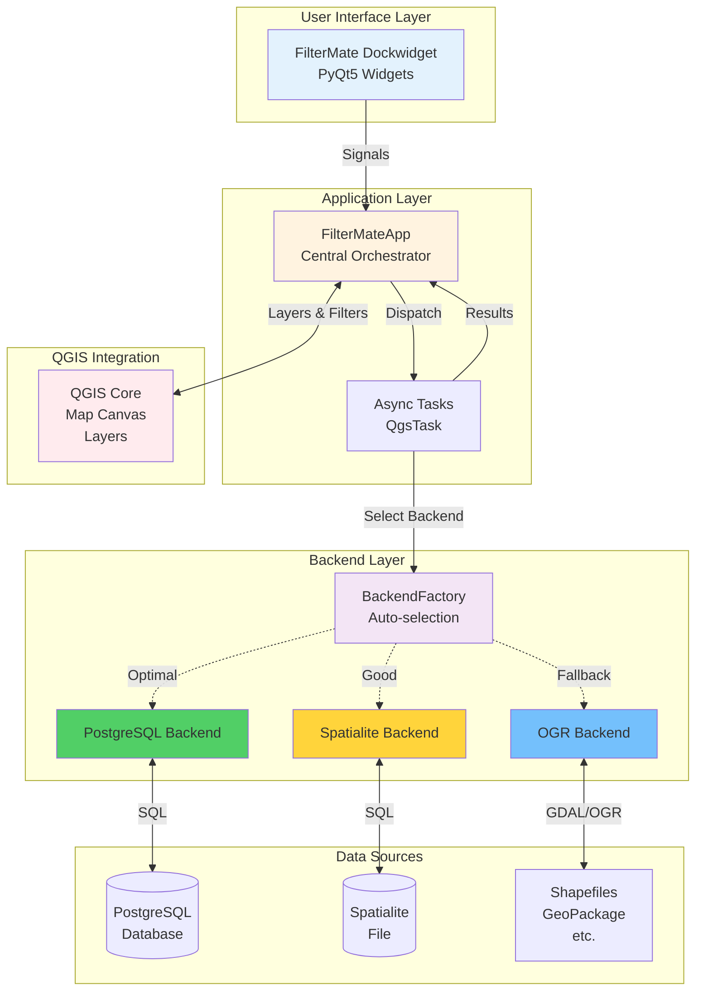

---

## 📦 Core Components

### 1. Plugin Entry Point
**File:** `filter_mate.py`  
**Purpose:** QGIS plugin integration

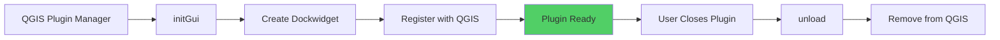

**Key Responsibilities:**
- Plugin lifecycle management
- QGIS integration
- Menu and toolbar registration

---

### 2. Application Orchestrator
**File:** `filter_mate_app.py`  
**Purpose:** Central coordinator

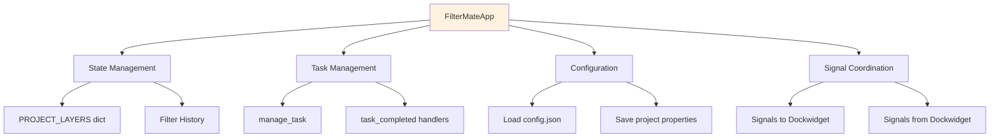

**Key Methods:**
```python
class FilterMateApp:
    # Central task dispatcher
    def manage_task(task_type, parameters):
        # Create and launch appropriate QgsTask
        
    # Result handlers
    def filter_engine_task_completed(result):
        # Apply filter to layers
        
    def layer_management_engine_task_completed(result):
        # Update PROJECT_LAYERS state
```

---

### 3. User Interface
**File:** `filter_mate_dockwidget.py`  
**Purpose:** User interaction

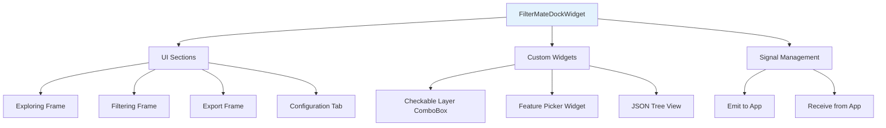

**UI Organization:**
- **Tab 1: Filtering & Exploring**: Main filtering interface
- **Tab 2: Configuration**: JSON tree view for settings

---

### 4. Asynchronous Tasks
**File:** `modules/appTasks.py`  
**Purpose:** Non-blocking operations

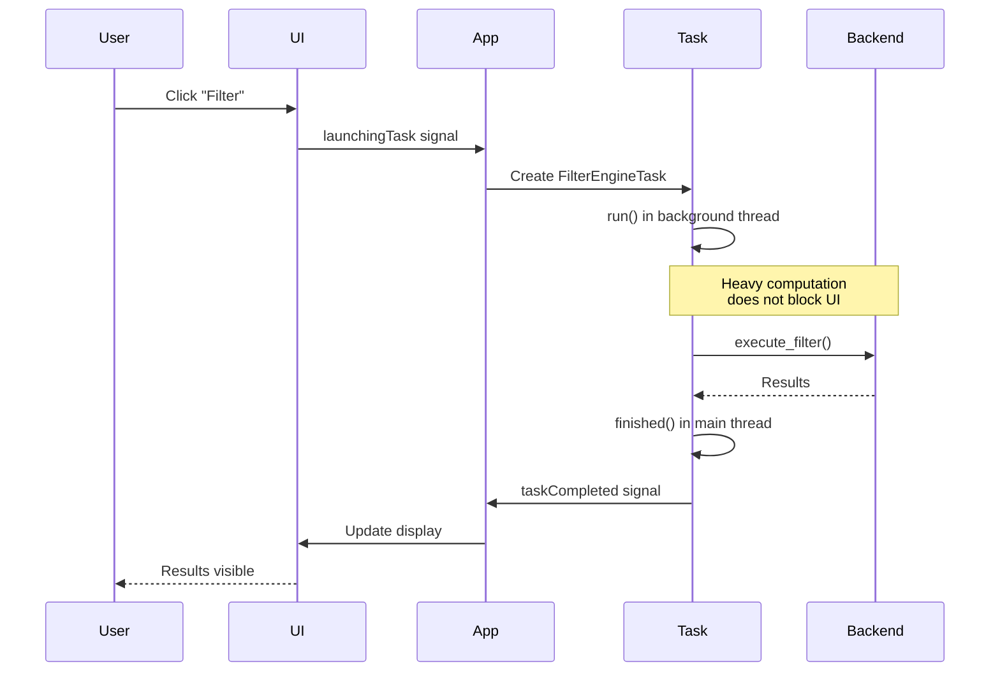

**Key Task Types:**
- `FilterEngineTask`: Execute filtering operations
- `LayersManagementEngineTask`: Add/remove layers
- `PopulateListEngineTask`: Load feature lists
- `ExportEngineTask`: Export filtered data

---

## 🔄 Data Flow Examples

### Example 1: User Applies a Filter

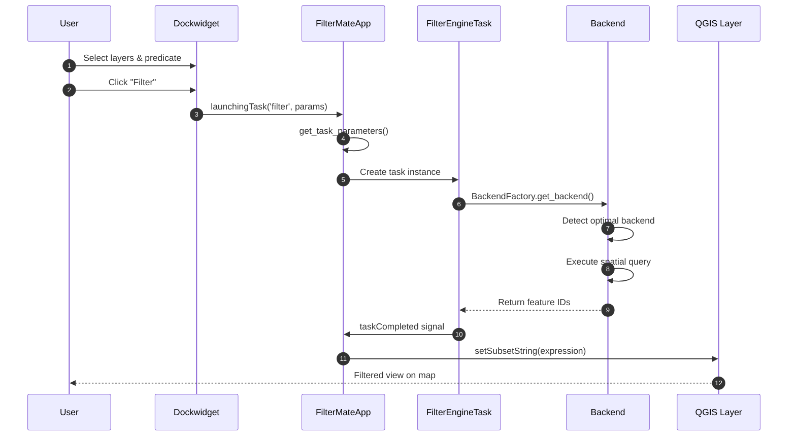

### Example 2: Layer Added to Project

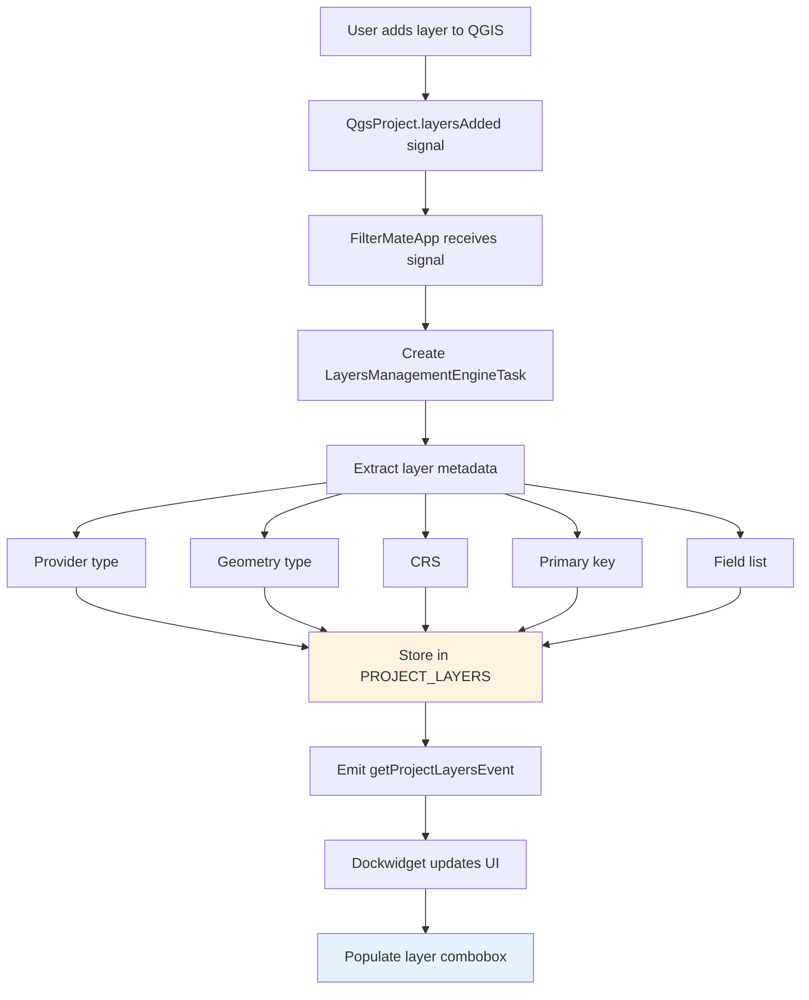

---

## 🔌 Backend System

### Backend Factory Pattern

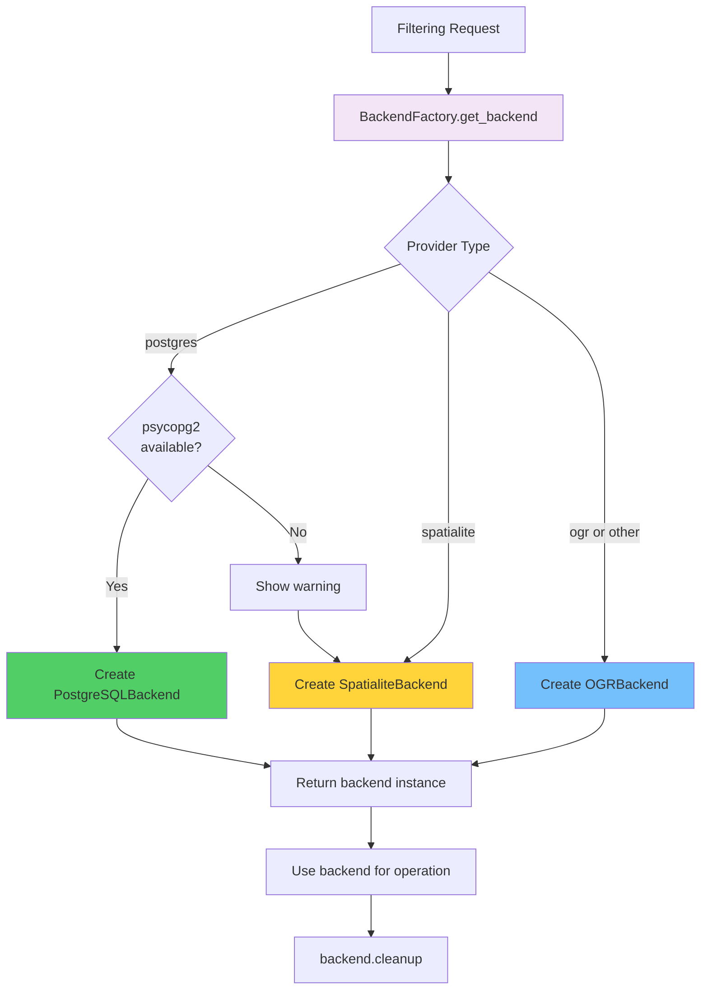

### Backend Interface

All backends implement the same interface:

```python
class GeometricFilterBackend(ABC):
    @abstractmethod
    def execute_filter(self, expression, predicates, buffer):
        """Execute filtering operation"""
        pass
    
    @abstractmethod
    def get_feature_count(self):
        """Get result count"""
        pass
    
    @abstractmethod
    def cleanup(self):
        """Clean up resources"""
        pass
```

---

## 🎨 UI System Architecture

### Dynamic Dimensions System

```mermaid
stateDiagram-v2
    [*] --> DetectScreen: Plugin starts
    
    DetectScreen --> CheckResolution: Get screen resolution
    
    CheckResolution --> AutoMode: UI_PROFILE = "auto"
    CheckResolution --> CompactMode: UI_PROFILE = "compact"
    CheckResolution --> NormalMode: UI_PROFILE = "normal"
    
    AutoMode --> IsSmall{Resolution<br/>< 1920x1080?}
    IsSmall -->|Yes| CompactMode
    IsSmall -->|No| NormalMode
    
    CompactMode --> ApplyCompact[Apply compact dimensions<br/>18px buttons<br/>24px inputs<br/>3px spacing]
    
    NormalMode --> ApplyNormal[Apply normal dimensions<br/>24px buttons<br/>30px inputs<br/>6px spacing]
    
    ApplyCompact --> [*]: UI Ready
    ApplyNormal --> [*]: UI Ready
```

### Theme System

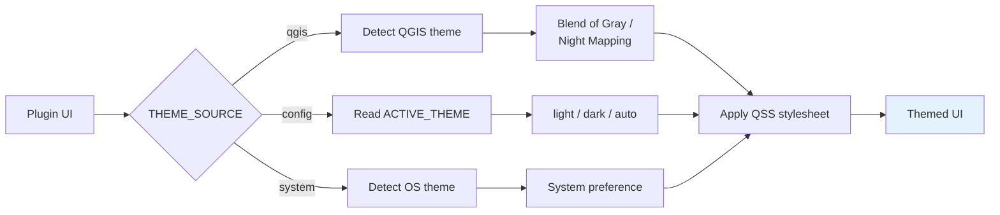

---

## 📊 State Management

### Layer State Storage

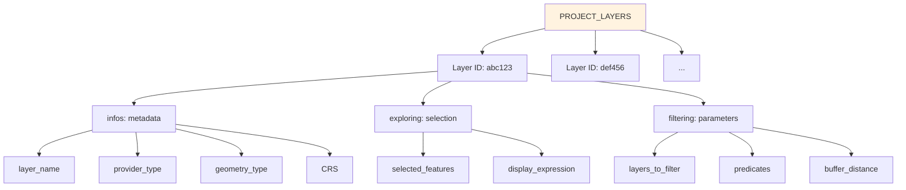

**Persistence:** Saved as QGIS project custom property

```python
# Save
QgsProject.instance().setCustomProperty(
    'filterMate_layers', 
    json.dumps(PROJECT_LAYERS)
)

# Load
PROJECT_LAYERS = json.loads(
    QgsProject.instance().readCustomProperty(
        'filterMate_layers', 
        '{}'
    )
)
```

---

## 🔧 Configuration System

### Configuration Hierarchy

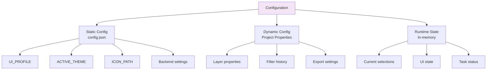

### Configuration Reactivity (v2.2.2+)

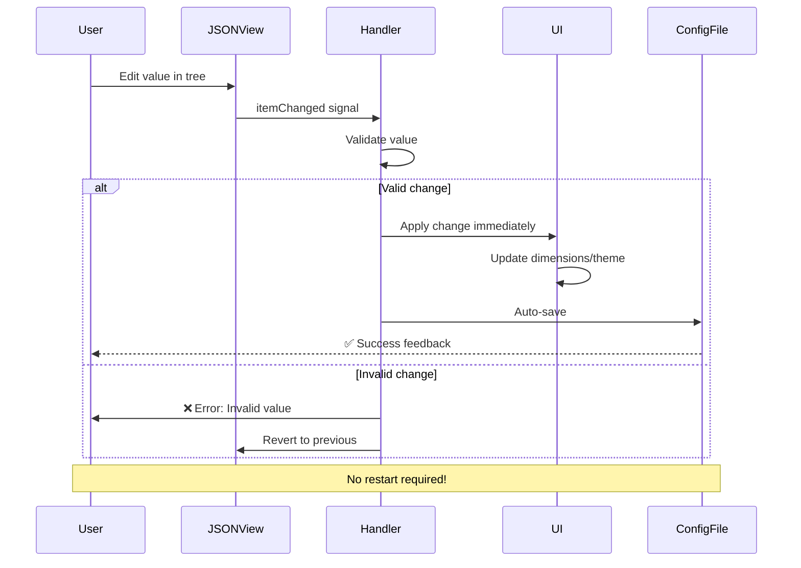

---

## 🧩 Module Organization

```
filter_mate/
├── filter_mate.py                 # Plugin entry point
├── filter_mate_app.py             # Application orchestrator
├── filter_mate_dockwidget.py      # User interface
│
├── modules/                       # Core modules
│   ├── appTasks.py               # Async task implementations
│   ├── appUtils.py               # Database utilities
│   ├── state_manager.py          # State management
│   ├── filter_history.py         # History tracking
│   │
│   ├── backends/                 # Backend system
│   │   ├── base_backend.py      # Abstract interface
│   │   ├── postgresql_backend.py
│   │   ├── spatialite_backend.py
│   │   ├── ogr_backend.py
│   │   └── factory.py           # Backend factory
│   │
│   ├── ui_config.py              # Dynamic dimensions
│   ├── ui_styles.py              # Theme management
│   ├── ui_elements.py            # UI helpers
│   ├── widgets.py                # Custom widgets
│   └── signal_utils.py           # Signal management
│
├── config/                        # Configuration
│   ├── config.json               # Settings
│   └── config.py                 # Config loader
│
└── resources/                     # Assets
    ├── styles/                   # QSS stylesheets
    └── icons/                    # Icon files
```

---

## 🔍 Key Design Patterns

### 1. Factory Pattern (Backend Selection)
```python
# Automatic backend selection
backend = BackendFactory.get_backend(layer)
result = backend.execute_filter(params)
backend.cleanup()
```

### 2. Signal/Slot Pattern (UI ↔ App Communication)
```python
# Dockwidget emits signal
self.launchingTask.emit('filter', parameters)

# App receives and processes
@pyqtSlot(str, dict)
def manage_task(self, task_type, params):
    # Handle task
```

### 3. Observer Pattern (State Management)
```python
# Layers added to project
QgsProject.instance().layersAdded.connect(
    self.on_layers_added
)
```

### 4. Strategy Pattern (Backends)
```python
# Different strategies for different data sources
if provider == 'postgres':
    strategy = PostgreSQLBackend()
elif provider == 'spatialite':
    strategy = SpatialiteBackend()
else:
    strategy = OGRBackend()
```

---

## 🚀 Extension Points

### Adding a New Backend

1. **Create backend class**
```python
from modules.backends.base_backend import GeometricFilterBackend

class MyCustomBackend(GeometricFilterBackend):
    def execute_filter(self, expression, predicates, buffer):
        # Your implementation
        pass
    
    def cleanup(self):
        # Cleanup resources
        pass
```

2. **Register in factory**
```python
# In factory.py
def get_backend(layer):
    if layer.providerType() == 'my_custom':
        return MyCustomBackend(layer)
    # ... existing logic
```

### Adding a New Task Type

1. **Create task class**
```python
class MyCustomTask(QgsTask):
    def __init__(self, description, parameters):
        super().__init__(description, QgsTask.CanCancel)
        self.parameters = parameters
    
    def run(self):
        # Background work
        return True
    
    def finished(self, result):
        # Main thread callback
        pass
```

2. **Add to dispatcher**
```python
# In filter_mate_app.py
def manage_task(self, task_type, params):
    if task_type == 'my_custom':
        task = MyCustomTask('Description', params)
        QgsApplication.taskManager().addTask(task)
```

---

## 📚 Further Reading

- **User Guide**: Understand features from user perspective
- **Backend Guide**: Deep dive into backend implementations
- **API Reference**: Detailed function documentation
- **Contributing Guide**: How to contribute code

## 🤝 Contributing

Want to contribute? Check out:
1. [GitHub Repository](https://github.com/sducournau/filter_mate)
2. [Open Issues](https://github.com/sducournau/filter_mate/issues)
3. [Development Setup Guide](./development-setup.md)

Questions? Open an issue or discussion on GitHub!
