# FilterMate Architecture

Comprehensive guide to FilterMate's system architecture, design patterns, and component interactions.

## Overview

FilterMate follows a **layered architecture** with clear separation of concerns, enabling maintainability, testability, and extensibility. The plugin leverages the **factory pattern** for multi-backend support and **asynchronous task execution** for non-blocking operations.

## System Architecture

### High-Level Component Diagram


### Architectural Layers

#### 1. Plugin Entry Layer
**Responsibility:** QGIS integration and lifecycle management

- **File:** `filter_mate.py`
- **Key Functions:**
  - `initGui()`: Initialize plugin UI, register with QGIS
  - `unload()`: Cleanup on plugin unload
  - Plugin metadata registration

#### 2. Application Orchestrator Layer
**Responsibility:** Central coordination and state management

- **File:** `filter_mate_app.py` (~3433 lines - v2.3.7)
- **Key Responsibilities:**
  - Task management and dispatch
  - Layer state management (`PROJECT_LAYERS`)
  - Project configuration persistence
  - Result processing and callback handling
  - Database initialization
  - **Global undo/redo with intelligent context detection** (v2.3.0+)
  - **Forced backend management** (v2.4+)
  - **Filter history management** with per-layer tracking

#### 3. UI Management Layer
**Responsibility:** User interface and interaction handling

- **File:** `filter_mate_dockwidget.py` (~5077 lines - v2.3.7)
- **Key Responsibilities:**
  - Widget initialization and layout
  - User input validation
  - Layer property management
  - Signal/slot connections
  - UI state synchronization
  - **Backend indicator and forced backend selection** (v2.4+)
  - **Configuration JSON tree editor** (v2.2+)
  - **Undo/redo button management**

#### 4. Task Execution Layer
**Responsibility:** Asynchronous operations using QgsTask

- **Directory:** `modules/tasks/` (refactored v2.3+)
  - `filter_task.py`: FilterEngineTask (~2100 lines)
  - `layer_management_task.py`: LayersManagementEngineTask (~1125 lines)
  - `task_utils.py`: Common utilities (~328 lines)
  - `geometry_cache.py`: SourceGeometryCache (~146 lines)
- **Legacy:** `modules/appTasks.py` (~58 lines, re-exports for compatibility)

- **Key Classes:**
  - `FilterEngineTask`: Filtering operations with backend delegation
  - `LayersManagementEngineTask`: Layer metadata extraction
  - `PopulateListEngineTask`: Feature list population (non-blocking)
  - `ExportEngineTask`: Feature export operations
  - **SourceGeometryCache**: Geometry caching for multi-layer operations

#### 5. Backend Layer
**Responsibility:** Data source-specific implementations

- **Directory:** `modules/backends/`
- **Pattern:** Factory pattern with automatic selection
- **Implementations:**
  - `PostgreSQLBackend`: Materialized views + GIST indexes
  - `SpatialiteBackend`: Temp tables + R-tree indexes
  - `OGRBackend`: QGIS processing + memory layers

#### 6. Utility Layer
**Responsibility:** Shared functionality and helpers

- **Files:** `modules/appUtils.py`, `modules/config_helpers.py`, etc.
- **Key Functions:**
  - Database connections
  - Configuration management
  - Signal utilities
  - State management
  - Geometry repair

## Multi-Backend Architecture

### Backend Factory Pattern

```mermaid
flowchart TD
    Start([Layer Selection]) --> Detect[Detect Provider Type]
    Detect --> PG{Provider = postgres?}
    
    PG -->|Yes| PSYC{psycopg2<br/>available?}
    PSYC -->|Yes| PGB[PostgreSQL Backend]
    PSYC -->|No| Warn1[⚠️ Warning: Install psycopg2<br/>for better performance]
    Warn1 --> Fall1[Fallback to OGR]
    
    PG -->|No| SP{Provider = spatialite?}
    SP -->|Yes| SPB[Spatialite Backend]
    
    SP -->|No| OG{Provider = ogr?}
    OG -->|Yes| OGB[OGR Backend]
    OG -->|No| Fall2[Fallback to OGR]
    
    PGB --> Check{Feature Count}
    SPB --> Check
    OGB --> Check
    Fall1 --> Check
    Fall2 --> Check
    
    Check -->|> 50,000| Warn2[⚠️ Warning: Large dataset<br/>Performance may be reduced]
    Check -->|< 50,000| OK[✓ Proceed]
    Warn2 --> OK
    
    OK --> Execute[Execute Filter Operation]
    
    style PGB fill:#4CAF50
    style SPB fill:#8BC34A
    style OGB fill:#FFC107
    style Warn1 fill:#FF9800
    style Warn2 fill:#FF9800
```



### Backend Selection Logic

**Location:** `modules/backends/factory.py`

```python
class BackendFactory:
    @staticmethod
    def get_backend(layer):
        provider_type = layer.providerType()
        
        if provider_type == 'postgres' and POSTGRESQL_AVAILABLE:
            return PostgreSQLBackend(layer)
        elif provider_type == 'spatialite':
            return SpatialiteBackend(layer)
        elif provider_type == 'ogr':
            return OGRBackend(layer)
        else:
            # Universal fallback
            return OGRBackend(layer)
```

### Forced Backend System (v2.4+)

**New Feature**: Users can manually force a specific backend for any layer, overriding automatic detection.

**UI Location**: Backend indicator (icon next to layer name in dockwidget)
- Click backend icon to force PostgreSQL/Spatialite/OGR
- **🔒 symbol** indicates forced backend
- **Auto symbol** indicates automatic detection

**Priority System**:

```mermaid
graph TD
    Start[Backend Selection] --> Force{Backend<br/>Forced by User?}
    Force -->|Yes| F1{Valid for Layer?}
    F1 -->|Yes| UseForced[✓ Use Forced Backend]
    F1 -->|No| Warn[⚠️ Invalid Choice] --> Auto[Use Auto]
    
    Force -->|No| PG{PostgreSQL Available<br/>but Layer Not PG?}
    PG -->|Yes| Fallback[⚠️ Force OGR<br/>PostgreSQL Unavailable]
    PG -->|No| Auto
    
    Auto --> Detect[Auto-Detect Provider Type]
    Detect --> UseAuto[✓ Use Detected Backend]
    
    UseForced --> Execute[Execute Operations]
    Fallback --> Execute
    UseAuto --> Execute
    
    style UseForced fill:#4CAF50
    style UseAuto fill:#8BC34A
    style Warn fill:#FF9800
    style Fallback fill:#FF5722
```



**Implementation Flow**:

```python
# 1. User forces backend via UI
dockwidget.forced_backends = {layer_id: 'postgresql'}  # or 'spatialite'/'ogr'

# 2. FilterMateApp passes to task
task_parameters['forced_backends'] = dockwidget.forced_backends

# 3. FilterTask checks priority
# PRIORITY 1: Check forced backend
forced_backend = task_parameters.get('forced_backends', {}).get(layer_id)
if forced_backend:
    provider_type = forced_backend  # Use forced
    layer_props['_forced_backend'] = True
# PRIORITY 2: Check PostgreSQL fallback
elif not POSTGRESQL_AVAILABLE and original_provider == 'postgres':
    provider_type = 'ogr'  # Fallback
# PRIORITY 3: Auto-detection
else:
    provider_type = layer.providerType()  # Auto

# 4. BackendFactory creates backend
backend = BackendFactory.get_backend(layer, task_parameters)
```

**Key Files**:
- `filter_mate_dockwidget.py`: UI management, `forced_backends` dict
- `filter_mate_app.py`: `get_task_parameters()` adds to task params
- `modules/tasks/filter_task.py`: Priority logic in `_organize_layers_to_filter()`
- `modules/backends/factory.py`: `get_backend()` respects forced backends

### Backend Comparison

| Backend | Best For | Performance | Requirements |
|---------|----------|-------------|-------------|
| **PostgreSQL** | > 50k features | ⚡⚡⚡ Sub-second | psycopg2 + PostGIS |
| **Spatialite** | 10k-50k features | ⚡⚡ 1-10 seconds | None (built-in) |
| **OGR** | < 10k features | ⚡ 10-60 seconds | None (built-in) |

## Data Flow Diagrams

### Layer Addition Flow


### Filtering Operation Flow


### Configuration Update Flow (v2.2.2+)


## Task Execution Pattern

### QgsTask Lifecycle


### Task Implementation Pattern

```python
class FilterEngineTask(QgsTask):
    """Executes filtering operations asynchronously."""
    
    def __init__(self, description, task_parameters):
        super().__init__(description, QgsTask.CanCancel)
        self.task_parameters = task_parameters
        self.result_data = None
        self.exception = None
    
    def run(self):
        """Main task execution (runs in background thread)."""
        try:
            # Get appropriate backend
            backend = BackendFactory.get_backend(self.layer)
            
            # Execute filtering
            self.result_data = backend.execute_filter(
                expression=self.task_parameters['expression'],
                predicates=self.task_parameters['predicates'],
                buffer_distance=self.task_parameters['buffer']
            )
            
            # Cleanup
            backend.cleanup()
            
            return True
        except Exception as e:
            self.exception = e
            return False
    
    def finished(self, result):
        """Called when task completes (runs in main thread)."""
        if result:
            # Success: emit signal with results
            self.taskCompletedSignal.emit(self.result_data)
        else:
            # Failure: show error message
            if self.exception:
                show_error(f"Filter failed: {str(self.exception)}")
```

## Configuration System

### Configuration Structure

**File:** `config/config.json`

```json
{
  "UI_PROFILE": {
    "value": "auto",
    "choices": ["auto", "compact", "normal"]
  },
  "ACTIVE_THEME": {
    "value": "auto",
    "choices": ["auto", "default", "dark", "light"]
  },
  "THEME_SOURCE": {
    "value": "qgis",
    "choices": ["config", "qgis", "system"]
  },
  "ICON_PATH": "icons/",
  "POSTGRESQL_AVAILABLE": true,
  "ENABLE_DEBUG_LOGGING": false,
  "STYLES_TO_EXPORT": {
    "value": "QML",
    "choices": ["QML", "SLD", "None"]
  },
  "DATATYPE_TO_EXPORT": {
    "value": "GPKG",
    "choices": ["GPKG", "SHP", "GEOJSON", "KML", "DXF", "CSV"]
  }
}
```

### ChoicesType Pattern

Values can be simple or choice-based:
- **Simple:** `"ICON_PATH": "icons/"`
- **ChoicesType:** `"UI_PROFILE": {"value": "auto", "choices": [...]}`

**Configuration Helpers** (`modules/config_helpers.py`):
```python
get_config_value(key, default)      # Read with ChoicesType extraction
set_config_value(key, value)        # Write with validation
get_config_choices(key)             # Get available options
validate_config_value(key, value)   # Validate before setting
```

## State Management

### Layer State Persistence

**Storage:** QGIS project custom properties  
**Key:** `filterMate_layers`  
**Format:** JSON string

```python
PROJECT_LAYERS = {
    "layer_id_123": {
        "infos": {
            "layer_name": "My Layer",
            "layer_id": "layer_id_123",
            "layer_geometry_type": "Polygon",
            "layer_provider_type": "postgresql",
            "layer_crs_authid": "EPSG:4326",
            "primary_key_name": "id",
            "source_table_name": "my_table",
            "source_schema_name": "public"
        },
        "exploring": {
            "single_selection_expression": "",
            "multiple_selection_expression": "",
            "selected_fields": []
        },
        "filtering": {
            "layers_to_filter": ["layer_id_456"],
            "geometric_predicates": ["intersects"],
            "buffer_distance": 100,
            "filter_expression": ""
        }
    }
}
```

### Filter History Manager

**File:** `modules/filter_history.py`

```python
class FilterHistory:
    """Manages filter history with undo/redo support."""
    
    def __init__(self):
        self.history = []      # List of filter states
        self.current_index = -1
    
    def add_filter(self, layer_id, expression):
        """Add new filter to history."""
        # Remove future history if we're in the middle
        self.history = self.history[:self.current_index + 1]
        self.history.append({'layer_id': layer_id, 'expression': expression})
        self.current_index += 1
    
    def undo(self):
        """Go back in history."""
        if self.can_undo():
            self.current_index -= 1
            return self.history[self.current_index]
    
    def redo(self):
        """Go forward in history."""
        if self.can_redo():
            self.current_index += 1
            return self.history[self.current_index]
```

## Signal/Slot Architecture

### Key Signals

**DockWidget → FilterMateApp:**
```python
launchingTask(str, dict)        # Request task execution
settingLayerVariable(dict)      # Save layer properties
resettingLayerVariable(str)     # Delete layer properties
settingProjectVariables(dict)   # Save project configuration
closingPlugin()                 # Plugin cleanup
```

**FilterMateApp → DockWidget:**
```python
getProjectLayersEvent(dict)     # Send layer list to UI
taskCompletedEvent(str, dict)   # Task result notification
```

### Signal Blocking Utilities

**File:** `modules/signal_utils.py`

```python
from modules.signal_utils import SignalBlocker

# Context manager for safe signal blocking
with SignalBlocker(widget):
    # Signals blocked here
    widget.setValue(new_value)
# Signals automatically restored
```

## Error Handling Patterns

### Exception Hierarchy

**File:** `modules/customExceptions.py`

```python
FilterMateException          # Base exception
├── DatabaseConnectionError  # Connection failures
├── GeometryError           # Geometry operation failures
├── BackendError            # Backend-specific errors
└── ConfigurationError      # Configuration issues
```

### Graceful Degradation

```python
if POSTGRESQL_AVAILABLE and provider == 'postgres':
    # Optimal path: PostgreSQL backend
    use_postgresql_backend()
elif provider == 'spatialite':
    # Good path: Spatialite backend
    use_spatialite_backend()
else:
    # Fallback path: Universal OGR backend
    use_ogr_backend()
```

### Geometry Repair Strategy

**File:** `modules/appUtils.py`

```python
def repair_geometry(geom):
    """5-strategy geometry repair."""
    strategies = [
        lambda g: g.makeValid(),
        lambda g: g.buffer(0),
        lambda g: g.simplify(0.0001),
        lambda g: g.densifyByCount(10),
        lambda g: g.convertToType(geom_type)
    ]
    
    for strategy in strategies:
        try:
            repaired = strategy(geom)
            if repaired.isGeosValid():
                return repaired
        except:
            continue
    
    raise GeometryError("Cannot repair geometry")
```

### Database Lock Retry (Spatialite)

```python
max_retries = 5
for attempt in range(max_retries):
    try:
        conn = sqlite3.connect(db_path)
        # operation
        break
    except sqlite3.OperationalError as e:
        if "locked" in str(e) and attempt < max_retries - 1:
            time.sleep(0.1 * (2 ** attempt))  # Exponential backoff
        else:
            raise
```

## Performance Optimizations

### 1. Spatial Index Automation
- **OGR:** Automatic `.qix` file generation
- **Spatialite:** R-tree index on temporary tables
- **PostgreSQL:** GIST index on materialized views

### 2. Source Geometry Caching
**File:** `modules/appTasks.py` (SourceGeometryCache class)
- Cache source geometries for multi-layer operations
- **5× speedup** on repeated geometric predicates
- Automatic cache invalidation on source changes

### 3. Predicate Ordering
Order predicates by computational cost:
1. `within` (cheapest - bounding box check)
2. `contains`
3. `intersects`
4. `crosses` (most expensive - detailed geometry)

### 4. Icon Caching
- Icons loaded once at startup
- Cached in memory for fast UI updates
- Faster layer switching

## Extension Points

### Adding New Backends

1. **Inherit from `BaseBackend`:**
```python
from modules.backends.base_backend import BaseBackend

class MyCustomBackend(BaseBackend):
    def execute_filter(self, expression, predicates, buffer):
        # Implementation
        pass
```

2. **Register in `BackendFactory`:**
```python
class BackendFactory:
    @staticmethod
    def get_backend(layer):
        if layer.providerType() == 'my_custom_provider':
            return MyCustomBackend(layer)
        # ... existing logic
```

### Adding New Task Types

1. **Create task class:**
```python
class MyCustomTask(QgsTask):
    def run(self):
        # Implementation
        return True
    
    def finished(self, result):
        # Handle completion
        pass
```

2. **Add to task dispatcher:**
```python
# In filter_mate_app.py
def manage_task(self, task_type, params):
    if task_type == 'my_custom_task':
        task = MyCustomTask(params)
        QgsApplication.taskManager().addTask(task)
```

## Testing Architecture

See [Testing Guide](./testing.md) for comprehensive testing documentation.

**Test Structure:**
```
tests/
├── conftest.py              # Pytest fixtures
├── test_appUtils.py         # Utility functions
├── test_backends.py         # Backend tests
├── test_config_*.py         # Configuration tests
├── test_filter_history.py   # History tests
└── test_performance.py      # Performance benchmarks
```

## Critical Code Locations

| Component | File | Lines |
|-----------|------|-------|
| Backend Selection | `modules/backends/factory.py` | 21-50 |
| Task Dispatch | `filter_mate_app.py` | 200-350 |
| UI Population | `filter_mate_dockwidget.py` | 1800-2000 |
| Config Reactivity | `filter_mate_dockwidget.py` | 1600-1700 |
| Filter History | `modules/filter_history.py` | 50-150 |
| Geometry Repair | `modules/appUtils.py` | 400-500 |

## Further Reading

- [Backend Development Guide](./backend-development.md)
- [Code Style Guide](./code-style.md)
- [Contributing Guide](./contributing.md)
