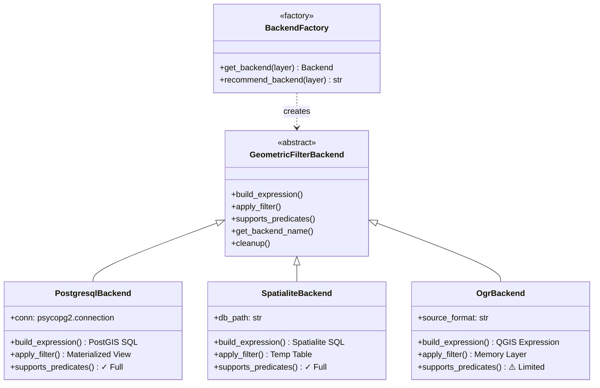

# Backend Development

Learn how to implement custom backends for FilterMate or extend existing ones. This guide covers the backend interface, implementation patterns, and best practices.

## Backend Architecture Overview

FilterMate uses a **factory pattern** with polymorphic backends to support multiple data sources. Each backend implements the same interface but provides optimized operations for its specific data provider.



## Backend Interface

All backends **must** implement the `GeometricFilterBackend` abstract class.

### Location

```
modules/backends/
├── base_backend.py         # Abstract base class
├── postgresql_backend.py   # PostgreSQL implementation
├── spatialite_backend.py   # Spatialite implementation
├── ogr_backend.py          # OGR implementation
└── factory.py              # Backend factory
```

### Required Methods

#### 1. `__init__(task_params: Dict)`

Initialize the backend with task parameters.

```python
def __init__(self, task_params: Dict):
    """
    Initialize backend with task parameters.
    
    Args:
        task_params: Dictionary containing:
            - layer: QgsVectorLayer instance
            - filter_expression: User filter expression
            - spatial_predicates: List of predicates to apply
            - buffer_distance: Optional buffer distance
            - etc.
    """
    self.task_params = task_params
    self.layer = task_params.get('layer')
    # Backend-specific initialization
```

#### 2. `build_expression()` (Abstract)

Build a filter expression for this backend.

**Signature**:

```python
@abstractmethod
def build_expression(
    self,
    layer_props: Dict,
    predicates: Dict,
    source_geom: Optional[str] = None,
    buffer_value: Optional[float] = None,
    buffer_expression: Optional[str] = None
) -> str:
```

**Parameters**:

- `layer_props`: Layer properties
  - `layer_name`: Table/layer name
  - `layer_schema`: Schema name (PostgreSQL)
  - `geometry_field`: Geometry column name
  - `primary_key_name`: Primary key field
  - `layer_provider_type`: Backend type
  
- `predicates`: Spatial predicates dictionary
  - Key: Predicate name ('intersects', 'contains', etc.)
  - Value: Backend-specific SQL function
  
- `source_geom`: Source geometry expression (optional)
- `buffer_value`: Static buffer distance (optional)
- `buffer_expression`: Dynamic buffer expression (optional)

**Returns**: Filter expression as string

**Example Implementation (PostgreSQL)**:

```python
def build_expression(
    self,
    layer_props: Dict,
    predicates: Dict,
    source_geom: Optional[str] = None,
    buffer_value: Optional[float] = None,
    buffer_expression: Optional[str] = None
) -> str:
    """Build PostGIS SQL WHERE clause"""
    
    # Extract layer properties
    geom_field = layer_props['geometry_field']
    table_name = layer_props['layer_name']
    
    # Build geometry expression with buffer
    geom_expr = f'"{table_name}"."{geom_field}"'
    if buffer_value:
        geom_expr = f'ST_Buffer({geom_expr}, {buffer_value})'
    elif buffer_expression:
        geom_expr = f'ST_Buffer({geom_expr}, {buffer_expression})'
    
    # Build predicate expression
    predicate_clauses = []
    for predicate_name, sql_function in predicates.items():
        clause = f'{sql_function}({geom_expr}, {source_geom})'
        predicate_clauses.append(clause)
    
    # Combine with OR
    return ' OR '.join(predicate_clauses)
```

#### 3. `apply_filter()` (Abstract)

Apply the filter expression to a layer.

**Signature**:

```python
@abstractmethod
def apply_filter(
    self,
    layer: QgsVectorLayer,
    expression: str,
    old_subset: Optional[str] = None,
    combine_operator: Optional[str] = None
) -> bool:
```

**Parameters**:

- `layer`: QGIS vector layer
- `expression`: Filter expression from `build_expression()`
- `old_subset`: Existing filter (optional)
- `combine_operator`: 'AND' or 'OR' to combine filters

**Returns**: `True` if successful, `False` otherwise

**Example Implementation (Spatialite)**:

```python
def apply_filter(
    self,
    layer: QgsVectorLayer,
    expression: str,
    old_subset: Optional[str] = None,
    combine_operator: Optional[str] = None
) -> bool:
    """Apply filter via Spatialite temporary table"""
    
    try:
        # Combine with existing filter if needed
        if old_subset and combine_operator:
            expression = f'({old_subset}) {combine_operator} ({expression})'
        
        # Create temporary table with filtered results
        self._create_temp_table(layer, expression)
        
        # Update layer to use temp table
        layer.setSubsetString(expression)
        
        return True
        
    except Exception as e:
        print(f"Filter failed: {e}")
        return False
```

#### 4. `supports_predicates()` (Abstract)

Check if backend supports spatial predicates.

**Signature**:

```python
@abstractmethod
def supports_predicates(self) -> bool:
```

**Returns**: `True` if predicates supported

**Example**:

```python
def supports_predicates(self) -> bool:
    """PostgreSQL fully supports all spatial predicates"""
    return True
```

#### 5. `get_backend_name()` (Abstract)

Get human-readable backend name.

**Signature**:

```python
@abstractmethod
def get_backend_name(self) -> str:
```

**Returns**: Backend name

**Example**:

```python
def get_backend_name(self) -> str:
    return "PostgreSQL/PostGIS"
```

#### 6. `cleanup()` (Abstract)

Clean up resources when done.

**Signature**:

```python
@abstractmethod
def cleanup(self):
```

**Example**:

```python
def cleanup(self):
    """Close database connections, delete temp tables"""
    if hasattr(self, 'conn') and self.conn:
        self.conn.close()
    if hasattr(self, 'temp_tables'):
        for table in self.temp_tables:
            self._drop_temp_table(table)
```

### Optional Helper Methods

The base class provides utility methods you can override:

#### `prepare_geometry_expression()`

```python
def prepare_geometry_expression(
    self,
    geom_field: str,
    buffer_value: Optional[float] = None,
    buffer_expression: Optional[str] = None,
    simplify_tolerance: Optional[float] = None
) -> str:
    """
    Prepare geometry with buffer/simplification.
    Override for backend-specific optimizations.
    """
    # Default implementation
    return geom_field
```

#### `validate_layer_properties()`

```python
def validate_layer_properties(self, layer_props: Dict) -> tuple:
    """
    Validate layer properties dictionary.
    Returns: (is_valid, missing_keys, error_message)
    """
    required_keys = ['layer_name', 'geometry_field']
    # Validation logic
    return (True, [], "")
```

## Implementing a Custom Backend

### Step 1: Create Backend File

Create `modules/backends/my_backend.py`:

```python
"""
My Custom Backend Implementation
Supports filtering for XYZ data source
"""

from typing import Dict, Optional
from qgis.core import QgsVectorLayer
from .base_backend import GeometricFilterBackend


class MyCustomBackend(GeometricFilterBackend):
    """Backend for XYZ data source"""
    
    def __init__(self, task_params: Dict):
        """Initialize custom backend"""
        super().__init__(task_params)
        self.layer = task_params.get('layer')
        # Custom initialization
        self._setup_connection()
    
    def _setup_connection(self):
        """Setup connection to XYZ data source"""
        # Your connection logic
        pass
    
    def build_expression(
        self,
        layer_props: Dict,
        predicates: Dict,
        source_geom: Optional[str] = None,
        buffer_value: Optional[float] = None,
        buffer_expression: Optional[str] = None
    ) -> str:
        """Build XYZ-specific filter expression"""
        
        # Validate inputs
        is_valid, missing, msg = self.validate_layer_properties(layer_props)
        if not is_valid:
            raise ValueError(f"Invalid layer properties: {msg}")
        
        # Extract properties
        geom_field = layer_props['geometry_field']
        
        # Build expression in XYZ syntax
        expression = f"XYZ_FILTER({geom_field}, {source_geom})"
        
        # Add buffer if needed
        if buffer_value:
            expression = f"XYZ_BUFFER({expression}, {buffer_value})"
        
        return expression
    
    def apply_filter(
        self,
        layer: QgsVectorLayer,
        expression: str,
        old_subset: Optional[str] = None,
        combine_operator: Optional[str] = None
    ) -> bool:
        """Apply filter to XYZ layer"""
        
        try:
            # Combine with existing filter
            final_expression = self._combine_with_existing(
                expression, old_subset, combine_operator
            )
            
            # Apply using XYZ API
            self._apply_xyz_filter(layer, final_expression)
            
            return True
            
        except Exception as e:
            print(f"Filter failed: {e}")
            return False
    
    def supports_predicates(self) -> bool:
        """Check if XYZ supports spatial predicates"""
        return True  # or False if limited
    
    def get_backend_name(self) -> str:
        """Get backend name"""
        return "My Custom XYZ Backend"
    
    def cleanup(self):
        """Clean up XYZ resources"""
        if hasattr(self, 'connection'):
            self.connection.close()
    
    # Helper methods
    def _combine_with_existing(self, new_expr, old_expr, operator):
        """Combine new filter with existing one"""
        if old_expr and operator:
            return f'({old_expr}) {operator} ({new_expr})'
        return new_expr
    
    def _apply_xyz_filter(self, layer, expression):
        """Apply filter using XYZ API"""
        # Your implementation
        pass
```

### Step 2: Register in Factory

Update `modules/backends/factory.py`:

```python
from .my_backend import MyCustomBackend

class BackendFactory:
    """Factory for creating backend instances"""
    
    @staticmethod
    def get_backend(layer: QgsVectorLayer) -> GeometricFilterBackend:
        """Get appropriate backend for layer"""
        
        provider_type = layer.providerType()
        
        # Add your backend detection
        if provider_type == 'xyz':  # Your provider type
            return MyCustomBackend({'layer': layer})
        
        elif provider_type == 'postgres':
            if POSTGRESQL_AVAILABLE:
                return PostgresqlBackend({'layer': layer})
            # Fallback logic
        
        # ... existing logic ...
```

### Step 3: Test Your Backend

Create `tests/test_my_backend.py`:

```python
import pytest
from unittest.mock import Mock
from modules.backends.my_backend import MyCustomBackend


class TestMyCustomBackend:
    """Test custom backend implementation"""
    
    @pytest.fixture
    def backend(self):
        """Create backend instance"""
        task_params = {
            'layer': Mock(spec=QgsVectorLayer),
            'filter_expression': 'test_filter'
        }
        return MyCustomBackend(task_params)
    
    def test_get_backend_name(self, backend):
        """Test backend name"""
        assert backend.get_backend_name() == "My Custom XYZ Backend"
    
    def test_supports_predicates(self, backend):
        """Test predicate support"""
        assert backend.supports_predicates() is True
    
    def test_build_expression(self, backend):
        """Test expression building"""
        layer_props = {
            'layer_name': 'test_layer',
            'geometry_field': 'geom'
        }
        predicates = {'intersects': 'XYZ_INTERSECTS'}
        
        expression = backend.build_expression(
            layer_props, predicates, 
            source_geom='POINT(0 0)'
        )
        
        assert 'XYZ_FILTER' in expression
        assert 'geom' in expression
    
    def test_apply_filter(self, backend):
        """Test filter application"""
        mock_layer = Mock()
        expression = 'test_expression'
        
        result = backend.apply_filter(mock_layer, expression)
        
        assert result is True
    
    def test_cleanup(self, backend):
        """Test resource cleanup"""
        # Should not raise exception
        backend.cleanup()
```

## Backend Development Best Practices

### ✅ Do's

#### 1. Error Handling

```python
def apply_filter(self, layer, expression, **kwargs):
    """Always handle errors gracefully"""
    try:
        # Your logic
        return True
    except SpecificException as e:
        self.logger.error(f"Specific error: {e}")
        return False
    except Exception as e:
        self.logger.error(f"Unexpected error: {e}")
        return False
```

#### 2. Resource Management

```python
def __init__(self, task_params):
    """Track resources for cleanup"""
    self.resources = []
    self.connections = []
    self.temp_tables = []

def cleanup(self):
    """Clean up all resources"""
    for conn in self.connections:
        try:
            conn.close()
        except:
            pass
    
    for table in self.temp_tables:
        try:
            self._drop_table(table)
        except:
            pass
```

#### 3. Input Validation

```python
def build_expression(self, layer_props, predicates, **kwargs):
    """Validate all inputs"""
    
    # Check required keys
    is_valid, missing, msg = self.validate_layer_properties(layer_props)
    if not is_valid:
        raise ValueError(f"Invalid properties: {msg}")
    
    # Check predicates
    if not predicates:
        raise ValueError("No predicates provided")
    
    # Validate geometry
    if kwargs.get('source_geom') is None:
        raise ValueError("Source geometry required")
    
    # Build expression
    # ...
```

#### 4. Performance Optimization

```python
def apply_filter(self, layer, expression, **kwargs):
    """Optimize for performance"""
    
    # Use spatial indexes
    self._ensure_spatial_index(layer)
    
    # Batch operations
    self._batch_process(layer, expression)
    
    # Cache results
    self._cache_filtered_results(expression)
    
    return True
```

### ❌ Don'ts

#### 1. Don't Assume Dependencies

```python
# ❌ Bad - Assumes psycopg2 available
import psycopg2

# ✅ Good - Check availability
try:
    import psycopg2
    PSYCOPG2_AVAILABLE = True
except ImportError:
    PSYCOPG2_AVAILABLE = False
```

#### 2. Don't Leak Resources

```python
# ❌ Bad - Connection not closed
def get_data(self):
    conn = self.connect()
    return conn.fetchall()  # Connection never closed!

# ✅ Good - Proper cleanup
def get_data(self):
    conn = self.connect()
    try:
        return conn.fetchall()
    finally:
        conn.close()
```

#### 3. Don't Ignore Errors

```python
# ❌ Bad - Silent failure
def apply_filter(self, layer, expression):
    try:
        layer.setSubsetString(expression)
    except:
        pass  # User has no idea it failed!

# ✅ Good - Proper error handling
def apply_filter(self, layer, expression):
    try:
        layer.setSubsetString(expression)
        return True
    except Exception as e:
        self.logger.error(f"Filter failed: {e}")
        return False
```

## Backend Testing Checklist

When implementing a new backend, test:

- [ ] **Basic functionality**
  - [ ] Expression building works
  - [ ] Filter application works
  - [ ] Cleanup works
  
- [ ] **Edge cases**
  - [ ] Empty datasets
  - [ ] Invalid geometries
  - [ ] Missing fields
  - [ ] Null values
  
- [ ] **Error handling**
  - [ ] Connection failures
  - [ ] Invalid expressions
  - [ ] Resource exhaustion
  
- [ ] **Performance**
  - [ ] 10k features < 2s
  - [ ] 100k features < 10s
  - [ ] Memory usage reasonable
  
- [ ] **Integration**
  - [ ] Works with FilterMateApp
  - [ ] Factory selects correctly
  - [ ] UI updates properly

## Debugging Backends

### Enable Logging

```python
import logging

logger = logging.getLogger('FilterMate.Backend')
logger.setLevel(logging.DEBUG)

def build_expression(self, *args, **kwargs):
    logger.debug(f"Building expression with args: {args}")
    expression = # ... build expression
    logger.debug(f"Built expression: {expression}")
    return expression
```

### Use QGIS Message Bar

```python
from qgis.utils import iface

def apply_filter(self, layer, expression):
    try:
        # Your logic
        iface.messageBar().pushSuccess(
            "Backend", 
            f"Filter applied: {expression[:50]}..."
        )
        return True
    except Exception as e:
        iface.messageBar().pushCritical(
            "Backend Error",
            f"Failed: {str(e)}"
        )
        return False
```

### Test in QGIS Python Console

```python
# In QGIS Python Console
from modules.backends.my_backend import MyCustomBackend

# Create test layer
layer = iface.activeLayer()

# Create backend
backend = MyCustomBackend({'layer': layer})

# Test expression building
layer_props = {
    'layer_name': layer.name(),
    'geometry_field': 'geom'
}
expression = backend.build_expression(layer_props, {...})
print(f"Expression: {expression}")

# Test filter application
result = backend.apply_filter(layer, expression)
print(f"Success: {result}")
```

## See Also

- [Backend Selection](../backends/backend-selection.md) - How backends are chosen
- [PostgreSQL Backend](../backends/postgresql.md) - Reference implementation
- [Spatialite Backend](../backends/spatialite.md) - Alternative reference
- [Testing Guide](./testing.md) - Testing your backend
- [Backend API Reference](../api/backend-api.md) - Complete API documentation

## Resources

- [QGIS PyQGIS Cookbook](https://docs.qgis.org/latest/en/docs/pyqgis_developer_cookbook/)
- [PostGIS Documentation](https://postgis.net/documentation/)
- [Spatialite Documentation](https://www.gaia-gis.it/fossil/libspatialite/)
- [GDAL/OGR Documentation](https://gdal.org/)

---

*Last updated: December 8, 2025*