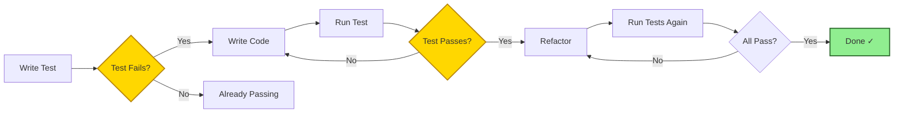

# Testing

FilterMate has a comprehensive test suite covering utilities, backends, UI components, and integration scenarios. The test suite targets **80%+ code coverage** and uses mocked QGIS modules for fast, isolated testing.

## Overview

### Test Categories

FilterMate's test suite is organized into several categories:

| Category | Files | Purpose |
|----------|-------|---------|
| **Backend Tests** | `test_backends.py` | Multi-backend architecture, factory pattern |
| **Utility Tests** | `test_appUtils.py`, `test_constants.py` | Core utility functions |
| **UI Tests** | `test_ui_*.py` | UI configuration, themes, styles |
| **Integration Tests** | `test_filter_history_integration.py` | Feature interaction |
| **Performance Tests** | `test_performance.py`, `benchmark_simple.py` | Speed benchmarks |
| **Refactoring Tests** | `test_refactored_helpers_*.py` | Helper method coverage |
| **Signal Tests** | `test_signal_utils.py` | Signal/slot management |
| **Configuration Tests** | `test_config_json_reactivity.py`, `test_choices_type_config.py` | Dynamic config |

### Test Statistics

- **Total Test Files**: 35+
- **Test Cases**: 150+
- **Target Coverage**: 80%
- **Current Coverage**: ~75%
- **Mock Framework**: pytest-mock + pytest-qt

## Setup

### Prerequisites

1. **Python 3.7+** (QGIS Python environment)
2. **pip** package manager
3. **No QGIS installation required** (tests use mocks)

### Install Test Dependencies

#### Method 1: Using requirements.txt

```bash
# From project root
cd /path/to/filter_mate
pip install -r tests/requirements-test.txt
```

#### Method 2: Manual Installation

```bash
pip install pytest pytest-cov pytest-mock pytest-qt
```

### Dependencies Explained

| Package | Purpose |
|---------|---------|
| `pytest` | Test framework and runner |
| `pytest-cov` | Code coverage reporting |
| `pytest-mock` | Mocking QGIS and external dependencies |
| `pytest-qt` | Qt signal/slot testing |

## Running Tests

### Basic Commands

#### Run All Tests

```bash
# From project root
pytest tests/

# With verbose output
pytest tests/ -v

# Show print statements
pytest tests/ -v -s
```

#### Run Specific Test File

```bash
# Test backends
pytest tests/test_backends.py -v

# Test utilities
pytest tests/test_appUtils.py -v

# Test UI configuration
pytest tests/test_ui_config.py -v
```

#### Run Specific Test Class

```bash
# Test only backend factory
pytest tests/test_backends.py::TestBackendFactory -v

# Test only signal utilities
pytest tests/test_signal_utils.py::TestSignalUtils -v
```

#### Run Specific Test Function

```bash
# Test specific function
pytest tests/test_backends.py::TestBackendFactory::test_get_backend_postgresql -v

# Test with keyword filter
pytest tests/ -k "backend" -v
```

### Coverage Reports

#### Generate HTML Coverage Report

```bash
# Run tests with coverage
pytest tests/ --cov=modules --cov=filter_mate_app --cov-report=html

# Open report
# Windows:
start htmlcov/index.html

# Linux/Mac:
xdg-open htmlcov/index.html  # Linux
open htmlcov/index.html      # Mac
```

#### Generate Terminal Coverage Report

```bash
# Brief coverage summary
pytest tests/ --cov=modules --cov=filter_mate_app

# Detailed line-by-line report
pytest tests/ --cov=modules --cov=filter_mate_app --cov-report=term-missing
```

#### Generate XML Coverage (CI/CD)

```bash
# For CI/CD integration
pytest tests/ --cov=modules --cov=filter_mate_app --cov-report=xml
```

## Test Structure

### Directory Layout

```
tests/
├── conftest.py                              # Shared fixtures & QGIS mocks
├── requirements-test.txt                    # Test dependencies
│
├── Backend Tests
│   └── test_backends.py                     # Backend architecture
│
├── Core Utility Tests
│   ├── test_appUtils.py                     # Database utilities
│   ├── test_constants.py                    # Module constants
│   └── test_signal_utils.py                 # Signal management
│
├── UI Tests
│   ├── test_ui_config.py                    # UI profile detection
│   ├── test_ui_config_ratios.py            # Dimension calculations
│   ├── test_ui_styles.py                    # Theme application
│   ├── test_qt_json_view_themes.py         # JSON view themes
│   └── test_theme_detection.py             # Theme synchronization
│
├── Configuration Tests
│   ├── test_config_json_reactivity.py       # Dynamic config updates
│   ├── test_choices_type_config.py          # ChoicesType enum
│   └── test_color_contrast.py               # Accessibility compliance
│
├── Backend-Specific Tests
│   ├── test_spatialite_expression_quotes.py # Field name quoting
│   ├── test_spatialite_temp_table_fix.py   # Temp table handling
│   ├── test_sqlite_lock_handling.py        # Database locking
│   ├── test_geometry_repair.py             # Auto-repair invalid geometries
│   ├── test_buffer_error_handling.py       # Buffer operation errors
│   ├── test_ogr_type_handling.py           # OGR provider detection
│   └── test_geopackage_detection.py        # GeoPackage identification
│
├── Feature Tests
│   ├── test_filter_history.py              # History tracking
│   ├── test_filter_history_integration.py  # UI integration
│   ├── test_feedback_utils.py              # User messaging
│   └── test_prepared_statements.py         # SQL preparation
│
├── Performance Tests
│   ├── test_performance.py                 # Speed benchmarks
│   └── benchmark_simple.py                 # Quick profiling
│
├── Refactoring Tests
│   ├── test_refactored_helpers_appTasks.py # 58 helper methods
│   └── test_refactored_helpers_dockwidget.py # 14 UI helpers
│
└── Migration Tests
    ├── test_layer_provider_type_migration.py # Provider type handling
    ├── test_source_table_name.py            # Table name extraction
    └── test_buffer_type.py                  # Buffer type validation
```

### Key Files Explained

#### conftest.py

Provides shared test fixtures and QGIS mocks:

```python
@pytest.fixture
def mock_qgs_layer():
    """Mock QgsVectorLayer for testing"""
    layer = Mock()
    layer.providerType.return_value = 'postgres'
    layer.featureCount.return_value = 1000
    return layer

@pytest.fixture
def mock_iface():
    """Mock QGIS interface"""
    iface = Mock()
    iface.messageBar.return_value = Mock()
    return iface
```

#### test_backends.py

Tests the multi-backend architecture:

```python
class TestBackendFactory:
    def test_get_backend_postgresql(self):
        """Test PostgreSQL backend selection"""
        # Arrange
        layer = create_postgres_layer()
        
        # Act
        backend = BackendFactory.get_backend(layer)
        
        # Assert
        assert isinstance(backend, PostgresqlBackend)
        assert backend.supports_predicates()
```

## Testing Workflow

### Test-Driven Development (TDD)



### Continuous Integration

1. **Pre-commit**: Run fast tests locally
2. **Push**: Trigger CI pipeline
3. **CI**: Run full test suite with coverage
4. **Review**: Check coverage reports
5. **Merge**: Only if tests pass + coverage maintained

## Writing Tests

### Test Template

```python
import pytest
from unittest.mock import Mock, patch

class TestMyFeature:
    """Test suite for MyFeature"""
    
    @pytest.fixture
    def setup_data(self):
        """Setup test data"""
        return {
            'param1': 'value1',
            'param2': 123
        }
    
    def test_basic_functionality(self, setup_data):
        """Test basic feature operation"""
        # Arrange
        input_data = setup_data
        expected_output = 'expected_value'
        
        # Act
        result = my_function(input_data)
        
        # Assert
        assert result == expected_output
    
    def test_error_handling(self):
        """Test error scenarios"""
        # Arrange
        invalid_input = None
        
        # Act & Assert
        with pytest.raises(ValueError):
            my_function(invalid_input)
    
    @patch('modules.appUtils.psycopg2')
    def test_with_mock(self, mock_psycopg2):
        """Test with external dependency mocked"""
        # Arrange
        mock_psycopg2.connect.return_value = Mock()
        
        # Act
        result = function_using_psycopg2()
        
        # Assert
        mock_psycopg2.connect.assert_called_once()
        assert result is not None
```

### Best Practices

#### ✅ Do's

- ✅ **Use descriptive names** - `test_filter_applies_buffer_correctly`
- ✅ **Follow AAA pattern** - Arrange, Act, Assert
- ✅ **One assertion per test** (when possible)
- ✅ **Mock external dependencies** - QGIS, databases, filesystem
- ✅ **Test edge cases** - Empty inputs, None values, large datasets
- ✅ **Use fixtures** - Share setup code across tests
- ✅ **Document test purpose** - Clear docstrings

#### ❌ Don'ts

- ❌ **Don't test QGIS internals** - Only test FilterMate code
- ❌ **Don't use real databases** - Mock all DB operations
- ❌ **Don't depend on test order** - Tests should be independent
- ❌ **Don't skip cleanup** - Use fixtures with yield
- ❌ **Don't write brittle tests** - Avoid hardcoded values
- ❌ **Don't ignore failures** - Fix or document intentional skips

### Testing Checklist

When adding new code, ensure tests cover:

- [ ] **Happy path** - Normal expected usage
- [ ] **Edge cases** - Boundary conditions
- [ ] **Error handling** - Invalid inputs, exceptions
- [ ] **Integration** - Interaction with other components
- [ ] **Performance** - Not too slow (if critical path)
- [ ] **Mocking** - External dependencies isolated

## Test Examples

### Example 1: Testing Utility Function

```python
# tests/test_appUtils.py
def test_get_primary_key_name_postgres(mock_postgres_layer):
    """Test primary key extraction from PostgreSQL layer"""
    # Arrange
    mock_postgres_layer.dataProvider().uri().table.return_value = 'my_table'
    mock_postgres_layer.dataProvider().uri().keyColumn.return_value = 'id'
    
    # Act
    pk_name = get_primary_key_name(mock_postgres_layer)
    
    # Assert
    assert pk_name == 'id'
```

### Example 2: Testing Backend Selection

```python
# tests/test_backends.py
class TestBackendFactory:
    def test_recommend_backend_large_dataset(self):
        """Should recommend PostgreSQL for large datasets"""
        # Arrange
        layer = Mock()
        layer.featureCount.return_value = 100000
        layer.providerType.return_value = 'postgres'
        
        # Act
        recommendation = BackendFactory.recommend_backend(layer)
        
        # Assert
        assert recommendation == 'postgresql'
```

### Example 3: Testing UI Configuration

```python
# tests/test_ui_config.py
def test_detect_ui_profile_compact():
    """Should detect compact profile for small screens"""
    # Arrange
    screen_width = 1366
    screen_height = 768
    
    # Act
    profile = detect_ui_profile(screen_width, screen_height)
    
    # Assert
    assert profile == 'compact'
```

### Example 4: Testing Signal Handling

```python
# tests/test_signal_utils.py
def test_safe_disconnect_existing_signal(qtbot):
    """Should disconnect existing signal without error"""
    # Arrange
    widget = QPushButton()
    callback = Mock()
    widget.clicked.connect(callback)
    
    # Act
    safe_disconnect(widget.clicked, callback)
    widget.click()
    
    # Assert
    callback.assert_not_called()  # Signal disconnected
```

## Troubleshooting

### Common Issues

#### Import Errors

**Problem**: `ModuleNotFoundError: No module named 'qgis'`

**Solution**: Tests use mocked QGIS modules. Ensure `conftest.py` is in place:

```python
# conftest.py must contain QGIS mocks
import sys
from unittest.mock import Mock

sys.modules['qgis'] = Mock()
sys.modules['qgis.core'] = Mock()
# ... more mocks
```

#### Test Discovery Issues

**Problem**: `pytest` doesn't find tests

**Solution**: Ensure proper naming:
- Test files: `test_*.py`
- Test classes: `class Test*`
- Test functions: `def test_*()`

#### Fixture Not Found

**Problem**: `fixture 'my_fixture' not found`

**Solution**: Check fixture is in `conftest.py` or same file:

```python
# conftest.py
@pytest.fixture
def my_fixture():
    return "test_data"
```

#### Coverage Too Low

**Problem**: Coverage report shows < 80%

**Solution**: 
1. Identify uncovered lines: `pytest --cov --cov-report=term-missing`
2. Add tests for uncovered code
3. Use `# pragma: no cover` for untestable code (sparingly)

### Debugging Tests

#### Use pytest verbosity

```bash
# Show test names and results
pytest tests/test_backends.py -v

# Show print statements
pytest tests/test_backends.py -v -s

# Stop at first failure
pytest tests/test_backends.py -x
```

#### Use pytest debugger

```bash
# Drop into debugger on failure
pytest tests/test_backends.py --pdb

# Set breakpoint in code
import pdb; pdb.set_trace()
```

#### Check mock calls

```python
# Verify mock was called
mock_function.assert_called()
mock_function.assert_called_once()
mock_function.assert_called_with(expected_arg)

# Print mock calls for debugging
print(mock_function.call_args_list)
```

## CI/CD Integration

### GitHub Actions Example

```yaml
# .github/workflows/test.yml
name: Run Tests

on: [push, pull_request]

jobs:
  test:
    runs-on: ubuntu-latest
    
    steps:
    - uses: actions/checkout@v2
    
    - name: Set up Python
      uses: actions/setup-python@v2
      with:
        python-version: '3.9'
    
    - name: Install dependencies
      run: |
        pip install -r tests/requirements-test.txt
    
    - name: Run tests with coverage
      run: |
        pytest tests/ --cov=modules --cov=filter_mate_app --cov-report=xml
    
    - name: Upload coverage to Codecov
      uses: codecov/codecov-action@v2
      with:
        file: ./coverage.xml
```

## Performance Testing

### Benchmark Tests

FilterMate includes performance benchmarks:

```bash
# Run performance tests
pytest tests/test_performance.py -v

# Run simple benchmark
python tests/benchmark_simple.py
```

### Performance Goals

| Operation | Target Time | Backend |
|-----------|-------------|---------|
| Filter 10k features | < 1s | Any |
| Filter 100k features | < 5s | PostgreSQL |
| Export 10k features | < 2s | Any |
| UI update | < 100ms | N/A |

## Contributing Tests

When contributing to FilterMate:

1. **Write tests first** (TDD approach)
2. **Maintain coverage** (≥ 80%)
3. **Follow naming conventions**
4. **Mock external dependencies**
5. **Document test purpose**
6. **Run full suite before PR**

### Test PR Checklist

- [ ] All tests pass locally
- [ ] New features have tests
- [ ] Coverage maintained or improved
- [ ] No skipped tests without reason
- [ ] Tests run in < 60 seconds
- [ ] Documentation updated

## See Also

- [Contributing Guide](./contributing) - Contribution workflow
- [Code Style](./code-style) - Coding standards
- [Architecture](./architecture) - System design
- [Backend Development](./backend-development) - Backend implementation

## Resources

- [pytest Documentation](https://docs.pytest.org/)
- [pytest-cov Documentation](https://pytest-cov.readthedocs.io/)
- [pytest-mock Documentation](https://pytest-mock.readthedocs.io/)
- [pytest-qt Documentation](https://pytest-qt.readthedocs.io/)

---

*Last updated: December 8, 2025*