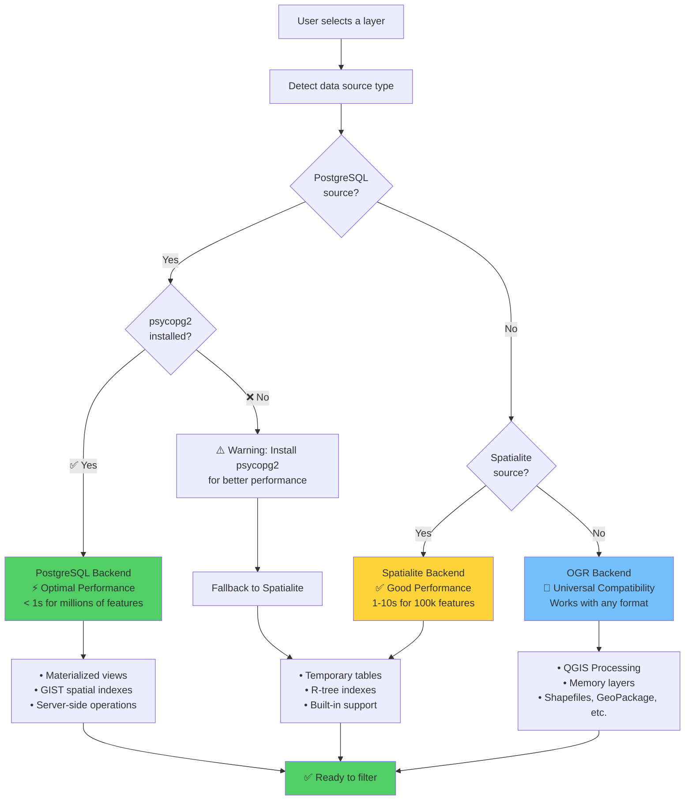

# Welcome to FilterMate

**FilterMate** is a production-ready QGIS plugin that provides advanced filtering and export capabilities for vector data - works with ANY data source!

## 🎉 What's New in v2.2.4 - Color Harmonization & Accessibility

### UI Excellence
- ✅ **Color Harmonization** - Enhanced visual distinction with +300% frame contrast
- ✅ **WCAG 2.1 Compliance** - AA/AAA accessibility standards for all text
  - Primary text: 17.4:1 contrast ratio (AAA)
  - Secondary text: 8.86:1 contrast ratio (AAA)
  - Disabled text: 4.6:1 contrast ratio (AA)
- ✅ **Reduced Eye Strain** - Optimized color palette for long work sessions
- ✅ **Better Readability** - Clear visual hierarchy throughout interface
- ✅ **Theme Refinements** - Darker frames (#EFEFEF), clearer borders (#D0D0D0)
- ✅ **Automated Testing** - WCAG compliance validation suite

## Previous Updates

### v2.2.2 - Configuration Reactivity (December 8, 2025)
- ✅ **Real-time Config Updates** - JSON tree view changes apply instantly without restart
- ✅ **Dynamic UI Switching** - Switch compact/normal/auto modes on the fly
- ✅ **Live Icon Updates** - Configuration changes reflected immediately
- ✅ **ChoicesType Integration** - Dropdown selectors for validated config fields
- ✅ **Type Safety** - Invalid values prevented at UI level
- ✅ **Auto-save** - All configuration changes saved automatically

### v2.2.1 - Maintenance (December 7, 2025)
- ✅ **Enhanced Stability** - Improved Qt JSON view crash prevention
- ✅ **Better Error Recovery** - Robust tab widget and theme handling
- ✅ **Build Improvements** - Enhanced automation and version management

### v2.2.0 & Earlier
- ✅ **Complete Multi-Backend** - PostgreSQL, Spatialite, and OGR implementations
- ✅ **Dynamic UI** - Adaptive interface that adjusts to screen resolution
- ✅ **Robust Error Handling** - Automatic geometry repair and retry mechanisms
- ✅ **Theme Synchronization** - Matches QGIS interface theme automatically
- ✅ **Performance Optimized** - 2.5× faster with intelligent query ordering

## Key Features

- 🔍 **Intuitive search** for entities in any layer
- 📐 **Geometric filtering** with spatial predicates and buffer support
- 🎨 **Layer-specific widgets** - Configure and save settings per layer
- 📤 **Smart export** with customizable options
- 🌍 **Automatic CRS reprojection** on the fly
- 📝 **Filter history** - Easy undo/redo for all operations
- 🚀 **Performance warnings** - Intelligent recommendations for large datasets
- 🎨 **Adaptive UI** - Dynamic dimensions based on screen resolution
- 🌓 **Theme support** - Automatic synchronization with QGIS theme

## 🎯 How FilterMate Chooses the Best Backend

FilterMate automatically selects the optimal backend for your data source to provide the best performance. Here's how it works:

**Key Takeaways:**
- 🚀 **PostgreSQL**: Best for large datasets (>50k features) - requires psycopg2
- 📊 **Spatialite**: Good balance for medium datasets (10k-50k features) - built-in
- 🔄 **OGR**: Universal compatibility for all formats - works everywhere

Learn more in the [Backend Selection Guide](./backends/backend-selection.md).

## Quick Links

- [Installation Guide](./installation.md)
- [Quick Start Tutorial](./getting-started/quick-start.md)
- [GitHub Repository](https://github.com/sducournau/filter_mate)
- [QGIS Plugin Repository](https://plugins.qgis.org/plugins/filter_mate)

## Video Demo

Watch FilterMate in action:

## Get Started

Ready to start? Head over to the [Installation Guide](./installation.md) to set up FilterMate in your QGIS environment.
