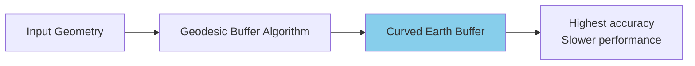
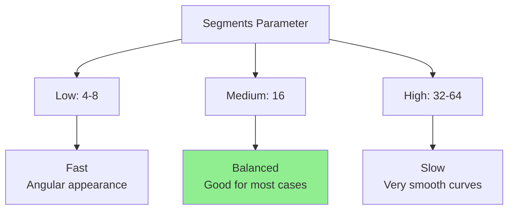
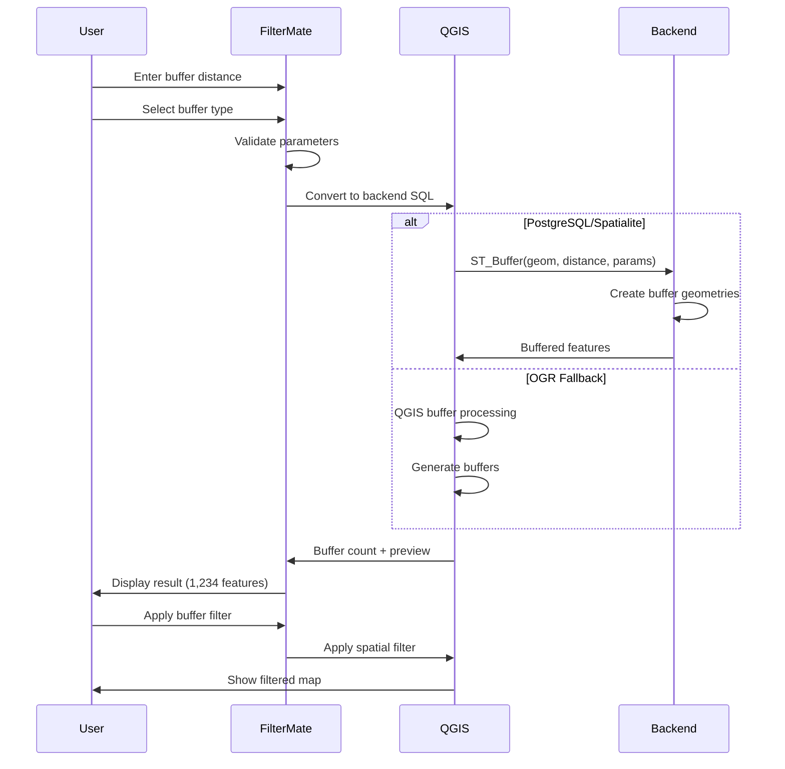

# Buffer Operations

Create buffers around geometries and use them for proximity analysis and spatial filtering.

## Overview

A **buffer** is a polygon representing all points within a specified distance from a geometry. Buffers are essential for:
- **Proximity analysis** - Find features near something
- **Impact zones** - Define areas of influence
- **Service areas** - Coverage analysis
- **Safety zones** - Exclusion boundaries

### Key Concepts

- **Distance**: How far the buffer extends (in map units)
- **Buffer Type**: Different algorithms for creating buffers
- **Segments**: Number of segments for curved buffers (higher = smoother)
- **Cap Style**: How buffer ends are shaped (round, flat, square)

## Buffer Types

FilterMate supports three buffer algorithms, each with different performance and accuracy characteristics.

### 1. Standard Buffer (Default)

The **standard algorithm** creates accurate buffers suitable for most use cases.


**Characteristics:**
- ✅ Accurate results
- ✅ Handles complex geometries well
- ✅ Good for most use cases
- ⚠️ Moderate performance on large datasets

**When to Use:**
- General proximity analysis
- Planning applications
- Regulatory compliance (accuracy required)
- Medium-sized datasets (&lt;10k features)

**Example:**
```python
# 500m buffer around buildings
buffer_type = "standard"
distance = 500
segments = 16  # Smooth curves
```

### 2. Fast Buffer

The **fast algorithm** prioritizes **performance** over precision.


**Characteristics:**
- ⚡ 2-5x faster than standard
- ⚠️ Lower geometric accuracy
- ✅ Good for large datasets
- ✅ Suitable for visualization

**When to Use:**
- Large datasets (&gt;50k features)
- Interactive exploration
- Approximate analysis
- Quick visualization

**Performance Comparison:**
```
Dataset Size  | Standard | Fast
--------------|----------|------
1,000 features| 0.5s     | 0.2s
10,000        | 4.2s     | 1.1s
50,000        | 21.3s    | 5.8s
100,000       | 45.1s    | 11.2s
```

**Example:**
```python
# Quick buffer for exploration
buffer_type = "fast"
distance = 1000
segments = 8  # Fewer segments for speed
```

### 3. Geodesic Buffer

The **geodesic algorithm** accounts for **Earth's curvature**, providing accurate results over long distances.



**Characteristics:**
- ✅ Accounts for Earth's curvature
- ✅ Accurate for large distances
- ✅ Critical for global/continental analysis
- ⚠️ Slower than standard
- ⚠️ Requires geographic CRS (lat/lon)

**When to Use:**
- Large distances (&gt;10 km)
- High latitude regions
- Global or continental analysis
- Legal/regulatory precision required

**Accuracy Difference:**

| Location | Distance | Standard Error | Geodesic Error |
|----------|----------|----------------|----------------|
| Equator | 10 km | 0.01% | 0.001% |
| Equator | 100 km | 0.5% | 0.01% |
| 45° Lat | 100 km | 2.1% | 0.01% |
| 60° Lat | 100 km | 5.8% | 0.01% |

**Example:**
```python
# Accurate 50km buffer in Alaska
buffer_type = "geodesic"
distance = 50000  # meters
segments = 32  # High precision
```

## Buffer Parameters

### Distance

The buffer radius in **map units** (depends on your layer's CRS).

```python
# Common distances
distance = 100      # 100m in projected CRS (UTM, etc.)
distance = 0.001    # ~111m in geographic CRS (WGS84)
distance = 5280     # 1 mile in feet-based CRS
```

:::tip CRS Matters
Ensure your layer uses an appropriate CRS:
- **Projected** (meters): UTM, State Plane, local projections
- **Geographic** (degrees): Use geodesic buffers for accuracy
:::

### Segments

Number of line segments approximating curves (higher = smoother but slower).



**Recommendations:**
- **Fast buffer**: 4-8 segments
- **Standard buffer**: 16 segments (default)
- **High precision**: 32-64 segments
- **Publication quality**: 64+ segments

### Cap Style

How buffer ends are shaped (for line geometries).

```
Round Cap:    ═════╗
              ═════╝

Flat Cap:     ═════|
              ═════|

Square Cap:   ═════||
              ═════||
```

**Options:**
- `round` (default) - Curved ends
- `flat` - Straight cut at endpoints
- `square` - Extended rectangular ends

## Buffer Workflow



## Practical Examples

### Urban Planning

#### Transit Coverage Analysis
```python
# 400m walk to transit stations
buffer_type = "standard"
distance = 400
segments = 16

# Find residential areas NOT covered
expression = """
NOT within(
    $geometry,
    buffer(
        geometry(get_feature('transit_stations', 'active', 'yes')),
        400
    )
)
AND land_use = 'residential'
"""
```

#### Noise Impact Zones
```python
# Highway noise zones (tiered)
# 100m: High impact
# 300m: Moderate impact
# 500m: Low impact

# High impact properties
expression = """
intersects(
    $geometry,
    buffer(geometry(get_feature('highways', 'type', 'major')), 100)
)
AND property_type = 'residential'
"""
```

### Environmental Analysis

#### Riparian Buffer Protection
```python
# 30m protected buffer around streams
buffer_type = "standard"
distance = 30
segments = 16

expression = """
intersects(
    $geometry,
    buffer(geometry(get_feature('streams', 'class', 'perennial')), 30)
)
AND development_status = 'proposed'
"""
```

#### Wildlife Corridor Analysis
```python
# 500m habitat buffer
buffer_type = "geodesic"  # Large area, accurate
distance = 500
segments = 32

expression = """
within(
    $geometry,
    buffer(geometry(get_feature('habitats', 'priority', 'high')), 500)
)
AND land_cover = 'forest'
"""
```

### Emergency Services

#### Fire Station Coverage
```python
# 5km service area (quick response)
buffer_type = "fast"  # Large dataset
distance = 5000
segments = 8

expression = """
NOT within(
    centroid($geometry),
    buffer(
        aggregate('fire_stations', 'collect', $geometry),
        5000
    )
)
AND zone_type = 'residential'
"""
```

#### Evacuation Zone
```python
# 2km evacuation buffer around hazard
buffer_type = "geodesic"
distance = 2000
segments = 32

expression = """
intersects(
    $geometry,
    buffer(geometry(get_feature('hazards', 'status', 'active')), 2000)
)
"""
```

## Buffer + Filter Combinations

### Multiple Buffer Zones

```sql
-- Properties in different risk zones
CASE
    WHEN distance($geometry, @hazard_geom) < 100 THEN 'high_risk'
    WHEN distance($geometry, @hazard_geom) < 500 THEN 'medium_risk'
    WHEN distance($geometry, @hazard_geom) < 1000 THEN 'low_risk'
    ELSE 'safe'
END = 'high_risk'
```

### Exclusion Zones

```sql
-- Available land (not in protected buffer)
land_use = 'undeveloped'
AND disjoint(
    $geometry,
    buffer(geometry(get_feature('protected', 'status', 'active')), 500)
)
AND area($geometry) > 10000
```

### Proximity to Multiple Features

```sql
-- Near transit OR major roads
(
    distance($geometry, geometry(get_feature('transit', 'type', 'station'))) < 400
    OR
    distance($geometry, geometry(get_feature('roads', 'class', 'highway'))) < 200
)
AND zone = 'commercial'
```

## Performance Optimization

### Backend Comparison

| Backend | Standard | Fast | Geodesic |
|---------|----------|------|----------|
| PostgreSQL | ⚡⚡⚡ Fast | ⚡⚡⚡⚡ Faster | ⚡⚡ Moderate |
| Spatialite | ⚡⚡ Moderate | ⚡⚡⚡ Fast | ⚡ Slow |
| OGR | ⚡ Slow | ⚡⚡ Moderate | ❌ N/A |

### Tips for Large Datasets

1. **Use Fast Buffer for Exploration**
   ```python
   # Quick interactive analysis
   buffer_type = "fast"
   segments = 8
   ```

2. **Switch to Standard for Final Results**
   ```python
   # Accurate final analysis
   buffer_type = "standard"
   segments = 16
   ```

3. **Reduce Segments**
   ```python
   # Balance accuracy and speed
   segments = 8  # Instead of 32
   ```

4. **Use PostgreSQL Backend**
   - Hardware-accelerated buffering
   - Spatial index support
   - 3-5x faster than Spatialite

### Memory Considerations

```python
# For 100k features with 500m buffers:
# - Fast buffer: ~200 MB RAM
# - Standard buffer: ~500 MB RAM
# - Geodesic buffer: ~800 MB RAM
```

## Backend-Specific Behavior

### PostgreSQL

```sql
-- Uses ST_Buffer (PostGIS)
ST_Buffer(
    geometry,
    distance,
    'quad_segs=16'  -- segments parameter
)
```

**Advantages:**
- Hardware acceleration
- Parallel processing
- Optimized algorithms

### Spatialite

```sql
-- Uses ST_Buffer (Spatialite)
ST_Buffer(geometry, distance)
```

**Advantages:**
- Good performance for medium datasets
- No external dependencies
- Works offline

**Limitations:**
- Fewer buffer parameters
- Slower than PostgreSQL
- May lock database for large buffers

### OGR (Fallback)

Uses QGIS processing algorithms:

```python
processing.run("native:buffer", {
    'INPUT': layer,
    'DISTANCE': distance,
    'SEGMENTS': segments,
    'OUTPUT': 'memory:'
})
```

**Limitations:**
- No spatial index
- Slower performance
- Limited to available QGIS algorithms

## Troubleshooting

### Invalid Buffer Results

```sql
-- Check for invalid geometries
is_valid($geometry)

-- Repair before buffering
make_valid($geometry)
```

### Performance Issues

1. **Reduce segments** - Lower segment count for curves
2. **Use fast buffer** - For large datasets
3. **Filter first** - Apply attribute filters before buffer
4. **Upgrade backend** - PostgreSQL for best performance

### Unexpected Results

1. **Check CRS** - Ensure projected CRS for metric distances
2. **Verify distance units** - Match layer's CRS units
3. **Test with smaller distance** - Confirm buffer logic
4. **Inspect geometries** - Check for NULL or invalid geometries

## Related Topics

- [Geometric Filtering](geometric-filtering.md) - Spatial predicates
- [Backend Performance](../backends/performance-comparison.md) - Optimization
- [Advanced Features](advanced-features.md) - Complex buffer operations
- [Backend Selection](../backends/backend-selection.md) - Choose optimal backend

## Next Steps

- **[Export Features](export-features.md)** - Save buffered results
- **[Filter History](filter-history.md)** - Reuse buffer configurations
- **[Performance Comparison](../backends/performance-comparison.md)** - Optimize buffer operations
