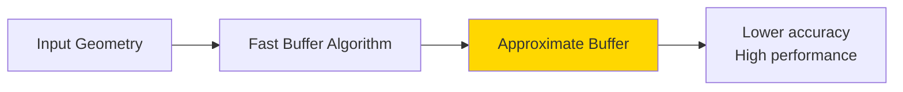
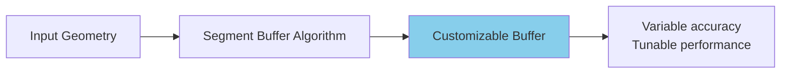

# Buffer Operations

Create buffers around geometries and use them for proximity analysis in the **FILTERING** tab.

## Overview

A **buffer** is a polygon representing all points within a specified distance from a geometry. In FilterMate, buffers are configured in the **FILTERING tab** alongside geometric predicates for proximity-based spatial filtering.

### Key Uses

Buffers are essential for:
- **Proximity analysis** - Find features near something (e.g., buildings within 200m of roads)
- **Impact zones** - Define areas of influence (e.g., noise buffer around airport)
- **Service areas** - Coverage analysis (e.g., 500m walking distance to transit)
- **Safety zones** - Exclusion boundaries (e.g., 100m buffer around hazards)

:::tip Location in Interface
Buffer configuration is in the **FILTERING tab**, below the geometric predicates selector. Buffers are applied to the **reference layer** geometry before spatial comparison.
:::

### Key Concepts

- **Distance**: How far the buffer extends (in specified units)
- **Unit**: Distance measurement (meters, kilometers, feet, miles, degrees)
- **Buffer Type**: Algorithm used (Standard, Fast, or Segment)
- **Integration**: Buffers work with spatial predicates (Intersects, Contains, etc.)

## Buffer Types

FilterMate supports three buffer algorithms in the FILTERING tab, each with different performance and accuracy characteristics.

### 1. Standard Buffer (Default)

The **standard algorithm** creates accurate buffers suitable for most use cases.


**Characteristics:**
- ✅ Accurate results
- ✅ Handles complex geometries well
- ✅ Good for most use cases
- ⚠️ Moderate performance on large datasets

**When to Use:**
- General proximity analysis
- Planning applications
- Regulatory compliance (accuracy required)
- Medium-sized datasets (&lt;10k features)

**Example Configuration:**
```
FILTERING Tab:
- Buffer Distance: 500
- Buffer Unit: meters
- Buffer Type: Standard
- Segments: 16 (smooth curves)
```

### 2. Fast Buffer

The **fast algorithm** prioritizes **performance** over precision.



**Characteristics:**
- ⚡ 2-5x faster than standard
- ⚠️ Lower geometric accuracy
- ✅ Good for large datasets
- ✅ Suitable for visualization and exploration

**When to Use:**
- Large datasets (&gt;50k features)
- Interactive exploration in QGIS
- Approximate analysis where precision isn't critical
- Quick visualization of proximity zones

**Performance Comparison:**
```
Dataset Size  | Standard | Fast  | Speed Gain
--------------|----------|-------|------------
1,000 features| 0.5s     | 0.2s  | 2.5x
10,000        | 4.2s     | 1.1s  | 3.8x
50,000        | 21.3s    | 5.8s  | 3.7x
100,000       | 45.1s    | 11.2s | 4.0x
```

**Example Configuration:**
```
FILTERING Tab:
- Buffer Distance: 1000
- Buffer Unit: meters
- Buffer Type: Fast
- Fewer segments for speed
```

### 3. Segment Buffer

The **segment buffer** creates buffers with customizable segmentation for fine control over smoothness vs performance.



**Characteristics:**
- ✅ Fine control over segment count
- ✅ Balance accuracy vs speed
- ✅ Good for publication-quality outputs
- ⚠️ Requires understanding of trade-offs

**When to Use:**
- Publication-quality maps
- When you need specific smoothness
- Custom performance tuning
- Advanced users wanting control

**Segment Count Guidelines:**
- **4-8 segments**: Fast, angular appearance
- **16 segments**: Balanced (default)
- **32-64 segments**: Smooth curves, slower
- **64+ segments**: Publication quality, slowest

**Example Configuration:**
```
FILTERING Tab:
- Buffer Distance: 200
- Buffer Unit: meters
- Buffer Type: Segment
- Segments: 32 (high quality)
```

## Buffer Configuration in FILTERING Tab

### Distance and Unit Selection


*Configure buffer distance and select unit*

**Supported Units**:
- **Meters** (m) - Most common for projected CRS
- **Kilometers** (km)
- **Feet** (ft) - US State Plane
- **Miles** (mi)
- **Degrees** - Geographic CRS (use with caution)

:::tip CRS Matters
Ensure your layer uses an appropriate CRS:
- **Projected** (meters, feet): UTM, State Plane, local projections → Use meters/feet
- **Geographic** (degrees): WGS84, NAD83 → Convert to projected CRS first for accurate buffers
:::

**Distance Examples**:
```
Urban planning:    50-500m
Transit access:    400-800m (walking distance)
Noise zones:       1-5km
Environmental:     100m-10km
Regional analysis: 10-100km
```

### Buffer Type Selection


*Choose buffer algorithm: Standard, Fast, or Segment*

**Selection Criteria**:

| Scenario | Recommended Type | Why |
|----------|------------------|-----|
| Quick exploration | Fast | Speed over precision |
| Official reporting | Standard | Good accuracy |
| Large datasets (&>;50k) | Fast | Performance |
| Publication maps | Segment (32+) | Visual quality |
| Regulatory compliance | Standard | Reliable accuracy |

### Buffer Integration with Geometric Filtering

Buffers work seamlessly with **spatial predicates** in the FILTERING tab:

**Workflow**:
1. Select source layer (e.g., "buildings")
2. Select spatial predicate (e.g., "Intersects")
3. Select reference layer (e.g., "roads")
4. Configure buffer: 200m, Standard type
5. Click FILTER

**What Happens**:
- Reference layer geometry is buffered by 200m
- Spatial predicate (Intersects) is applied between source layer and buffered reference
- Result: Buildings that intersect roads within 200m

**Example Use Cases**:

| Source Layer | Predicate | Reference Layer | Buffer | Result |
|--------------|-----------|-----------------|--------|--------|
| Buildings | Intersects | Roads | 200m | Buildings within 200m of roads |
| Parcels | Within | Protected Zone | 50m | Parcels within 50m inside zone |
| Facilities | Disjoint | Hazards | 500m | Facilities >500m` from hazards |
| POIs | Contains | District + Buffer | 100m | POIs in district + 100m margin |
    else OGR Fallback
        Q->>Q: QGIS buffer processing
        Q->>Q: Generate buffers
    end
    
    Q->>FM: Buffer count + preview
    FM->>U: Display result (1,234 features)
    
    U->>FM: Apply buffer filter
    FM->>Q: Apply spatial filter
    Q->>U: Show filtered map
```

## Practical Examples

### Urban Planning

#### Transit Coverage Analysis
```python
# 400m walk to transit stations
buffer_type = "standard"
distance = 400
segments = 16

# Find residential areas NOT covered
expression = """
NOT within(
    $geometry,
    buffer(
        geometry(get_feature('transit_stations', 'active', 'yes')),
        400
    )
)
AND land_use = 'residential'
"""
```

#### Noise Impact Zones
```python
# Highway noise zones (tiered)
# 100m: High impact
# 300m: Moderate impact
# 500m: Low impact

# High impact properties
expression = """
intersects(
    $geometry,
    buffer(geometry(get_feature('highways', 'type', 'major')), 100)
)
AND property_type = 'residential'
"""
```

### Environmental Analysis

#### Riparian Buffer Protection
```python
# 30m protected buffer around streams
buffer_type = "standard"
distance = 30
segments = 16

expression = """
intersects(
    $geometry,
    buffer(geometry(get_feature('streams', 'class', 'perennial')), 30)
)
AND development_status = 'proposed'
"""
```

#### Wildlife Corridor Analysis
```python
# 500m habitat buffer
buffer_type = "geodesic"  # Large area, accurate
distance = 500
segments = 32

expression = """
within(
    $geometry,
    buffer(geometry(get_feature('habitats', 'priority', 'high')), 500)
)
AND land_cover = 'forest'
"""
```

### Emergency Services

#### Fire Station Coverage
```python
# 5km service area (quick response)
buffer_type = "fast"  # Large dataset
distance = 5000
segments = 8

expression = """
NOT within(
    centroid($geometry),
    buffer(
        aggregate('fire_stations', 'collect', $geometry),
        5000
    )
)
AND zone_type = 'residential'
"""
```

#### Evacuation Zone
```python
# 2km evacuation buffer around hazard
buffer_type = "geodesic"
distance = 2000
segments = 32

expression = """
intersects(
    $geometry,
    buffer(geometry(get_feature('hazards', 'status', 'active')), 2000)
)
"""
```

## Buffer + Filter Combinations

### Multiple Buffer Zones

```sql
-- Properties in different risk zones
CASE
    WHEN distance($geometry, @hazard_geom) < 100 THEN 'high_risk'
    WHEN distance($geometry, @hazard_geom) < 500 THEN 'medium_risk'
    WHEN distance($geometry, @hazard_geom) < 1000 THEN 'low_risk'
    ELSE 'safe'
END = 'high_risk'
```

### Exclusion Zones

```sql
-- Available land (not in protected buffer)
land_use = 'undeveloped'
AND disjoint(
    $geometry,
    buffer(geometry(get_feature('protected', 'status', 'active')), 500)
)
AND area($geometry) > 10000
```

### Proximity to Multiple Features

```sql
-- Near transit OR major roads
(
    distance($geometry, geometry(get_feature('transit', 'type', 'station'))) < 400
    OR
    distance($geometry, geometry(get_feature('roads', 'class', 'highway'))) < 200
)
AND zone = 'commercial'
```

## Performance Optimization

### Backend Comparison

| Backend | Standard | Fast | Geodesic |
|---------|----------|------|----------|
| PostgreSQL | ⚡⚡⚡ Fast | ⚡⚡⚡⚡ Faster | ⚡⚡ Moderate |
| Spatialite | ⚡⚡ Moderate | ⚡⚡⚡ Fast | ⚡ Slow |
| OGR | ⚡ Slow | ⚡⚡ Moderate | ❌ N/A |

### Tips for Large Datasets

1. **Use Fast Buffer for Exploration**
   ```python
   # Quick interactive analysis
   buffer_type = "fast"
   segments = 8
   ```

2. **Switch to Standard for Final Results**
   ```python
   # Accurate final analysis
   buffer_type = "standard"
   segments = 16
   ```

3. **Reduce Segments**
   ```python
   # Balance accuracy and speed
   segments = 8  # Instead of 32
   ```

4. **Use PostgreSQL Backend**
   - Hardware-accelerated buffering
   - Spatial index support
   - 3-5x faster than Spatialite

### Memory Considerations

```python
# For 100k features with 500m buffers:
# - Fast buffer: ~200 MB RAM
# - Standard buffer: ~500 MB RAM
# - Geodesic buffer: ~800 MB RAM
```

## Backend-Specific Behavior

### PostgreSQL

## Complete Buffer Workflow Example

**Scenario**: Find all buildings within 200m of roads

This example shows how buffers integrate with geometric filtering in the FILTERING tab.

**Step-by-Step**:

<!-- *

<!--  executed spatial query with buffer
4. Matched features returned and displayed

**Backend SQL (PostgreSQL)**:
```sql
SELECT buildings.*
FROM buildings
WHERE ST_Intersects(
    buildings.geometry,
    (SELECT ST_Buffer(roads.geometry, 200) 
     FROM roads)
)
```

**Backend SQL (Spatialite)**:
```sql
SELECT buildings.*
FROM buildings
WHERE ST_Intersects(
    buildings.geometry,
    (SELECT ST_Buffer(roads.geometry, 200) 
     FROM roads)
)
```

## Backend-Specific Buffer Behavior

### PostgreSQL (Fastest)

```sql
-- Uses ST_Buffer (PostGIS)
ST_Buffer(
    geometry,
    distance,
    'quad_segs=16'  -- segments parameter
)
```

**Advantages:**
- Hardware acceleration via GIST indexes
- Parallel processing support
- Optimized algorithms for large datasets
- Best performance for >50k` features

### Spatialite (Good)

```sql
-- Uses ST_Buffer (Spatialite)
ST_Buffer(geometry, distance)
```

**Advantages:**
- Good performance for medium datasets (less than 50k)
- No external dependencies
- Works offline
- Portable database file

**Limitations:**
- Fewer buffer customization parameters
- Slower than PostgreSQL on large datasets
- May lock database during buffer operations

### OGR Fallback (Slow)

Uses QGIS processing algorithms:

```python
processing.run("native:buffer", {
    'INPUT': layer,
    'DISTANCE': distance,
    'SEGMENTS': segments,
    'OUTPUT': 'memory:'
})
```

**Limitations:**
- No spatial index support
- Slower performance
- Limited to available QGIS algorithms
- Not recommended for >10k` features

:::tip Performance Tip
For datasets over 50k features with frequent buffer operations, use **PostgreSQL** for optimal performance. Spatialite is good for datasets under 50k features.
:::

## Troubleshooting

### Invalid Buffer Results

**Problem**: Buffer operation fails or produces empty results

**Solutions**:
1. Check geometry validity:
   ```sql
   -- In attribute filter
   is_valid($geometry)
   ```

2. Repair geometries before buffering:
   ```sql
   -- Use QGIS processing to repair layer first
   processing.run("native:makevalid", {...})
   ```

3. Verify CRS is projected (not geographic)

### Performance Issues

**Problem**: Buffer operation is very slow

**Solutions**:
1. **Reduce segment count** - Use Fast buffer type or lower segments
2. **Filter attributes first** - Apply attribute filters before buffer
3. **Upgrade backend** - Switch to PostgreSQL for large datasets
4. **Check spatial indexes** - Verify indexes exist on geometry columns

**Performance Checklist**:
- [ ] Spatial index exists on both source and reference layers
- [ ] Using Fast buffer type for exploration
- [ ] Attribute filters applied first
- [ ] CRS is projected (not geographic)
- [ ] Layer has less than 100k features OR using PostgreSQL

### Unexpected Buffer Results

**Problem**: Buffer appears incorrect or missing features

**Common Issues**:

1. **Wrong CRS units**:
   - Geographic CRS (degrees): 200 degrees = ~22,000 km!
   - Solution: Convert to projected CRS first

2. **Distance too small**:
   - Check layer CRS units match buffer units
   - Example: Buffer of 200 in a CRS using feet = 200 feet, not meters

3. **NULL geometries**:
   - Some features may have NULL geometry
   - Filter them out: `geometry IS NOT NULL`

4. **Invalid geometries**:
   - Use `is_valid($geometry)` to check
   - Repair with `make_valid($geometry)`

## Practical Examples

### Urban Planning: Transit Access

**Goal**: Find residential parcels within 400m walking distance of transit

```
FILTERING Tab Configuration:
- Source Layer: residential_parcels
- Spatial Predicate: Intersects
- Reference Layer: metro_stations
- Buffer Distance: 400
- Buffer Unit: meters
- Buffer Type: Standard
```

**Result**: Parcels with good transit access for TOD (Transit-Oriented Development) planning

### Environmental: Protected Zone Buffer

**Goal**: Identify buildings in 100m buffer around protected wetlands

```
FILTERING Tab Configuration:
- Source Layer: buildings
- Spatial Predicate: Within
- Reference Layer: protected_wetlands
- Buffer Distance: 100
- Buffer Unit: meters
- Buffer Type: Standard
```

**Result**: Buildings requiring environmental impact assessment

### Safety: Hazard Exclusion Zone

**Goal**: Find facilities outside 500m safety zone from hazardous sites

```
FILTERING Tab Configuration:
- Source Layer: public_facilities
- Spatial Predicate: Disjoint
- Reference Layer: hazardous_sites
- Buffer Distance: 500
- Buffer Unit: meters
- Buffer Type: Standard
```

**Result**: Safe facility locations for public use

## Related Topics

- [Geometric Filtering](./geometric-filtering.md) - Spatial predicates used with buffers
- [Filtering Basics](./filtering-basics.md) - Combine buffers with attribute filters
- [Interface Overview](./interface-overview.md) - Complete FILTERING tab guide
- [Export Features](./export-features.md) - Save buffered results

:::info FILTERING Tab Integration
Buffers are part of the **geometric filtering** configuration in the FILTERING tab. They work seamlessly with:
- Spatial predicates (Intersects, Contains, Within, etc.)
- Attribute filters (expressions)
- Reference layers (distant layers)
- Multiple layers (multi-selection)
:::

## Next Steps

- **[Export Features](./export-features.md)** - Save your filtered results with buffers applied
- **[Filter History](./filter-history.md)** - Reuse buffer configurations from history

**Complete Guide**: See [First Filter](../getting-started/first-filter.md) for a comprehensive workflow combining attribute filters, geometric predicates, and buffers.
