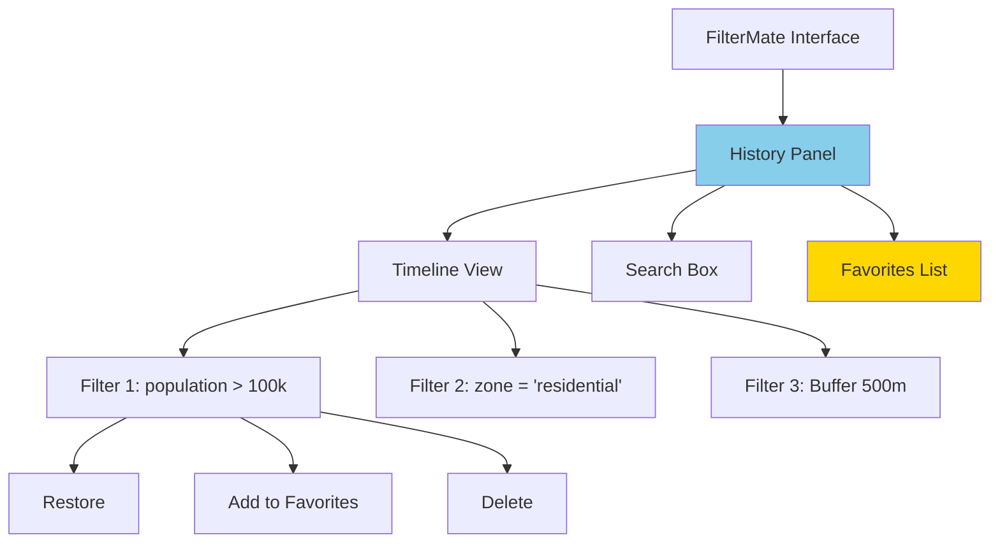
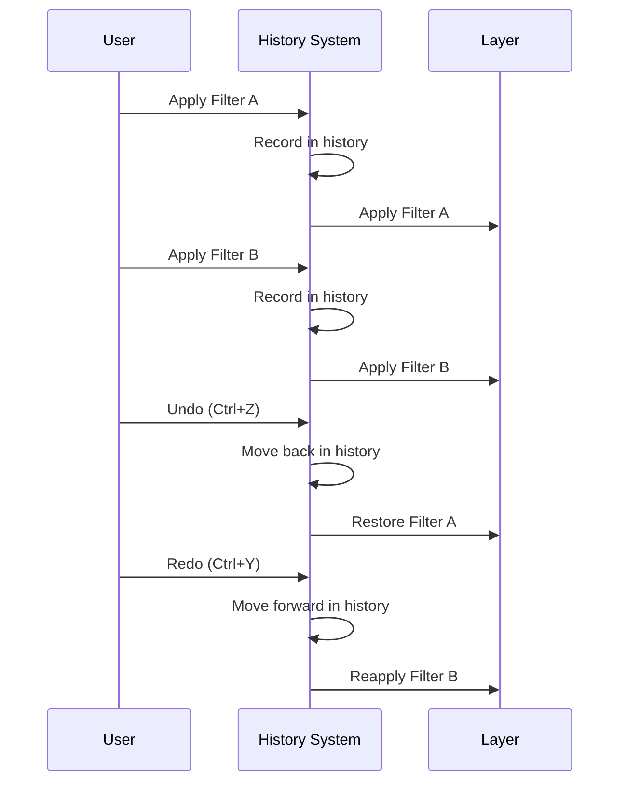
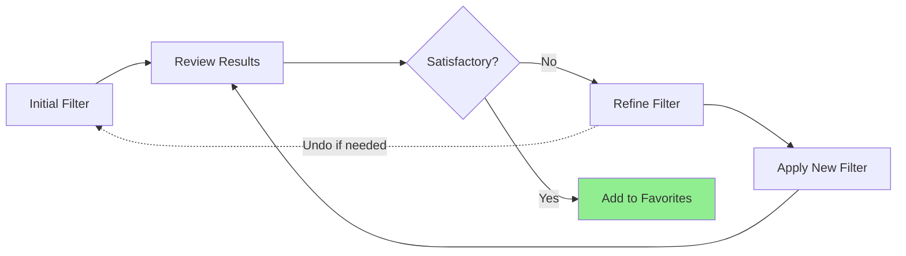

# Filter History

Track, manage, and reuse your filters with FilterMate's powerful history system featuring undo/redo capabilities.

## Overview

The **Filter History** system automatically records every filter you apply, allowing you to:
- **Undo/Redo** filters quickly
- **Review** past filter operations
- **Reuse** common filter patterns
- **Compare** different filter results
- **Save** favorite filters for later

### Key Features

- ✅ **Automatic History** - Every filter is recorded
- ✅ **Undo/Redo** - Navigate through filter states
- ✅ **Search** - Find past filters by expression
- ✅ **Favorites** - Bookmark frequently used filters
- ✅ **Export/Import** - Share filter configurations
- ✅ **Layer-Specific** - Separate history per layer

## History Interface



### Panel Components

1. **Timeline View** - Chronological list of filters
2. **Search Box** - Find filters by keyword or expression
3. **Current Filter Indicator** - Highlights active filter
4. **Favorites Section** - Quick access to saved filters
5. **Undo/Redo Buttons** - Navigate filter history

## Using Filter History

### Undo/Redo Filters

**Keyboard Shortcuts:**
- **Undo**: `Ctrl+Z` (Windows/Linux) or `Cmd+Z` (Mac)
- **Redo**: `Ctrl+Y` or `Ctrl+Shift+Z`

**Button Actions:**
1. Click **Undo** button (⟲) to revert to previous filter
2. Click **Redo** button (⟳) to reapply undone filter

**Example Workflow:**
```
1. Apply filter: population > 100000
   → 1,234 features shown

2. Apply filter: population > 100000 AND zone = 'residential'
   → 856 features shown

3. Undo (Ctrl+Z)
   → Back to 1,234 features (first filter restored)

4. Redo (Ctrl+Y)
   → Returns to 856 features (second filter reapplied)
```

### History Navigation



## History Management

### Timeline View

The **Timeline** shows all filters chronologically:

```
┌─────────────────────────────────────┐
│  Filter History - parcels_layer     │
├─────────────────────────────────────┤
│ ⭐ [14:23] zone = 'commercial'     │ ← Favorite
│ ▶ [14:15] population > 50000        │ ← Current
│   [14:10] area > 10000              │
│   [14:05] status = 'active'         │
│   [14:00] No filter (all features)  │
└─────────────────────────────────────┘
```

**Icons:**
- ⭐ **Favorite** - Saved for quick access
- ▶ **Current** - Active filter
- 🔍 **Complex** - Multi-condition expression
- 📍 **Spatial** - Geometric filter

### Search History

Find past filters using keywords:

```
Search: "population"

Results:
  [14:15] population > 50000
  [Yesterday] population BETWEEN 10000 AND 100000
  [2024-12-05] population > 100000 AND density > 50
```

**Search Tips:**
- Search by expression fragments
- Search by date/time
- Search by feature count
- Use wildcards: `pop*` matches `population`

### Managing History Items

**Right-Click Menu:**
- **Restore** - Apply this filter
- **Add to Favorites** ⭐ - Bookmark for quick access
- **Copy Expression** - Copy filter text
- **Edit** - Modify filter before applying
- **Delete** - Remove from history
- **Export** - Save to file

## Favorites System

### Creating Favorites

**Method 1: From History**
1. Right-click any history item
2. Select **Add to Favorites**
3. Enter a descriptive name
4. (Optional) Add tags for organization

**Method 2: From Current Filter**
1. Apply a filter
2. Click **⭐ Add to Favorites** button
3. Name and tag the filter

**Example Favorites:**
```
⭐ Large Parcels
   Expression: area > 10000

⭐ Recent Buildings
   Expression: year_built >= 2020

⭐ Transit Coverage
   Expression: distance($geometry, @transit_stations) < 400

⭐ High Priority Sites
   Expression: priority = 'high' AND status != 'complete'
```

### Using Favorites

**Quick Access:**
1. Open **Favorites** panel
2. Double-click favorite to apply
3. Or drag-and-drop onto layer

**Keyboard Shortcuts:**
- `Ctrl+1` through `Ctrl+9` - Apply favorite 1-9
- `Ctrl+F` - Open favorites panel

### Organizing Favorites

**Tags:**
```
Urban Planning
  ⭐ Large Parcels
  ⭐ Mixed Use Zones
  ⭐ Development Opportunities

Environmental
  ⭐ Protected Areas
  ⭐ Riparian Buffers
  ⭐ Wetland Proximity

Analysis
  ⭐ Transit Coverage
  ⭐ Service Gaps
  ⭐ High Density Areas
```

**Sort Options:**
- By name (A-Z)
- By usage frequency
- By date created
- By custom order (drag-and-drop)

## History Workflow

### Iterative Refinement



**Example:**
```
Step 1: zone = 'residential'
        → Too broad (10,000 features)

Step 2: zone = 'residential' AND area > 5000
        → Better (3,200 features)

Step 3: zone = 'residential' AND area > 5000 AND year_built > 2000
        → Perfect (1,200 features) ⭐ Add to Favorites
```

### Comparison Workflow

Compare different filter approaches:

```
Approach A: Attribute-based
  population > 100000
  → 45 features

Undo (Ctrl+Z)

Approach B: Spatial-based
  distance($geometry, @center) < 10000
  → 62 features

Undo (Ctrl+Z)

Approach C: Combined
  population > 50000 AND distance($geometry, @center) < 10000
  → 38 features ✓ Best balance
```

## Practical Examples

### Urban Planning Session

```
Morning Session:
  [09:15] No filter (all parcels)
  [09:30] zone = 'commercial' ⭐ Saved
  [09:45] zone = 'commercial' AND available = 'yes'
  [10:00] zone = 'commercial' AND available = 'yes' AND area > 5000 ⭐ Saved
  
Afternoon Session:
  [14:00] Retrieved: "Commercial available >5000`"
  [14:30] Modified: + "AND price < 500000"
  [15:00] New favorite: "Affordable commercial sites" ⭐
```

### Environmental Analysis

```
Wetland Buffer Analysis:
  [10:00] All features
  [10:15] habitat_type = 'wetland'
  [10:30] + buffer 100m ⭐ "Wetland buffer 100m"
  [10:45] + buffer 300m ⭐ "Wetland buffer 300m"
  [11:00] Comparison: 100m vs 300m impact
  [11:15] Final: 300m buffer + restrictions ⭐
```

### Emergency Response

```
Evacuation Planning:
  [12:00] All buildings
  [12:05] intersects(@hazard_zone) ⭐ "Hazard zone buildings"
  [12:15] + occupancy > 50 ⭐ "High occupancy in hazard"
  [12:30] + NOT exits >= 3 ⭐ "Evacuation risk buildings"
  [12:45] Export results → Share with team
```

## History Persistence

### Automatic Saving

History is **automatically saved**:
- Every filter application is recorded
- History persists between sessions
- Separate history per layer
- Survives QGIS restart

### Storage Location

```
Windows: %APPDATA%/QGIS/QGIS3/profiles/default/FilterMate/history/
Linux:   ~/.local/share/QGIS/QGIS3/profiles/default/FilterMate/history/
Mac:     ~/Library/Application Support/QGIS/QGIS3/profiles/default/FilterMate/history/
```

### History Limits

**Default Settings:**
- Maximum history items: **100** per layer
- History retention: **30 days**
- Favorites: **Unlimited**

**Configurable:**
```python
# In FilterMate settings
max_history_items = 100
history_retention_days = 30
auto_cleanup = True
```

## Export/Import

### Export History

Share filter configurations with colleagues:

**Export Options:**
1. **Single Filter** - Right-click → Export
2. **Multiple Filters** - Select → Export Selected
3. **All History** - Export → All History
4. **Favorites Only** - Export → Favorites

**Export Format (JSON):**
```json
{
  "filter_history_export": {
    "version": "1.0",
    "layer": "parcels_layer",
    "filters": [
      {
        "expression": "zone = 'commercial' AND area > 5000",
        "timestamp": "2024-12-08T14:30:00",
        "feature_count": 1234,
        "favorite": true,
        "name": "Large Commercial Parcels",
        "tags": ["commercial", "planning"]
      }
    ]
  }
}
```

### Import History

Import filters from colleagues or backup:

1. **File → Import History**
2. Select `.json` file
3. Choose merge or replace
4. Confirm import

**Import Options:**
- **Merge** - Add to existing history
- **Replace** - Clear and import
- **Favorites Only** - Import bookmarks only

## Best Practices

### 1. Name Favorites Clearly

```
✅ Good:
  "Commercial parcels >5000` sqm"
  "Residential near transit `<400m`"
  "High-priority incomplete projects"

❌ Bad:
  "Filter 1"
  "Test"
  "Temp filter"
```

### 2. Use Tags Effectively

```
Tags: "commercial", "planning", "large-parcels"
Tags: "environmental", "protected", "analysis"
Tags: "emergency", "evacuation", "high-risk"
```

### 3. Clean Up Regularly

- Delete experimental filters
- Archive old sessions
- Export important workflows
- Keep favorites organized

### 4. Document Complex Filters

Add comments to favorites:
```
Name: "Development Opportunities"
Expression: zone = 'mixed-use' AND area > 10000 AND NOT protected
Comment: "Large mixed-use parcels outside protected areas.
          Used for quarterly development opportunity analysis."
Tags: "planning", "development", "quarterly-report"
```

## Keyboard Shortcuts

| Action | Windows/Linux | Mac |
|--------|---------------|-----|
| Undo | `Ctrl+Z` | `Cmd+Z` |
| Redo | `Ctrl+Y` | `Cmd+Y` |
| Open History | `Ctrl+H` | `Cmd+H` |
| Open Favorites | `Ctrl+F` | `Cmd+F` |
| Add to Favorites | `Ctrl+D` | `Cmd+D` |
| Apply Favorite 1-9 | `Ctrl+1` to `Ctrl+9` | `Cmd+1` to `Cmd+9` |
| Search History | `Ctrl+Shift+F` | `Cmd+Shift+F` |

## Troubleshooting

### History Not Saving

**Solutions:**
1. Check write permissions in history folder
2. Verify QGIS profile path
3. Check disk space
4. Reset history database

### Missing History Items

**Causes:**
- History limit reached (default 100 items)
- Retention period expired (default 30 days)
- Manual deletion

**Solutions:**
- Increase history limit in settings
- Export important filters to favorites
- Regular backups

### Undo/Redo Not Working

**Check:**
1. History is enabled in settings
2. Layer has filter history
3. Not at beginning/end of history
4. QGIS not in edit mode

## Related Topics

- [Filtering Basics](filtering-basics.md) - Create filters to add to history
- [Interface Overview](interface-overview.md) - Navigate the UI
