# Filter History & Undo/Redo

FilterMate v2.3.0 features an intelligent history system with context-aware undo/redo capabilities.

:::info Version 2.3.0
This page documents the new Global Undo/Redo system introduced in v2.3.0. Previous versions had a simpler single-layer undo.
:::

## Overview

The **Filter History** system automatically records every filter you apply, allowing you to:
- **Undo/Redo** filters with intelligent context detection
- **Source Layer** or **Global** restoration based on your selection
- **Navigate** through filter states seamlessly
- **Preserve** filters automatically (combined with AND by default)

### Key Features

- ✅ **Automatic History** - Every filter is recorded (up to 100 states)
- ✅ **Intelligent Undo/Redo** - Context-aware layer restoration
- ✅ **Global Mode** - Restore multiple layers simultaneously
- ✅ **Source Mode** - Undo only the active layer
- ✅ **Smart Buttons** - Auto-enable/disable based on history availability
- ✅ **Layer-Specific** - Separate history per layer

## Undo/Redo Buttons

The Undo and Redo buttons are located in the **Action Bar** at the top of the FilterMate panel:

| Button | Icon | Action |
|--------|------|--------|
| **UNDO** | ↩️ | Revert to previous filter state |
| **REDO** | ↪️ | Reapply undone filter |

### Button States

Buttons **automatically enable/disable** based on history availability:
- **Enabled** (clickable): History available in that direction
- **Disabled** (grayed out): No history to navigate

## Two Undo/Redo Modes

FilterMate intelligently chooses between two modes based on your current configuration:

### 🎯 Source Layer Only Mode

**When activated:**
- The **"Layers to Filter"** button is **unchecked** OR
- No remote layers are selected

**Behavior:**
- Undo/Redo affects **only the source layer**
- Fast and simple for single-layer workflows


### 🌐 Global Mode

**When activated:**
- The **"Layers to Filter"** button is **checked** AND
- One or more remote layers are selected

**Behavior:**
- Undo/Redo restores **all affected layers simultaneously**
- Source layer + all remote layers are restored to their previous state

```mermaid
sequenceDiagram
    participant U as User
    participant H as History System
    participant S as Source Layer
    participant R1 as Remote Layer 1
    participant R2 as Remote Layer 2
    
    U->>H: Apply geometric filter (intersects)
    H->>S: Filter source (500 → 150 features)
    H->>R1: Filter remote 1 (1000 → 320 features)
    H->>R2: Filter remote 2 (800 → 210 features)
    
    U->>H: Global Undo
    H->>S: Restore (150 → 500 features)
    H->>R1: Restore (320 → 1000 features)
    H->>R2: Restore (210 → 800 features)
```



## How It Works

### State Capture

When you apply a filter, FilterMate captures:

**Source Layer History:**
- Filter expression (subset string)
- Feature count after filter
- Timestamp
- Operation metadata

**Global History (when remote layers selected):**
- Source layer state
- All remote layer states (expression + feature count)
- Combined snapshot for atomic restore

### Context Detection

FilterMate checks the UI state before each undo/redo:

```python
# Simplified logic
button_checked = "Layers to Filter" button is checked
has_remote_layers = remote layers are selected

if button_checked AND has_remote_layers:
    use_global_mode()  # Restore all layers
else:
    use_source_mode()  # Restore source only
```

## Example Workflows

### Single Layer Workflow

1. Select a layer in QGIS
2. Apply filter: `"population" > 10000` → 150 features
3. Apply filter: `"type" = 'residential'` → 45 features
4. Click **Undo** → Back to 150 features
5. Click **Undo** → Back to all features (no filter)
6. Click **Redo** → 150 features again

### Multi-Layer Workflow

1. Select source layer (e.g., "buildings")
2. Enable **"Layers to Filter"** button
3. Select remote layers: "parcels", "roads"
4. Apply geometric filter: intersects with selection
   - buildings: 500 → 150 features
   - parcels: 1000 → 320 features
   - roads: 800 → 210 features
5. Click **Undo** → **All 3 layers** restored simultaneously
6. Click **Redo** → **All 3 layers** filtered again

### Progressive Filtering with Preservation

:::tip Filter Preservation (v2.3.0)
New filters are automatically combined with existing filters using AND by default.
:::

```
Step 1: Geometric filter (intersects polygon)
        → Source: 150 features

Step 2: Attribute filter: "population" > 5000
        → Combined: (geometric) AND (population > 5000)
        → Source: 23 features

Step 3: Undo
        → Back to: 150 features (geometric only)

Step 4: Redo
        → Forward to: 23 features (combined)
```

## Configuration

### History Size

Default maximum history: **100 states** per layer

Configured in `modules/filter_history.py`:
```python
def __init__(self, layer_id: str, max_size: int = 100):
```

### Global History

Global history also stores up to 100 states for multi-layer operations.

## Technical Details

### FilterState Class

Represents a single filter state:
```python
class FilterState:
    expression: str      # Filter expression (subset string)
    feature_count: int   # Features visible after filter
    description: str     # Human-readable description
    timestamp: datetime  # When applied
    metadata: dict       # Additional info (backend, etc.)
```

### GlobalFilterState Class

Represents a multi-layer state:
```python
class GlobalFilterState:
    source_layer_id: str                    # Source layer ID
    source_expression: str                  # Source filter
    remote_layers: Dict[str, Tuple[str, int]]  # {layer_id: (expression, count)}
    timestamp: datetime                     # When captured
    description: str                        # Human-readable
```

### HistoryManager Class

Manages both single-layer and global history:
```python
class HistoryManager:
    - get_history(layer_id) -> FilterHistory
    - push_global_state(source_id, source_expr, remote_layers, desc)
    - undo_global() -> GlobalFilterState
    - redo_global() -> GlobalFilterState
    - can_undo_global() -> bool
    - can_redo_global() -> bool
```

## Troubleshooting

### Undo/Redo Buttons Disabled

**Cause:** No history available in that direction

**Solutions:**
- Apply at least one filter to enable Undo
- Undo at least once to enable Redo
- Check if you're at the beginning/end of history

### Global Undo Not Restoring All Layers

**Cause:** Remote layers may have been removed from project

**Solution:** FilterMate logs warnings for missing layers:
```
FilterMate: Remote layer {id} no longer exists, skipping
```

### History Lost After Reload

**Current behavior:** History is **in-memory only** and resets when:
- QGIS is closed
- Plugin is reloaded
- Project is changed

**Note:** Persistent history across sessions is a potential future enhancement.

## Best Practices

### 1. Use Global Mode for Multi-Layer Operations

When filtering multiple layers together, always:
1. Enable "Layers to Filter"
2. Select all affected remote layers
3. Apply filter once → all layers filtered
4. Use Global Undo to restore all at once

### 2. Progressive Refinement

Build complex filters step by step:
```
Step 1: Broad geometric filter
Step 2: Add attribute constraint
Step 3: Add another constraint
→ Each step recorded, easily reversible
```

### 3. Check Button States

Before clicking Undo/Redo:
- Enabled button = action available
- Disabled button = no history in that direction

### 4. Understand the Context

Before undoing:
- **Unchecked** "Layers to Filter" = source only undo
- **Checked** + remote layers = global undo (all layers)

## Related Topics

- [Filtering Basics](./filtering-basics.md) - Create filters
- [Geometric Filtering](./geometric-filtering.md) - Spatial operations
- [Interface Overview](./interface-overview.md) - Navigate the UI
