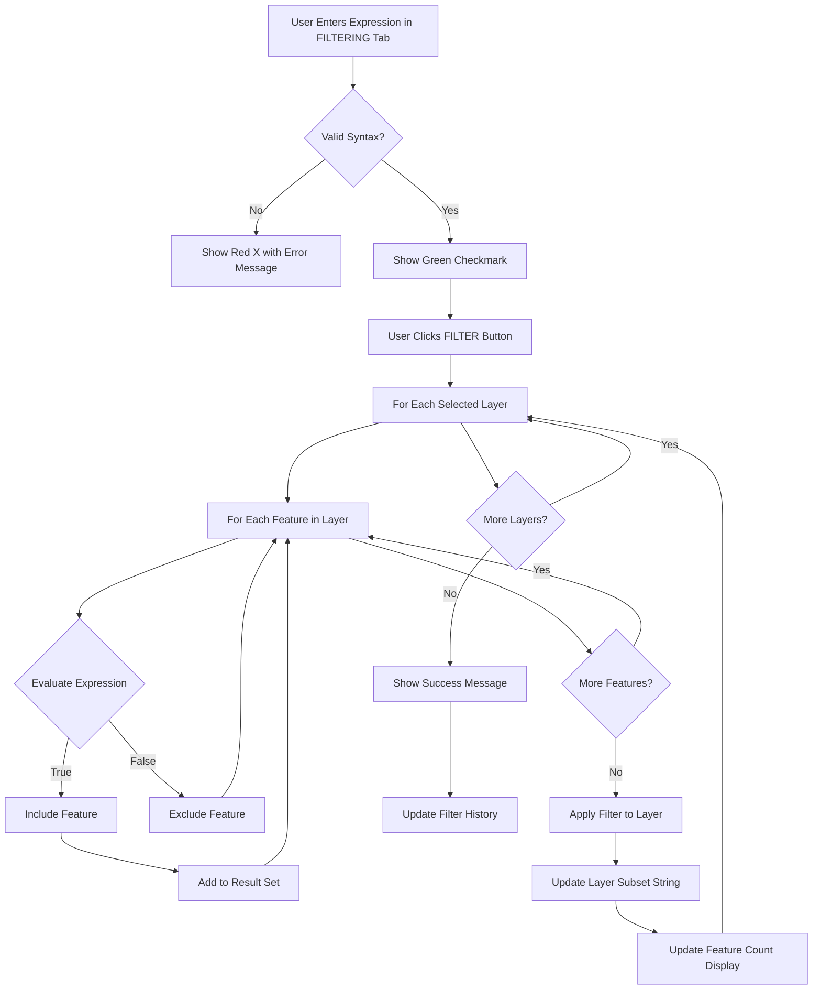

# Filtering Basics

Learn how to filter vector data using QGIS expressions and attribute conditions in FilterMate's **FILTERING** tab.

## Overview

The **FILTERING tab** is your central hub for configuring all types of filters on vector layers. It provides three main filtering capabilities:

1. **Attribute Filtering** - Filter features based on their attribute values using QGIS expressions
2. **Geometric Filtering** - Filter based on spatial relationships (covered in [Geometric Filtering](geometric-filtering.md))
3. **Buffer Operations** - Add proximity zones for spatial analysis (covered in [Buffer Operations](buffer-operations.md))

This page focuses on **attribute filtering** using QGIS expressions.

:::tip Location
All filtering operations are configured in the **FILTERING** tab at the top of the FilterMate panel. Don't confuse this with the EXPLORING tab, which works on the current active layer only.
:::

:::info Automatic Filter Preservation (v2.3.0)
FilterMate v2.3.0 automatically preserves existing filters when applying new ones. New filters are combined with the previous filter using the selected operator (AND by default). This prevents accidental filter loss when building complex queries step by step.

**Example:**
1. Apply geometric filter → 150 features
2. Apply attribute filter `"population" > 5000`
3. Result: `(geometric_filter) AND ("population" > 5000)` → 23 features

**Available Operators:**
- **AND** (default): Intersection of filters
- **OR**: Union of filters  
- **AND NOT**: Exclusion filter
:::

## FILTERING Tab Components

### Layer Selection

Before filtering, you must select one or more source layers:


*Multi-selection of layers with geometry type indicators (point/line/polygon)*

**Features**:
- **Multi-selection**: Check multiple layers to filter them simultaneously
- **Geometry icons**: Visual indication of layer type (🔵 Point, 🟢 Line, 🟪 Polygon)
- **Backend badges**: Shows data source type (PostgreSQL⚡, Spatialite, OGR)
- **Auto Current Layer**: Toggle button to automatically use QGIS's active layer


*Toggle "Auto Current Layer" mode*

When "Auto Current Layer" is enabled, FilterMate automatically selects whichever layer is active in QGIS, making quick filtering more convenient.

**Layer Information Display**:


*Layer information: provider type, feature count, CRS*

Shows critical layer details:
- Provider type (PostgreSQL, Spatialite, OGR)
- Total feature count
- Coordinate Reference System (CRS)
- Primary key field

### Expression Builder

FilterMate uses **QGIS expressions** to filter features. These expressions are evaluated against each feature's attributes to determine which features should be included in the result.


*Expression builder with free-text input*

**Key Features**:
- Free-text expression input
- Real-time syntax validation
- Access to all QGIS expression functions
- Field name autocomplete

**Field List**:

The field list shows:
- All attribute fields from selected layer(s)
- Data type for each field
- Clicking a field inserts it into the expression

### Expression Validation

FilterMate validates your expressions in real-time:

**Valid Expression**:
*Green checkmark (✓) indicates valid expression*

**Invalid Expression**:
*Red X (✗) with detailed error message*

Error messages show:
- Line and column of syntax error
- Description of the problem
- Suggestions for correction

## Key Concepts

- **Expression**: A formula that evaluates to `true` or `false` for each feature
- **Attribute**: A property of a feature (e.g., `population`, `name`, `area`)
- **Operator**: Comparison symbols like `=`, `>`, `<`, `LIKE`, `IN`
- **Function**: Built-in operations like `upper()`, `length()`, `year()`

## Expression Syntax

### Basic Comparisons

```sql
-- Numeric comparisons
population > 100000
area >= 50
year = 2024

-- Text comparisons (case-sensitive)
name = 'Paris'
status != 'inactive'

-- Text search (case-insensitive)
upper(name) LIKE '%CITY%'
name ILIKE 'paris'
```

### Multiple Conditions

```sql
-- AND: All conditions must be true
population > 50000 AND area < 100

-- OR: At least one condition must be true
type = 'city' OR type = 'town'

-- Complex combinations
(population > 100000 OR capital = 'yes') AND country = 'France'
```

### Working with NULL Values

```sql
-- Check for NULL
name IS NULL
description IS NOT NULL

-- Safe NULL handling
COALESCE(population, 0) > 0
```

## Common Filtering Patterns

### Text Filtering

#### Exact Match
```sql
-- Case-sensitive
city = 'Lyon'

-- Case-insensitive
upper(city) = 'LYON'
```

#### Pattern Matching
```sql
-- Starts with
name LIKE 'Saint%'

-- Contains (case-insensitive)
name ILIKE '%sur-mer%'

-- Ends with
name LIKE '%ville'

-- Multiple patterns
name LIKE 'Paris%' OR name LIKE 'Lyon%'
```

#### Multiple Values
```sql
-- IN operator
status IN ('active', 'pending', 'review')

-- NOT IN
country NOT IN ('France', 'Germany')
```

### Numeric Filtering

#### Range Queries
```sql
-- Between
population BETWEEN 10000 AND 50000

-- Equivalent to
population >= 10000 AND population <= 50000

-- Outside range
population NOT BETWEEN 10000 AND 50000
```

#### Arithmetic Operations
```sql
-- Calculated values
density > population / area

-- Percentage
(sales / target) * 100 > 80

-- Round values
round(area, 2) = 123.45
```

### Date Filtering

#### Basic Date Comparisons
```sql
-- Specific date
date = '2024-01-15'

-- Date range
date >= '2024-01-01' AND date < '2024-02-01'

-- Year
year(date) = 2024

-- Month
month(date) = 6
```

#### Relative Dates
```sql
-- Recent records
date >= now() - interval '7 days'

-- Last year
year(date) = year(now()) - 1

-- Current month
year(date) = year(now()) AND month(date) = month(now())
```

## String Functions

### Case Conversion
```sql
-- Uppercase
upper(name) = 'PARIS'

-- Lowercase
lower(name) = 'paris'
```

### String Operations
```sql
-- Concatenation
name || ' ' || country = 'Paris France'

-- Length
length(name) > 10

-- Substring
substr(code, 1, 2) = 'FR'

-- Trim whitespace
trim(name) = 'Lyon'
```

### Pattern Matching
```sql
-- Regular expression
regexp_match(name, '^[A-Z]{2}[0-9]{3}$')

-- Replace
replace(name, 'Saint', 'St') = 'St-Denis'
```

## Expression Flow

FilterMate processes expressions in several steps:



**Key Steps**:
1. **Expression Input**: Type or build expression in FILTERING tab
2. **Validation**: Real-time check for syntax errors (✓ or ✗)
3. **Apply Filter**: Click FILTER button to execute
4. **Processing**: Backend (PostgreSQL/Spatialite/OGR) evaluates expression
5. **Results**: Filtered features displayed, feature count updated
6. **History**: Filter saved to history for reuse

## Step-by-Step Filtering Workflow

### Complete Example: Filter Cities by Population

**Scenario**: Find all cities with population greater than 100,000

**Step 1 - Open FILTERING Tab**


*Switch to FILTERING tab in FilterMate panel*

**Step 2 - Select Source Layer**


- Check the "COMMUNE" layer in the layer selector
- Verify layer information is displayed (feature count, CRS)

**Step 3 - Enter Expression**


*Type expression: `population > 100000`*

**Step 4 - Verify Field List**

*Check available fields: population (Integer64), name (String), area (Double)*

You can click fields to insert them into the expression.

**Step 5 - Validate Expression**
<!--  confirms valid expression*

The validator shows:
- ✓ Syntax is correct
- Preview of estimated feature count (optional, if enabled)

**Step 6 - Apply Filter**


*Click FILTER button → Progress bar shows during processing*

**Step 7 - View Results**
<!-- 
3. **Type Compatibility**: Warns about type mismatches (e.g., comparing text to numbers)

**Visual Feedback**:
- ✅ **Green checkmark**: Expression is valid and ready to apply
- ❌ **Red X**: Syntax error detected, see error message
- ⚠️ **Orange warning**: Expression valid but may have performance issues

### Testing Against Sample Features

For complex expressions, you can test against real data:

1. Enable "Expression Preview" in Configuration tab
2. Expression builder shows how many features match
3. Adjust expression based on preview results

:::tip
For very large layers (&>;100k features), preview might be disabled for performance. In this case, apply the filter and check the result count.
:::

### Common Errors

#### Syntax Errors
```sql
-- ❌ Wrong: Missing quotes around text
name = Paris

-- ✅ Correct: Text in quotes
name = 'Paris'

-- ❌ Wrong: Unbalanced parentheses
(population > 1000 AND area < 50

-- ✅ Correct: Balanced parentheses
(population > 1000 AND area < 50)
```

**FilterMate shows**: "Syntax error at column 11: expected ')'"

#### Type Mismatches
```sql
-- ❌ Wrong: Comparing text field to number
name > 100

-- ✅ Correct: Convert to number if needed
to_int(name) > 100

-- ❌ Wrong: Using numeric operator on text
city_code + 100

-- ✅ Correct: Concatenate as text
city_code || '100'
```

**FilterMate shows**: "Type error: cannot compare String and Integer"

#### NULL Handling
```sql
-- ❌ Wrong: NULL comparisons always return false
population = NULL

-- ✅ Correct: Use IS NULL
population IS NULL

-- ❌ Wrong: NULL in arithmetic breaks calculation
population + income > 50000

-- ✅ Correct: Handle NULL explicitly
COALESCE(population, 0) + COALESCE(income, 0) > 50000
```

**FilterMate shows**: "Warning: Expression may return unexpected results with NULL values"

#### Field Name Errors
```sql
-- ❌ Wrong: Field doesn't exist
popilation > 1000  -- Typo!

-- ✅ Correct: Use field list to avoid typos
population > 1000

-- ❌ Wrong: Field name with spaces, no quotes
Population 2024 > 1000

-- ✅ Correct: Quote field names with spaces
"Population 2024" > 1000
```

**FilterMate shows**: "Field 'popilation' not found in layer"

### Debugging Tips

1. **Start Simple**: Build complex expressions incrementally
   ```sql
   -- Step 1: Test basic comparison
   population > 100000
   
   -- Step 2: Add second condition
   population > 100000 AND area > 50
   
   -- Step 3: Add third condition
   population > 100000 AND area > 50 AND status = 'active'
   ```

2. **Use Field List**: Click fields to insert them correctly
   - Avoids typos
   - Handles special characters automatically
   - Adds proper quotes for field names with spaces

3. **Check Data Types**: View field list to see data types
   - Integer64: Use numeric comparisons (`>`, `<`, `=`)
   - String: Use text functions (`LIKE`, `upper()`, `||`)
   - Date: Use date functions (`year()`, `month()`, `age()`)

4. **Test on Small Subset First**: 
   - Add `LIMIT` clause for testing: `population > 100000 LIMIT 10`
   - Remove LIMIT once expression is validated

## Best Practices

### Performance Tips

1. **Index-Friendly Expressions**
   ```sql
   -- ✅ Good: Uses index
   population > 100000
   
   -- ❌ Slow: Prevents index use
   population * 2 > 200000
   ```

2. **Avoid Complex Functions on Large Datasets**
   ```sql
   -- ✅ Fast: Simple comparison
   year = 2024
   
   -- ⚠️ Slower: Function call per feature
   year(date) = 2024
   ```

3. **Filter Early**
   - Apply simple filters first
   - Use geometric filters after attribute filters
   - Combine conditions efficiently

### Readability

1. **Use Clear Column Names**
   ```sql
   -- ✅ Clear
   "Population 2024" > 100000
   
   -- ❌ Unclear
   "col_23" > 100000
   ```

2. **Format Complex Expressions**
   ```sql
   -- Multi-line for readability
   (
       status = 'active'
       AND population > 50000
   )
   OR (
       status = 'pending'
       AND priority = 'high'
   )
   ```

3. **Comment Complex Logic**
   ```sql
   -- Large cities or regional capitals
   population > 100000 OR capital = 'regional'
   ```

## Practical Examples

### Urban Planning
```sql
-- High-density residential areas
zone = 'residential' AND density > 100 AND year_built >= 2000

-- Mixed-use development opportunities
(zone = 'commercial' OR zone = 'mixed') AND available_area > 1000
```

### Environmental Analysis
```sql
-- Protected natural areas above 50 hectares
protection_status = 'protected' AND area >= 500000 AND habitat_type IN ('forest', 'wetland')

-- Water bodies with quality issues
water_type IN ('river', 'lake') AND quality_index < 60
```

### Transportation
```sql
-- Major roads needing maintenance
road_class IN ('highway', 'major') AND condition = 'poor' AND traffic_count > 10000

-- Transit stops in underserved areas
service_frequency < 4 AND population_nearby > 5000
```

## Related Topics

- [Geometric Filtering](geometric-filtering.md) - Spatial predicates and reference layers in FILTERING tab
- [Buffer Operations](buffer-operations.md) - Add proximity zones in FILTERING tab
- [Interface Overview](interface-overview.md) - Complete FILTERING tab component guide
- [Filter History](filter-history.md) - Manage and reuse saved filters

## Next Steps

Now that you understand attribute filtering in the FILTERING tab, learn about:

1. **[Geometric Filtering](geometric-filtering.md)** - Add spatial predicates to find features based on location
2. **[Buffer Operations](buffer-operations.md)** - Create proximity zones for spatial analysis
3. **[Export Features](export-features.md)** - Save your filtered results to various formats

**Complete Workflow**: See [Quick Start Guide](../getting-started/quick-start.md) for a step-by-step filtering example.
