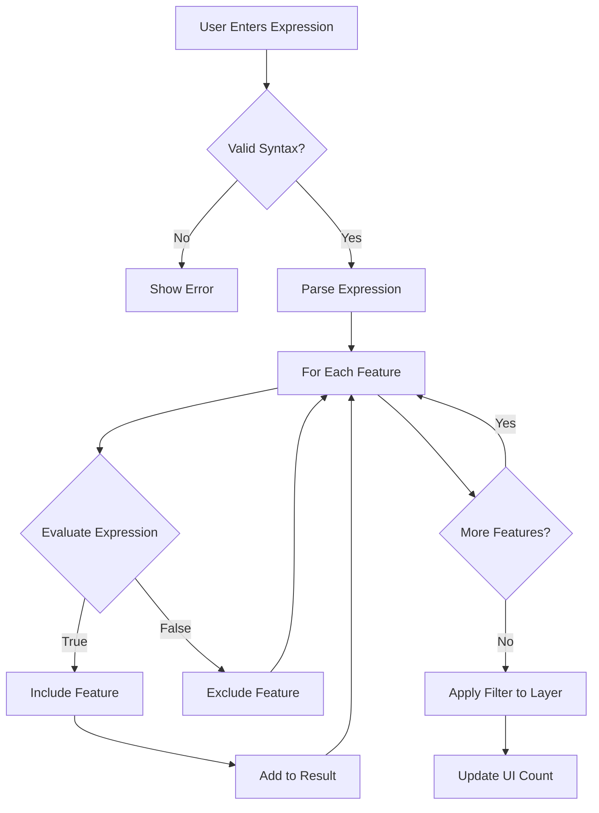

# Filtering Basics

Learn how to filter vector data using QGIS expressions and attribute conditions in FilterMate.

## Overview

FilterMate uses **QGIS expressions** to filter features. These expressions are evaluated against each feature's attributes to determine which features should be included in the result.

### Key Concepts

- **Expression**: A formula that evaluates to `true` or `false` for each feature
- **Attribute**: A property of a feature (e.g., `population`, `name`, `area`)
- **Operator**: Comparison symbols like `=`, `>`, `<`, `LIKE`, `IN`
- **Function**: Built-in operations like `upper()`, `length()`, `year()`

## Expression Syntax

### Basic Comparisons

```sql
-- Numeric comparisons
population > 100000
area >= 50
year = 2024

-- Text comparisons (case-sensitive)
name = 'Paris'
status != 'inactive'

-- Text search (case-insensitive)
upper(name) LIKE '%CITY%'
name ILIKE 'paris'
```

### Multiple Conditions

```sql
-- AND: All conditions must be true
population > 50000 AND area < 100

-- OR: At least one condition must be true
type = 'city' OR type = 'town'

-- Complex combinations
(population > 100000 OR capital = 'yes') AND country = 'France'
```

### Working with NULL Values

```sql
-- Check for NULL
name IS NULL
description IS NOT NULL

-- Safe NULL handling
COALESCE(population, 0) > 0
```

## Common Filtering Patterns

### Text Filtering

#### Exact Match
```sql
-- Case-sensitive
city = 'Lyon'

-- Case-insensitive
upper(city) = 'LYON'
```

#### Pattern Matching
```sql
-- Starts with
name LIKE 'Saint%'

-- Contains (case-insensitive)
name ILIKE '%sur-mer%'

-- Ends with
name LIKE '%ville'

-- Multiple patterns
name LIKE 'Paris%' OR name LIKE 'Lyon%'
```

#### Multiple Values
```sql
-- IN operator
status IN ('active', 'pending', 'review')

-- NOT IN
country NOT IN ('France', 'Germany')
```

### Numeric Filtering

#### Range Queries
```sql
-- Between
population BETWEEN 10000 AND 50000

-- Equivalent to
population >= 10000 AND population <= 50000

-- Outside range
population NOT BETWEEN 10000 AND 50000
```

#### Arithmetic Operations
```sql
-- Calculated values
density > population / area

-- Percentage
(sales / target) * 100 > 80

-- Round values
round(area, 2) = 123.45
```

### Date Filtering

#### Basic Date Comparisons
```sql
-- Specific date
date = '2024-01-15'

-- Date range
date >= '2024-01-01' AND date < '2024-02-01'

-- Year
year(date) = 2024

-- Month
month(date) = 6
```

#### Relative Dates
```sql
-- Recent records
date >= now() - interval '7 days'

-- Last year
year(date) = year(now()) - 1

-- Current month
year(date) = year(now()) AND month(date) = month(now())
```

## String Functions

### Case Conversion
```sql
-- Uppercase
upper(name) = 'PARIS'

-- Lowercase
lower(name) = 'paris'
```

### String Operations
```sql
-- Concatenation
name || ' ' || country = 'Paris France'

-- Length
length(name) > 10

-- Substring
substr(code, 1, 2) = 'FR'

-- Trim whitespace
trim(name) = 'Lyon'
```

### Pattern Matching
```sql
-- Regular expression
regexp_match(name, '^[A-Z]{2}[0-9]{3}$')

-- Replace
replace(name, 'Saint', 'St') = 'St-Denis'
```

## Expression Flow



## Testing Expressions

### Expression Builder

FilterMate integrates with QGIS's expression builder:

1. Click the **Expression** button (ε symbol)
2. Test expressions against sample features
3. See real-time preview of results
4. View function documentation

### Common Errors

#### Syntax Errors
```sql
-- ❌ Wrong: Missing quotes
name = Paris

-- ✅ Correct: Text in quotes
name = 'Paris'
```

#### Type Mismatches
```sql
-- ❌ Wrong: Comparing text to number
name > 100

-- ✅ Correct: Convert to number
to_int(name) > 100
```

#### NULL Handling
```sql
-- ❌ Wrong: NULL comparisons always false
population = NULL

-- ✅ Correct: Use IS NULL
population IS NULL
```

## Best Practices

### Performance Tips

1. **Index-Friendly Expressions**
   ```sql
   -- ✅ Good: Uses index
   population > 100000
   
   -- ❌ Slow: Prevents index use
   population * 2 > 200000
   ```

2. **Avoid Complex Functions on Large Datasets**
   ```sql
   -- ✅ Fast: Simple comparison
   year = 2024
   
   -- ⚠️ Slower: Function call per feature
   year(date) = 2024
   ```

3. **Filter Early**
   - Apply simple filters first
   - Use geometric filters after attribute filters
   - Combine conditions efficiently

### Readability

1. **Use Clear Column Names**
   ```sql
   -- ✅ Clear
   "Population 2024" > 100000
   
   -- ❌ Unclear
   "col_23" > 100000
   ```

2. **Format Complex Expressions**
   ```sql
   -- Multi-line for readability
   (
       status = 'active'
       AND population > 50000
   )
   OR (
       status = 'pending'
       AND priority = 'high'
   )
   ```

3. **Comment Complex Logic**
   ```sql
   -- Large cities or regional capitals
   population > 100000 OR capital = 'regional'
   ```

## Practical Examples

### Urban Planning
```sql
-- High-density residential areas
zone = 'residential' AND density > 100 AND year_built >= 2000

-- Mixed-use development opportunities
(zone = 'commercial' OR zone = 'mixed') AND available_area > 1000
```

### Environmental Analysis
```sql
-- Protected natural areas above 50 hectares
protection_status = 'protected' AND area >= 500000 AND habitat_type IN ('forest', 'wetland')

-- Water bodies with quality issues
water_type IN ('river', 'lake') AND quality_index < 60
```

### Transportation
```sql
-- Major roads needing maintenance
road_class IN ('highway', 'major') AND condition = 'poor' AND traffic_count > 10000

-- Transit stops in underserved areas
service_frequency < 4 AND population_nearby > 5000
```

## Related Topics

- [Geometric Filtering](geometric-filtering.md) - Spatial predicates
- [Advanced Features](advanced-features.md) - Complex expressions
- [Filter History](filter-history.md) - Manage and reuse filters
- [Backend Selection](../backends/backend-selection.md) - Performance optimization

## Next Steps

Now that you understand attribute filtering, learn about:
- **[Geometric Filtering](geometric-filtering.md)** - Spatial relationships
- **[Buffer Operations](buffer-operations.md)** - Proximity analysis
- **[Export Features](export-features.md)** - Save filtered results
