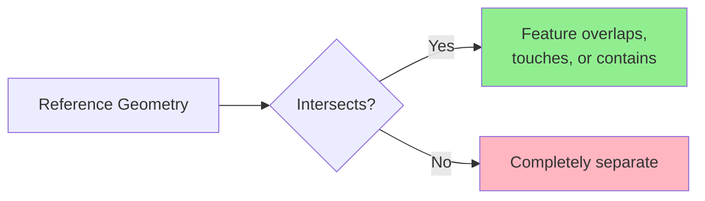
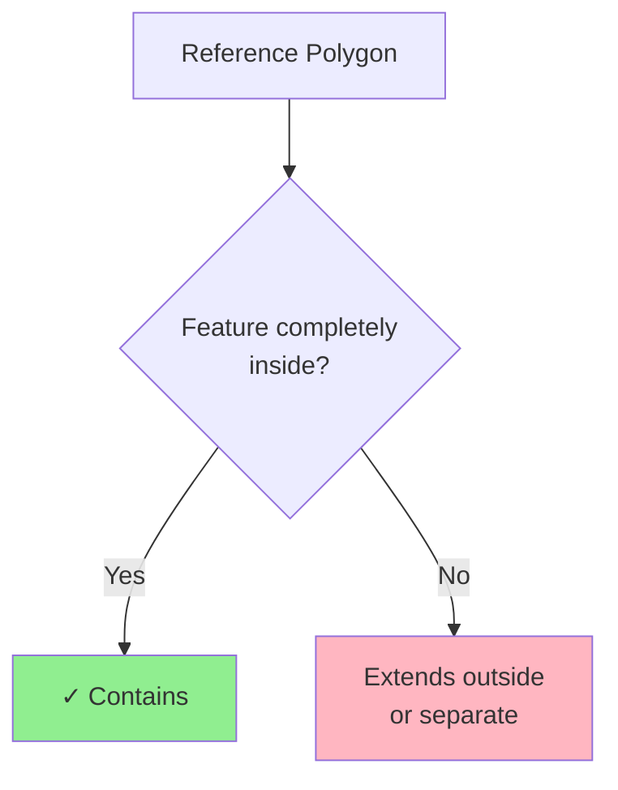
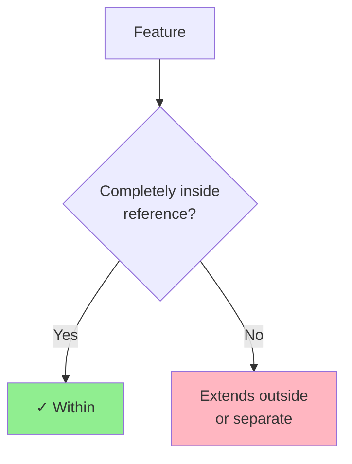
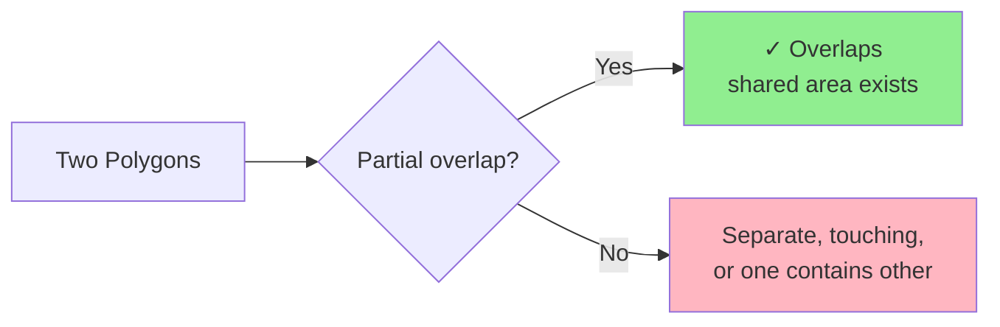
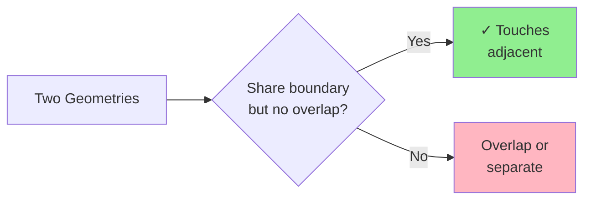
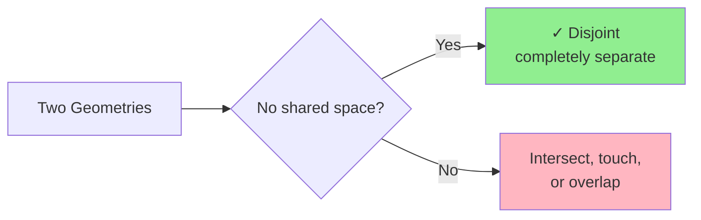
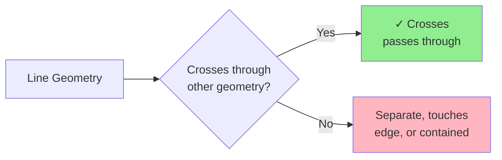
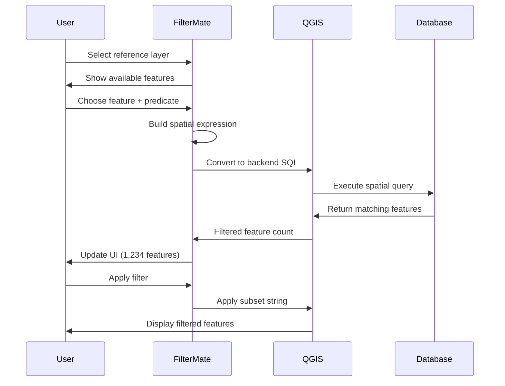

# Geometric Filtering

Filter features based on their spatial relationships with other geometries using geometric predicates.

## Overview

Geometric filtering allows you to select features based on their **spatial relationships** with:
- Other features in the same layer
- Features from a different layer
- A manually drawn geometry
- A buffered geometry

### Common Use Cases

- **Containment**: Find parcels within a municipality
- **Intersection**: Identify roads crossing a floodplain
- **Proximity**: Select buildings near a transit station
- **Adjacency**: Find neighboring polygons

## Spatial Predicates

### Intersects

Features that **share any space** with the reference geometry.



**Example Use Cases:**
- Roads crossing a district
- Properties touching a river
- Parcels within or overlapping a zone

**Expression:**
```sql
intersects($geometry, geometry(get_feature('zones', 'id', 1)))
```

### Contains

Reference geometry **completely contains** the feature (feature is entirely inside).



**Example Use Cases:**
- Buildings entirely within a parcel
- Parks completely inside city limits
- Points inside polygons

**Expression:**
```sql
contains(
    geometry(get_feature('parcels', 'id', @selected_parcel_id)),
    $geometry
)
```

### Within

Feature is **completely inside** the reference geometry (inverse of Contains).



**Example Use Cases:**
- Find which district a point is in
- Properties entirely within a zone
- Features contained by a boundary

**Expression:**
```sql
within($geometry, geometry(get_feature('districts', 'name', 'Downtown')))
```

### Overlaps

Features that **partially overlap** (some shared area, but neither contains the other).



**Example Use Cases:**
- Overlapping land use zones
- Conflicting property claims
- Intersecting administrative boundaries

**Expression:**
```sql
overlaps($geometry, geometry(get_feature('zones', 'type', 'commercial')))
```

### Touches

Features that **share a boundary** but don't overlap.



**Example Use Cases:**
- Adjacent parcels
- Neighboring administrative units
- Connected road segments

**Expression:**
```sql
touches($geometry, geometry(get_feature('parcels', 'id', @parcel_id)))
```

### Disjoint

Features that **don't share any space** (completely separate).



**Example Use Cases:**
- Features outside a restricted area
- Non-adjacent regions
- Isolated features

**Expression:**
```sql
disjoint($geometry, geometry(get_feature('restricted', 'id', 1)))
```

### Crosses

A line **crosses through** a polygon or another line.



**Example Use Cases:**
- Roads crossing district boundaries
- Pipelines passing through zones
- Trails intersecting rivers

**Expression:**
```sql
crosses($geometry, geometry(get_feature('districts', 'name', 'Industrial')))
```

## Geometric Functions

### Distance Calculations

```sql
-- Features within 500 meters
distance($geometry, geometry(get_feature('stations', 'id', 1))) < 500

-- Find nearest features
distance($geometry, @reference_geom) < @max_distance
```

### Area and Length

```sql
-- Large polygons (area in map units)
area($geometry) > 10000

-- Long roads (length in map units)
length($geometry) > 1000

-- Perimeter
perimeter($geometry) > 500
```

### Centroid Operations

```sql
-- Features whose centroid is in a polygon
within(
    centroid($geometry),
    geometry(get_feature('zones', 'type', 'residential'))
)

-- Distance from centroid
distance(
    centroid($geometry),
    make_point(lon, lat)
) < 1000
```

## Combining Filters

### Spatial + Attribute

```sql
-- Residential buildings near transit
zone_type = 'residential'
AND distance($geometry, geometry(get_feature('transit', 'id', 1))) < 500
```

### Multiple Spatial Conditions

```sql
-- Within district but not in restricted zone
within($geometry, geometry(get_feature('districts', 'id', 5)))
AND disjoint($geometry, geometry(get_feature('restricted', 'id', 1)))
```

### Complex Scenarios

```sql
-- Properties near river but outside floodplain
distance($geometry, geometry(get_feature('rivers', 'name', 'Main River'))) < 200
AND NOT within($geometry, geometry(get_feature('floodplain', 'risk', 'high')))
AND property_type = 'residential'
```

## Workflow Example



## Backend-Specific Behavior

### PostgreSQL (Fastest)

```sql
-- Uses GIST spatial index
ST_Intersects(geometry, reference_geometry)
```

- ✅ Full spatial index support
- ✅ Optimized for large datasets
- ✅ Hardware acceleration

### Spatialite (Fast)

```sql
-- Uses R-tree spatial index
ST_Intersects(geometry, reference_geometry)
```

- ✅ R-tree spatial index
- ✅ Good performance for medium datasets
- ⚠️ Slower than PostgreSQL for complex queries

### OGR (Fallback)

```sql
-- No spatial index
-- Scans all features
```

- ❌ No spatial index
- ⚠️ Performance degrades with size
- ✓ Universal compatibility

:::tip Performance Tip
For large datasets with frequent spatial queries, use **PostgreSQL** with GIST indexes for best performance.
:::

## Practical Examples

### Urban Planning

#### Find Parcels Near Transit
```sql
-- Within 400m walking distance
distance(
    centroid($geometry),
    geometry(get_feature('metro_stations', 'line', 'Red'))
) < 400
AND land_use = 'undeveloped'
```

#### Identify Development Opportunities
```sql
-- Large parcels, not in protected areas
area($geometry) > 5000
AND disjoint($geometry, geometry(get_feature('protected_areas', 'status', 'active')))
AND zone = 'mixed-use'
```

### Environmental Analysis

#### Protected Areas Impact
```sql
-- Projects intersecting protected zones
intersects(
    $geometry,
    geometry(get_feature('protected', 'category', 'wildlife'))
)
AND project_status = 'proposed'
```

#### Watershed Analysis
```sql
-- Properties within watershed
within(
    $geometry,
    geometry(get_feature('watersheds', 'name', 'Main Watershed'))
)
AND distance($geometry, geometry(get_feature('rivers', 'id', 1))) < 100
```

### Emergency Services

#### Coverage Analysis
```sql
-- Areas NOT covered by fire stations (>5km)
distance(
    centroid($geometry),
    aggregate('fire_stations', 'collect', $geometry)
) > 5000
```

#### Evacuation Routes
```sql
-- Roads within evacuation zone
intersects(
    $geometry,
    buffer(geometry(get_feature('hazard', 'type', 'flood')), 1000)
)
AND road_type IN ('highway', 'major')
```

## Performance Optimization

### 1. Use Spatial Indexes

Ensure spatial indexes exist:

**PostgreSQL:**
```sql
CREATE INDEX idx_geom ON table_name USING GIST (geometry);
```

**Spatialite:**
```sql
SELECT CreateSpatialIndex('table_name', 'geometry');
```

### 2. Simplify Reference Geometries

```sql
-- Simplify before filtering (faster)
intersects(
    $geometry,
    simplify(geometry(get_feature('complex_polygon', 'id', 1)), 10)
)
```

### 3. Filter Attributes First

```sql
-- ✅ Fast: Filter by attribute first
status = 'active'
AND intersects($geometry, @reference_geom)

-- ❌ Slower: Spatial filter first
intersects($geometry, @reference_geom)
AND status = 'active'
```

### 4. Use Bounding Box Checks

```sql
-- Fast bounding box check before expensive spatial operation
bbox($geometry, @reference_geom)
AND intersects($geometry, @reference_geom)
```

## Troubleshooting

### Invalid Geometries

```sql
-- Check geometry validity
is_valid($geometry)

-- Repair invalid geometries (if needed)
make_valid($geometry)
```

### Empty Results

1. **Check CRS compatibility** - Ensure layers use compatible projections
2. **Verify reference geometry** - Confirm reference feature exists
3. **Test simpler predicates** - Try `intersects` before `contains`
4. **Inspect geometries** - Check for NULL or invalid geometries

### Performance Issues

1. **Verify spatial indexes** - Check indexes exist and are up-to-date
2. **Simplify geometries** - Reduce vertex count if possible
3. **Use appropriate backend** - PostgreSQL for large datasets
4. **Break complex queries** - Split into multiple simpler filters

## Related Topics

- [Buffer Operations](buffer-operations.md) - Proximity analysis
- [Filtering Basics](filtering-basics.md) - Attribute filtering
- [Backend Performance](../backends/performance-comparison.md) - Optimization strategies
- [Advanced Features](advanced-features.md) - Complex spatial operations

## Next Steps

- **[Buffer Operations](buffer-operations.md)** - Create and filter with buffers
- **[Export Features](export-features.md)** - Save filtered results
- **[Backend Selection](../backends/backend-selection.md)** - Optimize spatial queries
