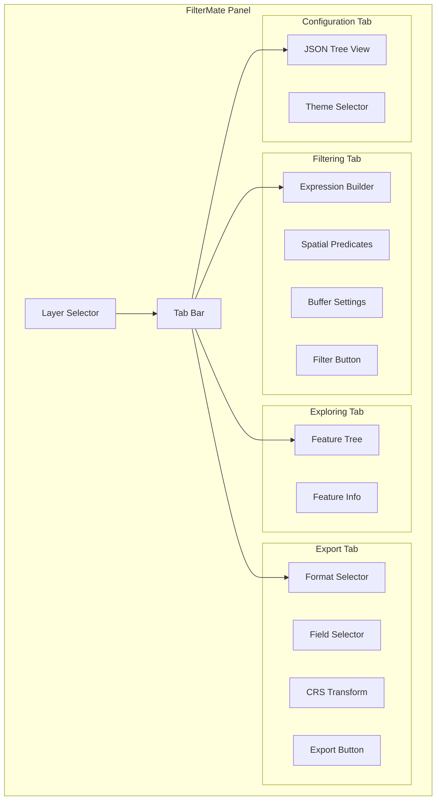

# Interface Overview

Complete guide to FilterMate's user interface and main components.

## Main Interface

FilterMate provides a dockable panel that integrates seamlessly with QGIS.

### Opening FilterMate

1. **Menu:** Vector → FilterMate
2. **Toolbar:** Click FilterMate icon
3. **Keyboard:** (customizable in QGIS settings)

### Dockable Panel

The panel can be:
- 🔒 **Docked** to any side of QGIS window
- 💬 **Floating** as a separate window
- ⏸️ **Hidden** when not in use (reopenable from menu)

## Interface Layout



## Layer Selector

### Features

- 📋 **Multi-selection:** Filter multiple layers at once
- 🔍 **Search:** Quick layer filtering
- 🎨 **Icons:** Geometry type indicators
  - 🔵 Point layers
  - 🟢 Line layers
  - 🟪 Polygon layers

### Usage

```
☑ Layer 1 (Polygon) — PostgreSQL ⚡
☑ Layer 2 (Point) — Spatialite
☐ Layer 3 (Line) — Shapefile
```

**Backend Indicators:**
- ⚡ PostgreSQL (high performance)
- 📦 Spatialite (medium performance)
- 📄 OGR (universal compatibility)

## Filtering Tab

### 1. Expression Builder

**Attribute Filtering:**
```sql
population > 100000
name LIKE '%Park%'
area BETWEEN 1000 AND 5000
```

**QGIS Expression Support:**
- Standard SQL operators
- QGIS expression functions
- Field name completion

### 2. Spatial Predicates

**Available Predicates:**
- ✅ **Intersects:** Geometries overlap
- 📦 **Contains:** Source contains target
- 🎯 **Within:** Target within source
- ❌ **Disjoint:** No overlap
- ♾️ **Touches:** Share boundary
- ↔️ **Crosses:** Cross but don't overlap
- 🔗 **Overlaps:** Partial overlap

**Multi-Predicate Support:**
Select multiple predicates for OR logic:
```
Intersects OR Contains → Features matching either condition
```

### 3. Buffer Settings

**Buffer Distance:**
- Unit: Layer's CRS units
- Supports: Positive values only
- Effect: Expands source geometry

**Example:**
```
Buffer: 100 meters
Predicate: Intersects
→ Find features within 100m of source
```

### 4. Action Buttons

- 🔍 **Filter:** Execute filtering
- ↩️ **Undo:** Revert last filter
- ↪️ **Redo:** Reapply filter
- 🖾️ **Clear:** Remove all filters

## Exploring Tab

### Feature Tree

**Displays:**
- Feature ID
- Selected attributes
- Geometry type icon

**Interactions:**
- **Click:** Select feature on map
- **Double-click:** Zoom to feature
- **Right-click:** Context menu
  - Copy attributes
  - Export selection
  - View geometry

### Feature Information

**Shows:**
- All attributes
- Geometry WKT
- Feature statistics

## Export Tab

### 1. Format Selection

**Supported Formats:**
- 📦 **GeoPackage (.gpkg)** - Recommended
- 📄 **Shapefile (.shp)** - Legacy
- 🌍 **GeoJSON (.geojson)** - Web-friendly
- 🗺️ **KML (.kml)** - Google Earth
- 📏 **DXF (.dxf)** - CAD
- 📊 **CSV (.csv)** - Tabular + WKT

### 2. Field Selection

- ☑ Select specific fields to export
- 🔄 Reorder fields
- 🔍 Quick search/filter

### 3. CRS Transformation

**Options:**
- 🔄 Keep original CRS
- 🌎 Transform to different CRS
- Common presets (WGS84, Web Mercator, etc.)

### 4. Style Export

**Options:**
- 🎨 **QML:** QGIS native style
- 🖼️ **SLD:** OGC standard
- ➖ **None:** Data only

## Configuration Tab

### JSON Tree View

**Real-time Configuration:**
- ✏️ Edit values directly
- 🔽 Dropdown selectors for choices
- 💾 Auto-save on changes
- ⚡ No restart required

### Key Settings

#### UI Profile
```json
{
  "UI_PROFILE": {
    "value": "auto",
    "choices": ["auto", "compact", "normal"]
  }
}
```
- **auto:** Adapt to screen resolution
- **compact:** Small screen mode (< 1080p)
- **normal:** Full UI (>= 1080p)

#### Theme Selection
```json
{
  "ACTIVE_THEME": {
    "value": "auto",
    "choices": ["auto", "default", "dark", "light"]
  }
}
```
- **auto:** Match QGIS theme
- **default:** FilterMate default theme
- **dark:** Dark mode
- **light:** Light mode

#### Export Defaults
```json
{
  "DATATYPE_TO_EXPORT": {"value": "GPKG"},
  "STYLES_TO_EXPORT": {"value": "QML"}
}
```

## Toolbar Buttons

### Main Actions

| Icon | Action | Shortcut |
|------|--------|----------|
| 🔍 | Filter | F5 |
| ↩️ | Undo | Ctrl+Z |
| ↪️ | Redo | Ctrl+Y |
| 🖾️ | Clear | Ctrl+Shift+C |
| 💾 | Save | Ctrl+S |
| 📄 | Export | Ctrl+E |

### Context Menus

**Right-click on:**
- **Layer:** Show layer options
- **Feature:** Feature operations
- **Tab:** Tab management

## UI Profiles

### Compact Mode

**Optimized for:**
- Screens < 1080p
- Laptop displays
- Limited space

**Features:**
- Smaller fonts
- Reduced padding
- Compact widgets
- Hidden labels

### Normal Mode

**Optimized for:**
- Screens >= 1080p
- Desktop displays
- Ample space

**Features:**
- Standard fonts
- Comfortable spacing
- Full labels
- Enhanced readability

### Auto Mode

**Behavior:**
- Detects screen resolution
- Switches automatically
- Updates on window resize

## Theme System

### Available Themes

#### Default Theme
- Neutral colors
- Good contrast
- WCAG AA compliant

#### Dark Theme
- Dark background (#2b2b2b)
- Reduced eye strain
- Night-friendly

#### Light Theme
- Bright background (#f5f5f5)
- Maximum readability
- Day-optimized

### Theme Synchronization

**Auto Mode:**
- Matches QGIS theme
- Updates on QGIS theme change
- Seamless integration

## Keyboard Shortcuts

### Global

- **Ctrl+F:** Focus expression builder
- **Ctrl+L:** Focus layer selector
- **Escape:** Clear selection

### Filtering

- **F5:** Execute filter
- **Ctrl+Z:** Undo last filter
- **Ctrl+Y:** Redo filter
- **Ctrl+Shift+C:** Clear all filters

### Navigation

- **Tab:** Next field
- **Shift+Tab:** Previous field
- **Ctrl+Tab:** Next tab
- **Ctrl+Shift+Tab:** Previous tab

## Tips & Tricks

### Quick Filtering

1. Select layer
2. Type expression
3. Press F5

### Multi-Layer Filtering

1. Check multiple layers
2. Configure once
3. Apply to all

### Expression Templates

Save frequent expressions:
1. Write expression
2. Right-click → Save template
3. Reuse anytime

### Keyboard-Only Workflow

1. Ctrl+L (select layer)
2. Tab (to expression)
3. Type expression
4. F5 (filter)

## Further Reading

- [Filtering Basics](./filtering-basics.md)
- [Geometric Filtering](./geometric-filtering.md)
- [Export Features](./export-features.md)
- [Advanced Features](./advanced-features.md)

For now, see the [Quick Start](../getting-started/quick-start.md) guide.
