# User Stories & Real-World Scenarios

This page presents real-world scenarios showing how FilterMate solves common GIS challenges across different professional domains.

## 🏙️ Urban Planning: Impact Analysis for New Development

### Context
Marie is an urban planner evaluating the impact of a new shopping center. She needs to identify all residential parcels within 100 meters that will be affected by construction noise and traffic.

### User Journey


### Steps

1. **Load Data**
   - Parcels layer: 12,450 features (PostgreSQL source)
   - Project boundary: Single polygon feature

2. **Configure Filter**
   - Source layer: Project boundary
   - Target layers: Parcels (zoning = 'residential')
   - Geometric predicate: `intersects`
   - Buffer distance: 100 meters

3. **Apply & Review**
   - FilterMate processes in < 1 second (PostgreSQL backend)
   - Results: 47 residential parcels identified
   - Visual verification on map canvas

4. **Export Results**
   - Format: GeoPackage
   - Fields: parcel_id, owner_name, address, area
   - CRS: Reprojected to EPSG:4326 for client

### Outcome
✅ Complete impact analysis in 5 minutes  
✅ Accurate list for notification letters  
✅ Professional deliverable for public consultation

---

## 🚨 Emergency Management: Flood Risk Assessment

### Context
Thomas is an emergency manager who needs to quickly identify all critical infrastructure (hospitals, fire stations, schools) within a predicted flood zone.

### Workflow Diagram

```mermaid
flowchart TD
    Start[Emergency Alert] --> Load[Load flood zone layer]
    Load --> Multi[Select multiple infrastructure layers]
    Multi --> Hospital[🏥 Hospitals]
    Multi --> Fire[🚒 Fire Stations]
    Multi --> School[🏫 Schools]
    Multi --> Shelter[🏠 Emergency Shelters]
    
    Hospital --> Filter{Apply Filter}
    Fire --> Filter
    School --> Filter
    Shelter --> Filter
    
    Filter --> Results[23 facilities at risk]
    Results --> Export[Export for field teams]
    Export --> Alert[Send alerts to facilities]
    
    style Results fill:#ff6b6b
    style Export fill:#51cf66
```



### Steps

1. **Rapid Setup**
   - Load predicted flood zone shapefile
   - Select 4 critical infrastructure layers
   - Predicate: `intersects` (no buffer needed)

2. **Multi-Layer Filtering**
   - FilterMate processes all layers simultaneously
   - 23 facilities identified across all categories
   - Color-coded by facility type

3. **Emergency Response**
   - Export to mobile-friendly format (GeoJSON)
   - Include facility contact information
   - Send to field coordination teams

### Performance
- Dataset: 350 infrastructure facilities, 1 flood zone
- Backend: OGR (shapefile source)
- Processing time: 8 seconds
- Response time: Critical 10-minute window met ✅

### Outcome
✅ Rapid identification of at-risk facilities  
✅ Coordinated evacuation planning  
✅ Lives and property protected

---

## 🌳 Environmental Analysis: Wildlife Corridor Assessment

### Context
Dr. Sophie, an ecologist, studies habitat connectivity by identifying all forest patches that intersect with a proposed wildlife corridor.

### Analysis Workflow


### Advanced Configuration

```python
# Expression filter for additional criteria
"forest_type IN ('deciduous', 'mixed') AND area_ha > 5"
```

### Steps

1. **Data Preparation**
   - Corridor layer: 1 multi-polygon feature (15 km length)
   - Forest patches: 8,450 features (PostGIS source)
   - CRS: EPSG:2154 (France Lambert 93)

2. **Spatial Analysis**
   - Buffer: 50 meters (ecological edge effect)
   - Predicate: `intersects`
   - Additional filter: Forest type and minimum area

3. **Results**
   - 124 forest patches intersect corridor
   - Total connected habitat: 1,847 hectares
   - Connectivity analysis complete

4. **Scientific Output**
   - Export with species richness data
   - Generate connectivity metrics
   - Publish in conservation report

### Outcome
✅ Evidence-based corridor design  
✅ Scientifically defensible recommendations  
✅ Biodiversity conservation supported

---

## 📊 GIS Analysis: Multi-Criteria Site Selection

### Context
Jean, a GIS analyst, identifies optimal locations for new bike-sharing stations by combining multiple spatial criteria.

### Decision Tree


### Iterative Filtering Process

1. **Filter 1: Metro Proximity**
   - Source: Metro stations
   - Buffer: 200 meters
   - Result: 847 candidate locations

2. **Filter 2: Bike Path Access**
   - Source: Bike path network
   - Buffer: 100 meters
   - Result: 312 locations

3. **Filter 3: Avoid Overlap**
   - Source: Existing stations
   - Buffer: 50 meters
   - Predicate: `disjoint` (inverse selection)
   - Result: 89 locations

4. **Filter 4: Zoning Compliance**
   - Expression: `zoning IN ('commercial', 'residential')`
   - Result: 32 optimal locations

### Filter History Navigation


### Outcome
✅ Systematic, reproducible analysis  
✅ Easy to test alternative scenarios  
✅ Filter history enables sensitivity analysis

---

## 📤 Project Delivery: Client Data Export

### Context
Claire, a project manager, prepares filtered datasets for multiple clients with different coordinate systems and format requirements.

### Export Workflow

```mermaid
flowchart LR
    A[Filtered Dataset] --> B{Client Requirements}
    
    B --> C1[Client A<br/>EPSG:4326<br/>GeoJSON]
    B --> C2[Client B<br/>EPSG:2154<br/>Shapefile]
    B --> C3[Client C<br/>EPSG:3857<br/>GeoPackage]
    
    C1 --> E1[Auto-reproject]
    C2 --> E2[Auto-reproject]
    C3 --> E3[Auto-reproject]
    
    E1 --> F1[Include QML style]
    E2 --> F2[Include SLD style]
    E3 --> F3[Include QML style]
    
    F1 --> Output1[✅ deliverable_A.geojson]
    F2 --> Output2[✅ deliverable_B.zip]
    F3 --> Output3[✅ deliverable_C.gpkg]
    
    style Output1 fill:#51cf66
    style Output2 fill:#51cf66
    style Output3 fill:#51cf66
```



### Configuration Per Client

| Client | CRS | Format | Style | Fields |
|--------|-----|--------|-------|--------|
| Client A | WGS84 (4326) | GeoJSON | QML | All |
| Client B | Lambert93 (2154) | Shapefile | SLD | Selected |
| Client C | Web Mercator (3857) | GeoPackage | QML | All + metadata |

### Steps

1. **Apply Common Filter**
   - Filter once for all clients
   - 1,240 features selected

2. **Export with Variations**
   - FilterMate handles CRS reprojection automatically
   - Style files exported with data
   - Field selection per client needs

3. **Quality Check**
   - Verify CRS in each output
   - Confirm feature count consistency
   - Test style rendering

### Outcome
✅ Professional deliverables in minutes  
✅ No manual CRS conversion needed  
✅ Consistent data across formats

---

## 📈 Common Patterns Summary

### By Industry

| Domain | Primary Use | Key Feature | Typical Dataset Size |
|--------|-------------|-------------|---------------------|
| 🏙️ Urban Planning | Impact zones | Buffer operations | 10k-100k features |
| 🚨 Emergency | Rapid assessment | Multi-layer filtering | 100-1k features |
| 🌳 Environment | Habitat analysis | Complex expressions | 5k-50k features |
| 📊 GIS Analysis | Site selection | Iterative filtering | 1k-10k features |
| 📤 Delivery | Data export | Format conversion | Any size |

### Performance Tips by Scenario

- **Large datasets (>50k)**: Use PostgreSQL backend
- **Time-critical**: Pre-index spatial layers
- **Multi-criteria**: Use filter history to iterate
- **Client delivery**: Configure export templates
- **Reproducibility**: Save expressions in project

---

## 🎯 Your Use Case

**Don't see your scenario?** These patterns can be adapted to:
- Infrastructure planning
- Real estate analysis
- Archaeological surveys
- Network optimization
- Risk assessment
- Land use planning
- Transportation studies

**Need help?** Check our [Advanced Features](./advanced-features.md) guide or open an [issue on GitHub](https://github.com/sducournau/filter_mate/issues).
