# Workflows & Process Diagrams

This guide provides detailed workflow diagrams for FilterMate's core operations, helping you understand the complete process from user action to result.

## 🔍 Basic Filtering Workflow

### Simple Geometric Filtering

This is the most common workflow: filtering layers based on spatial relationships.


### Key Points

- **Non-destructive**: Original data never modified
- **Reversible**: Clear filter button restores all features
- **Fast**: Backend automatically optimized for data source
- **Visual**: Results appear immediately on map

---

## 📤 Export Workflow

### Export with CRS Reprojection

```mermaid
flowchart TD
    Start[User: Export Filtered Features] --> CheckFilter{Features<br/>filtered?}
    
    CheckFilter -->|No| WarnNoFilter[⚠️ Warning: Export all features?]
    CheckFilter -->|Yes| GetCount[Get filtered count]
    WarnNoFilter --> Confirm{User confirms?}
    Confirm -->|No| Cancel[❌ Cancel export]
    Confirm -->|Yes| GetCount
    
    GetCount --> SelectFormat{Choose format}
    SelectFormat -->|GeoPackage| GPKG[GPKG format]
    SelectFormat -->|Shapefile| SHP[Shapefile format]
    SelectFormat -->|GeoJSON| JSON[GeoJSON format]
    SelectFormat -->|Other| Other[KML/DXF/CSV]
    
    GPKG --> SelectFields[Select fields to export]
    SHP --> SelectFields
    JSON --> SelectFields
    Other --> SelectFields
    
    SelectFields --> CheckCRS{Target CRS<br/>different?}
    
    CheckCRS -->|Yes| Reproject[Automatic reprojection]
    CheckCRS -->|No| DirectExport[Direct export]
    
    Reproject --> CheckStyle{Export style?}
    DirectExport --> CheckStyle
    
    CheckStyle -->|QML| AddQML[Include QML style file]
    CheckStyle -->|SLD| AddSLD[Include SLD style file]
    CheckStyle -->|None| NoStyle[No style export]
    
    AddQML --> Execute[Execute export task]
    AddSLD --> Execute
    NoStyle --> Execute
    
    Execute --> Progress[Show progress bar]
    Progress --> Success{Export<br/>successful?}
    
    Success -->|Yes| Complete[✅ Export complete<br/>File saved]
    Success -->|No| Error[❌ Error: Check logs]
    
    Complete --> AddToMap{Add to<br/>QGIS project?}
    AddToMap -->|Yes| LoadLayer[Load exported layer]
    AddToMap -->|No| Done[Done]
    LoadLayer --> Done
    
    style Complete fill:#51cf66
    style Error fill:#ff6b6b
    style Done fill:#51cf66
```



### Export Configuration Options


---

## 🔄 Filter History Navigation

### Undo/Redo Mechanism


### Filter History Timeline


**Use Cases:**
- 🔄 Test different filter parameters
- 🎯 Compare alternative scenarios
- ↩️ Quick rollback to previous state
- 💾 Reproducible analysis workflow

---

## 🔧 Backend Selection Logic

### Automatic Backend Decision Tree

```mermaid
flowchart TD
    Start[Layer loaded in FilterMate] --> DetectProvider{Detect<br/>Provider Type}
    
    DetectProvider -->|postgres| CheckPsycopg{psycopg2<br/>installed?}
    DetectProvider -->|spatialite| UseSpatialite[Spatialite Backend]
    DetectProvider -->|ogr| UseOGR[OGR Backend]
    DetectProvider -->|other| UseOGR
    
    CheckPsycopg -->|Yes ✅| UsePostgres[PostgreSQL Backend]
    CheckPsycopg -->|No ❌| ShowWarning[⚠️ Warning:<br/>Install psycopg2<br/>for better performance]
    
    ShowWarning --> CheckSize{Dataset size}
    CheckSize -->|> 50k features| Recommend[Strongly recommend<br/>PostgreSQL]
    CheckSize -->|< 50k features| UseSpatialiteAlt[Use Spatialite<br/>as fallback]
    
    Recommend --> UseSpatialiteAlt
    
    UsePostgres --> PG_Features[• Materialized views<br/>• GIST indexes<br/>• Sub-second queries<br/>• Million+ features]
    UseSpatialite --> SL_Features[• Temp tables<br/>• R-tree indexes<br/>• Good for 10k-50k<br/>• Built-in support]
    UseOGR --> OGR_Features[• QGIS Processing<br/>• Memory layers<br/>• Universal compatibility<br/>• Slower on large data]
    
    PG_Features --> Execute[Execute filtering]
    SL_Features --> Execute
    OGR_Features --> Execute
    
    Execute --> Result[✅ Filtered results]
    
    style UsePostgres fill:#51cf66
    style UseSpatialite fill:#ffd43b
    style UseOGR fill:#74c0fc
    style Result fill:#51cf66
```



### Performance Comparison by Backend


---

## 🎨 Configuration Update Workflow (v2.2.2+)

### Real-Time Configuration Reactivity

```mermaid
sequenceDiagram
    participant U as User
    participant JSON as JSON Tree View
    participant Handler as Config Handler
    participant UI as FilterMate UI
    participant Config as config.json
    participant QGIS as QGIS
    
    U->>JSON: Click dropdown (UI_PROFILE)
    JSON->>JSON: Show choices:<br/>auto, compact, normal
    U->>JSON: Select "compact"
    
    JSON->>Handler: itemChanged signal
    Handler->>Handler: Extract new value
    Handler->>Handler: Validate (ChoicesType)
    
    alt UI_PROFILE changed
        Handler->>UI: update_dimensions()
        UI->>UI: Recalculate all dimensions
        UI->>UI: Apply compact sizes
        Note over UI: Instant visual update!
    else ACTIVE_THEME changed
        Handler->>UI: apply_theme()
        UI->>UI: Load theme QSS
        UI->>UI: Update all widgets
    else THEME_SOURCE changed
        Handler->>QGIS: Detect QGIS theme
        QGIS-->>Handler: Current theme
        Handler->>UI: Sync theme
    end
    
    Handler->>Config: Auto-save changes
    Config-->>U: ✅ Success notification
    
    Note over U,QGIS: No restart required!
```



### Theme Synchronization States


---

## 🔍 Feature Exploration Workflow

### Interactive Feature Selection

```mermaid
flowchart TD
    Start[User opens Exploring frame] --> LoadLayer[Load current layer]
    LoadLayer --> PopulateTask[Launch PopulateListEngineTask]
    
    PopulateTask --> Background[Async: Load features]
    Background --> GetFeatures[Query layer features]
    GetFeatures --> BuildList[Build feature list]
    BuildList --> ApplyExpr{Display<br/>expression set?}
    
    ApplyExpr -->|Yes| FormatList[Format: display_expression]
    ApplyExpr -->|No| DefaultList[Format: Feature ID]
    
    FormatList --> ShowList[Show in combobox]
    DefaultList --> ShowList
    
    ShowList --> UserSelect{User action}
    
    UserSelect -->|Single select| SingleMode[Single selection mode]
    UserSelect -->|Multi select| MultiMode[Multiple selection mode]
    UserSelect -->|Search| SearchMode[Filter list]
    
    SingleMode --> Expression1[Generate expression:<br/>fid = 123]
    MultiMode --> Expression2[Generate expression:<br/>fid IN (1,2,3...)]
    SearchMode --> FilterList[Filter combobox items]
    
    Expression1 --> ApplyHighlight[Highlight on map]
    Expression2 --> ApplyHighlight
    FilterList --> ShowList
    
    ApplyHighlight --> UseAsFilter{Use as<br/>filter source?}
    
    UseAsFilter -->|Yes| FilterOthers[Filter other layers<br/>based on selection]
    UseAsFilter -->|No| Done[Done: Visual only]
    
    FilterOthers --> Done
    
    style Done fill:#51cf66
```

---

## 🚀 Performance Optimization Workflow

### Large Dataset Handling


---

## 📚 Workflow Patterns Summary

### Common Workflow Types

| Workflow | Complexity | Duration | Key Steps |
|----------|------------|----------|-----------|
| Simple geometric filter | Low | 30 seconds | Select layers → Choose predicate → Filter |
| Buffer analysis | Medium | 1-2 minutes | Select source → Set buffer → Filter → Review |
| Multi-criteria filter | High | 5-10 minutes | Multiple filters → Test alternatives → Refine → Export |
| Export with reprojection | Medium | 1-3 minutes | Filter → Choose format → Set CRS → Export |
| Iterative analysis | High | 10-30 minutes | Filter → Review → Undo → Adjust → Repeat |

### Best Practices by Workflow

**Quick Filtering (< 1 minute)**
- ✅ Use single geometric predicate
- ✅ Pre-filtered source layer
- ✅ PostgreSQL backend for speed

**Exploratory Analysis (5-15 minutes)**
- ✅ Use filter history for testing
- ✅ Save intermediate results
- ✅ Document successful parameters

**Production Workflows (repeatable)**
- ✅ Save expressions in project
- ✅ Create export templates
- ✅ Document process steps

**Team Collaboration**
- ✅ Export configuration JSON
- ✅ Share filter expressions
- ✅ Standardize naming conventions

---

## 🎯 Next Steps

- **Learn by doing**: Try the [Quick Start Tutorial](../getting-started/quick-start.md)
- **See real examples**: Check [User Stories](./user-stories.md)
- **Optimize performance**: Read [Backend Selection Guide](../backends/backend-selection.md)
- **Advanced techniques**: Explore [Advanced Features](./advanced-features.md)

Have questions about a specific workflow? [Open an issue on GitHub](https://github.com/sducournau/filter_mate/issues) for support.
