# Configuration

FilterMate features a powerful, reactive configuration system that adapts to your environment and preferences. The configuration is stored in `config/config.json` and can be edited through the built-in JSON editor or manually.

## Overview

### Key Features

- 🔄 **Reactive Updates** - Changes apply instantly without restart
- 🎯 **Auto-Detection** - Screen size and theme detection
- 🎨 **Visual Editor** - Built-in JSON editor with syntax highlighting
- 📋 **ChoicesType** - Dropdown selectors for valid options
- 🔍 **Validation** - Real-time syntax and structure validation
- 💾 **Auto-Save** - Changes saved automatically

### Configuration File Location

```
filter_mate/
└── config/
    └── config.json  # Main configuration file
```

## Configuration Structure


## Auto-Configuration

### UI Profile Detection

FilterMate automatically detects your screen size and selects the optimal UI profile.

#### Configuration

```json
{
    "APP": {
        "DOCKWIDGET": {
            "UI_PROFILE": {
                "choices": ["auto", "compact", "normal"],
                "value": "auto"
            },
            "_UI_PROFILE_META": {
                "description": "UI display profile",
                "auto_detection_thresholds": {
                    "compact_if_width_less_than": 1920,
                    "compact_if_height_less_than": 1080
                }
            }
        }
    }
}
```

#### Detection Logic

```mermaid
flowchart TD
    Start([Plugin Initialization]) --> CheckConfig{UI_PROFILE<br/>setting?}
    
    CheckConfig -->|"auto"| DetectScreen[Detect Screen<br/>Resolution]
    CheckConfig -->|"compact"| ForceCompact[Force Compact Mode]
    CheckConfig -->|"normal"| ForceNormal[Force Normal Mode]
    
    DetectScreen --> GetWidth[Get Screen Width]
    DetectScreen --> GetHeight[Get Screen Height]
    
    GetWidth --> CheckThresholds{Width < 1920px<br/>OR<br/>Height < 1080px?}
    GetHeight --> CheckThresholds
    
    CheckThresholds -->|Yes| AutoCompact[Auto: Compact Mode<br/>📱 Small Screen]
    CheckThresholds -->|No| AutoNormal[Auto: Normal Mode<br/>🖥️ Large Screen]
    
    ForceCompact --> ApplyCompact[Apply Compact Layout]
    AutoCompact --> ApplyCompact
    
    ForceNormal --> ApplyNormal[Apply Normal Layout]
    AutoNormal --> ApplyNormal
    
    ApplyCompact --> CompactSettings[✓ Reduced padding<br/>✓ Smaller icons<br/>✓ Compact spacing<br/>✓ Optimized for < 1920x1080]
    
    ApplyNormal --> NormalSettings[✓ Standard padding<br/>✓ Larger icons<br/>✓ Comfortable spacing<br/>✓ Optimized for ≥ 1920x1080]
    
    CompactSettings --> Ready([UI Ready])
    NormalSettings --> Ready
    
    classDef auto fill:#87CEEB,stroke:#1e5f8f,stroke-width:2px
    classDef forced fill:#FFD700,stroke:#b8860b,stroke-width:2px
    classDef result fill:#90EE90,stroke:#2d6a2d,stroke-width:2px
    
    class DetectScreen,AutoCompact,AutoNormal auto
    class ForceCompact,ForceNormal forced
    class CompactSettings,NormalSettings result
```



#### Profile Comparison

| Feature | Compact Mode | Normal Mode |
|---------|--------------|-------------|
| **Screen Size** | < 1920x1080 | ≥ 1920x1080 |
| **Icon Size** | 20px | 25px |
| **Padding** | 5-10px | 10-15px |
| **Spacing** | 5px | 10px |
| **Font Size** | 9-10pt | 10-11pt |
| **Widget Height** | 28-32px | 32-36px |
| **Use Case** | Laptops, tablets | Desktops, large displays |

#### Example Resolutions

**Compact Mode** (< 1920x1080):
- 1366x768 (14" laptop) ✓
- 1440x900 (15" laptop) ✓
- 1600x900 (15.6" laptop) ✓
- 1680x1050 (20" monitor) ✓

**Normal Mode** (≥ 1920x1080):
- 1920x1080 (Full HD) ✓
- 2560x1440 (QHD) ✓
- 3840x2160 (4K) ✓

### Theme Detection

FilterMate can automatically synchronize with QGIS's theme.

#### Configuration

```json
{
    "APP": {
        "DOCKWIDGET": {
            "COLORS": {
                "ACTIVE_THEME": {
                    "choices": ["auto", "default", "dark", "light"],
                    "value": "auto"
                },
                "THEME_SOURCE": {
                    "choices": ["config", "qgis", "system"],
                    "value": "qgis"
                }
            }
        }
    }
}
```

#### Theme Selection Logic

```python
# Pseudo-code for theme detection
def detect_theme():
    if ACTIVE_THEME == "auto":
        if THEME_SOURCE == "qgis":
            # Analyze QGIS palette
            bg_color = qgis.gui.palette().window().color()
            luminance = 0.299 * bg_color.red() + 
                       0.587 * bg_color.green() + 
                       0.114 * bg_color.blue()
            
            if luminance < 128:
                return "dark"
            else:
                return "default"
        elif THEME_SOURCE == "system":
            return detect_system_theme()
    else:
        return ACTIVE_THEME
```

#### Available Themes

| Theme | Background | Font | Best For |
|-------|-----------|------|----------|
| **default** | Light gray (#F5F5F5) | Dark gray (#212121) | General use |
| **light** | White (#FFFFFF) | Black (#000000) | High contrast |
| **dark** | Dark gray (#1E1E1E) | Light gray (#EFF0F1) | Night work |
| **auto** | Detected | Detected | QGIS synchronization |

## Configuration Sections

### APP Section

Top-level application settings.

```json
{
    "APP": {
        "DOCKWIDGET": {
            // UI configuration
        },
        "BACKENDS": {
            // Backend preferences
        },
        "PERFORMANCE": {
            // Performance settings
        }
    }
}
```

### DOCKWIDGET Section

UI-related configuration.

#### Feedback Level (v2.3.0)

:::info New in v2.3.0
Control the verbosity of user feedback messages to reduce notification fatigue.
:::

```json
"FEEDBACK_LEVEL": {
    "choices": ["minimal", "normal", "verbose"],
    "value": "normal"
}
```

**Options:**

| Level | Description | Use Case |
|-------|-------------|----------|
| `minimal` | Only critical errors and performance warnings | Production use, experienced users |
| `normal` | Balanced feedback, essential information | General use (default) |
| `verbose` | All messages including debug info | Development, troubleshooting |

**Message Reduction:**
- **Minimal mode**: ~92% fewer messages (7 vs 90 per session)
- **Normal mode**: ~42% fewer messages (52 vs 90 per session)

**Categories Affected:**
- `filter_count` - Filter result messages
- `undo_redo` - Undo/redo confirmation messages
- `backend_info` - Backend selection messages
- `config_changes` - Configuration change notifications
- `progress_info` - Progress indicators
- `history_status` - History state messages

**Example:**
```json
{
    "APP": {
        "DOCKWIDGET": {
            "FEEDBACK_LEVEL": {
                "choices": ["minimal", "normal", "verbose"],
                "value": "minimal"  // Quiet mode for production
            }
        }
    }
}
```

#### UI Profile

```json
"UI_PROFILE": {
    "choices": ["auto", "compact", "normal"],
    "value": "auto"
}
```

**Options**:
- `auto`: Detect from screen size (recommended)
- `compact`: Force compact layout
- `normal`: Force normal layout

#### Colors & Themes

```json
"COLORS": {
    "ACTIVE_THEME": {
        "choices": ["auto", "default", "dark", "light"],
        "value": "auto"
    },
    "THEMES": {
        "default": { /* theme colors */ },
        "dark": { /* theme colors */ },
        "light": { /* theme colors */ }
    }
}
```

**Theme Structure**:

```json
"default": {
    "BACKGROUND": [
        "#F5F5F5",  // Primary background
        "#FFFFFF",  // Secondary background
        "#E0E0E0",  // Border/separator
        "#2196F3"   // Highlight
    ],
    "FONT": [
        "#212121",  // Primary text
        "#616161",  // Secondary text
        "#BDBDBD"   // Disabled text
    ],
    "ACCENT": {
        "PRIMARY": "#1976D2",
        "HOVER": "#2196F3",
        "PRESSED": "#0D47A1",
        "LIGHT_BG": "#E3F2FD",
        "DARK": "#01579B"
    }
}
```

#### Button Configuration

```json
"PushButton": {
    "STYLE": {
        "QPushButton": {
            "border-radius": "10px;",
            "padding": "10px 10px 10px 10px;",
            "background-color": "#F0F0F0;"
        },
        "QPushButton:hover": {
            "background-color": "#CCCCCC;"
        },
        "QPushButton:pressed": {
            "background-color": "#CCCCCC;",
            "border": "2px solid black;"
        }
    },
    "ICONS_SIZES": {
        "ACTION": 25,
        "OTHERS": 20
    },
    "ICONS": {
        "ACTION": {
            "FILTER": "filter.png",
            "UNFILTER": "unfilter.png",
            "RESET": "reset.png",
            "EXPORT": "export.png"
        }
    }
}
```

### Backend Configuration

```json
"BACKENDS": {
    "postgresql": {
        "enabled": true,
        "connection_timeout": 30,
        "query_timeout": 300,
        "use_materialized_views": true,
        "auto_create_indexes": true
    },
    "spatialite": {
        "enabled": true,
        "use_rtree_indexes": true,
        "temp_table_prefix": "filtermate_temp_"
    },
    "ogr": {
        "enabled": true,
        "use_memory_layers": true
    }
}
```

### Performance Settings

```json
"PERFORMANCE": {
    "large_dataset_warning_threshold": 50000,
    "very_large_dataset_threshold": 500000,
    "enable_performance_warnings": true,
    "cache_layer_metadata": true,
    "max_cache_entries": 100
}
```

## ChoicesType Configuration

FilterMate uses a special `ChoicesType` structure for dropdown menus in the UI.

### Structure

```json
"SETTING_NAME": {
    "choices": ["option1", "option2", "option3"],
    "value": "option1"
}
```

### Example

```json
"UI_PROFILE": {
    "choices": ["auto", "compact", "normal"],
    "value": "auto"
}
```

This creates a dropdown in the JSON editor with three options, defaulting to "auto".

### Benefits

- ✅ **Type Safety** - Only valid options selectable
- ✅ **User-Friendly** - Dropdown instead of text field
- ✅ **Self-Documenting** - Shows all available options
- ✅ **Error Prevention** - Prevents typos

## Reactive Configuration System

### How It Works

1. **User edits config** in JSON editor
2. **SignalManager detects** change
3. **Validator checks** syntax and structure
4. **Auto-save** persists to config.json
5. **LiveUpdate** applies to UI immediately

### Example Flow

```python
# User changes theme in JSON editor
config['COLORS']['ACTIVE_THEME']['value'] = 'dark'

# Signal emitted
signal_manager.config_changed.emit('COLORS.ACTIVE_THEME', 'dark')

# Auto-save triggered
config_manager.save_config()

# Live update applied
theme_system.apply_theme('dark')
```

### No Restart Required

Changes take effect **immediately** for:
- ✅ Theme changes
- ✅ UI profile changes
- ✅ Icon changes
- ✅ Color changes
- ✅ Layout adjustments

**Restart required** only for:
- ⚠️ Backend preference changes
- ⚠️ Major architectural changes

## Editing Configuration

### Method 1: Built-in JSON Editor (Recommended)

1. Open FilterMate in QGIS
2. Go to **Configuration** tab
3. Edit values directly in the editor
4. Changes save automatically

**Features**:
- Syntax highlighting
- Auto-completion
- Validation
- ChoicesType dropdowns
- Undo/Redo

### Method 2: Manual Editing

1. Close QGIS
2. Open `config/config.json` in text editor
3. Edit carefully (validate JSON syntax)
4. Save file
5. Restart QGIS

:::warning Manual Editing
Always validate JSON syntax when editing manually. Invalid JSON will prevent FilterMate from loading.
:::

### Method 3: Programmatic (Advanced)

```python
from filter_mate.config.config import CONFIG_MANAGER

# Get value
theme = CONFIG_MANAGER.get('APP.DOCKWIDGET.COLORS.ACTIVE_THEME.value')

# Set value
CONFIG_MANAGER.set('APP.DOCKWIDGET.COLORS.ACTIVE_THEME.value', 'dark')

# Save
CONFIG_MANAGER.save()
```

## Configuration Best Practices

### ✅ Do's

1. **Use auto-detection** - Let FilterMate optimize for your environment
   ```json
   "UI_PROFILE": {"value": "auto"}
   "ACTIVE_THEME": {"value": "auto"}
   ```

2. **Backup before changes** - Copy config.json before major edits
   ```bash
   cp config/config.json config/config.json.backup
   ```

3. **Use built-in editor** - Validation and syntax highlighting help
4. **Test changes incrementally** - Change one setting at a time
5. **Document custom settings** - Add comments (use `_META` keys)

### ❌ Don'ts

1. **Don't edit while QGIS is running** - Use built-in editor instead
2. **Don't remove required keys** - May break FilterMate
3. **Don't use invalid JSON** - Always validate syntax
4. **Don't hardcode paths** - Use relative paths where possible
5. **Don't skip backups** - Always have a working copy

## Troubleshooting

### Configuration Not Loading

**Symptom**: FilterMate uses default settings, ignoring config.json

**Solutions**:
1. **Validate JSON syntax**
   ```bash
   # Linux/Mac
   python -m json.tool config/config.json
   
   # Or use online validator: jsonlint.com
   ```

2. **Check file permissions**
   ```bash
   ls -l config/config.json
   # Should be readable/writable
   ```

3. **Reset to defaults**
   ```bash
   # Backup current
   cp config/config.json config/config.json.broken
   
   # Restore defaults (reinstall plugin)
   ```

### Changes Not Applying

**Symptom**: Edited config but no changes visible

**Solutions**:
1. **Restart QGIS** - Some changes require restart
2. **Check signal connections** - Ensure reactive system working
3. **Verify config save** - Check file modification timestamp
4. **Clear cache** - Delete `__pycache__` folders

### Theme Not Changing

**Symptom**: Theme selection doesn't update UI

**Solutions**:
1. **Check THEME_SOURCE**
   ```json
   "THEME_SOURCE": {"value": "config"}  // Not "qgis" if manual
   ```

2. **Verify theme exists**
   ```json
   "THEMES": {
       "your_theme": { /* must be defined */ }
   }
   ```

3. **Check ACTIVE_THEME value**
   ```json
   "ACTIVE_THEME": {"value": "dark"}  // Must match theme name
   ```

## Advanced Configuration

### Custom Theme Definition

```json
"THEMES": {
    "my_custom_theme": {
        "BACKGROUND": ["#1A1A1A", "#252525", "#303030", "#0078D7"],
        "FONT": ["#FFFFFF", "#CCCCCC", "#888888"],
        "ACCENT": {
            "PRIMARY": "#0078D7",
            "HOVER": "#1E90FF",
            "PRESSED": "#005A9E",
            "LIGHT_BG": "#1E3A5F",
            "DARK": "#003D66"
        }
    }
}
```

Then set:
```json
"ACTIVE_THEME": {"value": "my_custom_theme"}
```

### Custom Icon Set

```json
"ICONS": {
    "ACTION": {
        "FILTER": "my_filter_icon.png",
        "EXPORT": "my_export_icon.png"
    }
}
```

Place icons in `icons/` folder.

### Performance Tuning

```json
"PERFORMANCE": {
    "large_dataset_warning_threshold": 100000,  // Increase for powerful systems
    "enable_performance_warnings": false,        // Disable warnings
    "cache_layer_metadata": true,               // Enable caching
    "max_cache_entries": 200                    // Increase cache size
}
```

## Configuration Reference

### Complete Structure

```json
{
    "APP": {
        "DOCKWIDGET": {
            "UI_PROFILE": { /* ChoicesType */ },
            "COLORS": {
                "ACTIVE_THEME": { /* ChoicesType */ },
                "THEME_SOURCE": { /* ChoicesType */ },
                "THEMES": { /* Theme definitions */ }
            },
            "PushButton": {
                "STYLE": { /* QSS styles */ },
                "ICONS_SIZES": { /* Icon dimensions */ },
                "ICONS": { /* Icon paths */ }
            }
        },
        "BACKENDS": {
            "postgresql": { /* PostgreSQL settings */ },
            "spatialite": { /* Spatialite settings */ },
            "ogr": { /* OGR settings */ }
        },
        "PERFORMANCE": { /* Performance settings */ }
    }
}
```

## See Also

- [Backend Configuration](../backends/choosing-backend.md) - Backend-specific settings
- [Performance Tuning](./performance-tuning.md) - Optimize your setup

---

*Last updated: December 8, 2025*