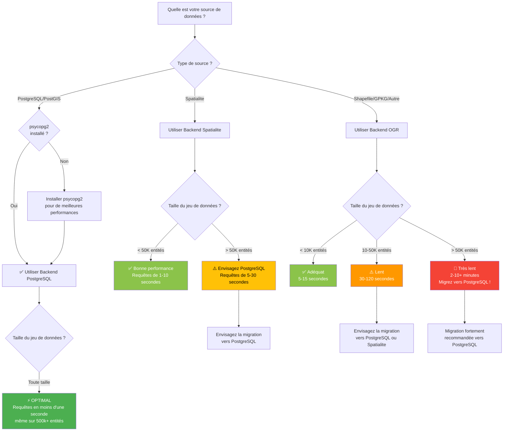

import Tabs from '@theme/Tabs';
import TabItem from '@theme/TabItem';

# Choisir le bon Backend

Guide interactif pour vous aider à sélectionner le backend optimal pour vos données et votre flux de travail.

## Arbre de décision rapide



---

## Facteurs de décision

### 1. Type de source de données

**Ceci est généralement déterminé pour vous** - FilterMate détecte automatiquement le fournisseur de votre couche.

| Votre couche est | Backend utilisé | Contrôle |
|------------------|-----------------|----------|
| Connexion PostgreSQL/PostGIS | PostgreSQL (si psycopg2 installé) | ⚙️ Installer psycopg2 |
| Fichier Spatialite (.sqlite) | Spatialite | ✓ Automatique |
| Shapefile (.shp) | OGR | 💡 Migration possible |
| GeoPackage (.gpkg) | OGR ou Spatialite | 💡 Optimisation possible |
| GeoJSON, KML, etc. | OGR | 💡 Migration possible |

---

### 2. Taille du jeu de données

**Facteur le plus important** pour la performance :

```
< 10 000 entités    → Tout backend convient
10 000 - 50 000     → Spatialite recommandé
50 000 - 500 000    → PostgreSQL recommandé
> 500 000           → PostgreSQL requis
```

**Comment vérifier le nombre d'entités** :
1. Clic droit sur la couche → **Propriétés**
2. Onglet **Informations**
3. Cherchez « Nombre d'entités »

Ou dans FilterMate :
- Le nombre d'entités est affiché dans le panneau d'info de la couche

---

### 3. Complexité des requêtes

**Requêtes simples** (soit/ou) :
- Filtrage par attributs uniquement
- Un seul prédicat spatial
- Petites distances de tampon

→ Tout backend adéquat

**Requêtes complexes** (multiples) :
- Filtrage attribut + spatial combiné
- Plusieurs prédicats spatiaux
- Grandes distances de tampon (>1km)
- Jointures multi-couches

→ PostgreSQL fortement recommandé

---

### 4. Fréquence d'utilisation

**Utilisation occasionnelle** (mensuelle) :
- Le backend actuel convient probablement
- La performance est moins critique

**Utilisation régulière** (hebdomadaire) :
- Optimisez avec Spatialite ou PostgreSQL
- Les gains de temps s'accumulent

**Utilisation quotidienne** (workflows de production) :
- **Utilisez définitivement PostgreSQL**
- Accélération de 10-50× = heures économisées par semaine

---

## Matrice de comparaison des backends

### Performance

| Backend | 10K entités | 50K entités | 100K entités | 500K entités |
|---------|-------------|-------------|--------------|--------------|
| **PostgreSQL** | 0.1s ⚡ | 0.3s ⚡ | 0.8s ⚡ | 2.5s ⚡ |
| **Spatialite** | 0.4s ✓ | 4.5s ⏱️ | 18s ⏱️ | 120s ⚠️ |
| **OGR (GPKG)** | 2.1s | 25s ⏱️ | 95s 🐌 | 600s 🔴 |
| **OGR (SHP)** | 3.8s | 45s ⚠️ | 180s 🐌 | 1200s 🔴 |

*Temps de requête typiques pour un filtre spatial avec tampon de 500m*

---

### Fonctionnalités

| Fonctionnalité | PostgreSQL | Spatialite | OGR |
|----------------|------------|------------|-----|
| Indexation spatiale | GIST ✅ | R-Tree ✅ | Limité ⚠️ |
| Vues matérialisées | ✅ | Tables temporaires ✅ | Mémoire ⚠️ |
| Traitement côté serveur | ✅ | Client ⚠️ | Client ⚠️ |
| Accès concurrent | ✅ | Utilisateur unique ⚠️ | Verrouillage fichier ⚠️ |
| Taille max du jeu de données | Illimitée ✅ | ~1M entités ✓ | ~100K ⚠️ |
| Installation | Nécessite serveur | Intégrée ✅ | Intégrée ✅ |
| psycopg2 requis | ✅ | Non | Non |

---

### Avantages et inconvénients

#### Backend PostgreSQL

**Avantages** ✅ :
- Performance la plus rapide (10-50× vs OGR)
- Gère d'énormes jeux de données (millions d'entités)
- Opérations spatiales côté serveur
- Index spatiaux automatiques
- Prêt pour la production
- Accès concurrent

**Inconvénients** ⚠️ :
- Nécessite un serveur PostgreSQL
- Requiert le package Python psycopg2
- Configuration plus complexe
- Connaissance de l'administration de base de données utile

**Idéal pour** :
- Grands jeux de données (>50k entités)
- Workflows de production
- Environnements multi-utilisateurs
- Utilisation régulière/quotidienne
- Requêtes spatiales complexes

---

#### Backend Spatialite

**Avantages** ✅ :
- Bonne performance pour les jeux de données moyens
- Basé sur fichiers (portable)
- Pas de serveur requis
- Intégré à QGIS
- Index spatiaux supportés
- Facile à partager

**Inconvénients** ⚠️ :
- Plus lent que PostgreSQL sur les grands jeux de données
- Mono-utilisateur (verrouillage de fichier)
- Limitations de mémoire
- Non idéal pour >100k entités

**Idéal pour** :
- Jeux de données moyens (10k-50k entités)
- Projets portables
- Workflows personnels
- Pas de serveur de base de données disponible
- Utilisation occasionnelle

---

#### Backend OGR

**Avantages** ✅ :
- Compatibilité universelle
- Fonctionne avec tout format de fichier
- Pas de dépendances
- Configuration simple
- Intégré à QGIS

**Inconvénients** ⚠️ :
- Performance la plus lente
- Optimisation spatiale limitée
- Gourmand en mémoire
- Non recommandé pour >50k entités
- Limitations des formats de fichiers

**Idéal pour** :
- Petits jeux de données (`<10k` entités)
- Requêtes ponctuelles rapides
- Formats de fichiers legacy
- Exigences de compatibilité
- Tests/prototypage

---

## Chemins de migration

### Shapefile → PostgreSQL

**Pourquoi migrer** :
- Requêtes 10-50× plus rapides
- Pas de limites de taille de fichier
- Meilleurs types de données
- Accès concurrent

**Comment** :
```bash
1. Installer PostgreSQL + PostGIS
2. QGIS : Base de données → DB Manager → Importer couche
3. Source : Votre Shapefile
4. Destination : Base de données PostgreSQL
5. Activer l'index spatial
6. Charger la couche PostgreSQL dans QGIS
```

**Temps estimé** : 5-15 minutes
**Gain de performance** : 10-50×

Voir : [Guide de configuration PostgreSQL](../backends/postgresql.md)

---

### Shapefile → Spatialite

**Pourquoi migrer** :
- 3-5× plus rapide que Shapefile
- Portabilité en fichier unique
- Indexation spatiale
- Meilleurs noms d'attributs (pas de limite de 10 caractères)

**Comment** :
```bash
1. Boîte à outils de traitement → Général vecteur → Empaqueter couches
2. Sortie : Spatialite (.sqlite)
3. Cocher « Sauvegarder styles de couche »
4. Charger le fichier .sqlite dans QGIS
```

**Temps estimé** : 2-5 minutes
**Gain de performance** : 3-5×

---

### Spatialite → PostgreSQL

**Pourquoi migrer** :
- 5-10× plus rapide sur les grands jeux de données
- Meilleure évolutivité
- Support multi-utilisateurs

**Comment** :
```bash
1. DB Manager → Importer couche
2. Source : Couche Spatialite
3. Destination : PostgreSQL
4. Activer l'index spatial
```

**Temps estimé** : 5-10 minutes
**Gain de performance** : 5-10×

---

## Scénarios réels

### Scénario 1 : Analyse parcellaire urbaine

**Données** :
- 150 000 parcelles (polygones)
- 5 000 routes (lignes)
- Filtrage régulier (quotidien)

**Recommandation** : PostgreSQL ⚡

**Pourquoi** :
- Grand jeu de données
- Requêtes spatiales complexes
- Utilisation quotidienne = heures économisées

**Alternative** : Spatialite fonctionnerait mais 20-30× plus lent

---

### Scénario 2 : Évaluation environnementale de site

**Données** :
- 2 500 points d'échantillonnage
- 50 zones de protection (polygones)
- Utilisation occasionnelle (mensuelle)

**Recommandation** : Spatialite ✓ ou format actuel

**Pourquoi** :
- Petit jeu de données
- Utilisation occasionnelle
- Surcoût de configuration non justifié

**Alternative** : OGR (Shapefile/GPKG) parfaitement adéquat

---

### Scénario 3 : Réseau de transport régional

**Données** :
- 75 000 segments routiers
- 12 000 intersections
- Analyse hebdomadaire

**Recommandation** : PostgreSQL ⚡

**Pourquoi** :
- Jeu de données moyen-grand
- Utilisation régulière
- Analyse de réseau complexe

**Alternative** : Spatialite possible mais plus lent (10-30s vs 1-2s)

---

### Scénario 4 : Limites de petits projets

**Données** :
- 150 sites de projet
- 500 entités de référence
- Export ponctuel

**Recommandation** : Format actuel (OGR) ✓

**Pourquoi** :
- Très petit jeu de données
- Utilisation ponctuelle
- Migration non justifiée

---

## Guides d'installation

### Installer psycopg2 pour le backend PostgreSQL

<Tabs>
  <TabItem value="windows" label="Windows" default>
    ```bash
    # OSGeo4W Shell (Recommandé)
    # Ouvrir OSGeo4W Shell en Administrateur
    # Exécuter :
    py3_env
    pip install psycopg2-binary
    
    # Redémarrer QGIS
    ```
  </TabItem>
  
  <TabItem value="linux" label="Linux">
    ```bash
    # Ubuntu/Debian
    sudo apt-get install python3-psycopg2
    
    # Ou via pip
    pip3 install psycopg2-binary
    ```
  </TabItem>
  
  <TabItem value="macos" label="macOS">
    ```bash
    # Avec pip
    /Applications/QGIS.app/Contents/MacOS/bin/pip3 install psycopg2-binary
    ```
  </TabItem>
</Tabs>

**Vérification** :
```python
# Console Python QGIS
import psycopg2
print(psycopg2.__version__)
# Devrait afficher le numéro de version
```

---

## Liste de vérification des performances

Avant de vous plaindre de performances lentes, vérifiez :

### Utilisateurs PostgreSQL
- [ ] psycopg2 est installé
- [ ] L'index spatial existe sur la colonne géométrique
- [ ] VACUUM ANALYZE exécuté récemment
- [ ] La connexion est locale (pas serveur distant)
- [ ] La base de données a suffisamment de RAM

### Utilisateurs Spatialite
- [ ] Utilisation d'un fichier .sqlite (pas Shapefile)
- [ ] Index spatial créé (généralement automatique)
- [ ] Jeu de données `<100k` entités
- [ ] Fichier sur disque local (pas réseau)

### Utilisateurs OGR
- [ ] Jeu de données `<50k` entités (sinon, migrez !)
- [ ] Utilisation de GeoPackage au lieu de Shapefile
- [ ] Fichier sur SSD (pas HDD ou réseau)
- [ ] Envisagez migration Spatialite ou PostgreSQL

---

## Astuces rapides

### Quand PostgreSQL n'est pas disponible

**Option 1** : Utiliser Spatialite
```bash
# Convertir en Spatialite pour accélération 3-5×
Traitement → Empaqueter couches → Spatialite
```

**Option 2** : Pré-filtrer avec QGIS
```bash
# Réduire le jeu de données avant FilterMate
Propriétés de la couche → Source → Constructeur de requête
```

**Option 3** : Diviser les grands fichiers
```bash
# Diviser par région/attribut
Traitement → Diviser couche vecteur
```

---

### Optimiser le backend existant

**PostgreSQL** :
```sql
-- Créer l'index spatial manquant
CREATE INDEX idx_geom ON nom_table USING GIST(geom);

-- Mettre à jour les statistiques
VACUUM ANALYZE nom_table;

-- Vérifier l'utilisation des index
EXPLAIN ANALYZE SELECT ... ;
```

**Spatialite** :
```sql
-- Créer l'index spatial
SELECT CreateSpatialIndex('nom_table', 'geom');

-- Nettoyer la base
VACUUM;
```

---

## Résumé

### Logique de sélection du backend

```
1. Vérifier le type de source de données (détection automatique)
2. Compter les entités du jeu de données
3. Considérer la fréquence d'utilisation
4. Choisir le backend :
   
   > 50k entités + utilisation régulière → PostgreSQL
   10-50k entités → Spatialite
   < 10k entités → Format actuel convient
```

### Points clés

- **PostgreSQL** : Meilleures performances, vaut la configuration pour >50k entités
- **Spatialite** : Bon équilibre pour 10-50k entités, pas de serveur nécessaire
- **OGR** : Compatibilité universelle mais le plus lent, convient pour `<10k` entités
- **Migration** : Facile et rentable pour les grands jeux de données utilisés fréquemment

### Investissement temps vs économies

| Migration | Temps de configuration | Temps économisé par requête | Point de rentabilité |
|-----------|------------------------|----------------------------|---------------------|
| SHP → Spatialite | 5 min | 5-15 secondes | ~20 requêtes |
| SHP → PostgreSQL | 30 min | 30-120 secondes | ~15 requêtes |
| Spatialite → PostgreSQL | 15 min | 10-30 secondes | ~30 requêtes |

---

## Besoin d'aide ?

- 📖 [Configuration PostgreSQL](../backends/postgresql.md)
- 📖 [Guide Spatialite](../backends/spatialite.md)
- 📖 [Backend OGR](../backends/ogr.md)
- 📖 [Configuration](../advanced/configuration.md)
- 💬 [Demander sur GitHub](https://github.com/sducournau/filter_mate/discussions)
