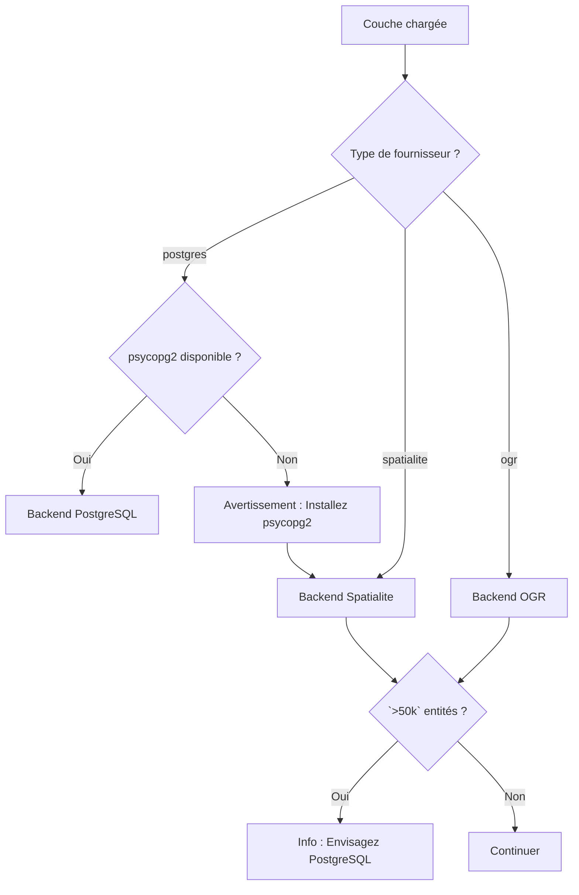

# Vue d'ensemble des Backends

FilterMate utilise une **architecture multi-backend** pour offrir des performances optimales selon les différentes sources de données. Le backend est automatiquement sélectionné en fonction du type de votre couche — aucune configuration requise.

## Qu'est-ce qu'un Backend ?

Les backends sont les moteurs qui traitent vos opérations de filtrage. FilterMate inclut trois backends spécialisés optimisés pour différentes sources de données :

- **Backend PostgreSQL** : Traitement côté serveur pour une vitesse maximale
- **Backend Spatialite** : Base de données locale avec index spatiaux
- **Backend OGR** : Compatibilité universelle pour les formats de fichiers

:::tip Réponse rapide
**La plupart des utilisateurs n'ont pas besoin de se soucier des backends !** FilterMate choisit automatiquement le meilleur pour vos données. Chargez simplement votre couche et filtrez.
:::

## Architecture

```
modules/backends/
  ├── base_backend.py        # Interface abstraite
  ├── postgresql_backend.py  # Backend PostgreSQL/PostGIS
  ├── spatialite_backend.py  # Backend Spatialite
  ├── ogr_backend.py         # Backend OGR universel
  └── factory.py             # Sélection automatique du backend
```

## Logique de sélection automatique

FilterMate sélectionne intelligemment le meilleur backend en fonction de votre couche :



**Fonctionnement :**

1. **Détecte le type de fournisseur de la couche** (PostgreSQL, Spatialite ou OGR)
2. **Vérifie la disponibilité de PostgreSQL** (psycopg2 est-il installé ?)
3. **Sélectionne le backend optimal** avec des avertissements de performance si nécessaire
4. **Bascule gracieusement** si la meilleure option n'est pas disponible

## Comparaison des backends

| Fonctionnalité | PostgreSQL | Spatialite | OGR |
|----------------|-----------|-----------|-----|
| **Vitesse (`<10k` entités)** | `<1s` ⚡ | `<1s` ⚡ | ~2s |
| **Vitesse (100k entités)** | ~2s ⚡ | ~8s | ~15s 🐌 |
| **Vitesse (1M entités)** | ~10s ⚡ | ~60s 🐌 | Timeout ❌ |
| **Opérations concurrentes** | Excellent | Bon | Limité |
| **Installation** | Optionnelle (psycopg2) | Intégrée ✓ | Intégrée ✓ |
| **Source de données** | PostgreSQL/PostGIS | Fichiers .sqlite | Shapefiles, GPKG, etc. |
| **Idéal pour** | Grands jeux de données (`>50k`) | Jeux moyens (`<50k`) | Tous formats |

## Fonctionnalités des backends

### Backend PostgreSQL

**Technologie** : Traitement côté serveur avec vues matérialisées

**Capacités** :
- ✅ Vues matérialisées pour un filtrage ultra-rapide
- ✅ Index spatiaux natifs (GIST)
- ✅ Opérations spatiales côté serveur
- ✅ Support des opérations concurrentes

**Utilisé automatiquement quand** :
- La source de la couche est PostgreSQL/PostGIS
- psycopg2 est installé
- **Recommandé pour `>50k` entités**

**Performance** : La meilleure de sa catégorie pour les grands jeux de données

[En savoir plus →](./postgresql)

---

### Backend Spatialite

**Technologie** : Tables temporaires avec index R-tree

**Capacités** :
- ✅ Index spatiaux R-tree
- ✅ Opérations de base de données locale
- ✅ Détection automatique des index spatiaux
- ✅ Aucune installation supplémentaire requise

**Utilisé automatiquement quand** :
- La source de la couche est Spatialite (.sqlite, .db)
- Toujours disponible
- **Optimal pour `<50k` entités**

**Performance** : Bon équilibre entre vitesse et simplicité

[En savoir plus →](./spatialite)

---

### Backend OGR

**Technologie** : Framework de traitement QGIS

**Capacités** :
- ✅ Compatibilité universelle (Shapefiles, GeoPackage, CSV, etc.)
- ✅ Opérations en mémoire
- ✅ Fonctionne avec tous les formats supportés par OGR
- ✅ Création automatique d'index spatiaux (v1.9+)

**Utilisé automatiquement quand** :
- La source de la couche est basée sur fichiers (Shapefile, GeoPackage, etc.)
- Fallback quand PostgreSQL n'est pas disponible
- **Fonctionne avec toutes les sources de données**

**Performance** : Bon pour les jeux de données petits à moyens (`<10k`)

[En savoir plus →](./ogr)

---

## Vérifier votre backend actif

### Via les messages FilterMate

FilterMate affiche des messages d'information lors du chargement des couches :

- **« Utilisation du backend PostgreSQL »** → Mode PostgreSQL (meilleures performances)
- **« Utilisation du backend Spatialite »** → Mode Spatialite
- **« Utilisation du backend OGR »** → Mode OGR (basé sur fichiers)

### Via la console Python

Ouvrez **Extensions → Console Python** dans QGIS :

```python
# Vérifier la disponibilité de PostgreSQL
from modules.appUtils import POSTGRESQL_AVAILABLE
print(f"PostgreSQL disponible : {POSTGRESQL_AVAILABLE}")

# Vérifier le backend de la couche actuelle
from modules.backends.factory import BackendFactory

layer = iface.activeLayer()
backend = BackendFactory.create_backend(layer)
print(f"Backend : {backend.__class__.__name__}")
# Sortie : PostgresqlBackend, SpatialiteBackend ou OgrBackend
```

## Prérequis PostgreSQL

FilterMate nécessite le package Python **psycopg2** pour le support PostgreSQL.

**Installation :**

```bash
# Avec pip
pip install psycopg2-binary

# Sur Ubuntu/Debian
sudo apt-get install python3-psycopg2

# Sur macOS (avec QGIS Homebrew)
/Applications/QGIS.app/Contents/MacOS/bin/pip3 install psycopg2-binary
```

**Vérifier l'installation :**

```python
import psycopg2
print(psycopg2.__version__)
# Attendu : '2.9.x (dt dec pq3 ext lo64)'
```

**Si non installé :**
- Les couches PostgreSQL utiliseront le filtrage natif QGIS (plus lent)
- Vous verrez un avertissement : « psycopg2 non trouvé, utilisation du fallback »
- Les couches Spatialite et OGR fonctionnent normalement

## Optimisations de performance

FilterMate inclut des optimisations automatiques pour tous les backends :

### Optimisations PostgreSQL
- **Vues matérialisées** : Requêtes en moins d'une seconde sur des tables de millions de lignes
- **Index GIST** : Opérations spatiales optimisées par PostgreSQL
- **Traitement côté serveur** : Pas de transfert de données vers QGIS

### Optimisations Spatialite (v1.9+)
- **Tables temporaires avec index R-tree** : 44,6× plus rapide que les opérations en mémoire
- **Ordonnancement des prédicats** : 2,3× plus rapide avec une évaluation optimale
- **Détection des index spatiaux** : Utilise automatiquement les index existants

### Optimisations OGR (v1.9+)
- **Création automatique d'index spatiaux** : 19,5× plus rapide sur les grands jeux de données
- **Optimisation des grands jeux de données** : Amélioration de 3× pour `>50k` entités
- **Traitement économe en mémoire** : Empreinte mémoire réduite

### Optimisations universelles
- **Cache de géométrie** : 5× plus rapide pour les opérations multi-couches
- **Mécanismes de réessai** : Gère automatiquement les verrous SQLite
- **Réparation de géométrie** : Approche multi-stratégie pour les géométries invalides

## Dépannage

### Avertissement « psycopg2 non trouvé »

**Symptôme** : Message d'avertissement lors de l'utilisation de couches PostgreSQL

**Solution** :
1. Installez psycopg2 (voir section installation ci-dessus)
2. Redémarrez QGIS
3. Rechargez votre couche

### Performances lentes

**Symptôme** : Le filtrage prend plus de 10 secondes

**Diagnostic** :
- Vérifiez le backend dans le panneau FilterMate (section info couche)
- Notez la taille de votre jeu de données (nombre d'entités)

**Solutions** :
- **Backend OGR avec `>10k` entités** : Convertir en Spatialite ou PostgreSQL
- **Spatialite avec `>50k` entités** : Migrer vers PostgreSQL
- **PostgreSQL sans psycopg2** : Installer psycopg2

Voir [Choisir le bon Backend](./choosing-backend) pour des guides de migration détaillés.

## Prochaines étapes

- **[Choisir un Backend](./choosing-backend)** - Arbre de décision interactif pour vous aider à choisir le meilleur backend
- **[Benchmarks de performance](./performance-benchmarks)** - Résultats détaillés des benchmarks
- **[Configuration PostgreSQL](./postgresql)** - Configurer PostgreSQL pour des performances maximales
- **[Détails Spatialite](./spatialite)** - Découvrir les capacités de Spatialite
- **[Limitations OGR](./ogr)** - Comprendre les contraintes du backend OGR

- [Détails du Backend PostgreSQL](./postgresql)
- [Détails du Backend Spatialite](./spatialite)
- [Détails du Backend OGR](./ogr)
- [Comparaison des performances](./performance-benchmarks)
- [Guide de sélection du backend](./choosing-backend)
