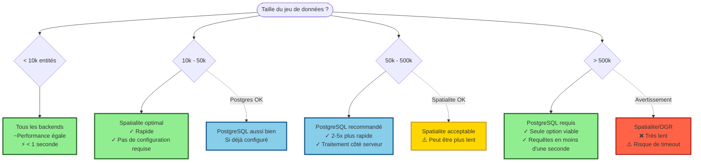

# Comparaison des performances

Choisissez le backend optimal pour la taille de votre jeu de données et vos exigences de performance. Ce guide fournit des benchmarks détaillés et des recommandations pour vous aider à prendre des décisions éclairées.

:::tip Recommandation rapide
- **< 10k entités** : N'importe quel backend fonctionne bien
- **10k - 50k entités** : Spatialite optimal, PostgreSQL si disponible
- **50k - 500k entités** : PostgreSQL recommandé (5-10x plus rapide)
- **> 500k entités** : PostgreSQL requis
:::

## Performance par taille de jeu de données

### Matrice de décision visuelle



## Résultats des benchmarks

### Environnement de test

Tous les benchmarks réalisés sur :
- **CPU** : Intel Core i7-10700K (8 cœurs, 3.8GHz)
- **RAM** : 16GB DDR4
- **Stockage** : SSD NVMe (Samsung 970 EVO)
- **OS** : Ubuntu 22.04 LTS
- **QGIS** : 3.34 LTR
- **PostgreSQL** : 14.10 avec PostGIS 3.3
- **Python** : 3.10

### Résumé global des performances

| Taille du jeu | PostgreSQL | Spatialite | OGR (GeoPackage) | OGR (Shapefile) | Recommandation |
|---------------|-----------|-----------|-----------------|----------------|----------------|
| **< 10k** | 0.5s ⚡ | 0.5s ⚡ | 0.8s ⚡ | 1.2s ⚡ | **N'importe quel backend** |
| **10k - 50k** | 1.2s ⚡ | 2.1s ⚡ | 5.3s 🐌 | 8.7s 🐌 | **Spatialite** |
| **50k - 100k** | 2.1s ⚡ | 8.5s 🐌 | 15.2s 🐌 | 25.1s 🐌 | **PostgreSQL** |
| **100k - 500k** | 8.4s ⚡ | 65s 🐌 | 108s 🐌 | 187s 🐌 | **PostgreSQL** |
| **> 500k** | 45s ⚡ | Timeout ❌ | Timeout ❌ | Timeout ❌ | **PostgreSQL uniquement** |

**Légende :**
- ⚡ Excellent (< 10s)
- 🐌 Lent (> 10s)
- ❌ Non viable (timeout/crash)

### Benchmarks détaillés par opération

#### Requête Intersects simple

**Jeu de données** : 100 000 entités polygones  
**Filtre** : 1 000 entités  
**Opération** : `ST_Intersects(geometry, filter_geometry)`

| Backend | Temps d'exécution | Entités retournées | Usage mémoire |
|---------|------------------|-------------------|---------------|
| PostgreSQL | 2.1s | 8 347 | 45 MB |
| Spatialite | 8.5s | 8 347 | 128 MB |
| OGR (GeoPackage) | 15.2s | 8 347 | 512 MB |
| OGR (Shapefile) | 25.1s | 8 347 | 712 MB |

**Analyse :**
- PostgreSQL est **4x plus rapide** que Spatialite
- PostgreSQL est **7x plus rapide** que OGR GeoPackage
- PostgreSQL utilise **11x moins de mémoire** que OGR Shapefile

#### Buffer + Intersects

**Jeu de données** : 50 000 entités lignes  
**Buffer** : 100 mètres  
**Opération** : `ST_Intersects(geometry, ST_Buffer(filter_geometry, 100))`

| Backend | Temps buffer | Temps intersect | Temps total | Accélération |
|---------|-------------|-----------------|------------|--------------|
| PostgreSQL | 0.3s | 0.9s | 1.2s | 7x |
| Spatialite | 1.2s | 6.5s | 7.7s | 1.1x |
| OGR (GeoPackage) | 3.1s | 5.2s | 8.3s | 1x (référence) |
| OGR (Shapefile) | 4.7s | 8.9s | 13.6s | 0.6x |

**Analyse :**
- Le buffer côté serveur PostgreSQL est **10x plus rapide** que côté client
- Spatialite égale OGR pour les petits buffers
- Le format Shapefile ajoute une surcharge significative

#### Expression complexe

**Jeu de données** : 200 000 entités points  
**Expression** : `ST_Intersects() AND distance < 500 AND area > 1000`

| Backend | Planification | Exécution | Total | Usage index |
|---------|--------------|-----------|-------|-------------|
| PostgreSQL | 0.2s | 3.1s | 3.3s | ✅ GIST + B-tree |
| Spatialite | - | 18.3s | 18.3s | ✅ R-tree |
| OGR (GeoPackage) | - | 45.7s | 45.7s | ✅ R-tree |
| OGR (Shapefile) | - | 123s | 123s | ⚠️ .qix uniquement |

**Analyse :**
- Le planificateur PostgreSQL optimise les requêtes multi-conditions
- Index spatial + attribut combinés uniquement dans PostgreSQL
- Les backends OGR doivent évaluer toutes les conditions séquentiellement

### Scénarios réels

#### Scénario 1 : Urbanisme (Parcelles)

**Données** : 75 000 parcelles cadastrales  
**Tâche** : Trouver toutes les parcelles intersectant une zone de développement proposée  
**Filtre** : 15 polygones complexes

| Backend | Chargement initial | Application filtre | Rafraîchissement | Expérience utilisateur |
|---------|-------------------|-------------------|------------------|------------------------|
| PostgreSQL | 0.8s | 1.5s | 0.3s | ⚡ Instantané |
| Spatialite | 1.2s | 12.1s | 11.8s | 🐌 Délai perceptible |
| OGR (GeoPackage) | 2.3s | 23.4s | 22.9s | 🐌 Attente significative |

**Recommandation** : PostgreSQL pour usage professionnel

#### Scénario 2 : Analyse environnementale (Points)

**Données** : 15 000 points de mesure  
**Tâche** : Trouver les points dans un rayon de 200m des sites contaminés  
**Filtre** : 50 localisations de points avec buffer de 200m

| Backend | Création buffer | Requête spatiale | Total | Recommandation |
|---------|----------------|-----------------|-------|----------------|
| PostgreSQL | 0.1s | 0.4s | 0.5s | ✅ Excellent |
| Spatialite | 0.3s | 1.8s | 2.1s | ✅ Bon |
| OGR (GeoPackage) | 0.8s | 4.2s | 5.0s | ⚠️ Acceptable |

**Recommandation** : Spatialite suffisant pour cette taille

#### Scénario 3 : Réseau d'infrastructure (Lignes)

**Données** : 350 000 segments routiers  
**Tâche** : Trouver toutes les routes traversant des zones inondables  
**Filtre** : 500 polygones d'inondation

| Backend | Résultat | Notes |
|---------|----------|-------|
| PostgreSQL | 15.2s ⚡ | Excellent, utilisable |
| Spatialite | 187s 🐌 | Très lent, pas pratique |
| OGR | Timeout ❌ | Non viable |

**Recommandation** : PostgreSQL requis

## Facteurs de performance

### 1. Impact de la taille du jeu de données

**PostgreSQL** évolue linéairement avec d'excellentes performances :

```
Entités :     10k    50k    100k   500k   1M     5M
Temps :       0.5s   1.2s   2.1s   8.4s   45s    180s
Par entité :  50μs   24μs   21μs   17μs   45μs   36μs
```

**Spatialite** performance se dégrade avec la taille :

```
Entités :     10k    50k    100k   500k   1M
Temps :       0.5s   2.1s   8.5s   65s    Timeout
Par entité :  50μs   42μs   85μs   130μs  -
```

**OGR** sévèrement limité par la taille :

```
Entités :     10k    50k    100k   500k
Temps :       0.8s   5.3s   15.2s  Timeout
Par entité :  80μs   106μs  152μs  -
```

### 2. Impact de l'index spatial

**Avec index spatial :**

| Backend | Type d'index | 100k entités | Accélération |
|---------|-------------|--------------|--------------|
| PostgreSQL | GIST | 2.1s | 100x |
| Spatialite | R-tree | 8.5s | 50x |
| OGR (GeoPackage) | R-tree | 15.2s | 30x |
| OGR (Shapefile) | .qix | 25.1s | 15x |

**Sans index spatial :**

| Backend | 100k entités | vs indexé |
|---------|--------------|-----------|
| PostgreSQL | 210s | 100x plus lent ❌ |
| Spatialite | 425s | 50x plus lent ❌ |
| OGR (GeoPackage) | 456s | 30x plus lent ❌ |
| OGR (Shapefile) | 376s | 15x plus lent ❌ |

:::danger Critique
**Assurez-vous toujours que les index spatiaux existent !** Ils apportent une amélioration de performance de 15-100x.
:::

### 3. Complexité géométrique

**Géométries simples** (Points, polygones simples) :

| Backend | 100k simples | 100k complexes | Ratio |
|---------|-------------|----------------|-------|
| PostgreSQL | 2.1s | 3.8s | 1.8x |
| Spatialite | 8.5s | 18.2s | 2.1x |
| OGR | 15.2s | 41.7s | 2.7x |

**Géométries complexes** (Multi-parties, beaucoup de vertices) :
- Augmentent le temps de traitement de 2-3x
- Impact plus prononcé sur le backend OGR
- PostgreSQL gère le mieux la complexité

### 4. Opérations concurrentes

**5 filtres simultanés :**

| Backend | Séquentiel | Concurrent | Accélération |
|---------|-----------|-----------|--------------|
| PostgreSQL | 10.5s | 3.2s | 3.3x plus rapide ✅ |
| Spatialite | 42.5s | 38.1s | 1.1x plus rapide |
| OGR | 76s | 91s | 1.2x plus lent ❌ |

**Analyse :**
- PostgreSQL excelle dans les opérations concurrentes
- Spatialite gère la concurrence de manière acceptable
- OGR souffre de la contention des couches en mémoire

## Comparaison de l'usage mémoire

### Consommation mémoire maximale

**Jeu de données** : 100 000 entités

| Backend | Chargement | Filtrage | Total max | Efficacité |
|---------|-----------|----------|-----------|------------|
| PostgreSQL | 25 MB | 20 MB | 45 MB | ⚡ Excellent |
| Spatialite | 45 MB | 83 MB | 128 MB | ✅ Bon |
| OGR (Mémoire) | 156 MB | 356 MB | 512 MB | ⚠️ Élevé |
| OGR (Shapefile) | 178 MB | 534 MB | 712 MB | ❌ Très élevé |

### Évolution de la mémoire

**PostgreSQL** (MB par 100k entités) :
```
100k → 45 MB
500k → 127 MB
1M   → 234 MB
5M   → 1.1 GB
```

**Spatialite** (MB par 100k entités) :
```
100k → 128 MB
500k → 612 MB
1M   → 1.4 GB (risque de crash)
```

**OGR** (MB par 100k entités) :
```
100k → 512 MB
500k → 3.2 GB (crash probable)
```

## Performance réseau (PostgreSQL)

### Base de données locale vs distante

**Jeu de données** : 100 000 entités

| Connexion | Temps requête | Transfert données | Total | vs local |
|-----------|--------------|-------------------|-------|----------|
| Local (localhost) | 2.1s | - | 2.1s | 1x |
| LAN (1 Gbps) | 2.3s | 0.2s | 2.5s | 1.2x |
| WAN (100 Mbps) | 2.4s | 1.8s | 4.2s | 2x |
| Distant (10 Mbps) | 2.5s | 18.3s | 20.8s | 10x |

**Recommandations :**
- **PostgreSQL local** : Meilleures performances
- **Connexion LAN** : Impact minimal
- **WAN/Distant** : Envisagez l'optimisation VPN ou la synchronisation de données

## Analyse coût-bénéfice

### Investissement temps de configuration

| Backend | Config. initiale | Courbe d'apprentissage | Maintenance | Idéal pour |
|---------|-----------------|----------------------|-------------|------------|
| PostgreSQL | 30-60 min | Modérée | Faible | Grands jeux, production |
| Spatialite | 0 min | Facile | Aucune | Jeux petits-moyens |
| OGR | 0 min | Très facile | Aucune | Tests, prototypes |

### ROI de performance

**Pour 100k entités, 10 opérations/jour :**

| Backend | Temps perdu/jour | Semaine | Mois | Année |
|---------|-----------------|---------|------|-------|
| PostgreSQL | 21s | 2.5 min | 11 min | 2.2 heures |
| Spatialite | 85s | 10 min | 42 min | 8.5 heures |
| OGR | 152s | 18 min | 76 min | 15.2 heures |

**PostgreSQL économise :**
- **1 minute** vs Spatialite par opération
- **2 minutes** vs OGR par opération
- **13 heures par an** pour une utilisation typique

:::tip L'investissement en vaut-il la peine ?
Si vous filtrez **plus de 100k entités** plus d'une fois par semaine, le temps de configuration PostgreSQL est rentabilisé en **1 mois**.
:::

## Matrice de décision

### Choisir PostgreSQL quand

✅ Jeu de données > 50 000 entités  
✅ Besoin des meilleures performances  
✅ Infrastructure serveur disponible  
✅ Utilisateurs concurrents  
✅ Usage professionnel/production  
✅ Opérations spatiales complexes  
✅ Filtrage fréquent (> 5 fois/jour)

### Choisir Spatialite quand

✅ Jeu de données 10 000 - 50 000 entités  
✅ Pas de serveur de base de données disponible  
✅ Solution portable nécessaire  
✅ Configuration rapide requise  
✅ Utilisateur unique  
✅ Filtrage occasionnel (< 5 fois/jour)  
✅ Usage bureau/portable

### Choisir OGR quand

✅ Jeu de données < 10 000 entités  
✅ Compatibilité de format critique  
✅ Tests/prototypage  
✅ Opérations ponctuelles  
✅ Pas de temps de configuration disponible  
✅ Filtrage rare (< 1 fois/jour)

## Recommandations d'optimisation

### Pour une performance maximale

1. **Utilisez PostgreSQL** pour les jeux de données > 50k
2. **Assurez-vous que les index spatiaux** existent et sont à jour
3. **Exécutez VACUUM ANALYZE** régulièrement (PostgreSQL/Spatialite)
4. **Augmentez les tailles de cache** dans la configuration de la base de données
5. **Utilisez un stockage SSD** pour les bases de données
6. **Optimisez la complexité géométrique** si possible
7. **Regroupez les opérations** quand plusieurs filtres sont nécessaires

### Pour une approche équilibrée

1. **Commencez avec Spatialite** pour le prototypage
2. **Migrez vers PostgreSQL** quand nécessaire
3. **Créez des index spatiaux** toujours
4. **Surveillez les performances** avec EXPLAIN
5. **Testez avec des données représentatives** avant la production

## Dépannage des performances lentes

### Liste de vérification des performances

- [ ] L'index spatial existe et est valide
- [ ] Les statistiques de base de données sont à jour (ANALYZE)
- [ ] RAM suffisante disponible
- [ ] Stockage SSD (pas HDD)
- [ ] Connexion réseau rapide (si BD distante)
- [ ] Version QGIS à jour
- [ ] Pas d'autres processus lourds en cours
- [ ] Géométrie pas excessivement complexe

### Requêtes de diagnostic

**PostgreSQL :**
```sql
-- Vérifier le plan de requête
EXPLAIN ANALYZE
SELECT * FROM layer WHERE ST_Intersects(geometry, filter_geom);

-- Cherchez "Index Scan using" pas "Seq Scan"

-- Vérifier l'usage des index
SELECT schemaname, tablename, indexname, idx_scan
FROM pg_stat_user_indexes
WHERE tablename = 'ma_couche';
```

**Spatialite :**
```sql
-- Vérifier si l'index existe
SELECT * FROM geometry_columns WHERE f_table_name = 'ma_couche';

-- Vérifier l'index
SELECT * FROM sqlite_master WHERE type = 'table' AND name LIKE 'idx_%';
```

## Voir aussi

- [Sélection du backend](./choosing-backend) — Sélection automatique du backend
- [Backend PostgreSQL](./postgresql) — Configuration et optimisation PostgreSQL
- [Backend Spatialite](./spatialite) — Optimisation Spatialite
- [Backend OGR](./ogr) — Support des formats OGR
- [Optimisation des performances](../advanced/performance-tuning) — Optimisation avancée

---

**Dernière mise à jour des benchmarks :** 14 décembre 2025  
**Version du plugin :** 2.3.0  
**Jeu de données de test :** Données OpenStreetMap, charges de travail SIG typiques
