# Contributing

Thank you for your interest in contributing to FilterMate! This guide will help you get started with contributions, from bug reports to new features.

## Ways to Contribute

There are many ways to contribute to FilterMate:

- 🐛 **Report Bugs** - Found an issue? Let us know!
- 💡 **Suggest Features** - Have ideas for improvements?
- 📝 **Improve Documentation** - Help others understand FilterMate
- 🧪 **Write Tests** - Increase code coverage
- 🔧 **Fix Bugs** - Tackle open issues
- ✨ **Add Features** - Implement new capabilities
- 🌍 **Translations** - Help localize FilterMate

## Getting Started

### Prerequisites

1. **Git** - Version control
2. **Python 3.7+** - FilterMate's language
3. **QGIS 3.x** - For testing in real environment
4. **Text Editor/IDE** - VS Code recommended

### Fork and Clone

1. **Fork the repository** on GitHub
2. **Clone your fork**:

```bash
git clone https://github.com/YOUR_USERNAME/filter_mate.git
cd filter_mate
```

3. **Add upstream remote**:

```bash
git remote add upstream https://github.com/sducournau/filter_mate.git
```

4. **Create a branch**:

```bash
git checkout -b feature/your-feature-name
# or
git checkout -b fix/your-bug-fix
```

### Development Setup

See the [Development Setup](./development-setup.md) guide for detailed instructions on setting up your environment.

## Contribution Workflow

```mermaid
flowchart TD
    A[Fork Repository] --> B[Clone Locally]
    B --> C[Create Branch]
    C --> D[Make Changes]
    D --> E[Write Tests]
    E --> F[Run Test Suite]
    F --> G{Tests Pass?}
    G -->|No| D
    G -->|Yes| H[Commit Changes]
    H --> I[Push to Fork]
    I --> J[Create Pull Request]
    J --> K[Code Review]
    K --> L{Approved?}
    L -->|No| M[Address Feedback]
    M --> D
    L -->|Yes| N[Merge! 🎉]
    
    style N fill:#90EE90,stroke:#2d6a2d,stroke-width:2px
    style G fill:#FFD700,stroke:#b8860b,stroke-width:2px
    style L fill:#FFD700,stroke:#b8860b,stroke-width:2px
```



### Step-by-Step Guide

#### 1. Create an Issue (Optional but Recommended)

Before starting work:

1. Check if an issue already exists
2. If not, create one describing your proposed change
3. Wait for feedback from maintainers
4. This avoids duplicate work

#### 2. Make Your Changes

Follow the [Code Style Guide](./code-style.md):

- Use PEP 8 conventions
- Add docstrings to functions/classes
- Keep lines under 120 characters
- Use type hints where helpful

```python
def my_new_function(layer: QgsVectorLayer, buffer_distance: float) -> bool:
    """
    Brief description of function.
    
    Args:
        layer: The QGIS vector layer to process
        buffer_distance: Buffer distance in layer units
    
    Returns:
        True if operation succeeded, False otherwise
    
    Raises:
        ValueError: If buffer_distance is negative
    """
    if buffer_distance < 0:
        raise ValueError("Buffer distance must be positive")
    
    # Implementation here
    return True
```

#### 3. Write Tests

Every new feature or bug fix should include tests:

```python
# tests/test_my_feature.py
import pytest
from unittest.mock import Mock

def test_my_new_function():
    """Test the new function works correctly"""
    # Arrange
    mock_layer = Mock()
    buffer_distance = 100.0
    
    # Act
    result = my_new_function(mock_layer, buffer_distance)
    
    # Assert
    assert result is True

def test_my_new_function_negative_buffer():
    """Test error handling for negative buffer"""
    # Arrange
    mock_layer = Mock()
    buffer_distance = -100.0
    
    # Act & Assert
    with pytest.raises(ValueError):
        my_new_function(mock_layer, buffer_distance)
```

See [Testing Guide](./testing.md) for more details.

#### 4. Run Tests Locally

```bash
# Run all tests
pytest tests/ -v

# Run with coverage
pytest tests/ --cov=modules --cov=filter_mate_app --cov-report=html

# Run specific test
pytest tests/test_my_feature.py -v
```

All tests must pass before submitting a PR.

#### 5. Commit Your Changes

Follow **Conventional Commits** format:

```bash
# Feature
git commit -m "feat: add support for negative buffers"

# Bug fix
git commit -m "fix: correct Spatialite field name quoting"

# Documentation
git commit -m "docs: update installation instructions"

# Tests
git commit -m "test: add unit tests for buffer operations"

# Refactor
git commit -m "refactor: extract common DB connection logic"

# Performance
git commit -m "perf: optimize spatial index creation"
```

**Commit Message Format**:

```
<type>: <description>

[optional body]

[optional footer]
```

**Types**:
- `feat`: New feature
- `fix`: Bug fix
- `docs`: Documentation changes
- `test`: Adding or updating tests
- `refactor`: Code refactoring
- `perf`: Performance improvements
- `style`: Code style changes (formatting, etc.)
- `chore`: Maintenance tasks

#### 6. Push to Your Fork

```bash
git push origin feature/your-feature-name
```

#### 7. Create Pull Request

1. Go to your fork on GitHub
2. Click "Compare & pull request"
3. Fill out the PR template:

```markdown
## Description
Brief description of changes

## Type of Change
- [ ] Bug fix
- [ ] New feature
- [ ] Documentation update
- [ ] Performance improvement

## Testing
- [ ] All tests pass locally
- [ ] Added new tests for changes
- [ ] Tested manually in QGIS

## Checklist
- [ ] Code follows style guidelines
- [ ] Documentation updated
- [ ] CHANGELOG.md updated
```

4. Submit the PR

#### 8. Code Review

Maintainers will review your PR:

- ✅ **Approved** - Your PR will be merged!
- 🔄 **Changes Requested** - Address feedback and update PR
- ❌ **Closed** - Explanation will be provided

**Tips for review**:
- Respond to all comments
- Ask questions if unclear
- Be patient and respectful
- Update your branch if requested

## Code Style Guidelines

### Python Standards

#### PEP 8 Conventions

```python
# ✅ Good
def calculate_buffer_distance(layer, percentage):
    """Calculate buffer distance based on layer extent."""
    extent = layer.extent()
    return extent.width() * (percentage / 100.0)

# ❌ Bad
def CalculateBufferDistance(l,p):
    e=l.extent()
    return e.width()*(p/100.0)
```

#### Naming Conventions

```python
# Classes: PascalCase
class FilterMateApp:
    pass

# Functions/methods: snake_case
def get_datasource_connexion_from_layer(layer):
    pass

# Constants: UPPER_SNAKE_CASE
POSTGRESQL_AVAILABLE = True

# Private methods: _prefix
def _internal_helper(self):
    pass
```

#### Import Order

```python
# 1. Standard library
import os
import sys
from typing import Optional

# 2. Third-party (QGIS, PyQt5)
from qgis.core import QgsVectorLayer, QgsProject
from qgis.PyQt.QtCore import Qt

# 3. Local application
from .config.config import ENV_VARS
from .modules.appUtils import get_datasource_connexion_from_layer
```

### Critical Patterns

#### PostgreSQL Availability Check

**ALWAYS** check before using PostgreSQL:

```python
from modules.appUtils import POSTGRESQL_AVAILABLE

if POSTGRESQL_AVAILABLE and provider_type == 'postgresql':
    # PostgreSQL-specific code
    connexion = psycopg2.connect(...)
else:
    # Fallback to Spatialite or OGR
    pass
```

#### Provider Type Detection

```python
if layer.providerType() == 'postgres':
    layer_provider_type = 'postgresql'
elif layer.providerType() == 'spatialite':
    layer_provider_type = 'spatialite'
elif layer.providerType() == 'ogr':
    layer_provider_type = 'ogr'
else:
    layer_provider_type = 'unknown'
```

#### Error Handling

```python
# ✅ Good - Specific exceptions
try:
    connexion = psycopg2.connect(conn_string)
except psycopg2.OperationalError as e:
    iface.messageBar().pushCritical("FilterMate", f"Connection failed: {e}")
    return None

# ❌ Bad - Bare except
try:
    connexion = psycopg2.connect(conn_string)
except:
    return None
```

## Documentation Standards

### Docstrings

Use Google-style docstrings:

```python
def apply_geometric_filter(
    layer: QgsVectorLayer,
    predicate: str,
    reference_geometry: QgsGeometry,
    buffer_distance: float = 0.0
) -> bool:
    """
    Apply geometric filter to layer using spatial predicate.
    
    This function filters features in the layer based on their spatial
    relationship with the reference geometry. An optional buffer can be
    applied to the reference geometry before filtering.
    
    Args:
        layer: The QGIS vector layer to filter
        predicate: Spatial predicate (e.g., 'intersects', 'contains')
        reference_geometry: Geometry to filter against
        buffer_distance: Optional buffer distance in layer units (default: 0.0)
    
    Returns:
        True if filter applied successfully, False otherwise
    
    Raises:
        ValueError: If predicate is not supported
        RuntimeError: If layer provider doesn't support filtering
    
    Example:
        >>> layer = QgsProject.instance().mapLayersByName('cities')[0]
        >>> point = QgsGeometry.fromPointXY(QgsPointXY(0, 0))
        >>> apply_geometric_filter(layer, 'intersects', point, 1000.0)
        True
    """
    # Implementation
    pass
```

### Code Comments

```python
# Good comments explain WHY, not WHAT
# Use buffer to account for coordinate precision issues
buffer_distance = 0.0001

# Bad comment - states the obvious
# Set buffer distance to 0.0001
buffer_distance = 0.0001
```

## Testing Requirements

### Test Coverage

- **Minimum**: 80% code coverage
- **Target**: 90%+ code coverage
- Run coverage report: `pytest --cov=modules --cov-report=html`

### Test Requirements

Every PR should include:

1. **Unit tests** for new functions
2. **Integration tests** for features
3. **Edge case tests** for error handling
4. **Mock external dependencies** (QGIS, databases)

### Testing Checklist

- [ ] Tests for happy path
- [ ] Tests for error conditions
- [ ] Tests for edge cases
- [ ] All tests pass
- [ ] Coverage maintained or improved

## Pull Request Guidelines

### PR Title

Use conventional commit format:

```
feat: add Spatialite backend support
fix: correct buffer distance calculation
docs: update installation guide
```

### PR Description

Include:

1. **What** - What does this PR do?
2. **Why** - Why is this change needed?
3. **How** - How does it work?
4. **Testing** - How was it tested?
5. **Screenshots** - If UI changes

### PR Size

Keep PRs focused and manageable:

- ✅ **Small PRs** (< 500 lines) - Easy to review
- ⚠️ **Medium PRs** (500-1000 lines) - Take longer
- ❌ **Large PRs** (> 1000 lines) - Split if possible

### Review Process

1. **Automated checks** run first
   - Tests must pass
   - Linting must pass
   - Coverage must meet threshold

2. **Maintainer review**
   - Code quality
   - Adherence to style guide
   - Test coverage
   - Documentation

3. **Address feedback**
   - Make requested changes
   - Push updates
   - Mark conversations as resolved

4. **Merge**
   - Squash and merge (usually)
   - Your commits will be combined
   - PR description becomes commit message

## Common Pitfalls

### ❌ Don'ts

- ❌ **Don't** import psycopg2 without checking availability
- ❌ **Don't** assume PostgreSQL is available
- ❌ **Don't** use blocking operations in main thread
- ❌ **Don't** forget to close database connections
- ❌ **Don't** skip writing tests
- ❌ **Don't** ignore warnings or errors
- ❌ **Don't** hardcode file paths or credentials

### ✅ Do's

- ✅ **Do** use POSTGRESQL_AVAILABLE flag
- ✅ **Do** provide Spatialite/OGR fallbacks
- ✅ **Do** use QgsTask for heavy operations
- ✅ **Do** use try/finally for resources
- ✅ **Do** write comprehensive tests
- ✅ **Do** update documentation
- ✅ **Do** follow coding standards

## Getting Help

### Resources

- **Documentation**: https://sducournau.github.io/filter_mate
- **GitHub Issues**: https://github.com/sducournau/filter_mate/issues
- **GitHub Discussions**: For questions and ideas
- **QGIS Documentation**: https://docs.qgis.org

### Where to Ask

- **Bug reports** → GitHub Issues
- **Feature requests** → GitHub Issues
- **Usage questions** → GitHub Discussions
- **Development questions** → GitHub Discussions
- **Security issues** → Email maintainers

## Code of Conduct

### Be Respectful

- Treat all contributors with respect
- Welcome newcomers
- Accept constructive criticism
- Focus on what's best for the project
- Show empathy

### Unacceptable Behavior

- Harassment or discrimination
- Trolling or insulting comments
- Personal or political attacks
- Publishing others' private information
- Other unprofessional conduct

## Recognition

Contributors will be:

- Listed in README.md
- Credited in CHANGELOG.md
- Thanked in release notes
- Part of the FilterMate community! 🎉

## License

By contributing, you agree that your contributions will be licensed under the GPL-3.0 License.

## Questions?

Don't hesitate to ask! Open a GitHub Discussion or comment on an issue. We're here to help.

---

**Happy Contributing! 🚀**

---

*Last updated: December 8, 2025*