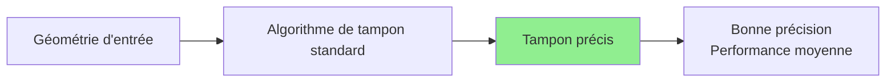
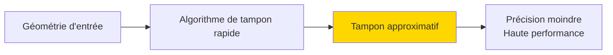
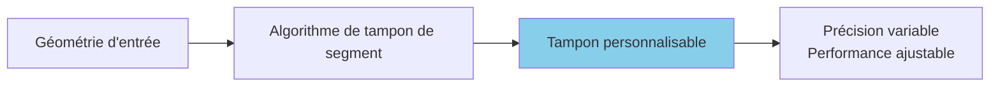

gtt---
sidebar_position: 5
---

# Opérations de tampon

Créez des tampons autour des géométries et utilisez-les pour l'analyse de proximité dans l'onglet **FILTRAGE**.

## Aperçu

Un **tampon** est un polygone représentant tous les points à une distance spécifiée d'une géométrie. Dans FilterMate, les tampons sont configurés dans l'**onglet FILTRAGE** aux côtés des prédicats géométriques pour le filtrage spatial basé sur la proximité.

### Utilisations principales

Les tampons sont essentiels pour :
- **Analyse de proximité** - Trouver des entités près de quelque chose (par ex., bâtiments à moins de 200m de routes)
- **Zones d'impact** - Définir des zones d'influence (par ex., tampon de bruit autour d'un aéroport)
- **Zones de service** - Analyse de couverture (par ex., 500m de distance de marche vers les transports)
- **Zones de sécurité** - Limites d'exclusion (par ex., tampon de 100m autour des dangers)

:::tip Emplacement dans l'interface
La configuration du tampon se trouve dans l'**onglet FILTRAGE**, sous le sélecteur de prédicats géométriques. Les tampons sont appliqués à la géométrie de la **couche de référence** avant la comparaison spatiale.
:::

### Concepts clés

- **Distance** : Jusqu'où le tampon s'étend (en unités spécifiées)
- **Unité** : Mesure de distance (mètres, kilomètres, pieds, miles, degrés)
- **Type de tampon** : Algorithme utilisé (Standard, Rapide ou Segment)
- **Intégration** : Les tampons fonctionnent avec les prédicats spatiaux (Intersecte, Contient, etc.)

## Types de tampon

FilterMate prend en charge trois algorithmes de tampon dans l'onglet FILTRAGE, chacun avec différentes caractéristiques de performance et de précision.

### 1. Tampon standard (Par défaut)

L'**algorithme standard** crée des tampons précis adaptés à la plupart des cas d'usage.



**Caractéristiques :**
- ✅ Résultats précis
- ✅ Gère bien les géométries complexes
- ✅ Bon pour la plupart des cas d'usage
- ⚠️ Performance modérée sur les grands ensembles de données

**Quand l'utiliser :**
- Analyse de proximité générale
- Applications de planification
- Conformité réglementaire (précision requise)
- Ensembles de données de taille moyenne (<10k entités)

**Exemple de configuration :**
```
Onglet FILTRAGE :
- Distance de tampon : 500
- Unité de tampon : mètres
- Type de tampon : Standard
- Segments : 16 (courbes lisses)
```

### 2. Tampon rapide

L'**algorithme rapide** privilégie la **performance** par rapport à la précision.



**Caractéristiques :**
- ⚡ 2-5x plus rapide que standard
- ⚠️ Précision géométrique inférieure
- ✅ Bon pour les grands ensembles de données
- ✅ Adapté à la visualisation et l'exploration

**Quand l'utiliser :**
- Grands ensembles de données (>50k entités)
- Exploration interactive dans QGIS
- Analyse approximative où la précision n'est pas critique
- Visualisation rapide des zones de proximité

**Comparaison de performance :**
```
Taille ensemble | Standard | Rapide | Gain vitesse
----------------|----------|--------|-------------
1 000 entités  | 0,5s     | 0,2s   | 2,5x
10 000         | 4,2s     | 1,1s   | 3,8x
50 000         | 21,3s    | 5,8s   | 3,7x
100 000        | 45,1s    | 11,2s  | 4,0x
```

**Exemple de configuration :**
```
Onglet FILTRAGE :
- Distance de tampon : 1000
- Unité de tampon : mètres
- Type de tampon : Rapide
- Moins de segments pour la vitesse
```

### 3. Tampon de segment

Le **tampon de segment** crée des tampons avec segmentation personnalisable pour un contrôle fin de la douceur vs performance.



**Caractéristiques :**
- ✅ Contrôle fin du nombre de segments
- ✅ Équilibre précision vs vitesse
- ✅ Bon pour les sorties de qualité publication
- ⚠️ Nécessite une compréhension des compromis

**Quand l'utiliser :**
- Cartes de qualité publication
- Lorsque vous avez besoin d'une douceur spécifique
- Réglage de performance personnalisé
- Utilisateurs avancés voulant du contrôle

**Directives de nombre de segments :**
- **4-8 segments** : Rapide, apparence angulaire
- **16 segments** : Équilibré (par défaut)
- **32-64 segments** : Courbes lisses, plus lent
- **64+ segments** : Qualité publication, le plus lent

**Exemple de configuration :**
```
Onglet FILTRAGE :
- Distance de tampon : 200
- Unité de tampon : mètres
- Type de tampon : Segment
- Segments : 32 (haute qualité)
```

## Configuration du tampon dans l'onglet FILTRAGE

### Sélection de distance et d'unité


*Configurer la distance de tampon et sélectionner l'unité*

**Unités prises en charge** :
- **Mètres** (m) - Le plus courant pour les SCR projetés
- **Kilomètres** (km)
- **Pieds** (ft) - US State Plane
- **Miles** (mi)
- **Degrés** - SCR géographiques (à utiliser avec précaution)

:::tip Le SCR compte
Assurez-vous que votre couche utilise un SCR approprié :
- **Projeté** (mètres, pieds) : UTM, State Plane, projections locales → Utiliser mètres/pieds
- **Géographique** (degrés) : WGS84, NAD83 → Convertir d'abord en SCR projeté pour des tampons précis
:::

**Exemples de distance :**
```
Urbanisme :           50-500m
Accès transport :     400-800m (distance de marche)
Zones de bruit :      1-5km
Environnement :       100m-10km
Analyse régionale :   10-100km
```

### Sélection du type de tampon


*Choisir l'algorithme de tampon : Standard, Rapide ou Segment*

**Critères de sélection :**

| Scénario | Type recommandé | Pourquoi |
|----------|-----------------|----------|
| Exploration rapide | Rapide | Vitesse sur précision |
| Rapport officiel | Standard | Bonne précision |
| Grands ensembles (>50k) | Rapide | Performance |
| Cartes publication | Segment (32+) | Qualité visuelle |
| Conformité réglementaire | Standard | Précision fiable |

### Intégration du tampon avec le filtrage géométrique

Les tampons fonctionnent parfaitement avec les **prédicats spatiaux** dans l'onglet FILTRAGE :

**Flux de travail :**
1. Sélectionner la couche source (par ex., "bâtiments")
2. Sélectionner le prédicat spatial (par ex., "Intersecte")
3. Sélectionner la couche de référence (par ex., "routes")
4. Configurer le tampon : 200m, type Standard
5. Cliquer sur FILTRER

**Ce qui se passe :**
- La géométrie de la couche de référence est tamponnée de 200m
- Le prédicat spatial (Intersecte) est appliqué entre la couche source et la référence tamponnée
- Résultat : Bâtiments qui intersectent les routes à moins de 200m

**Exemples de cas d'usage :**

| Couche source | Prédicat | Couche référence | Tampon | Résultat |
|---------------|----------|------------------|--------|----------|
| Bâtiments | Intersecte | Routes | 200m | Bâtiments à moins de 200m de routes |
| Parcelles | À l'intérieur | Zone protégée | 50m | Parcelles à 50m à l'intérieur de la zone |
| Installations | Disjoint | Dangers | 500m | Installations >500m des dangers |
| POIs | Contient | District + Tampon | 100m | POIs dans district + marge 100m |

## Exemple de flux de travail de tampon complet

**Scénario** : Trouver tous les bâtiments à moins de 200m de routes

Cet exemple montre comment les tampons s'intègrent au filtrage géométrique dans l'onglet FILTRAGE.

**Étape par étape :**

<!-- ![Étape 1](/img/workflows/workflow-filtering-01.png -->
*1. Ouvrir l'onglet FILTRAGE*

<!-- *

<!--  a exécuté la requête spatiale avec tampon
4. Les entités correspondantes ont été retournées et affichées

**SQL Backend (PostgreSQL) :**
```sql
SELECT buildings.*
FROM buildings
WHERE ST_Intersects(
    buildings.geometry,
    (SELECT ST_Buffer(roads.geometry, 200) 
     FROM roads)
)
```

**SQL Backend (Spatialite) :**
```sql
SELECT buildings.*
FROM buildings
WHERE ST_Intersects(
    buildings.geometry,
    (SELECT ST_Buffer(roads.geometry, 200) 
     FROM roads)
)
```

## Comportement de tampon spécifique au backend

### PostgreSQL (Le plus rapide)

```sql
-- Utilise ST_Buffer (PostGIS)
ST_Buffer(
    geometry,
    distance,
    'quad_segs=16'  -- paramètre de segments
)
```

**Avantages :**
- Accélération matérielle via index GIST
- Support du traitement parallèle
- Algorithmes optimisés pour grands ensembles de données
- Meilleures performances pour >50k entités

### Spatialite (Bon)

```sql
-- Utilise ST_Buffer (Spatialite)
ST_Buffer(geometry, distance)
```

**Avantages :**
- Bonnes performances pour ensembles de données moyens (moins de 50k)
- Pas de dépendances externes
- Fonctionne hors ligne
- Fichier de base de données portable

**Limitations :**
- Moins de paramètres de personnalisation de tampon
- Plus lent que PostgreSQL sur grands ensembles de données
- Peut verrouiller la base de données pendant les opérations de tampon

### OGR (Solution de secours)

Utilise les algorithmes de traitement QGIS :

```python
processing.run("native:buffer", {
    'INPUT': layer,
    'DISTANCE': distance,
    'SEGMENTS': segments,
    'OUTPUT': 'memory:'
})
```

**Limitations :**
- Pas de support d'index spatial
- Performance plus lente
- Limité aux algorithmes QGIS disponibles
- Non recommandé pour >10k entités

:::tip Conseil de performance
Pour les ensembles de données de plus de 50k entités avec opérations de tampon fréquentes, utilisez **PostgreSQL** pour des performances optimales. Spatialite est bon pour les ensembles de données de moins de 50k entités.
:::

## Combinaisons tampon + filtre

### Zones de tampon multiples

```sql
-- Propriétés dans différentes zones de risque
CASE
    WHEN distance($geometry, @hazard_geom) < 100 THEN 'risque_élevé'
    WHEN distance($geometry, @hazard_geom) < 500 THEN 'risque_moyen'
    WHEN distance($geometry, @hazard_geom) < 1000 THEN 'risque_faible'
    ELSE 'sûr'
END = 'risque_élevé'
```

### Zones d'exclusion

```sql
-- Terrain disponible (pas dans tampon protégé)
land_use = 'non développé'
AND disjoint(
    $geometry,
    buffer(geometry(get_feature('protected', 'status', 'actif')), 500)
)
AND area($geometry) > 10000
```

### Proximité à plusieurs entités

```sql
-- Près de transport OU routes principales
(
    distance($geometry, geometry(get_feature('transit', 'type', 'station'))) < 400
    OR
    distance($geometry, geometry(get_feature('roads', 'class', 'autoroute'))) < 200
)
AND zone = 'commercial'
```

## Exemples pratiques

### Urbanisme : Accès transport

**Objectif** : Trouver parcelles résidentielles à 400m à pied des transports

```
Configuration onglet FILTRAGE :
- Couche source : parcelles_residentielles
- Prédicat spatial : Intersecte
- Couche référence : stations_metro
- Distance tampon : 400
- Unité tampon : mètres
- Type tampon : Standard
```

**Résultat** : Parcelles avec bon accès transport pour planification TOD (Développement Orienté Transit)

### Environnement : Tampon zone protégée

**Objectif** : Identifier bâtiments dans tampon 100m autour zones humides protégées

```
Configuration onglet FILTRAGE :
- Couche source : bâtiments
- Prédicat spatial : À l'intérieur
- Couche référence : zones_humides_protegees
- Distance tampon : 100
- Unité tampon : mètres
- Type tampon : Standard
```

**Résultat** : Bâtiments nécessitant évaluation impact environnemental

### Sécurité : Zone exclusion danger

**Objectif** : Trouver installations en dehors zone sécurité 500m de sites dangereux

```
Configuration onglet FILTRAGE :
- Couche source : installations_publiques
- Prédicat spatial : Disjoint
- Couche référence : sites_dangereux
- Distance tampon : 500
- Unité tampon : mètres
- Type tampon : Standard
```

**Résultat** : Emplacements sûrs d'installations pour usage public

## Dépannage

### Résultats de tampon invalides

**Problème** : L'opération de tampon échoue ou produit des résultats vides

**Solutions :**
1. Vérifier validité de la géométrie :
   ```sql
   -- Dans filtre d'attributs
   is_valid($geometry)
   ```

2. Réparer géométries avant tamponnage :
   ```sql
   -- Utiliser traitement QGIS pour réparer couche d'abord
   processing.run("native:makevalid", {...})
   ```

3. Vérifier que le SCR est projeté (pas géographique)

### Problèmes de performance

**Problème** : L'opération de tampon est très lente

**Solutions :**
1. **Réduire nombre de segments** - Utiliser type tampon Rapide ou moins de segments
2. **Filtrer attributs d'abord** - Appliquer filtres d'attributs avant tampon
3. **Améliorer backend** - Passer à PostgreSQL pour grands ensembles de données
4. **Vérifier index spatiaux** - Vérifier que index existent sur colonnes géométrie

**Liste de contrôle performance :**
- [ ] Index spatial existe sur couches source et référence
- [ ] Utilisation type tampon Rapide pour exploration
- [ ] Filtres d'attributs appliqués d'abord
- [ ] SCR est projeté (pas géographique)
- [ ] Couche a moins de 100k entités OU utilise PostgreSQL

### Résultats de tampon inattendus

**Problème** : Le tampon semble incorrect ou manque d'entités

**Problèmes courants :**

1. **Mauvaises unités SCR** :
   - SCR géographique (degrés) : 200 degrés = ~22 000 km !
   - Solution : Convertir d'abord en SCR projeté

2. **Distance trop petite** :
   - Vérifier que les unités SCR de la couche correspondent aux unités de tampon
   - Exemple : Tampon de 200 dans un SCR utilisant pieds = 200 pieds, pas mètres

3. **Géométries NULL** :
   - Certaines entités peuvent avoir géométrie NULL
   - Les filtrer : `geometry IS NOT NULL`

4. **Géométries invalides** :
   - Utiliser `is_valid($geometry)` pour vérifier
   - Réparer avec `make_valid($geometry)`

## Optimisation des performances

### Comparaison des backends

| Backend | Standard | Rapide | Géodésique |
|---------|----------|--------|------------|
| PostgreSQL | ⚡⚡⚡ Rapide | ⚡⚡⚡⚡ Plus rapide | ⚡⚡ Modéré |
| Spatialite | ⚡⚡ Modéré | ⚡⚡⚡ Rapide | ⚡ Lent |
| OGR | ⚡ Lent | ⚡⚡ Modéré | ❌ N/A |

### Conseils pour grands ensembles de données

1. **Utiliser Tampon rapide pour exploration**
   ```python
   # Analyse interactive rapide
   buffer_type = "rapide"
   segments = 8
   ```

2. **Passer à Standard pour résultats finaux**
   ```python
   # Analyse finale précise
   buffer_type = "standard"
   segments = 16
   ```

3. **Réduire segments**
   ```python
   # Équilibrer précision et vitesse
   segments = 8  # Au lieu de 32
   ```

4. **Utiliser backend PostgreSQL**
   - Tamponnage accéléré matériellement
   - Support index spatial
   - 3-5x plus rapide que Spatialite

### Considérations mémoire

```python
# Pour 100k entités avec tampons 500m :
# - Tampon rapide : ~200 MB RAM
# - Tampon standard : ~500 MB RAM
# - Tampon géodésique : ~800 MB RAM
```

## Sujets connexes

- [Filtrage géométrique](geometric-filtering.md) - Prédicats spatiaux utilisés avec tampons
- [Bases du filtrage](filtering-basics.md) - Combiner tampons avec filtres d'attributs
- [Aperçu de l'interface](interface-overview.md) - Guide complet onglet FILTRAGE
- [Exporter des entités](export-features.md) - Enregistrer résultats tamponnés

:::info Intégration onglet FILTRAGE
Les tampons font partie de la configuration de **filtrage géométrique** dans l'onglet FILTRAGE. Ils fonctionnent parfaitement avec :
- Prédicats spatiaux (Intersecte, Contient, À l'intérieur, etc.)
- Filtres d'attributs (expressions)
- Couches de référence (couches distantes)
- Couches multiples (sélection multiple)
:::

## Prochaines étapes

- **[Exporter des entités](export-features.md)** - Enregistrer vos résultats filtrés avec tampons appliqués
- **[Historique des filtres](filter-history.md)** - Réutiliser configurations de tampon depuis l'historique

**Guide complet** : Voir [Premier filtre](../getting-started/first-filter.md) pour un flux de travail complet combinant filtres d'attributs, prédicats géométriques et tampons.
