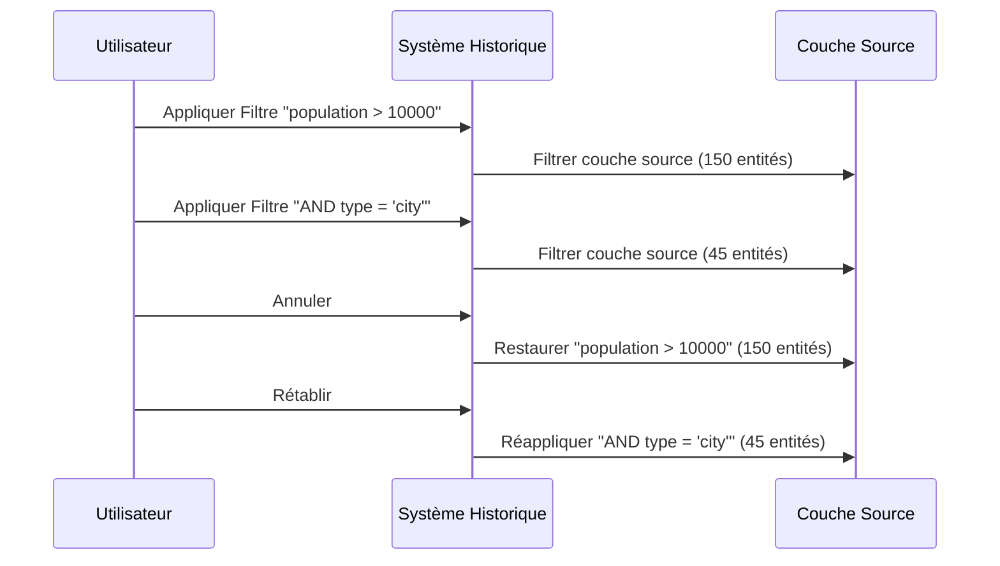
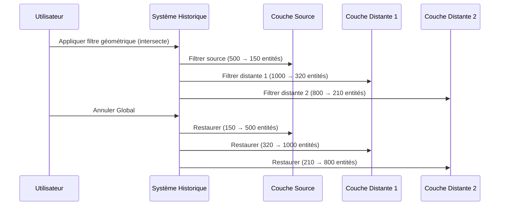

# Historique des Filtres & Annuler/Rétablir

FilterMate v2.3.0 propose un système d'historique intelligent avec des capacités d'annulation/rétablissement contextuelles.

:::info Version 2.3.0
Cette page documente le nouveau système Global Undo/Redo introduit dans la v2.3.0. Les versions précédentes avaient un système d'annulation plus simple pour une seule couche.
:::

## Vue d'ensemble

Le système d'**Historique des Filtres** enregistre automatiquement chaque filtre appliqué, vous permettant de :
- **Annuler/Rétablir** les filtres avec détection intelligente du contexte
- **Restauration Couche Source** ou **Globale** selon votre sélection
- **Naviguer** à travers les états de filtres de manière fluide
- **Préserver** automatiquement les filtres (combinés avec AND par défaut)

### Fonctionnalités Clés

- ✅ **Historique Automatique** - Chaque filtre est enregistré (jusqu'à 100 états)
- ✅ **Annuler/Rétablir Intelligent** - Restauration contextuelle des couches
- ✅ **Mode Global** - Restaurer plusieurs couches simultanément
- ✅ **Mode Source** - Annuler uniquement la couche active
- ✅ **Boutons Intelligents** - Activation/désactivation automatique selon l'historique disponible
- ✅ **Spécifique par Couche** - Historique séparé par couche

## Boutons Annuler/Rétablir

Les boutons Annuler et Rétablir sont situés dans la **Barre d'Actions** en haut du panneau FilterMate :

| Bouton | Icône | Action |
|--------|-------|--------|
| **ANNULER** | ↩️ | Revenir à l'état de filtre précédent |
| **RÉTABLIR** | ↪️ | Réappliquer le filtre annulé |

### États des Boutons

Les boutons **s'activent/désactivent automatiquement** selon la disponibilité de l'historique :
- **Activé** (cliquable) : Historique disponible dans cette direction
- **Désactivé** (grisé) : Pas d'historique à naviguer

## Deux Modes Annuler/Rétablir

FilterMate choisit intelligemment entre deux modes selon votre configuration actuelle :

### 🎯 Mode Couche Source Uniquement

**Quand activé :**
- Le bouton **"Couches à Filtrer"** est **décoché** OU
- Aucune couche distante n'est sélectionnée

**Comportement :**
- Annuler/Rétablir n'affecte **que la couche source**
- Rapide et simple pour les workflows mono-couche



### 🌐 Mode Global

**Quand activé :**
- Le bouton **"Couches à Filtrer"** est **coché** ET
- Une ou plusieurs couches distantes sont sélectionnées

**Comportement :**
- Annuler/Rétablir restaure **toutes les couches affectées simultanément**
- Couche source + toutes les couches distantes sont restaurées à leur état précédent



## Comment Ça Fonctionne

### Capture d'État

Quand vous appliquez un filtre, FilterMate capture :

**Historique Couche Source :**
- Expression de filtre (subset string)
- Nombre d'entités après filtre
- Horodatage
- Métadonnées de l'opération

**Historique Global (quand couches distantes sélectionnées) :**
- État de la couche source
- États de toutes les couches distantes (expression + nombre)
- Instantané combiné pour restauration atomique

### Détection de Contexte

FilterMate vérifie l'état de l'interface avant chaque annulation/rétablissement :

```python
# Logique simplifiée
bouton_coche = bouton "Couches à Filtrer" est coché
a_couches_distantes = des couches distantes sont sélectionnées

if bouton_coche AND a_couches_distantes:
    utiliser_mode_global()  # Restaurer toutes les couches
else:
    utiliser_mode_source()  # Restaurer source uniquement
```

## Exemples de Workflows

### Workflow Mono-Couche

1. Sélectionnez une couche dans QGIS
2. Appliquez filtre : `"population" > 10000` → 150 entités
3. Appliquez filtre : `"type" = 'residential'` → 45 entités
4. Cliquez **Annuler** → Retour à 150 entités
5. Cliquez **Annuler** → Retour à toutes les entités (pas de filtre)
6. Cliquez **Rétablir** → 150 entités à nouveau

### Workflow Multi-Couches

1. Sélectionnez la couche source (ex: "bâtiments")
2. Activez le bouton **"Couches à Filtrer"**
3. Sélectionnez les couches distantes : "parcelles", "routes"
4. Appliquez filtre géométrique : intersecte avec sélection
   - bâtiments : 500 → 150 entités
   - parcelles : 1000 → 320 entités
   - routes : 800 → 210 entités
5. Cliquez **Annuler** → **Les 3 couches** restaurées simultanément
6. Cliquez **Rétablir** → **Les 3 couches** filtrées à nouveau

### Filtrage Progressif avec Préservation

:::tip Préservation des Filtres (v2.3.0)
Les nouveaux filtres sont automatiquement combinés avec les filtres existants en utilisant AND par défaut.
:::

```
Étape 1 : Filtre géométrique (intersecte polygone)
          → Source : 150 entités

Étape 2 : Filtre attributaire : "population" > 5000
          → Combiné : (géométrique) AND (population > 5000)
          → Source : 23 entités

Étape 3 : Annuler
          → Retour à : 150 entités (géométrique uniquement)

Étape 4 : Rétablir
          → Avancer à : 23 entités (combiné)
```

## Configuration

### Taille de l'Historique

Historique maximum par défaut : **100 états** par couche

Configuré dans `modules/filter_history.py` :
```python
def __init__(self, layer_id: str, max_size: int = 100):
```

### Historique Global

L'historique global stocke également jusqu'à 100 états pour les opérations multi-couches.

## Détails Techniques

### Classe FilterState

Représente un état de filtre unique :
```python
class FilterState:
    expression: str      # Expression de filtre (subset string)
    feature_count: int   # Entités visibles après filtre
    description: str     # Description lisible
    timestamp: datetime  # Date d'application
    metadata: dict       # Infos additionnelles (backend, etc.)
```

### Classe GlobalFilterState

Représente un état multi-couches :
```python
class GlobalFilterState:
    source_layer_id: str                    # ID couche source
    source_expression: str                  # Filtre source
    remote_layers: Dict[str, Tuple[str, int]]  # {layer_id: (expression, count)}
    timestamp: datetime                     # Date de capture
    description: str                        # Description lisible
```

### Classe HistoryManager

Gère l'historique mono-couche et global :
```python
class HistoryManager:
    - get_history(layer_id) -> FilterHistory
    - push_global_state(source_id, source_expr, remote_layers, desc)
    - undo_global() -> GlobalFilterState
    - redo_global() -> GlobalFilterState
    - can_undo_global() -> bool
    - can_redo_global() -> bool
```

## Dépannage

### Boutons Annuler/Rétablir Désactivés

**Cause :** Pas d'historique disponible dans cette direction

**Solutions :**
- Appliquez au moins un filtre pour activer Annuler
- Annulez au moins une fois pour activer Rétablir
- Vérifiez si vous êtes au début/fin de l'historique

### Annuler Global Ne Restaure Pas Toutes les Couches

**Cause :** Les couches distantes peuvent avoir été supprimées du projet

**Solution :** FilterMate journalise des avertissements pour les couches manquantes :
```
FilterMate: Remote layer {id} no longer exists, skipping
```

### Historique Perdu Après Rechargement

**Comportement actuel :** L'historique est **en mémoire uniquement** et se réinitialise quand :
- QGIS est fermé
- Le plugin est rechargé
- Le projet est changé

**Note :** L'historique persistant entre sessions est une amélioration future potentielle.

## Bonnes Pratiques

### 1. Utilisez le Mode Global pour les Opérations Multi-Couches

Quand vous filtrez plusieurs couches ensemble, toujours :
1. Activez "Couches à Filtrer"
2. Sélectionnez toutes les couches distantes affectées
3. Appliquez le filtre une fois → toutes les couches filtrées
4. Utilisez Annuler Global pour tout restaurer d'un coup

### 2. Affinage Progressif

Construisez des filtres complexes étape par étape :
```
Étape 1 : Filtre géométrique large
Étape 2 : Ajoutez contrainte attributaire
Étape 3 : Ajoutez une autre contrainte
→ Chaque étape enregistrée, facilement réversible
```

### 3. Vérifiez les États des Boutons

Avant de cliquer Annuler/Rétablir :
- Bouton activé = action disponible
- Bouton désactivé = pas d'historique dans cette direction

### 4. Comprenez le Contexte

Avant d'annuler :
- **Décoché** "Couches à Filtrer" = annuler source uniquement
- **Coché** + couches distantes = annuler global (toutes les couches)

## Sujets Connexes

- [Bases du Filtrage](./filtering-basics) - Créer des filtres
- [Filtrage Géométrique](./geometric-filtering) - Opérations spatiales
- [Aperçu de l'Interface](./interface-overview) - Naviguer dans l'interface
