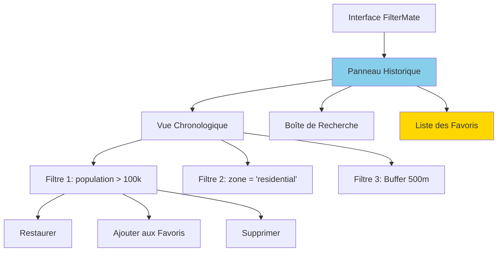
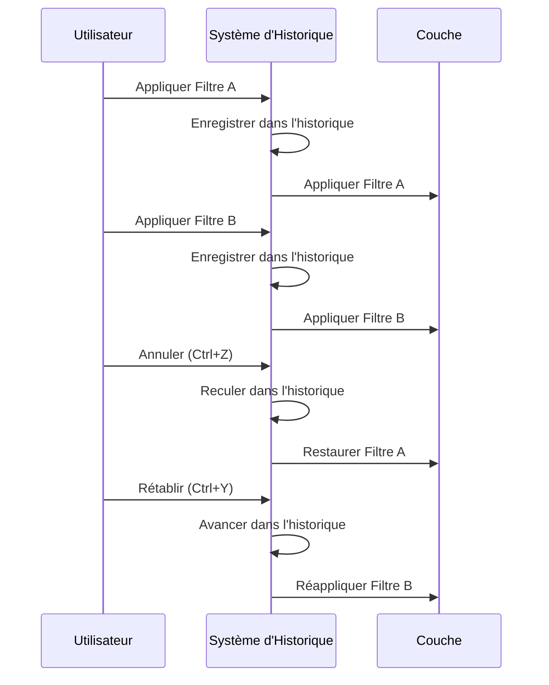
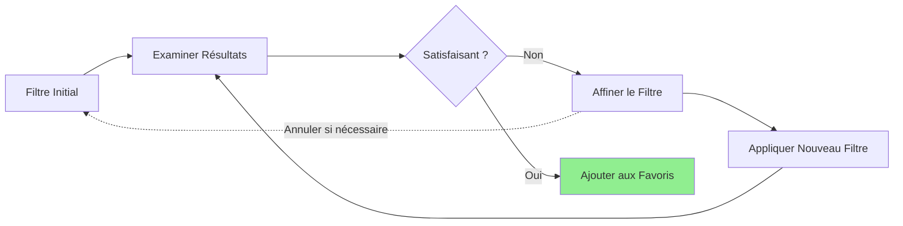

# Historique des Filtres

Suivez, gérez et réutilisez vos filtres grâce au puissant système d'historique de FilterMate avec capacités d'annulation/rétablissement.

:::tip Nouveau dans v2.3.0
Le système **Global Undo/Redo** capture maintenant atomiquement l'état de toutes les couches à chaque opération de filtrage, permettant une restauration parfaite des états précédents. La détection intelligente distingue automatiquement le mode "source-only" du mode "global".
:::

## Vue d'ensemble

Le système d'**Historique des Filtres** enregistre automatiquement chaque filtre appliqué, vous permettant de :
- **Annuler/Rétablir** les filtres rapidement
- **Consulter** les opérations de filtrage passées
- **Réutiliser** les modèles de filtres courants
- **Comparer** différents résultats de filtrage
- **Sauvegarder** vos filtres favoris pour plus tard

### Fonctionnalités Clés

- ✅ **Historique Automatique** - Chaque filtre est enregistré
- ✅ **Annuler/Rétablir** - Naviguez entre les états des filtres
- ✅ **Recherche** - Trouvez les filtres passés par expression
- ✅ **Favoris** - Marquez les filtres fréquemment utilisés
- ✅ **Export/Import** - Partagez les configurations de filtres
- ✅ **Spécifique par Couche** - Historique séparé par couche

## Interface de l'Historique



### Composants du Panneau

1. **Vue Chronologique** - Liste chronologique des filtres
2. **Boîte de Recherche** - Rechercher des filtres par mot-clé ou expression
3. **Indicateur de Filtre Actuel** - Met en évidence le filtre actif
4. **Section Favoris** - Accès rapide aux filtres sauvegardés
5. **Boutons Annuler/Rétablir** - Navigation dans l'historique

## Utilisation de l'Historique

### Annuler/Rétablir les Filtres

**Raccourcis Clavier :**
- **Annuler** : `Ctrl+Z` (Windows/Linux) ou `Cmd+Z` (Mac)
- **Rétablir** : `Ctrl+Y` ou `Ctrl+Shift+Z`

**Actions des Boutons :**
1. Cliquez sur le bouton **Annuler** (⟲) pour revenir au filtre précédent
2. Cliquez sur le bouton **Rétablir** (⟳) pour réappliquer le filtre annulé

**Exemple de Flux de Travail :**
```
1. Appliquer filtre : population > 100000
   → 1 234 entités affichées

2. Appliquer filtre : population > 100000 AND zone = 'residential'
   → 856 entités affichées

3. Annuler (Ctrl+Z)
   → Retour à 1 234 entités (premier filtre restauré)

4. Rétablir (Ctrl+Y)
   → Retour à 856 entités (second filtre réappliqué)
```

### Navigation dans l'Historique



## Gestion de l'Historique

### Vue Chronologique

La **Chronologie** affiche tous les filtres par ordre chronologique :

```
┌─────────────────────────────────────┐
│  Historique des Filtres - parcelles │
├─────────────────────────────────────┤
│ ⭐ [14:23] zone = 'commercial'      │ ← Favori
│ ▶ [14:15] population > 50000        │ ← Actuel
│   [14:10] area > 10000              │
│   [14:05] status = 'active'         │
│   [14:00] Pas de filtre (toutes)    │
└─────────────────────────────────────┘
```

**Icônes :**
- ⭐ **Favori** - Sauvegardé pour accès rapide
- ▶ **Actuel** - Filtre actif
- 🔍 **Complexe** - Expression multi-conditions
- 📍 **Spatial** - Filtre géométrique

### Recherche dans l'Historique

Trouvez les filtres passés par mots-clés :

```
Recherche : "population"

Résultats :
  [14:15] population > 50000
  [Hier] population BETWEEN 10000 AND 100000
  [2024-12-05] population > 100000 AND density > 50
```

**Astuces de Recherche :**
- Recherche par fragments d'expression
- Recherche par date/heure
- Recherche par nombre d'entités
- Utilisez les jokers : `pop*` correspond à `population`

### Gestion des Éléments de l'Historique

**Menu Clic Droit :**
- **Restaurer** - Appliquer ce filtre
- **Ajouter aux Favoris** ⭐ - Marquer pour accès rapide
- **Copier l'Expression** - Copier le texte du filtre
- **Modifier** - Modifier le filtre avant application
- **Supprimer** - Retirer de l'historique
- **Exporter** - Sauvegarder dans un fichier

## Système de Favoris

### Créer des Favoris

**Méthode 1 : Depuis l'Historique**
1. Clic droit sur un élément de l'historique
2. Sélectionnez **Ajouter aux Favoris**
3. Entrez un nom descriptif
4. (Optionnel) Ajoutez des tags pour l'organisation

**Méthode 2 : Depuis le Filtre Actuel**
1. Appliquez un filtre
2. Cliquez sur le bouton **⭐ Ajouter aux Favoris**
3. Nommez et taguez le filtre

**Exemples de Favoris :**
```
⭐ Grandes Parcelles
   Expression : area > 10000

⭐ Bâtiments Récents
   Expression : year_built >= 2020

⭐ Couverture Transport
   Expression : distance($geometry, @transit_stations) < 400

⭐ Sites Haute Priorité
   Expression : priority = 'high' AND status != 'complete'
```

### Utiliser les Favoris

**Accès Rapide :**
1. Ouvrez le panneau **Favoris**
2. Double-cliquez sur un favori pour l'appliquer
3. Ou glissez-déposez sur la couche

**Raccourcis Clavier :**
- `Ctrl+1` à `Ctrl+9` - Appliquer le favori 1-9
- `Ctrl+F` - Ouvrir le panneau des favoris

### Organisation des Favoris

**Tags :**
```
Urbanisme
  ⭐ Grandes Parcelles
  ⭐ Zones Mixtes
  ⭐ Opportunités de Développement

Environnement
  ⭐ Zones Protégées
  ⭐ Zones Tampon Riveraines
  ⭐ Proximité Zones Humides

Analyse
  ⭐ Couverture Transport
  ⭐ Lacunes de Services
  ⭐ Zones Haute Densité
```

**Options de Tri :**
- Par nom (A-Z)
- Par fréquence d'utilisation
- Par date de création
- Par ordre personnalisé (glisser-déposer)

## Flux de Travail avec l'Historique

### Affinage Itératif



**Exemple :**
```
Étape 1 : zone = 'residential'
          → Trop large (10 000 entités)

Étape 2 : zone = 'residential' AND area > 5000
          → Mieux (3 200 entités)

Étape 3 : zone = 'residential' AND area > 5000 AND year_built > 2000
          → Parfait (1 200 entités) ⭐ Ajouter aux Favoris
```

### Flux de Travail de Comparaison

Comparez différentes approches de filtrage :

```
Approche A : Basée sur les attributs
  population > 100000
  → 45 entités

Annuler (Ctrl+Z)

Approche B : Basée sur le spatial
  distance($geometry, @center) < 10000
  → 62 entités

Annuler (Ctrl+Z)

Approche C : Combinée
  population > 50000 AND distance($geometry, @center) < 10000
  → 38 entités ✓ Meilleur équilibre
```

## Exemples Pratiques

### Session d'Urbanisme

```
Session du Matin :
  [09:15] Pas de filtre (toutes les parcelles)
  [09:30] zone = 'commercial' ⭐ Sauvegardé
  [09:45] zone = 'commercial' AND available = 'yes'
  [10:00] zone = 'commercial' AND available = 'yes' AND area > 5000 ⭐ Sauvegardé
  
Session de l'Après-midi :
  [14:00] Récupéré : "Commercial disponible >5000 m²"
  [14:30] Modifié : + "AND price < 500000"
  [15:00] Nouveau favori : "Sites commerciaux abordables" ⭐
```

### Analyse Environnementale

```
Analyse Zone Tampon Zone Humide :
  [10:00] Toutes les entités
  [10:15] habitat_type = 'wetland'
  [10:30] + buffer 100m ⭐ "Zone humide buffer 100m"
  [10:45] + buffer 300m ⭐ "Zone humide buffer 300m"
  [11:00] Comparaison : impact 100m vs 300m
  [11:15] Final : buffer 300m + restrictions ⭐
```

### Intervention d'Urgence

```
Planification d'Évacuation :
  [12:00] Tous les bâtiments
  [12:05] intersects(@hazard_zone) ⭐ "Bâtiments en zone de danger"
  [12:15] + occupancy > 50 ⭐ "Forte occupation en zone de danger"
  [12:30] + NOT exits >= 3 ⭐ "Bâtiments à risque d'évacuation"
  [12:45] Exporter résultats → Partager avec l'équipe
```

## Persistance de l'Historique

### Sauvegarde Automatique

L'historique est **automatiquement sauvegardé** :
- Chaque application de filtre est enregistrée
- L'historique persiste entre les sessions
- Historique séparé par couche
- Survit au redémarrage de QGIS

### Emplacement de Stockage

```
Windows : %APPDATA%/QGIS/QGIS3/profiles/default/FilterMate/history/
Linux :   ~/.local/share/QGIS/QGIS3/profiles/default/FilterMate/history/
Mac :     ~/Library/Application Support/QGIS/QGIS3/profiles/default/FilterMate/history/
```

### Limites de l'Historique

**Paramètres par Défaut :**
- Maximum d'éléments : **100** par couche
- Rétention : **30 jours**
- Favoris : **Illimités**

**Configurable :**
```python
# Dans les paramètres FilterMate
max_history_items = 100
history_retention_days = 30
auto_cleanup = True
```

## Export/Import

### Exporter l'Historique

Partagez les configurations de filtres avec vos collègues :

**Options d'Export :**
1. **Filtre Unique** - Clic droit → Exporter
2. **Filtres Multiples** - Sélectionner → Exporter Sélection
3. **Tout l'Historique** - Exporter → Tout l'Historique
4. **Favoris Uniquement** - Exporter → Favoris

**Format d'Export (JSON) :**
```json
{
  "filter_history_export": {
    "version": "1.0",
    "layer": "parcelles",
    "filters": [
      {
        "expression": "zone = 'commercial' AND area > 5000",
        "timestamp": "2024-12-08T14:30:00",
        "feature_count": 1234,
        "favorite": true,
        "name": "Grandes Parcelles Commerciales",
        "tags": ["commercial", "urbanisme"]
      }
    ]
  }
}
```

### Importer l'Historique

Importez des filtres depuis des collègues ou une sauvegarde :

1. **Fichier → Importer Historique**
2. Sélectionnez le fichier `.json`
3. Choisissez fusionner ou remplacer
4. Confirmez l'import

**Options d'Import :**
- **Fusionner** - Ajouter à l'historique existant
- **Remplacer** - Effacer et importer
- **Favoris Uniquement** - Importer seulement les marque-pages

## Bonnes Pratiques

### 1. Nommez les Favoris Clairement

```
✅ Bon :
  "Parcelles commerciales >5000 m²"
  "Résidentiel près du transport <400m"
  "Projets haute priorité incomplets"

❌ Mauvais :
  "Filtre 1"
  "Test"
  "Filtre temp"
```

### 2. Utilisez les Tags Efficacement

```
Tags : "commercial", "urbanisme", "grandes-parcelles"
Tags : "environnement", "protégé", "analyse"
Tags : "urgence", "évacuation", "haut-risque"
```

### 3. Nettoyez Régulièrement

- Supprimez les filtres expérimentaux
- Archivez les anciennes sessions
- Exportez les flux de travail importants
- Gardez les favoris organisés

### 4. Documentez les Filtres Complexes

Ajoutez des commentaires aux favoris :
```
Nom : "Opportunités de Développement"
Expression : zone = 'mixed-use' AND area > 10000 AND NOT protected
Commentaire : "Grandes parcelles à usage mixte hors zones protégées.
              Utilisé pour l'analyse trimestrielle des opportunités."
Tags : "urbanisme", "développement", "rapport-trimestriel"
```

## Raccourcis Clavier

| Action | Windows/Linux | Mac |
|--------|---------------|-----|
| Annuler | `Ctrl+Z` | `Cmd+Z` |
| Rétablir | `Ctrl+Y` | `Cmd+Y` |
| Ouvrir Historique | `Ctrl+H` | `Cmd+H` |
| Ouvrir Favoris | `Ctrl+F` | `Cmd+F` |
| Ajouter aux Favoris | `Ctrl+D` | `Cmd+D` |
| Appliquer Favori 1-9 | `Ctrl+1` à `Ctrl+9` | `Cmd+1` à `Cmd+9` |
| Rechercher Historique | `Ctrl+Shift+F` | `Cmd+Shift+F` |

## Dépannage

### L'Historique ne se Sauvegarde Pas

**Solutions :**
1. Vérifiez les permissions d'écriture dans le dossier historique
2. Vérifiez le chemin du profil QGIS
3. Vérifiez l'espace disque
4. Réinitialisez la base de données de l'historique

### Éléments d'Historique Manquants

**Causes :**
- Limite d'historique atteinte (100 éléments par défaut)
- Période de rétention expirée (30 jours par défaut)
- Suppression manuelle

**Solutions :**
- Augmentez la limite dans les paramètres
- Exportez les filtres importants en favoris
- Sauvegardes régulières

### Annuler/Rétablir ne Fonctionne Pas

**Vérifiez :**
1. L'historique est activé dans les paramètres
2. La couche a un historique de filtres
3. Vous n'êtes pas au début/fin de l'historique
4. QGIS n'est pas en mode édition

## Sujets Connexes

- [Bases du Filtrage](filtering-basics.md) - Créer des filtres à ajouter à l'historique
- [Aperçu de l'Interface](interface-overview.md) - Naviguer dans l'interface
