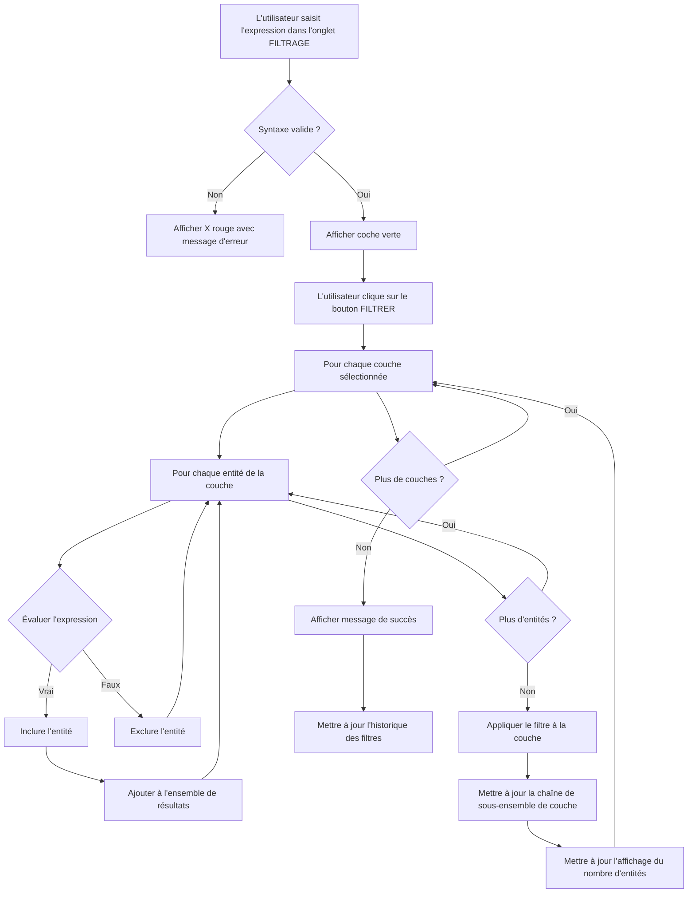

# Bases du filtrage

Apprenez à filtrer des données vectorielles en utilisant les expressions QGIS et les conditions d'attributs dans l'onglet **FILTRAGE** de FilterMate.

## Aperçu

L'**onglet FILTRAGE** est votre centre de contrôle pour configurer tous les types de filtres sur les couches vectorielles. Il offre trois capacités de filtrage principales :

1. **Filtrage par attributs** - Filtrer les entités en fonction de leurs valeurs d'attributs en utilisant les expressions QGIS
2. **Filtrage géométrique** - Filtrer selon des relations spatiales (voir [Filtrage géométrique](geometric-filtering.md))
3. **Opérations de tampon** - Ajouter des zones de proximité pour l'analyse spatiale (voir [Opérations de tampon](buffer-operations.md))

Cette page se concentre sur le **filtrage par attributs** en utilisant les expressions QGIS.

:::tip Emplacement
Toutes les opérations de filtrage sont configurées dans l'onglet **FILTRAGE** en haut du panneau FilterMate. Ne confondez pas avec l'onglet EXPLORATION, qui fonctionne uniquement sur la couche active actuelle.
:::

## Composants de l'onglet FILTRAGE

### Sélection de couches

Avant de filtrer, vous devez sélectionner une ou plusieurs couches sources :


*Sélection multiple de couches avec indicateurs de type de géométrie (point/ligne/polygone)*

**Fonctionnalités** :
- **Sélection multiple** : Cochez plusieurs couches pour les filtrer simultanément
- **Icônes de géométrie** : Indication visuelle du type de couche (🔵 Point, 🟢 Ligne, 🟪 Polygone)
- **Badges de backend** : Affiche le type de source de données (PostgreSQL⚡, Spatialite, OGR)
- **Couche courante automatique** : Bouton bascule pour utiliser automatiquement la couche active de QGIS


*Basculer le mode "Couche courante automatique"*

Lorsque "Couche courante automatique" est activé, FilterMate sélectionne automatiquement la couche active dans QGIS, rendant le filtrage rapide plus pratique.

**Affichage des informations de couche** :


*Informations sur la couche : type de fournisseur, nombre d'entités, SCR*

Affiche les détails critiques de la couche :
- Type de fournisseur (PostgreSQL, Spatialite, OGR)
- Nombre total d'entités
- Système de coordonnées de référence (SCR)
- Champ de clé primaire

### Constructeur d'expression

FilterMate utilise les **expressions QGIS** pour filtrer les entités. Ces expressions sont évaluées par rapport aux attributs de chaque entité pour déterminer quelles entités doivent être incluses dans le résultat.


*Constructeur d'expression avec saisie en texte libre*

**Fonctionnalités clés** :
- Saisie d'expression en texte libre
- Validation de syntaxe en temps réel
- Accès à toutes les fonctions d'expression QGIS
- Autocomplétion des noms de champs

**Liste des champs** :

La liste des champs affiche :
- Tous les champs d'attributs de la ou des couches sélectionnées
- Type de données pour chaque champ
- Cliquer sur un champ l'insère dans l'expression

### Validation d'expression

FilterMate valide vos expressions en temps réel :

**Expression valide** :
*Coche verte (✓) indique une expression valide*

**Expression invalide** :
*X rouge (✗) avec message d'erreur détaillé*

Les messages d'erreur affichent :
- Ligne et colonne de l'erreur de syntaxe
- Description du problème
- Suggestions de correction

## Concepts clés

- **Expression** : Une formule qui s'évalue à `vrai` ou `faux` pour chaque entité
- **Attribut** : Une propriété d'une entité (par ex., `population`, `nom`, `superficie`)
- **Opérateur** : Symboles de comparaison comme `=`, `>`, `<`, `LIKE`, `IN`
- **Fonction** : Opérations intégrées comme `upper()`, `length()`, `year()`

## Syntaxe d'expression

### Comparaisons de base

```sql
-- Comparaisons numériques
population > 100000
superficie >= 50
annee = 2024

-- Comparaisons de texte (sensible à la casse)
nom = 'Paris'
statut != 'inactif'

-- Recherche de texte (insensible à la casse)
upper(nom) LIKE '%VILLE%'
nom ILIKE 'paris'
```

### Conditions multiples

```sql
-- AND : Toutes les conditions doivent être vraies
population > 50000 AND superficie < 100

-- OR : Au moins une condition doit être vraie
type = 'ville' OR type = 'bourg'

-- Combinaisons complexes
(population > 100000 OR capitale = 'oui') AND pays = 'France'
```

### Travailler avec les valeurs NULL

```sql
-- Vérifier NULL
nom IS NULL
description IS NOT NULL

-- Gestion sûre de NULL
COALESCE(population, 0) > 0
```

## Modèles de filtrage courants

### Filtrage de texte

#### Correspondance exacte
```sql
-- Sensible à la casse
ville = 'Lyon'

-- Insensible à la casse
upper(ville) = 'LYON'
```

#### Correspondance de motif
```sql
-- Commence par
nom LIKE 'Saint%'

-- Contient (insensible à la casse)
nom ILIKE '%sur-mer%'

-- Se termine par
nom LIKE '%ville'

-- Motifs multiples
nom LIKE 'Paris%' OR nom LIKE 'Lyon%'
```

#### Valeurs multiples
```sql
-- Opérateur IN
statut IN ('actif', 'en attente', 'révision')

-- NOT IN
pays NOT IN ('France', 'Allemagne')
```

### Filtrage numérique

#### Requêtes de plage
```sql
-- Entre
population BETWEEN 10000 AND 50000

-- Équivalent à
population >= 10000 AND population <= 50000

-- Hors plage
population NOT BETWEEN 10000 AND 50000
```

#### Opérations arithmétiques
```sql
-- Valeurs calculées
densite > population / superficie

-- Pourcentage
(ventes / objectif) * 100 > 80

-- Arrondir les valeurs
round(superficie, 2) = 123.45
```

### Filtrage de dates

#### Comparaisons de dates de base
```sql
-- Date spécifique
date = '2024-01-15'

-- Plage de dates
date >= '2024-01-01' AND date < '2024-02-01'

-- Année
year(date) = 2024

-- Mois
month(date) = 6
```

#### Dates relatives
```sql
-- Enregistrements récents
date >= now() - interval '7 days'

-- L'année dernière
year(date) = year(now()) - 1

-- Mois actuel
year(date) = year(now()) AND month(date) = month(now())
```

## Fonctions de chaîne

### Conversion de casse
```sql
-- Majuscules
upper(nom) = 'PARIS'

-- Minuscules
lower(nom) = 'paris'
```

### Opérations sur les chaînes
```sql
-- Concaténation
nom || ' ' || pays = 'Paris France'

-- Longueur
length(nom) > 10

-- Sous-chaîne
substr(code, 1, 2) = 'FR'

-- Supprimer les espaces
trim(nom) = 'Lyon'
```

### Correspondance de motif
```sql
-- Expression régulière
regexp_match(nom, '^[A-Z]{2}[0-9]{3}$')

-- Remplacer
replace(nom, 'Saint', 'St') = 'St-Denis'
```

## Flux d'expression

FilterMate traite les expressions en plusieurs étapes :



**Étapes clés** :
1. **Saisie d'expression** : Taper ou construire l'expression dans l'onglet FILTRAGE
2. **Validation** : Vérification en temps réel des erreurs de syntaxe (✓ ou ✗)
3. **Appliquer le filtre** : Cliquer sur le bouton FILTRER pour exécuter
4. **Traitement** : Le backend (PostgreSQL/Spatialite/OGR) évalue l'expression
5. **Résultats** : Entités filtrées affichées, nombre d'entités mis à jour
6. **Historique** : Filtre enregistré dans l'historique pour réutilisation

## Flux de travail de filtrage étape par étape

### Exemple complet : Filtrer les villes par population

**Scénario** : Trouver toutes les villes avec une population supérieure à 100 000

**Étape 1 - Ouvrir l'onglet FILTRAGE**


*Basculer vers l'onglet FILTRAGE dans le panneau FilterMate*

**Étape 2 - Sélectionner la couche source**


- Cocher la couche "COMMUNE" dans le sélecteur de couches
- Vérifier que les informations de couche sont affichées (nombre d'entités, SCR)

**Étape 3 - Saisir l'expression**


*Taper l'expression : `population > 100000`*

**Étape 4 - Vérifier la liste des champs**

*Vérifier les champs disponibles : population (Integer64), nom (String), superficie (Double)*

Vous pouvez cliquer sur les champs pour les insérer dans l'expression.

**Étape 5 - Valider l'expression**
<!--  confirme une expression valide*

Le validateur affiche :
- ✓ La syntaxe est correcte
- Aperçu du nombre estimé d'entités (optionnel, si activé)

**Étape 6 - Appliquer le filtre**


*Cliquer sur le bouton FILTRER → La barre de progression s'affiche pendant le traitement*

**Étape 7 - Voir les résultats**
<!-- 

**Retour visuel** :
- ✅ **Coche verte** : L'expression est valide et prête à être appliquée
- ❌ **X rouge** : Erreur de syntaxe détectée, voir le message d'erreur
- ⚠️ **Avertissement orange** : Expression valide mais peut avoir des problèmes de performance

### Tester contre des entités d'exemple

Pour les expressions complexes, vous pouvez tester avec des données réelles :

1. Activer "Aperçu d'expression" dans l'onglet Configuration
2. Le constructeur d'expression montre combien d'entités correspondent
3. Ajuster l'expression en fonction des résultats de l'aperçu

:::tip
Pour les très grandes couches (> 100k entités), l'aperçu peut être désactivé pour les performances. Dans ce cas, appliquez le filtre et vérifiez le nombre de résultats.
:::

### Erreurs courantes

#### Erreurs de syntaxe
```sql
-- ❌ Incorrect : Guillemets manquants autour du texte
nom = Paris

-- ✅ Correct : Texte entre guillemets
nom = 'Paris'

-- ❌ Incorrect : Parenthèses non équilibrées
(population > 1000 AND superficie < 50

-- ✅ Correct : Parenthèses équilibrées
(population > 1000 AND superficie < 50)
```

**FilterMate affiche** : "Erreur de syntaxe à la colonne 11 : ')' attendu"

#### Incompatibilités de type
```sql
-- ❌ Incorrect : Comparer un champ texte à un nombre
nom > 100

-- ✅ Correct : Convertir en nombre si nécessaire
to_int(nom) > 100

-- ❌ Incorrect : Utiliser un opérateur numérique sur du texte
code_ville + 100

-- ✅ Correct : Concaténer comme texte
code_ville || '100'
```

**FilterMate affiche** : "Erreur de type : impossible de comparer String et Integer"

#### Gestion de NULL
```sql
-- ❌ Incorrect : Les comparaisons NULL retournent toujours faux
population = NULL

-- ✅ Correct : Utiliser IS NULL
population IS NULL

-- ❌ Incorrect : NULL dans l'arithmétique casse le calcul
population + revenu > 50000

-- ✅ Correct : Gérer NULL explicitement
COALESCE(population, 0) + COALESCE(revenu, 0) > 50000
```

**FilterMate affiche** : "Avertissement : L'expression peut retourner des résultats inattendus avec des valeurs NULL"

#### Erreurs de nom de champ
```sql
-- ❌ Incorrect : Le champ n'existe pas
popilation > 1000  -- Faute de frappe !

-- ✅ Correct : Utiliser la liste des champs pour éviter les fautes de frappe
population > 1000

-- ❌ Incorrect : Nom de champ avec espaces, pas de guillemets
Population 2024 > 1000

-- ✅ Correct : Mettre entre guillemets les noms de champs avec espaces
"Population 2024" > 1000
```

**FilterMate affiche** : "Champ 'popilation' introuvable dans la couche"

### Conseils de débogage

1. **Commencer simple** : Construire des expressions complexes de manière incrémentale
   ```sql
   -- Étape 1 : Tester une comparaison de base
   population > 100000
   
   -- Étape 2 : Ajouter une deuxième condition
   population > 100000 AND superficie > 50
   
   -- Étape 3 : Ajouter une troisième condition
   population > 100000 AND superficie > 50 AND statut = 'actif'
   ```

2. **Utiliser la liste des champs** : Cliquer sur les champs pour les insérer correctement
   - Évite les fautes de frappe
   - Gère automatiquement les caractères spéciaux
   - Ajoute des guillemets appropriés pour les noms de champs avec espaces

3. **Vérifier les types de données** : Voir la liste des champs pour connaître les types de données
   - Integer64 : Utiliser des comparaisons numériques (`>`, `<`, `=`)
   - String : Utiliser des fonctions de texte (`LIKE`, `upper()`, `||`)
   - Date : Utiliser des fonctions de date (`year()`, `month()`, `age()`)

4. **Tester d'abord sur un petit sous-ensemble** : 
   - Ajouter une clause `LIMIT` pour le test : `population > 100000 LIMIT 10`
   - Supprimer LIMIT une fois l'expression validée

## Bonnes pratiques

### Conseils de performance

1. **Expressions compatibles avec les index**
   ```sql
   -- ✅ Bon : Utilise l'index
   population > 100000
   
   -- ❌ Lent : Empêche l'utilisation de l'index
   population * 2 > 200000
   ```

2. **Éviter les fonctions complexes sur les grands ensembles de données**
   ```sql
   -- ✅ Rapide : Comparaison simple
   annee = 2024
   
   -- ⚠️ Plus lent : Appel de fonction par entité
   year(date) = 2024
   ```

3. **Filtrer tôt**
   - Appliquer d'abord les filtres simples
   - Utiliser les filtres géométriques après les filtres d'attributs
   - Combiner les conditions efficacement

### Lisibilité

1. **Utiliser des noms de colonnes clairs**
   ```sql
   -- ✅ Clair
   "Population 2024" > 100000
   
   -- ❌ Peu clair
   "col_23" > 100000
   ```

2. **Formater les expressions complexes**
   ```sql
   -- Multi-ligne pour la lisibilité
   (
       statut = 'actif'
       AND population > 50000
   )
   OR (
       statut = 'en attente'
       AND priorite = 'haute'
   )
   ```

3. **Commenter la logique complexe**
   ```sql
   -- Grandes villes ou capitales régionales
   population > 100000 OR capitale = 'regionale'
   ```

## Exemples pratiques

### Urbanisme
```sql
-- Zones résidentielles à forte densité
zone = 'residentielle' AND densite > 100 AND annee_construction >= 2000

-- Opportunités de développement à usage mixte
(zone = 'commerciale' OR zone = 'mixte') AND superficie_disponible > 1000
```

### Analyse environnementale
```sql
-- Aires naturelles protégées de plus de 50 hectares
statut_protection = 'protege' AND superficie >= 500000 AND type_habitat IN ('foret', 'zone humide')

-- Plans d'eau avec problèmes de qualité
type_eau IN ('riviere', 'lac') AND indice_qualite < 60
```

### Transport
```sql
-- Routes principales nécessitant un entretien
classe_route IN ('autoroute', 'majeure') AND etat = 'mauvais' AND comptage_trafic > 10000

-- Arrêts de transport en commun dans des zones mal desservies
frequence_service < 4 AND population_a_proximite > 5000
```

## Sujets connexes

- [Filtrage géométrique](geometric-filtering.md) - Prédicats spatiaux et couches de référence dans l'onglet FILTRAGE
- [Opérations de tampon](buffer-operations.md) - Ajouter des zones de proximité dans l'onglet FILTRAGE
- [Aperçu de l'interface](interface-overview.md) - Guide complet des composants de l'onglet FILTRAGE
- [Historique des filtres](filter-history.md) - Gérer et réutiliser les filtres enregistrés

## Prochaines étapes

Maintenant que vous comprenez le filtrage par attributs dans l'onglet FILTRAGE, découvrez :

1. **[Filtrage géométrique](geometric-filtering.md)** - Ajouter des prédicats spatiaux pour trouver des entités en fonction de leur emplacement
2. **[Opérations de tampon](buffer-operations.md)** - Créer des zones de proximité pour l'analyse spatiale
3. **[Exporter des entités](export-features.md)** - Enregistrer vos résultats filtrés dans divers formats

**Flux de travail complet** : Voir [Guide de démarrage rapide](../getting-started/quick-start.md) pour un exemple de filtrage étape par étape.
