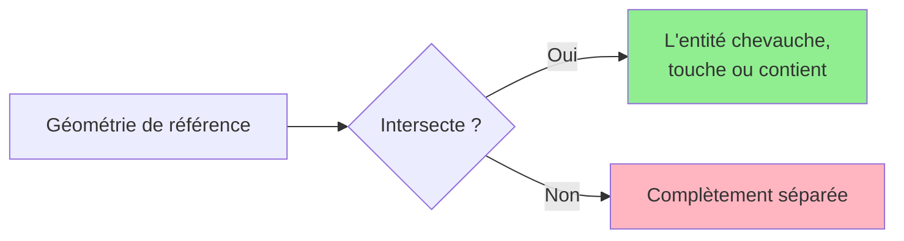
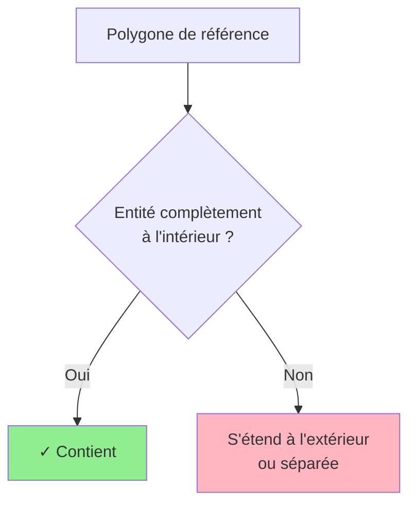
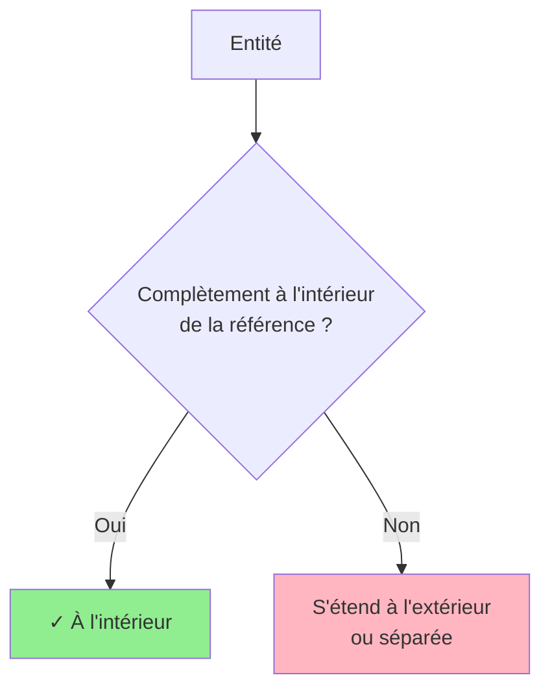
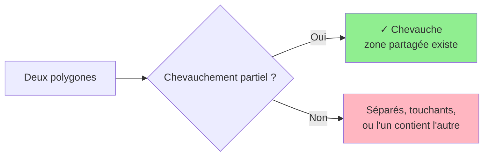
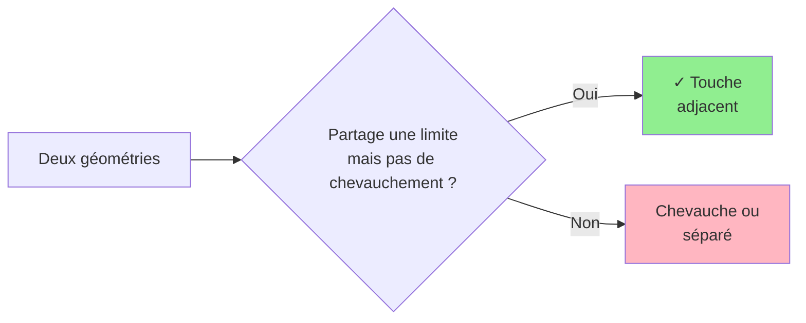
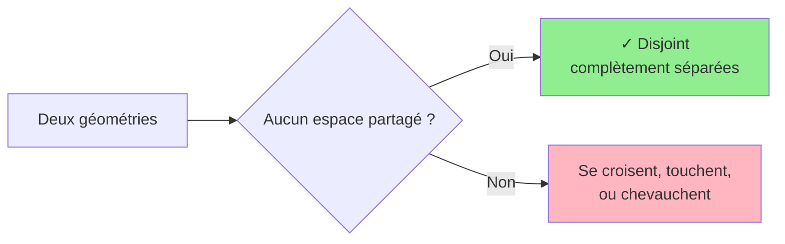
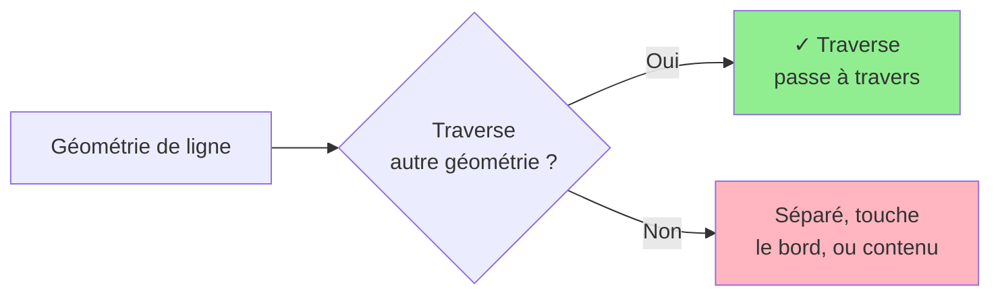
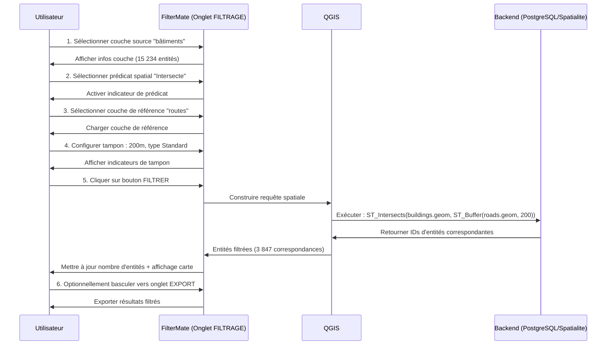

# Filtrage géométrique

Filtrez les entités en fonction de leurs relations spatiales avec d'autres géométries en utilisant les prédicats géométriques et le sélecteur de couche de référence de l'onglet **FILTRAGE**.

## Aperçu

Le filtrage géométrique dans FilterMate vous permet de sélectionner des entités en fonction de leurs **relations spatiales** avec une couche de référence. Ceci est configuré dans le même onglet **FILTRAGE** où vous configurez les filtres d'attributs.

**Composants clés dans l'onglet FILTRAGE** :
- **Prédicats spatiaux** : Sélection multiple de relations géométriques (Intersecte, Contient, À l'intérieur, etc.)
- **Couche de référence** : Choisir la couche à comparer
- **Opérateur de combinaison** : Utiliser ET/OU lorsque plusieurs prédicats sont sélectionnés
- **Intégration de tampon** : Combiner avec des zones tampons pour l'analyse de proximité

 

*Sélection multiple de prédicats spatiaux dans l'onglet FILTRAGE*

 

*Sélectionner la couche de référence pour la comparaison spatiale*

 

*Choisir ET/OU pour combiner plusieurs prédicats*

### Cas d'usage courants

- **Inclusion** : Trouver des parcelles dans une commune
- **Intersection** : Identifier les routes traversant une plaine inondable
- **Proximité** : Sélectionner les bâtiments près d'une station de transport (avec tampon)
- **Adjacence** : Trouver des polygones voisins

:::tip Emplacement
Tout le filtrage géométrique est configuré dans l'onglet **FILTRAGE**, aux côtés des filtres d'attributs. Ne confondez pas avec l'onglet **EXPLORATION**, qui sert à visualiser et sélectionner des entités de la couche actuelle.
:::

## Prédicats spatiaux

### Intersecte

Entités qui **partagent un espace** avec la géométrie de référence.



**Exemples de cas d'usage :**
- Routes traversant un district
- Propriétés touchant une rivière
- Parcelles à l'intérieur ou chevauchant une zone

**Expression :**
```sql
intersects($geometry, geometry(get_feature('zones', 'id', 1)))
```

### Contient

La géométrie de référence **contient complètement** l'entité (l'entité est entièrement à l'intérieur).



**Exemples de cas d'usage :**
- Bâtiments entièrement dans une parcelle
- Parcs complètement à l'intérieur des limites de la ville
- Points à l'intérieur de polygones

**Expression :**
```sql
contains(
    geometry(get_feature('parcels', 'id', @selected_parcel_id)),
    $geometry
)
```

### À l'intérieur

L'entité est **complètement à l'intérieur** de la géométrie de référence (inverse de Contient).



**Exemples de cas d'usage :**
- Trouver dans quel district se trouve un point
- Propriétés entièrement dans une zone
- Entités contenues par une limite

**Expression :**
```sql
within($geometry, geometry(get_feature('districts', 'name', 'Centre-ville')))
```

### Chevauche

Entités qui **se chevauchent partiellement** (zone partagée, mais aucune ne contient l'autre).



**Exemples de cas d'usage :**
- Zones d'utilisation des sols qui se chevauchent
- Revendications de propriété conflictuelles
- Limites administratives qui se croisent

**Expression :**
```sql
overlaps($geometry, geometry(get_feature('zones', 'type', 'commercial')))
```

### Touche

Entités qui **partagent une limite** mais ne se chevauchent pas.



**Exemples de cas d'usage :**
- Parcelles adjacentes
- Unités administratives voisines
- Segments de route connectés

**Expression :**
```sql
touches($geometry, geometry(get_feature('parcels', 'id', @parcel_id)))
```

### Disjoint

Entités qui **ne partagent aucun espace** (complètement séparées).



**Exemples de cas d'usage :**
- Entités en dehors d'une zone restreinte
- Régions non adjacentes
- Entités isolées

**Expression :**
```sql
disjoint($geometry, geometry(get_feature('restricted', 'id', 1)))
```

### Traverse

Une ligne **traverse** un polygone ou une autre ligne.



**Exemples de cas d'usage :**
- Routes traversant les limites de district
- Pipelines passant à travers des zones
- Sentiers croisant des rivières

**Expression :**
```sql
crosses($geometry, geometry(get_feature('districts', 'name', 'Industriel')))
```

## Fonctions géométriques

### Calculs de distance

```sql
-- Entités à moins de 500 mètres
distance($geometry, geometry(get_feature('stations', 'id', 1))) < 500

-- Trouver les entités les plus proches
distance($geometry, @reference_geom) < @max_distance
```

### Superficie et longueur

```sql
-- Grands polygones (superficie en unités cartographiques)
area($geometry) > 10000

-- Longues routes (longueur en unités cartographiques)
length($geometry) > 1000

-- Périmètre
perimeter($geometry) > 500
```

### Opérations sur le centroïde

```sql
-- Entités dont le centroïde est dans un polygone
within(
    centroid($geometry),
    geometry(get_feature('zones', 'type', 'residentiel'))
)

-- Distance depuis le centroïde
distance(
    centroid($geometry),
    make_point(lon, lat)
) < 1000
```

## Combinaison de filtres

### Spatial + Attribut

```sql
-- Bâtiments résidentiels près des transports
zone_type = 'residentiel'
AND distance($geometry, geometry(get_feature('transit', 'id', 1))) < 500
```

### Conditions spatiales multiples

```sql
-- Dans le district mais pas dans la zone restreinte
within($geometry, geometry(get_feature('districts', 'id', 5)))
AND disjoint($geometry, geometry(get_feature('restricted', 'id', 1)))
```

### Scénarios complexes

```sql
-- Propriétés près de la rivière mais en dehors de la plaine inondable
distance($geometry, geometry(get_feature('rivers', 'name', 'Rivière principale'))) < 200
AND NOT within($geometry, geometry(get_feature('floodplain', 'risk', 'elevé')))
AND property_type = 'residentiel'
```

## Exemple de flux de travail : Filtrage géométrique

**Flux de travail complet pour trouver des bâtiments près de routes avec tampon :**



### Étape par étape : Filtre géométrique complet

**Scénario** : Trouver des bâtiments à moins de 200m de routes

<!-- <!-- *

<!-- <!-- *

<!-- <!-- *

<!-- <!-- *

<!-- <!-- *

**Logique de l'opérateur de combinaison** :
- **ET** : L'entité doit satisfaire TOUS les prédicats sélectionnés
- **OU** : L'entité doit satisfaire AU MOINS UN prédicat

```sql
-- Exemple ET : Doit intersecte ET toucher
ST_Intersects(geom, ref) AND ST_Touches(geom, ref)

-- Exemple OU : Peut intersecte OU toucher
ST_Intersects(geom, ref) OR ST_Touches(geom, ref)
```

## Comportement spécifique au backend

### PostgreSQL (Le plus rapide)

```sql
-- Utilise l'index spatial GIST
ST_Intersects(geometry, reference_geometry)
```

- ✅ Support complet d'index spatial
- ✅ Optimisé pour les grands ensembles de données
- ✅ Accélération matérielle

### Spatialite (Rapide)

```sql
-- Utilise l'index spatial R-tree
ST_Intersects(geometry, reference_geometry)
```

- ✅ Index spatial R-tree
- ✅ Bonnes performances pour les ensembles de données moyens
- ⚠️ Plus lent que PostgreSQL pour les requêtes complexes

### OGR (Solution de secours)

```sql
-- Pas d'index spatial
-- Scanne toutes les entités
```

- ❌ Pas d'index spatial
- ⚠️ Les performances se dégradent avec la taille
- ✓ Compatibilité universelle

:::tip Conseil de performance
Pour les grands ensembles de données avec des requêtes spatiales fréquentes, utilisez **PostgreSQL** avec des index GIST pour de meilleures performances.
:::

## Exemples pratiques

### Urbanisme

#### Trouver des parcelles près des transports
```sql
-- À moins de 400m à pied
distance(
    centroid($geometry),
    geometry(get_feature('metro_stations', 'line', 'Rouge'))
) < 400
AND land_use = 'non développé'
```

#### Identifier les opportunités de développement
```sql
-- Grandes parcelles, pas dans les zones protégées
area($geometry) > 5000
AND disjoint($geometry, geometry(get_feature('protected_areas', 'status', 'actif')))
AND zone = 'usage mixte'
```

### Analyse environnementale

#### Impact des zones protégées
```sql
-- Projets intersectant des zones protégées
intersects(
    $geometry,
    geometry(get_feature('protected', 'category', 'faune'))
)
AND project_status = 'proposé'
```

#### Analyse de bassin versant
```sql
-- Propriétés dans le bassin versant
within(
    $geometry,
    geometry(get_feature('watersheds', 'name', 'Bassin principal'))
)
AND distance($geometry, geometry(get_feature('rivers', 'id', 1))) < 100
```

### Services d'urgence

#### Analyse de couverture
```sql
-- Zones NON couvertes par les casernes de pompiers (>5km)
distance(
    centroid($geometry),
    aggregate('fire_stations', 'collect', $geometry)
) > 5000
```

#### Routes d'évacuation
```sql
-- Routes dans la zone d'évacuation
intersects(
    $geometry,
    buffer(geometry(get_feature('hazard', 'type', 'inondation')), 1000)
)
AND road_type IN ('autoroute', 'majeure')
```

## Optimisation des performances

### 1. Utiliser les index spatiaux

Assurez-vous que les index spatiaux existent :

**PostgreSQL :**
```sql
CREATE INDEX idx_geom ON table_name USING GIST (geometry);
```

**Spatialite :**
```sql
SELECT CreateSpatialIndex('table_name', 'geometry');
```

### 2. Simplifier les géométries de référence

```sql
-- Simplifier avant le filtrage (plus rapide)
intersects(
    $geometry,
    simplify(geometry(get_feature('complex_polygon', 'id', 1)), 10)
)
```

### 3. Filtrer d'abord les attributs

```sql
-- ✅ Rapide : Filtrer par attribut d'abord
status = 'actif'
AND intersects($geometry, @reference_geom)

-- ❌ Plus lent : Filtre spatial d'abord
intersects($geometry, @reference_geom)
AND status = 'actif'
```

### 4. Utiliser les vérifications de boîte englobante

```sql
-- Vérification rapide de boîte englobante avant opération spatiale coûteuse
bbox($geometry, @reference_geom)
AND intersects($geometry, @reference_geom)
```

## Dépannage

### Géométries invalides

```sql
-- Vérifier la validité de la géométrie
is_valid($geometry)

-- Réparer les géométries invalides (si nécessaire)
make_valid($geometry)
```

### Reprojection SCR {#crs-reprojection}

FilterMate gère automatiquement les transformations de système de coordonnées de référence (SCR) lors du filtrage de couches avec différentes projections.

**Comportement automatique** :
- Les couches cible et de référence peuvent utiliser des SCR différents
- FilterMate reprojette à la volée pour les opérations spatiales
- Vous verrez l'indicateur 🔄 dans les journaux lors de la reprojection

**Meilleures pratiques** :
1. **Utiliser un SCR projeté** pour des calculs de distance précis (par ex., EPSG:3857, zones UTM locales)
2. **Éviter les SCR géographiques** (EPSG:4326) pour les opérations de tampon - utiliser des mètres au lieu de degrés
3. **Vérifier les résultats** après reprojection avec inspection visuelle

**Exemple** :
```
Couche A : EPSG:4326 (WGS84) - Coordonnées globales
Couche B : EPSG:2154 (Lambert 93) - Projection France
FilterMate : Reprojette automatiquement pour la comparaison ✓
```

:::tip Note de performance
Les transformations SCR fréquentes peuvent ralentir les opérations sur de grands ensembles de données. Pour de meilleures performances, assurez-vous que vos couches partagent le même SCR avant le filtrage.
:::

### Résultats vides

1. **Vérifier la compatibilité SCR** - Assurez-vous que les couches utilisent des projections compatibles (voir [Reprojection SCR](#crs-reprojection))
2. **Vérifier la géométrie de référence** - Confirmer que l'entité de référence existe
3. **Tester des prédicats plus simples** - Essayer `intersects` avant `contains`
4. **Inspecter les géométries** - Vérifier les géométries NULL ou invalides

### Problèmes de performance

1. **Vérifier les index spatiaux** - Vérifier que les index existent et sont à jour
2. **Simplifier les géométries** - Réduire le nombre de sommets si possible
3. **Utiliser le backend approprié** - PostgreSQL pour les grands ensembles de données
4. **Diviser les requêtes complexes** - Diviser en plusieurs filtres plus simples

## Sujets connexes

- [Opérations de tampon](./buffer-operations) - Configurer des zones tampons dans l'onglet FILTRAGE pour l'analyse de proximité
- [Bases du filtrage](./filtering-basics) - Combiner les filtres géométriques avec les filtres d'attributs
- [Aperçu de l'interface](./interface-overview) - Guide complet des composants de l'onglet FILTRAGE
- [Exporter des entités](./export-features) - Exporter les résultats filtrés depuis l'onglet EXPORT

:::info Composants de l'onglet FILTRAGE
L'onglet FILTRAGE combine trois types de filtres :
1. **Filtres d'attributs** - Constructeur d'expression (voir [Bases du filtrage](./filtering-basics))
2. **Filtres géométriques** - Prédicats spatiaux + couche de référence (cette page)
3. **Opérations de tampon** - Zones de distance (voir [Opérations de tampon](./buffer-operations))

Les trois peuvent être utilisés ensemble dans une seule opération de filtrage.
:::

## Prochaines étapes

- **[Opérations de tampon](./buffer-operations)** - Ajouter des zones de proximité basées sur la distance aux filtres géométriques
- **[Exporter des entités](./export-features)** - Enregistrer les résultats filtrés dans divers formats

**Flux de travail complet** : Voir [Guide du premier filtre](../getting-started/first-filter) pour un exemple complet combinant filtres d'attributs, géométriques et tampons.
