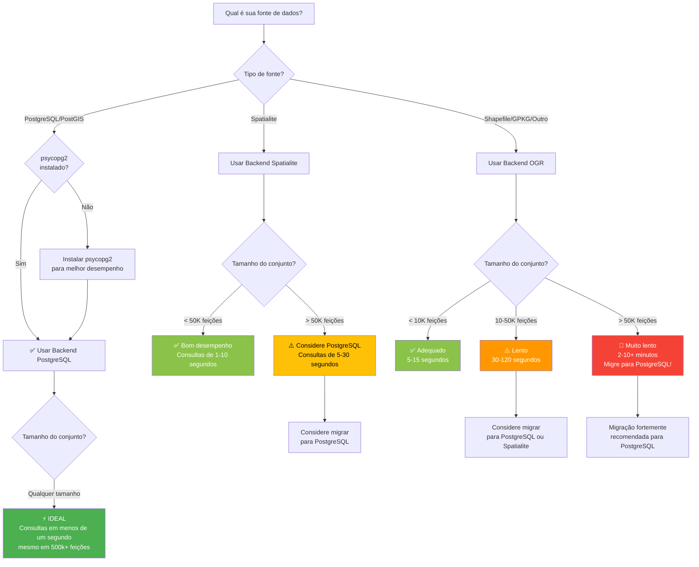

import Tabs from '@theme/Tabs';
import TabItem from '@theme/TabItem';

# Escolhendo o Backend Certo

Guia interativo para ajudá-lo a selecionar o backend ideal para seus dados e fluxo de trabalho.

## Árvore de decisão rápida



---

## Fatores de decisão

### 1. Tipo de fonte de dados

**Isso geralmente é determinado para você** - O FilterMate detecta automaticamente o provedor da sua camada.

| Sua camada é | Backend usado | Controle |
|--------------|---------------|----------|
| Conexão PostgreSQL/PostGIS | PostgreSQL (se psycopg2 instalado) | ⚙️ Instalar psycopg2 |
| Arquivo Spatialite (.sqlite) | Spatialite | ✓ Automático |
| Shapefile (.shp) | OGR | 💡 Migração possível |
| GeoPackage (.gpkg) | OGR ou Spatialite | 💡 Otimização possível |
| GeoJSON, KML, etc. | OGR | 💡 Migração possível |

---

### 2. Tamanho do conjunto de dados

**Fator mais importante** para o desempenho:

```
< 10.000 feições    → Qualquer backend funciona
10.000 - 50.000     → Spatialite recomendado
50.000 - 500.000    → PostgreSQL recomendado
> 500.000           → PostgreSQL obrigatório
```

**Como verificar a contagem de feições**:
1. Clique direito na camada → **Propriedades**
2. Aba **Informações**
3. Procure "Contagem de feições"

Ou no FilterMate:
- A contagem de feições é exibida no painel de informações da camada

---

### 3. Complexidade das consultas

**Consultas simples** (ou/ou):
- Filtragem apenas por atributos
- Um único predicado espacial
- Pequenas distâncias de buffer

→ Qualquer backend adequado

**Consultas complexas** (múltiplas):
- Filtragem atributo + espacial combinada
- Múltiplos predicados espaciais
- Grandes distâncias de buffer (>1km)
- Junções multi-camadas

→ PostgreSQL fortemente recomendado

---

### 4. Frequência de uso

**Uso ocasional** (mensal):
- O backend atual provavelmente está bom
- O desempenho é menos crítico

**Uso regular** (semanal):
- Otimize com Spatialite ou PostgreSQL
- Os ganhos de tempo se acumulam

**Uso diário** (fluxos de trabalho de produção):
- **Definitivamente use PostgreSQL**
- Aceleração de 10-50× = horas economizadas por semana

---

## Matriz de comparação de backends

### Desempenho

| Backend | 10K feições | 50K feições | 100K feições | 500K feições |
|---------|-------------|-------------|--------------|--------------|
| **PostgreSQL** | 0.1s ⚡ | 0.3s ⚡ | 0.8s ⚡ | 2.5s ⚡ |
| **Spatialite** | 0.4s ✓ | 4.5s ⏱️ | 18s ⏱️ | 120s ⚠️ |
| **OGR (GPKG)** | 2.1s | 25s ⏱️ | 95s 🐌 | 600s 🔴 |
| **OGR (SHP)** | 3.8s | 45s ⚠️ | 180s 🐌 | 1200s 🔴 |

*Tempos de consulta típicos para filtro espacial com buffer de 500m*

---

### Recursos

| Recurso | PostgreSQL | Spatialite | OGR |
|---------|------------|------------|-----|
| Indexação espacial | GIST ✅ | R-Tree ✅ | Limitado ⚠️ |
| Views materializadas | ✅ | Tabelas temp ✅ | Memória ⚠️ |
| Processamento no servidor | ✅ | Cliente ⚠️ | Cliente ⚠️ |
| Acesso concorrente | ✅ | Usuário único ⚠️ | Bloqueio de arquivo ⚠️ |
| Tamanho máx do conjunto | Ilimitado ✅ | ~1M feições ✓ | ~100K ⚠️ |
| Instalação | Requer servidor | Integrado ✅ | Integrado ✅ |
| psycopg2 obrigatório | ✅ | Não | Não |

---

### Prós e contras

#### Backend PostgreSQL

**Prós** ✅:
- Desempenho mais rápido (10-50× vs OGR)
- Lida com enormes conjuntos de dados (milhões de feições)
- Operações espaciais no servidor
- Índices espaciais automáticos
- Pronto para produção
- Acesso concorrente

**Contras** ⚠️:
- Requer servidor PostgreSQL
- Precisa do pacote Python psycopg2
- Configuração mais complexa
- Conhecimento de administração de banco de dados útil

**Ideal para**:
- Grandes conjuntos de dados (>50k feições)
- Fluxos de trabalho de produção
- Ambientes multi-usuário
- Uso regular/diário
- Consultas espaciais complexas

---

#### Backend Spatialite

**Prós** ✅:
- Bom desempenho para conjuntos de dados médios
- Baseado em arquivo (portátil)
- Sem servidor necessário
- Integrado ao QGIS
- Índices espaciais suportados
- Fácil de compartilhar

**Contras** ⚠️:
- Mais lento que PostgreSQL em grandes conjuntos de dados
- Usuário único (bloqueio de arquivo)
- Limitações de memória
- Não ideal para >100k feições

**Ideal para**:
- Conjuntos de dados médios (10k-50k feições)
- Projetos portáteis
- Fluxos de trabalho pessoais
- Sem servidor de banco de dados disponível
- Uso ocasional

---

#### Backend OGR

**Prós** ✅:
- Compatibilidade universal
- Funciona com qualquer formato de arquivo
- Sem dependências
- Configuração simples
- Integrado ao QGIS

**Contras** ⚠️:
- Desempenho mais lento
- Otimização espacial limitada
- Intensivo em memória
- Não recomendado para >50k feições
- Limitações de formato de arquivo

**Ideal para**:
- Pequenos conjuntos de dados (`<10k` feições)
- Consultas pontuais rápidas
- Formatos de arquivo legados
- Requisitos de compatibilidade
- Testes/prototipagem

---

## Caminhos de migração

### Shapefile → PostgreSQL

**Por que migrar**:
- Consultas 10-50× mais rápidas
- Sem limites de tamanho de arquivo
- Melhores tipos de dados
- Acesso concorrente

**Como**:
```bash
1. Instalar PostgreSQL + PostGIS
2. QGIS: Banco de dados → DB Manager → Importar camada
3. Origem: Seu Shapefile
4. Destino: Banco de dados PostgreSQL
5. Ativar índice espacial
6. Carregar camada PostgreSQL no QGIS
```

**Tempo estimado**: 5-15 minutos
**Ganho de desempenho**: 10-50×

Veja: [Guia de configuração PostgreSQL](../backends/postgresql)

---

### Shapefile → Spatialite

**Por que migrar**:
- 3-5× mais rápido que Shapefile
- Portabilidade em arquivo único
- Indexação espacial
- Melhores nomes de atributos (sem limite de 10 caracteres)

**Como**:
```bash
1. Caixa de ferramentas de processamento → Geral vetor → Empacotar camadas
2. Saída: Spatialite (.sqlite)
3. Marcar "Salvar estilos de camada"
4. Carregar arquivo .sqlite no QGIS
```

**Tempo estimado**: 2-5 minutos
**Ganho de desempenho**: 3-5×

---

### Spatialite → PostgreSQL

**Por que migrar**:
- 5-10× mais rápido em grandes conjuntos de dados
- Melhor escalabilidade
- Suporte multi-usuário

**Como**:
```bash
1. DB Manager → Importar camada
2. Origem: Camada Spatialite
3. Destino: PostgreSQL
4. Ativar índice espacial
```

**Tempo estimado**: 5-10 minutos
**Ganho de desempenho**: 5-10×

---

## Guias de instalação

### Instalar psycopg2 para backend PostgreSQL

<Tabs>
  <TabItem value="windows" label="Windows" default>
    ```bash
    # OSGeo4W Shell (Recomendado)
    # Abrir OSGeo4W Shell como Administrador
    # Executar:
    py3_env
    pip install psycopg2-binary
    
    # Reiniciar QGIS
    ```
  </TabItem>
  
  <TabItem value="linux" label="Linux">
    ```bash
    # Ubuntu/Debian
    sudo apt-get install python3-psycopg2
    
    # Ou via pip
    pip3 install psycopg2-binary
    ```
  </TabItem>
  
  <TabItem value="macos" label="macOS">
    ```bash
    # Usando pip
    /Applications/QGIS.app/Contents/MacOS/bin/pip3 install psycopg2-binary
    ```
  </TabItem>
</Tabs>

**Verificação**:
```python
# Console Python QGIS
import psycopg2
print(psycopg2.__version__)
# Deve imprimir o número da versão
```

---

## Resumo

### Lógica de seleção de backend

```
1. Verificar tipo de fonte de dados (detecção automática)
2. Contar feições do conjunto de dados
3. Considerar frequência de uso
4. Escolher backend:
   
   > 50k feições + uso regular → PostgreSQL
   10-50k feições → Spatialite
   < 10k feições → Formato atual está bom
```

### Pontos-chave

- **PostgreSQL**: Melhor desempenho, vale a configuração para >50k feições
- **Spatialite**: Bom equilíbrio para 10-50k feições, sem servidor necessário
- **OGR**: Compatibilidade universal mas mais lento, bom para `<10k` feições
- **Migração**: Fácil e vale a pena para grandes conjuntos de dados usados frequentemente

---

## Precisa de ajuda?

- 📖 [Configuração PostgreSQL](../backends/postgresql)
- 📖 [Guia Spatialite](../backends/spatialite)
- 📖 [Backend OGR](../backends/ogr)
- 📖 [Configuração](../advanced/configuration)
- 💬 [Pergunte no GitHub](https://github.com/sducournau/filter_mate/discussions)
