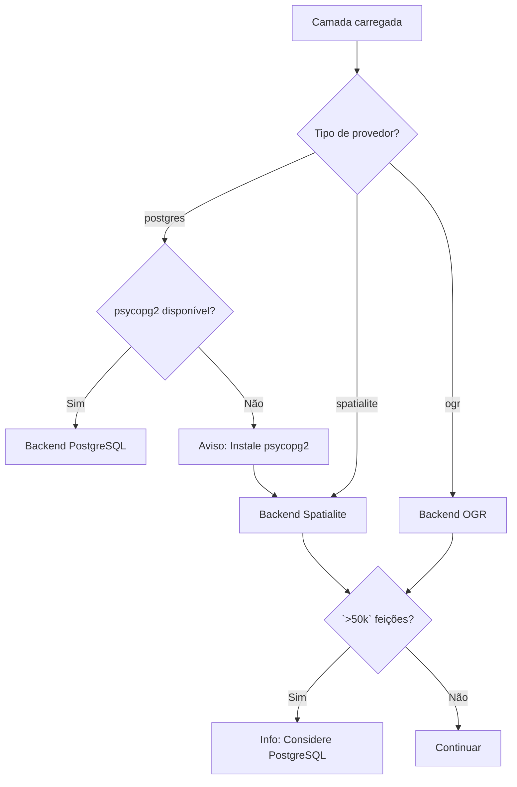

# Visão Geral dos Backends

O FilterMate usa uma **arquitetura multi-backend** para fornecer desempenho ideal em diferentes fontes de dados. O backend é selecionado automaticamente com base no tipo da sua camada — nenhuma configuração necessária.

## O que são Backends?

Backends são os motores que processam suas operações de filtragem. O FilterMate inclui três backends especializados otimizados para diferentes fontes de dados:

- **Backend PostgreSQL**: Processamento no servidor para velocidade máxima
- **Backend Spatialite**: Banco de dados local com índices espaciais
- **Backend OGR**: Compatibilidade universal para formatos de arquivo

:::tip Resposta rápida
**A maioria dos usuários não precisa se preocupar com backends!** O FilterMate escolhe automaticamente o melhor para seus dados. Basta carregar sua camada e filtrar.
:::

## Arquitetura

```
modules/backends/
  ├── base_backend.py        # Interface abstrata
  ├── postgresql_backend.py  # Backend PostgreSQL/PostGIS
  ├── spatialite_backend.py  # Backend Spatialite
  ├── ogr_backend.py         # Backend OGR universal
  └── factory.py             # Seleção automática de backend
```

## Lógica de seleção automática

O FilterMate seleciona inteligentemente o melhor backend com base na sua camada:



**Como funciona:**

1. **Detecta o tipo de provedor da camada** (PostgreSQL, Spatialite ou OGR)
2. **Verifica a disponibilidade do PostgreSQL** (psycopg2 está instalado?)
3. **Seleciona o backend ideal** com avisos de desempenho quando necessário
4. **Faz fallback graciosamente** se a melhor opção não estiver disponível

## Comparação de backends

| Recurso | PostgreSQL | Spatialite | OGR |
|---------|-----------|-----------|-----|
| **Velocidade (`<10k` feições)** | `<1s` ⚡ | `<1s` ⚡ | ~2s |
| **Velocidade (100k feições)** | ~2s ⚡ | ~8s | ~15s 🐌 |
| **Velocidade (1M feições)** | ~10s ⚡ | ~60s 🐌 | Timeout ❌ |
| **Operações concorrentes** | Excelente | Bom | Limitado |
| **Instalação** | Opcional (psycopg2) | Integrado ✓ | Integrado ✓ |
| **Fonte de dados** | PostgreSQL/PostGIS | Arquivos .sqlite | Shapefiles, GPKG, etc. |
| **Ideal para** | Grandes conjuntos (`>50k`) | Conjuntos médios (`<50k`) | Todos os formatos |

## Recursos dos backends

### Backend PostgreSQL

**Tecnologia**: Processamento no servidor com views materializadas

**Capacidades**:
- ✅ Views materializadas para filtragem ultra-rápida
- ✅ Índices espaciais nativos (GIST)
- ✅ Operações espaciais no servidor
- ✅ Suporte a operações concorrentes

**Usado automaticamente quando**:
- A fonte da camada é PostgreSQL/PostGIS
- psycopg2 está instalado
- **Recomendado para `>50k` feições**

**Desempenho**: O melhor da categoria para grandes conjuntos de dados

[Saiba mais →](./postgresql)

---

### Backend Spatialite

**Tecnologia**: Tabelas temporárias com índices R-tree

**Capacidades**:
- ✅ Índices espaciais R-tree
- ✅ Operações de banco de dados local
- ✅ Detecção automática de índices espaciais
- ✅ Nenhuma instalação adicional necessária

**Usado automaticamente quando**:
- A fonte da camada é Spatialite (.sqlite, .db)
- Sempre disponível
- **Ideal para `<50k` feições**

**Desempenho**: Bom equilíbrio entre velocidade e simplicidade

[Saiba mais →](./spatialite)

---

### Backend OGR

**Tecnologia**: Framework de processamento QGIS

**Capacidades**:
- ✅ Compatibilidade universal (Shapefiles, GeoPackage, CSV, etc.)
- ✅ Operações baseadas em memória
- ✅ Funciona com todos os formatos suportados pelo OGR
- ✅ Criação automática de índice espacial (v1.9+)

**Usado automaticamente quando**:
- A fonte da camada é baseada em arquivo (Shapefile, GeoPackage, etc.)
- Fallback quando PostgreSQL não está disponível
- **Funciona com qualquer fonte de dados**

**Desempenho**: Bom para conjuntos de dados pequenos a médios (`<10k`)

[Saiba mais →](./ogr)

---

## Verificando seu backend ativo

### Via mensagens do FilterMate

O FilterMate exibe mensagens informativas ao carregar camadas:

- **"Usando backend PostgreSQL"** → Modo PostgreSQL (melhor desempenho)
- **"Usando backend Spatialite"** → Modo Spatialite
- **"Usando backend OGR"** → Modo OGR (baseado em arquivo)

### Via Console Python

Abra **Plugins → Console Python** no QGIS:

```python
# Verificar disponibilidade do PostgreSQL
from modules.appUtils import POSTGRESQL_AVAILABLE
print(f"PostgreSQL disponível: {POSTGRESQL_AVAILABLE}")

# Verificar o backend da camada atual
from modules.backends.factory import BackendFactory

layer = iface.activeLayer()
backend = BackendFactory.create_backend(layer)
print(f"Backend: {backend.__class__.__name__}")
# Saída: PostgresqlBackend, SpatialiteBackend ou OgrBackend
```

## Requisito PostgreSQL

O FilterMate requer o pacote Python **psycopg2** para suporte ao PostgreSQL.

**Instalação:**

```bash
# Usando pip
pip install psycopg2-binary

# No Ubuntu/Debian
sudo apt-get install python3-psycopg2

# No macOS (com QGIS Homebrew)
/Applications/QGIS.app/Contents/MacOS/bin/pip3 install psycopg2-binary
```

**Verificar instalação:**

```python
import psycopg2
print(psycopg2.__version__)
# Esperado: '2.9.x (dt dec pq3 ext lo64)'
```

**Se não instalado:**
- Camadas PostgreSQL usarão a filtragem nativa do QGIS (mais lenta)
- Você verá um aviso: "psycopg2 não encontrado, usando fallback"
- Camadas Spatialite e OGR funcionam normalmente

## Otimizações de desempenho

O FilterMate inclui otimizações automáticas para todos os backends:

### Otimizações PostgreSQL
- **Views materializadas**: Consultas em menos de um segundo em tabelas de milhões de linhas
- **Índices GIST**: Operações espaciais otimizadas pelo PostgreSQL
- **Processamento no servidor**: Sem transferência de dados para o QGIS

### Otimizações Spatialite (v1.9+)
- **Tabelas temporárias com índices R-tree**: 44,6× mais rápido que operações em memória
- **Ordenação de predicados**: 2,3× mais rápido com avaliação ideal
- **Detecção de índices espaciais**: Usa automaticamente índices existentes

### Otimizações OGR (v1.9+)
- **Criação automática de índice espacial**: 19,5× mais rápido em grandes conjuntos de dados
- **Otimização de grandes conjuntos**: Melhoria de 3× para `>50k` feições
- **Processamento eficiente em memória**: Pegada de memória reduzida

### Otimizações universais
- **Cache de geometria**: 5× mais rápido para operações multi-camadas
- **Mecanismos de retry**: Lida automaticamente com bloqueios SQLite
- **Reparo de geometria**: Abordagem multi-estratégia para geometrias inválidas

## Solução de problemas

### Aviso "psycopg2 não encontrado"

**Sintoma**: Mensagem de aviso ao usar camadas PostgreSQL

**Solução**:
1. Instale psycopg2 (veja a seção de instalação acima)
2. Reinicie o QGIS
3. Recarregue sua camada

### Desempenho lento

**Sintoma**: A filtragem leva mais de 10 segundos

**Diagnóstico**:
- Verifique o backend no painel FilterMate (seção de informações da camada)
- Anote o tamanho do seu conjunto de dados (contagem de feições)

**Soluções**:
- **Backend OGR com `>10k` feições**: Converter para Spatialite ou PostgreSQL
- **Spatialite com `>50k` feições**: Migrar para PostgreSQL
- **PostgreSQL sem psycopg2**: Instalar psycopg2

Veja [Escolhendo o Backend certo](./choosing-backend) para guias de migração detalhados.

## Próximos passos

- **[Escolher um Backend](./choosing-backend)** - Árvore de decisão interativa para ajudá-lo a escolher o melhor backend
- **[Benchmarks de desempenho](./performance-benchmarks)** - Resultados detalhados dos benchmarks
- **[Configuração PostgreSQL](./postgresql)** - Configurar PostgreSQL para desempenho máximo
- **[Detalhes Spatialite](./spatialite)** - Conhecer as capacidades do Spatialite
- **[Limitações OGR](./ogr)** - Entender as restrições do backend OGR

- [Detalhes do Backend PostgreSQL](./postgresql)
- [Detalhes do Backend Spatialite](./spatialite)
- [Detalhes do Backend OGR](./ogr)
- [Comparação de desempenho](./performance-benchmarks)
- [Guia de seleção de backend](./choosing-backend)
