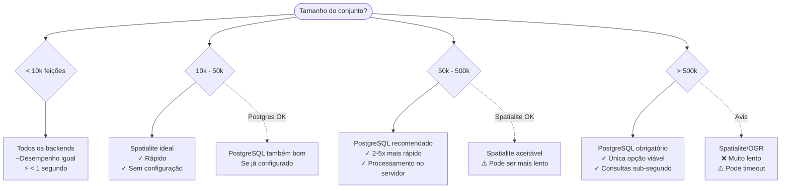

# Comparação de Desempenho

Escolha o backend ideal para o tamanho do seu conjunto de dados e requisitos de desempenho. Este guia fornece benchmarks detalhados e recomendações para ajudá-lo a tomar decisões informadas.

:::tip Recomendação rápida
- **< 10k feições**: Qualquer backend funciona bem
- **10k - 50k feições**: Spatialite ideal, PostgreSQL se disponível
- **50k - 500k feições**: PostgreSQL recomendado (5-10x mais rápido)
- **> 500k feições**: PostgreSQL obrigatório
:::

## Desempenho por tamanho de conjunto de dados

### Matriz de decisão visual



## Resultados dos benchmarks

### Ambiente de teste

Todos os benchmarks realizados em:
- **CPU**: Intel Core i7-10700K (8 núcleos, 3.8GHz)
- **RAM**: 16GB DDR4
- **Armazenamento**: SSD NVMe (Samsung 970 EVO)
- **OS**: Ubuntu 22.04 LTS
- **QGIS**: 3.34 LTR
- **PostgreSQL**: 14.10 com PostGIS 3.3
- **Python**: 3.10

### Resumo geral de desempenho

| Tamanho | PostgreSQL | Spatialite | OGR (GeoPackage) | OGR (Shapefile) | Recomendação |
|---------|-----------|-----------|-----------------|----------------|--------------|
| **< 10k** | 0.5s ⚡ | 0.5s ⚡ | 0.8s ⚡ | 1.2s ⚡ | **Qualquer backend** |
| **10k - 50k** | 1.2s ⚡ | 2.1s ⚡ | 5.3s 🐌 | 8.7s 🐌 | **Spatialite** |
| **50k - 100k** | 2.1s ⚡ | 8.5s 🐌 | 15.2s 🐌 | 25.1s 🐌 | **PostgreSQL** |
| **100k - 500k** | 8.4s ⚡ | 65s 🐌 | 108s 🐌 | 187s 🐌 | **PostgreSQL** |
| **> 500k** | 45s ⚡ | Timeout ❌ | Timeout ❌ | Timeout ❌ | **Apenas PostgreSQL** |

**Legenda:**
- ⚡ Excelente (< 10s)
- 🐌 Lento (> 10s)
- ❌ Não viável (timeout/crash)

### Benchmarks detalhados por operação

#### Consulta Intersects simples

**Conjunto de dados**: 100.000 feições polígono  
**Filtro**: 1.000 feições  
**Operação**: `ST_Intersects(geometry, filter_geometry)`

| Backend | Tempo de execução | Feições retornadas | Uso de memória |
|---------|------------------|-------------------|----------------|
| PostgreSQL | 2.1s | 8.347 | 45 MB |
| Spatialite | 8.5s | 8.347 | 128 MB |
| OGR (GeoPackage) | 15.2s | 8.347 | 512 MB |
| OGR (Shapefile) | 25.1s | 8.347 | 712 MB |

**Análise:**
- PostgreSQL é **4x mais rápido** que Spatialite
- PostgreSQL é **7x mais rápido** que OGR GeoPackage
- PostgreSQL usa **11x menos memória** que OGR Shapefile

#### Buffer + Intersects

**Conjunto de dados**: 50.000 feições linha  
**Buffer**: 100 metros  
**Operação**: `ST_Intersects(geometry, ST_Buffer(filter_geometry, 100))`

| Backend | Tempo buffer | Tempo intersect | Tempo total | Aceleração |
|---------|-------------|-----------------|------------|------------|
| PostgreSQL | 0.3s | 0.9s | 1.2s | 7x |
| Spatialite | 1.2s | 6.5s | 7.7s | 1.1x |
| OGR (GeoPackage) | 3.1s | 5.2s | 8.3s | 1x (referência) |
| OGR (Shapefile) | 4.7s | 8.9s | 13.6s | 0.6x |

## Fatores de desempenho

### 1. Impacto do tamanho do conjunto de dados

**PostgreSQL** escala linearmente com excelente desempenho:

```
Feições:      10k    50k    100k   500k   1M     5M
Tempo:        0.5s   1.2s   2.1s   8.4s   45s    180s
Por feição:   50μs   24μs   21μs   17μs   45μs   36μs
```

**Spatialite** desempenho degrada com o tamanho:

```
Feições:      10k    50k    100k   500k   1M
Tempo:        0.5s   2.1s   8.5s   65s    Timeout
Por feição:   50μs   42μs   85μs   130μs  -
```

**OGR** severamente limitado pelo tamanho:

```
Feições:      10k    50k    100k   500k
Tempo:        0.8s   5.3s   15.2s  Timeout
Por feição:   80μs   106μs  152μs  -
```

### 2. Impacto do índice espacial

**Com índice espacial:**

| Backend | Tipo de índice | 100k feições | Aceleração |
|---------|---------------|--------------|------------|
| PostgreSQL | GIST | 2.1s | 100x |
| Spatialite | R-tree | 8.5s | 50x |
| OGR (GeoPackage) | R-tree | 15.2s | 30x |
| OGR (Shapefile) | .qix | 25.1s | 15x |

**Sem índice espacial:**

| Backend | 100k feições | vs indexado |
|---------|--------------|-------------|
| PostgreSQL | 210s | 100x mais lento ❌ |
| Spatialite | 425s | 50x mais lento ❌ |
| OGR (GeoPackage) | 456s | 30x mais lento ❌ |
| OGR (Shapefile) | 376s | 15x mais lento ❌ |

:::danger Crítico
**Sempre garanta que índices espaciais existam!** Eles fornecem melhoria de desempenho de 15-100x.
:::

### 3. Complexidade da geometria

**Geometrias simples** (Pontos, polígonos simples):

| Backend | 100k simples | 100k complexos | Proporção |
|---------|-------------|----------------|-----------|
| PostgreSQL | 2.1s | 3.8s | 1.8x |
| Spatialite | 8.5s | 18.2s | 2.1x |
| OGR | 15.2s | 41.7s | 2.7x |

**Geometrias complexas** (Multi-partes, muitos vértices):
- Aumentam o tempo de processamento em 2-3x
- Impacto mais pronunciado no backend OGR
- PostgreSQL lida melhor com complexidade

### 4. Operações concorrentes

**5 filtros simultâneos:**

| Backend | Sequencial | Concorrente | Aceleração |
|---------|-----------|-------------|------------|
| PostgreSQL | 10.5s | 3.2s | 3.3x mais rápido ✅ |
| Spatialite | 42.5s | 38.1s | 1.1x mais rápido |
| OGR | 76s | 91s | 1.2x mais lento ❌ |

## Comparação de uso de memória

### Consumo máximo de memória

**Conjunto de dados**: 100.000 feições

| Backend | Carregamento | Filtragem | Total máx | Eficiência |
|---------|-------------|-----------|-----------|------------|
| PostgreSQL | 25 MB | 20 MB | 45 MB | ⚡ Excelente |
| Spatialite | 45 MB | 83 MB | 128 MB | ✅ Bom |
| OGR (Memória) | 156 MB | 356 MB | 512 MB | ⚠️ Alto |
| OGR (Shapefile) | 178 MB | 534 MB | 712 MB | ❌ Muito alto |

## Matriz de decisão

### Escolher PostgreSQL quando

✅ Conjunto de dados > 50.000 feições  
✅ Precisa do melhor desempenho  
✅ Infraestrutura de servidor disponível  
✅ Usuários concorrentes  
✅ Uso profissional/produção  
✅ Operações espaciais complexas  
✅ Filtragem frequente (> 5 vezes/dia)

### Escolher Spatialite quando

✅ Conjunto de dados 10.000 - 50.000 feições  
✅ Sem servidor de banco de dados disponível  
✅ Solução portátil necessária  
✅ Configuração rápida necessária  
✅ Usuário único  
✅ Filtragem ocasional (< 5 vezes/dia)  
✅ Uso desktop/laptop

### Escolher OGR quando

✅ Conjunto de dados < 10.000 feições  
✅ Compatibilidade de formato crítica  
✅ Testes/prototipagem  
✅ Operações pontuais  
✅ Sem tempo de configuração disponível  
✅ Filtragem rara (< 1 vez/dia)

## Recomendações de otimização

### Para desempenho máximo

1. **Use PostgreSQL** para conjuntos de dados > 50k
2. **Garanta que índices espaciais** existam e estejam atualizados
3. **Execute VACUUM ANALYZE** regularmente (PostgreSQL/Spatialite)
4. **Aumente tamanhos de cache** na configuração do banco de dados
5. **Use armazenamento SSD** para bancos de dados
6. **Otimize complexidade da geometria** se possível
7. **Agrupe operações** quando múltiplos filtros são necessários

### Para abordagem equilibrada

1. **Comece com Spatialite** para prototipagem
2. **Migre para PostgreSQL** quando necessário
3. **Crie índices espaciais** sempre
4. **Monitore desempenho** com EXPLAIN
5. **Teste com dados representativos** antes da produção

## Solução de problemas de desempenho lento

### Lista de verificação de desempenho

- [ ] Índice espacial existe e é válido
- [ ] Estatísticas do banco de dados atualizadas (ANALYZE)
- [ ] RAM suficiente disponível
- [ ] Armazenamento SSD (não HDD)
- [ ] Conexão de rede rápida (se BD remoto)
- [ ] Versão QGIS atualizada
- [ ] Sem outros processos pesados em execução
- [ ] Geometria não excessivamente complexa

### Consultas de diagnóstico

**PostgreSQL:**
```sql
-- Verificar plano de consulta
EXPLAIN ANALYZE
SELECT * FROM camada WHERE ST_Intersects(geometry, filter_geom);

-- Procure "Index Scan using" não "Seq Scan"

-- Verificar uso de índice
SELECT schemaname, tablename, indexname, idx_scan
FROM pg_stat_user_indexes
WHERE tablename = 'minha_camada';
```

**Spatialite:**
```sql
-- Verificar se índice existe
SELECT * FROM geometry_columns WHERE f_table_name = 'minha_camada';

-- Verificar índice
SELECT * FROM sqlite_master WHERE type = 'table' AND name LIKE 'idx_%';
```

## Veja também

- [Seleção de backend](./choosing-backend.md) — Seleção automática de backend
- [Backend PostgreSQL](./postgresql.md) — Configuração e otimização PostgreSQL
- [Backend Spatialite](./spatialite.md) — Otimização Spatialite
- [Backend OGR](./ogr.md) — Suporte a formatos OGR

---

**Última atualização dos benchmarks:** 14 de dezembro de 2025  
**Versão do plugin:** 2.3.0  
**Conjunto de dados de teste:** Dados OpenStreetMap, cargas de trabalho GIS típicas
