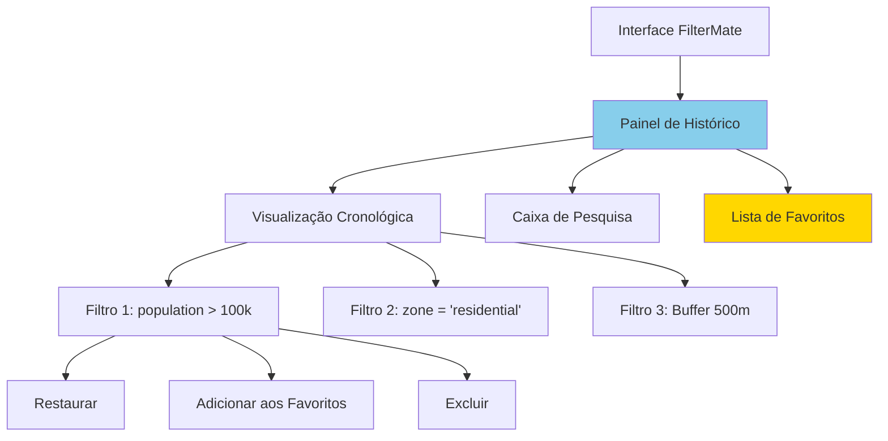
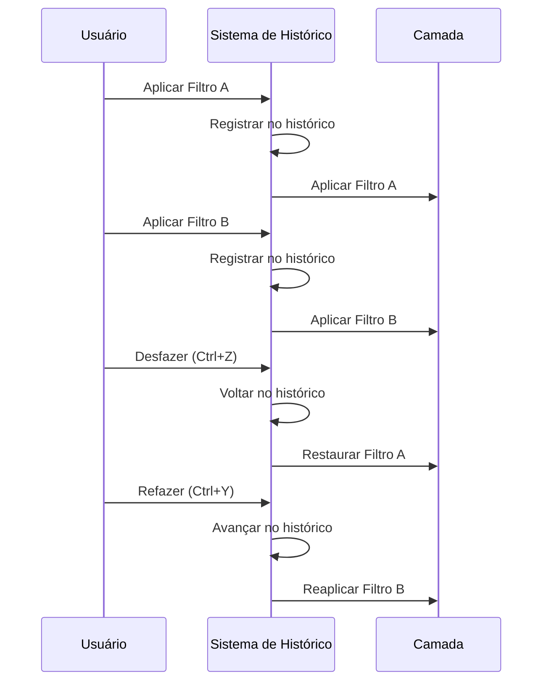
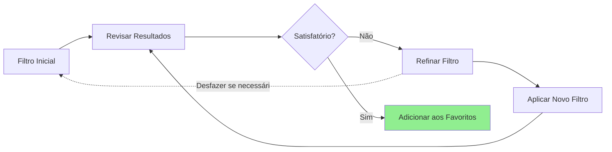

# Histórico de Filtros

Acompanhe, gerencie e reutilize seus filtros com o poderoso sistema de histórico do FilterMate com capacidades de desfazer/refazer.

:::tip Novo na v2.3.0
O sistema **Global Undo/Redo** agora captura atomicamente o estado de todas as camadas em cada operação de filtragem, permitindo restauração perfeita de estados anteriores. A detecção inteligente distingue automaticamente o modo "source-only" do modo "global".
:::

## Visão Geral

O sistema de **Histórico de Filtros** registra automaticamente cada filtro aplicado, permitindo que você:
- **Desfaça/Refaça** filtros rapidamente
- **Revise** operações de filtro passadas
- **Reutilize** padrões de filtros comuns
- **Compare** diferentes resultados de filtros
- **Salve** filtros favoritos para uso posterior

### Funcionalidades Principais

- ✅ **Histórico Automático** - Cada filtro é registrado
- ✅ **Desfazer/Refazer** - Navegue entre estados de filtros
- ✅ **Pesquisa** - Encontre filtros passados por expressão
- ✅ **Favoritos** - Marque filtros frequentemente usados
- ✅ **Exportar/Importar** - Compartilhe configurações de filtros
- ✅ **Específico por Camada** - Histórico separado por camada

## Interface do Histórico



### Componentes do Painel

1. **Visualização Cronológica** - Lista cronológica de filtros
2. **Caixa de Pesquisa** - Encontre filtros por palavra-chave ou expressão
3. **Indicador de Filtro Atual** - Destaca o filtro ativo
4. **Seção de Favoritos** - Acesso rápido a filtros salvos
5. **Botões Desfazer/Refazer** - Navegação no histórico

## Usando o Histórico de Filtros

### Desfazer/Refazer Filtros

**Atalhos de Teclado:**
- **Desfazer**: `Ctrl+Z` (Windows/Linux) ou `Cmd+Z` (Mac)
- **Refazer**: `Ctrl+Y` ou `Ctrl+Shift+Z`

**Ações dos Botões:**
1. Clique no botão **Desfazer** (⟲) para voltar ao filtro anterior
2. Clique no botão **Refazer** (⟳) para reaplicar o filtro desfeito

**Exemplo de Fluxo de Trabalho:**
```
1. Aplicar filtro: population > 100000
   → 1.234 feições exibidas

2. Aplicar filtro: population > 100000 AND zone = 'residential'
   → 856 feições exibidas

3. Desfazer (Ctrl+Z)
   → Volta para 1.234 feições (primeiro filtro restaurado)

4. Refazer (Ctrl+Y)
   → Retorna para 856 feições (segundo filtro reaplicado)
```

### Navegação no Histórico



## Gerenciamento do Histórico

### Visualização Cronológica

A **Linha do Tempo** mostra todos os filtros cronologicamente:

```
┌─────────────────────────────────────┐
│  Histórico de Filtros - parcelas    │
├─────────────────────────────────────┤
│ ⭐ [14:23] zone = 'commercial'      │ ← Favorito
│ ▶ [14:15] population > 50000        │ ← Atual
│   [14:10] area > 10000              │
│   [14:05] status = 'active'         │
│   [14:00] Sem filtro (todas)        │
└─────────────────────────────────────┘
```

**Ícones:**
- ⭐ **Favorito** - Salvo para acesso rápido
- ▶ **Atual** - Filtro ativo
- 🔍 **Complexo** - Expressão multi-condições
- 📍 **Espacial** - Filtro geométrico

### Pesquisa no Histórico

Encontre filtros passados usando palavras-chave:

```
Pesquisa: "population"

Resultados:
  [14:15] population > 50000
  [Ontem] population BETWEEN 10000 AND 100000
  [2024-12-05] population > 100000 AND density > 50
```

**Dicas de Pesquisa:**
- Pesquise por fragmentos de expressão
- Pesquise por data/hora
- Pesquise por contagem de feições
- Use curingas: `pop*` corresponde a `population`

### Gerenciando Itens do Histórico

**Menu de Clique Direito:**
- **Restaurar** - Aplicar este filtro
- **Adicionar aos Favoritos** ⭐ - Marcar para acesso rápido
- **Copiar Expressão** - Copiar texto do filtro
- **Editar** - Modificar filtro antes de aplicar
- **Excluir** - Remover do histórico
- **Exportar** - Salvar em arquivo

## Sistema de Favoritos

### Criando Favoritos

**Método 1: Do Histórico**
1. Clique direito em qualquer item do histórico
2. Selecione **Adicionar aos Favoritos**
3. Digite um nome descritivo
4. (Opcional) Adicione tags para organização

**Método 2: Do Filtro Atual**
1. Aplique um filtro
2. Clique no botão **⭐ Adicionar aos Favoritos**
3. Nomeie e adicione tags ao filtro

**Exemplos de Favoritos:**
```
⭐ Parcelas Grandes
   Expressão: area > 10000

⭐ Edifícios Recentes
   Expressão: year_built >= 2020

⭐ Cobertura de Transporte
   Expressão: distance($geometry, @transit_stations) < 400

⭐ Sites de Alta Prioridade
   Expressão: priority = 'high' AND status != 'complete'
```

### Usando Favoritos

**Acesso Rápido:**
1. Abra o painel **Favoritos**
2. Clique duas vezes no favorito para aplicar
3. Ou arraste e solte na camada

**Atalhos de Teclado:**
- `Ctrl+1` até `Ctrl+9` - Aplicar favorito 1-9
- `Ctrl+F` - Abrir painel de favoritos

### Organizando Favoritos

**Tags:**
```
Planejamento Urbano
  ⭐ Parcelas Grandes
  ⭐ Zonas de Uso Misto
  ⭐ Oportunidades de Desenvolvimento

Ambiental
  ⭐ Áreas Protegidas
  ⭐ Buffers Ripários
  ⭐ Proximidade de Áreas Alagadas

Análise
  ⭐ Cobertura de Transporte
  ⭐ Lacunas de Serviço
  ⭐ Áreas de Alta Densidade
```

**Opções de Ordenação:**
- Por nome (A-Z)
- Por frequência de uso
- Por data de criação
- Por ordem personalizada (arrastar e soltar)

## Fluxo de Trabalho com Histórico

### Refinamento Iterativo



**Exemplo:**
```
Passo 1: zone = 'residential'
         → Muito amplo (10.000 feições)

Passo 2: zone = 'residential' AND area > 5000
         → Melhor (3.200 feições)

Passo 3: zone = 'residential' AND area > 5000 AND year_built > 2000
         → Perfeito (1.200 feições) ⭐ Adicionar aos Favoritos
```

### Fluxo de Trabalho de Comparação

Compare diferentes abordagens de filtro:

```
Abordagem A: Baseada em atributos
  population > 100000
  → 45 feições

Desfazer (Ctrl+Z)

Abordagem B: Baseada em espacial
  distance($geometry, @center) < 10000
  → 62 feições

Desfazer (Ctrl+Z)

Abordagem C: Combinada
  population > 50000 AND distance($geometry, @center) < 10000
  → 38 feições ✓ Melhor equilíbrio
```

## Exemplos Práticos

### Sessão de Planejamento Urbano

```
Sessão da Manhã:
  [09:15] Sem filtro (todas as parcelas)
  [09:30] zone = 'commercial' ⭐ Salvo
  [09:45] zone = 'commercial' AND available = 'yes'
  [10:00] zone = 'commercial' AND available = 'yes' AND area > 5000 ⭐ Salvo
  
Sessão da Tarde:
  [14:00] Recuperado: "Comercial disponível >5000 m²"
  [14:30] Modificado: + "AND price < 500000"
  [15:00] Novo favorito: "Sites comerciais acessíveis" ⭐
```

### Análise Ambiental

```
Análise de Buffer de Área Alagada:
  [10:00] Todas as feições
  [10:15] habitat_type = 'wetland'
  [10:30] + buffer 100m ⭐ "Área alagada buffer 100m"
  [10:45] + buffer 300m ⭐ "Área alagada buffer 300m"
  [11:00] Comparação: impacto 100m vs 300m
  [11:15] Final: buffer 300m + restrições ⭐
```

### Resposta a Emergências

```
Planejamento de Evacuação:
  [12:00] Todos os edifícios
  [12:05] intersects(@hazard_zone) ⭐ "Edifícios em zona de perigo"
  [12:15] + occupancy > 50 ⭐ "Alta ocupação em zona de perigo"
  [12:30] + NOT exits >= 3 ⭐ "Edifícios com risco de evacuação"
  [12:45] Exportar resultados → Compartilhar com equipe
```

## Persistência do Histórico

### Salvamento Automático

O histórico é **salvo automaticamente**:
- Cada aplicação de filtro é registrada
- Histórico persiste entre sessões
- Histórico separado por camada
- Sobrevive ao reinício do QGIS

### Local de Armazenamento

```
Windows: %APPDATA%/QGIS/QGIS3/profiles/default/FilterMate/history/
Linux:   ~/.local/share/QGIS/QGIS3/profiles/default/FilterMate/history/
Mac:     ~/Library/Application Support/QGIS/QGIS3/profiles/default/FilterMate/history/
```

### Limites do Histórico

**Configurações Padrão:**
- Máximo de itens: **100** por camada
- Retenção: **30 dias**
- Favoritos: **Ilimitados**

**Configurável:**
```python
# Nas configurações do FilterMate
max_history_items = 100
history_retention_days = 30
auto_cleanup = True
```

## Exportar/Importar

### Exportar Histórico

Compartilhe configurações de filtros com colegas:

**Opções de Exportação:**
1. **Filtro Único** - Clique direito → Exportar
2. **Múltiplos Filtros** - Selecionar → Exportar Selecionados
3. **Todo o Histórico** - Exportar → Todo o Histórico
4. **Apenas Favoritos** - Exportar → Favoritos

**Formato de Exportação (JSON):**
```json
{
  "filter_history_export": {
    "version": "1.0",
    "layer": "parcelas",
    "filters": [
      {
        "expression": "zone = 'commercial' AND area > 5000",
        "timestamp": "2024-12-08T14:30:00",
        "feature_count": 1234,
        "favorite": true,
        "name": "Grandes Parcelas Comerciais",
        "tags": ["comercial", "planejamento"]
      }
    ]
  }
}
```

### Importar Histórico

Importe filtros de colegas ou backup:

1. **Arquivo → Importar Histórico**
2. Selecione o arquivo `.json`
3. Escolha mesclar ou substituir
4. Confirme a importação

**Opções de Importação:**
- **Mesclar** - Adicionar ao histórico existente
- **Substituir** - Limpar e importar
- **Apenas Favoritos** - Importar só os marcadores

## Boas Práticas

### 1. Nomeie Favoritos Claramente

```
✅ Bom:
  "Parcelas comerciais >5000 m²"
  "Residencial perto do transporte <400m"
  "Projetos de alta prioridade incompletos"

❌ Ruim:
  "Filtro 1"
  "Teste"
  "Filtro temp"
```

### 2. Use Tags Efetivamente

```
Tags: "comercial", "planejamento", "parcelas-grandes"
Tags: "ambiental", "protegido", "análise"
Tags: "emergência", "evacuação", "alto-risco"
```

### 3. Limpe Regularmente

- Exclua filtros experimentais
- Arquive sessões antigas
- Exporte fluxos de trabalho importantes
- Mantenha favoritos organizados

### 4. Documente Filtros Complexos

Adicione comentários aos favoritos:
```
Nome: "Oportunidades de Desenvolvimento"
Expressão: zone = 'mixed-use' AND area > 10000 AND NOT protected
Comentário: "Grandes parcelas de uso misto fora de áreas protegidas.
             Usado para análise trimestral de oportunidades."
Tags: "planejamento", "desenvolvimento", "relatório-trimestral"
```

## Atalhos de Teclado

| Ação | Windows/Linux | Mac |
|------|---------------|-----|
| Desfazer | `Ctrl+Z` | `Cmd+Z` |
| Refazer | `Ctrl+Y` | `Cmd+Y` |
| Abrir Histórico | `Ctrl+H` | `Cmd+H` |
| Abrir Favoritos | `Ctrl+F` | `Cmd+F` |
| Adicionar aos Favoritos | `Ctrl+D` | `Cmd+D` |
| Aplicar Favorito 1-9 | `Ctrl+1` a `Ctrl+9` | `Cmd+1` a `Cmd+9` |
| Pesquisar Histórico | `Ctrl+Shift+F` | `Cmd+Shift+F` |

## Solução de Problemas

### Histórico Não Salva

**Soluções:**
1. Verifique permissões de escrita na pasta de histórico
2. Verifique o caminho do perfil QGIS
3. Verifique espaço em disco
4. Redefina o banco de dados do histórico

### Itens de Histórico Faltando

**Causas:**
- Limite de histórico atingido (padrão 100 itens)
- Período de retenção expirado (padrão 30 dias)
- Exclusão manual

**Soluções:**
- Aumente o limite nas configurações
- Exporte filtros importantes como favoritos
- Backups regulares

### Desfazer/Refazer Não Funciona

**Verifique:**
1. Histórico está habilitado nas configurações
2. Camada tem histórico de filtros
3. Não está no início/fim do histórico
4. QGIS não está em modo de edição

## Tópicos Relacionados

- [Noções Básicas de Filtragem](filtering-basics.md) - Crie filtros para adicionar ao histórico
- [Visão Geral da Interface](interface-overview.md) - Navegue pela interface
