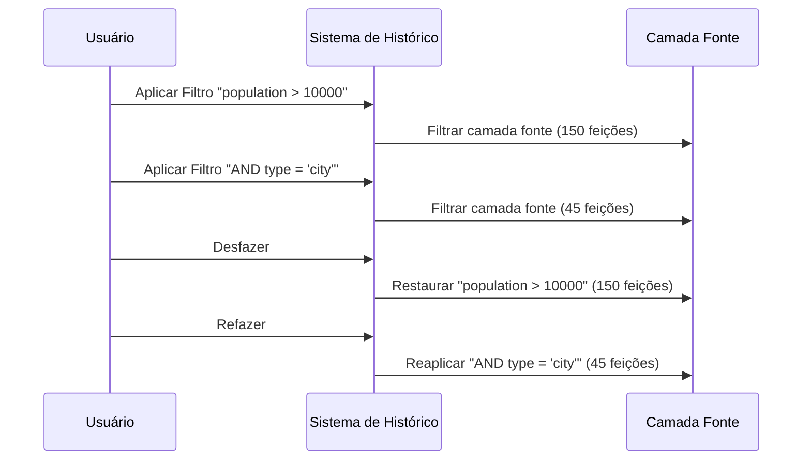
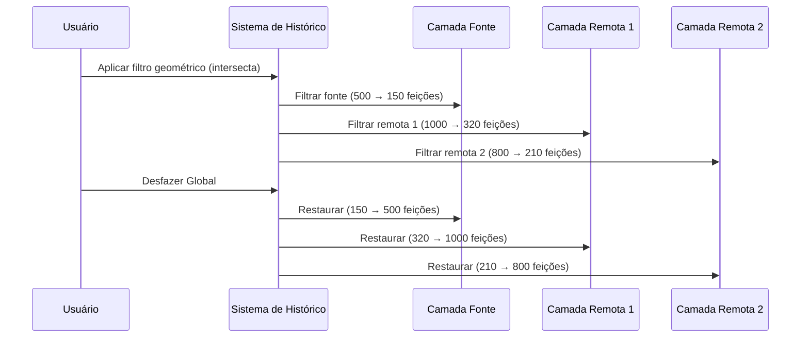

# Histórico de Filtros & Desfazer/Refazer

FilterMate v2.3.0 apresenta um sistema de histórico inteligente com capacidades de desfazer/refazer contextuais.

:::info Versão 2.3.0
Esta página documenta o novo sistema Global Undo/Redo introduzido na v2.3.0. Versões anteriores tinham um sistema de desfazer mais simples para camada única.
:::

## Visão Geral

O sistema de **Histórico de Filtros** registra automaticamente cada filtro aplicado, permitindo:
- **Desfazer/Refazer** filtros com detecção inteligente de contexto
- **Restauração Camada Fonte** ou **Global** baseada na sua seleção
- **Navegar** através dos estados de filtro de forma fluida
- **Preservar** automaticamente filtros (combinados com AND por padrão)

### Funcionalidades Principais

- ✅ **Histórico Automático** - Cada filtro é registrado (até 100 estados)
- ✅ **Desfazer/Refazer Inteligente** - Restauração contextual de camadas
- ✅ **Modo Global** - Restaurar múltiplas camadas simultaneamente
- ✅ **Modo Fonte** - Desfazer apenas a camada ativa
- ✅ **Botões Inteligentes** - Ativação/desativação automática baseada no histórico disponível
- ✅ **Específico por Camada** - Histórico separado por camada

## Botões Desfazer/Refazer

Os botões Desfazer e Refazer estão localizados na **Barra de Ações** no topo do painel FilterMate:

| Botão | Ícone | Ação |
|-------|-------|------|
| **DESFAZER** | ↩️ | Voltar ao estado de filtro anterior |
| **REFAZER** | ↪️ | Reaplicar o filtro desfeito |

### Estados dos Botões

Os botões **ativam/desativam automaticamente** baseado na disponibilidade do histórico:
- **Ativado** (clicável): Histórico disponível nessa direção
- **Desativado** (cinza): Nenhum histórico para navegar

## Dois Modos de Desfazer/Refazer

FilterMate escolhe inteligentemente entre dois modos baseado na sua configuração atual:

### 🎯 Modo Camada Fonte Apenas

**Quando ativado:**
- O botão **"Camadas a Filtrar"** está **desmarcado** OU
- Nenhuma camada remota está selecionada

**Comportamento:**
- Desfazer/Refazer afeta **apenas a camada fonte**
- Rápido e simples para workflows de camada única



### 🌐 Modo Global

**Quando ativado:**
- O botão **"Camadas a Filtrar"** está **marcado** E
- Uma ou mais camadas remotas estão selecionadas

**Comportamento:**
- Desfazer/Refazer restaura **todas as camadas afetadas simultaneamente**
- Camada fonte + todas as camadas remotas são restauradas ao estado anterior



## Como Funciona

### Captura de Estado

Quando você aplica um filtro, FilterMate captura:

**Histórico Camada Fonte:**
- Expressão de filtro (subset string)
- Número de feições após filtro
- Timestamp
- Metadados da operação

**Histórico Global (quando camadas remotas selecionadas):**
- Estado da camada fonte
- Estados de todas as camadas remotas (expressão + contagem)
- Snapshot combinado para restauração atômica

### Detecção de Contexto

FilterMate verifica o estado da interface antes de cada desfazer/refazer:

```python
# Lógica simplificada
botao_marcado = botão "Camadas a Filtrar" está marcado
tem_camadas_remotas = camadas remotas estão selecionadas

if botao_marcado AND tem_camadas_remotas:
    usar_modo_global()  # Restaurar todas as camadas
else:
    usar_modo_fonte()  # Restaurar fonte apenas
```

## Exemplos de Workflows

### Workflow Camada Única

1. Selecione uma camada no QGIS
2. Aplique filtro: `"population" > 10000` → 150 feições
3. Aplique filtro: `"type" = 'residential'` → 45 feições
4. Clique **Desfazer** → Volta para 150 feições
5. Clique **Desfazer** → Volta para todas as feições (sem filtro)
6. Clique **Refazer** → 150 feições novamente

### Workflow Multi-Camadas

1. Selecione a camada fonte (ex: "edifícios")
2. Ative o botão **"Camadas a Filtrar"**
3. Selecione camadas remotas: "parcelas", "estradas"
4. Aplique filtro geométrico: intersecta com seleção
   - edifícios: 500 → 150 feições
   - parcelas: 1000 → 320 feições
   - estradas: 800 → 210 feições
5. Clique **Desfazer** → **Todas as 3 camadas** restauradas simultaneamente
6. Clique **Refazer** → **Todas as 3 camadas** filtradas novamente

### Filtragem Progressiva com Preservação

:::tip Preservação de Filtros (v2.3.0)
Novos filtros são automaticamente combinados com filtros existentes usando AND por padrão.
:::

```
Passo 1: Filtro geométrico (intersecta polígono)
         → Fonte: 150 feições

Passo 2: Filtro de atributo: "population" > 5000
         → Combinado: (geométrico) AND (population > 5000)
         → Fonte: 23 feições

Passo 3: Desfazer
         → Volta para: 150 feições (apenas geométrico)

Passo 4: Refazer
         → Avança para: 23 feições (combinado)
```

## Configuração

### Tamanho do Histórico

Histórico máximo padrão: **100 estados** por camada

Configurado em `modules/filter_history.py`:
```python
def __init__(self, layer_id: str, max_size: int = 100):
```

### Histórico Global

O histórico global também armazena até 100 estados para operações multi-camadas.

## Detalhes Técnicos

### Classe FilterState

Representa um único estado de filtro:
```python
class FilterState:
    expression: str      # Expressão de filtro (subset string)
    feature_count: int   # Feições visíveis após filtro
    description: str     # Descrição legível
    timestamp: datetime  # Data de aplicação
    metadata: dict       # Info adicional (backend, etc.)
```

### Classe GlobalFilterState

Representa um estado multi-camadas:
```python
class GlobalFilterState:
    source_layer_id: str                    # ID camada fonte
    source_expression: str                  # Filtro fonte
    remote_layers: Dict[str, Tuple[str, int]]  # {layer_id: (expression, count)}
    timestamp: datetime                     # Data de captura
    description: str                        # Descrição legível
```

### Classe HistoryManager

Gerencia histórico de camada única e global:
```python
class HistoryManager:
    - get_history(layer_id) -> FilterHistory
    - push_global_state(source_id, source_expr, remote_layers, desc)
    - undo_global() -> GlobalFilterState
    - redo_global() -> GlobalFilterState
    - can_undo_global() -> bool
    - can_redo_global() -> bool
```

## Solução de Problemas

### Botões Desfazer/Refazer Desativados

**Causa:** Nenhum histórico disponível nessa direção

**Soluções:**
- Aplique pelo menos um filtro para ativar Desfazer
- Desfaça pelo menos uma vez para ativar Refazer
- Verifique se você está no início/fim do histórico

### Desfazer Global Não Restaura Todas as Camadas

**Causa:** Camadas remotas podem ter sido removidas do projeto

**Solução:** FilterMate registra avisos para camadas ausentes:
```
FilterMate: Remote layer {id} no longer exists, skipping
```

### Histórico Perdido Após Recarregar

**Comportamento atual:** O histórico é **apenas em memória** e reseta quando:
- QGIS é fechado
- O plugin é recarregado
- O projeto é alterado

**Nota:** Histórico persistente entre sessões é uma melhoria futura potencial.

## Melhores Práticas

### 1. Use Modo Global para Operações Multi-Camadas

Quando filtrar múltiplas camadas juntas, sempre:
1. Ative "Camadas a Filtrar"
2. Selecione todas as camadas remotas afetadas
3. Aplique o filtro uma vez → todas as camadas filtradas
4. Use Desfazer Global para restaurar tudo de uma vez

### 2. Refinamento Progressivo

Construa filtros complexos passo a passo:
```
Passo 1: Filtro geométrico amplo
Passo 2: Adicione restrição de atributo
Passo 3: Adicione outra restrição
→ Cada passo registrado, facilmente reversível
```

### 3. Verifique Estados dos Botões

Antes de clicar Desfazer/Refazer:
- Botão ativado = ação disponível
- Botão desativado = nenhum histórico nessa direção

### 4. Entenda o Contexto

Antes de desfazer:
- **Desmarcado** "Camadas a Filtrar" = desfazer fonte apenas
- **Marcado** + camadas remotas = desfazer global (todas as camadas)

## Tópicos Relacionados

- [Noções Básicas de Filtragem](filtering-basics.md) - Criar filtros
- [Filtragem Geométrica](geometric-filtering.md) - Operações espaciais
- [Visão Geral da Interface](interface-overview.md) - Navegar na interface
