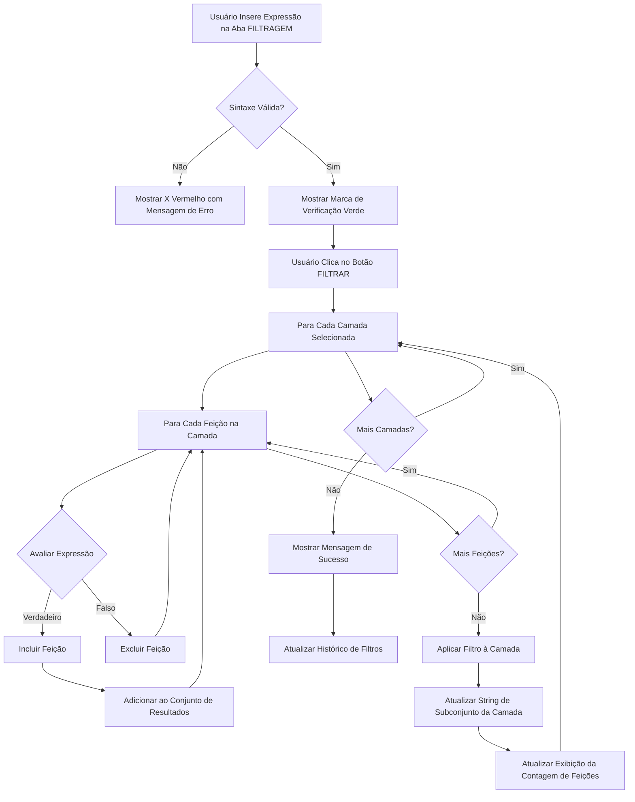

# Noções Básicas de Filtragem

Aprenda a filtrar dados vetoriais usando expressões QGIS e condições de atributos na aba **FILTRAGEM** do FilterMate.

## Visão Geral

A **aba FILTRAGEM** é seu centro de controle para configurar todos os tipos de filtros em camadas vetoriais. Ela fornece três capacidades principais de filtragem:

1. **Filtragem por Atributos** - Filtrar feições com base em seus valores de atributos usando expressões QGIS
2. **Filtragem Geométrica** - Filtrar com base em relacionamentos espaciais (veja [Filtragem Geométrica](./geometric-filtering))
3. **Operações de Buffer** - Adicionar zonas de proximidade para análise espacial (veja [Operações de Buffer](./buffer-operations))

Esta página foca na **filtragem por atributos** usando expressões QGIS.

:::tip Localização
Todas as operações de filtragem são configuradas na aba **FILTRAGEM** no topo do painel FilterMate. Não confunda com a aba EXPLORAÇÃO, que funciona apenas na camada ativa atual.
:::

## Componentes da Aba FILTRAGEM

### Seleção de Camadas

Antes de filtrar, você deve selecionar uma ou mais camadas fonte:


*Seleção múltipla de camadas com indicadores de tipo de geometria (ponto/linha/polígono)*

**Recursos**:
- **Seleção múltipla**: Marque múltiplas camadas para filtrá-las simultaneamente
- **Ícones de geometria**: Indicação visual do tipo de camada (🔵 Ponto, 🟢 Linha, 🟪 Polígono)
- **Emblemas de backend**: Mostra o tipo de fonte de dados (PostgreSQL⚡, Spatialite, OGR)
- **Camada Atual Automática**: Botão de alternância para usar automaticamente a camada ativa do QGIS


*Alternar modo "Camada Atual Automática"*

Quando "Camada Atual Automática" está ativado, FilterMate seleciona automaticamente qualquer camada que esteja ativa no QGIS, tornando a filtragem rápida mais conveniente.

**Exibição de Informações da Camada**:


*Informações da camada: tipo de provedor, contagem de feições, SRC*

Mostra detalhes críticos da camada:
- Tipo de provedor (PostgreSQL, Spatialite, OGR)
- Contagem total de feições
- Sistema de Referência de Coordenadas (SRC)
- Campo de chave primária

### Construtor de Expressões

FilterMate usa **expressões QGIS** para filtrar feições. Essas expressões são avaliadas contra os atributos de cada feição para determinar quais feições devem ser incluídas no resultado.


*Construtor de expressões com entrada de texto livre*

**Recursos principais**:
- Entrada de expressão em texto livre
- Validação de sintaxe em tempo real
- Acesso a todas as funções de expressão QGIS
- Preenchimento automático de nomes de campos

**Lista de Campos**:

A lista de campos mostra:
- Todos os campos de atributos da(s) camada(s) selecionada(s)
- Tipo de dados para cada campo
- Clicar em um campo o insere na expressão

### Validação de Expressão

FilterMate valida suas expressões em tempo real:

**Expressão Válida**:
*Marca de verificação verde (✓) indica expressão válida*

**Expressão Inválida**:
*X vermelho (✗) com mensagem de erro detalhada*

Mensagens de erro mostram:
- Linha e coluna do erro de sintaxe
- Descrição do problema
- Sugestões para correção

## Conceitos Principais

- **Expressão**: Uma fórmula que avalia como `verdadeiro` ou `falso` para cada feição
- **Atributo**: Uma propriedade de uma feição (ex: `população`, `nome`, `area`)
- **Operador**: Símbolos de comparação como `=`, `>`, `<`, `LIKE`, `IN`
- **Função**: Operações integradas como `upper()`, `length()`, `year()`

## Sintaxe de Expressão

### Comparações Básicas

```sql
-- Comparações numéricas
populacao > 100000
area >= 50
ano = 2024

-- Comparações de texto (sensível a maiúsculas)
nome = 'Paris'
status != 'inativo'

-- Pesquisa de texto (insensível a maiúsculas)
upper(nome) LIKE '%CIDADE%'
nome ILIKE 'paris'
```

### Condições Múltiplas

```sql
-- AND: Todas as condições devem ser verdadeiras
populacao > 50000 AND area < 100

-- OR: Pelo menos uma condição deve ser verdadeira
tipo = 'cidade' OR tipo = 'vila'

-- Combinações complexas
(populacao > 100000 OR capital = 'sim') AND pais = 'Brasil'
```

### Trabalhando com Valores NULL

```sql
-- Verificar NULL
nome IS NULL
descricao IS NOT NULL

-- Tratamento seguro de NULL
COALESCE(populacao, 0) > 0
```

## Padrões Comuns de Filtragem

### Filtragem de Texto

#### Correspondência Exata
```sql
-- Sensível a maiúsculas
cidade = 'São Paulo'

-- Insensível a maiúsculas
upper(cidade) = 'SÃO PAULO'
```

#### Correspondência de Padrão
```sql
-- Começa com
nome LIKE 'São%'

-- Contém (insensível a maiúsculas)
nome ILIKE '%do sul%'

-- Termina com
nome LIKE '%polis'

-- Múltiplos padrões
nome LIKE 'São%' OR nome LIKE 'Rio%'
```

#### Múltiplos Valores
```sql
-- Operador IN
status IN ('ativo', 'pendente', 'revisão')

-- NOT IN
pais NOT IN ('Brasil', 'Argentina')
```

### Filtragem Numérica

#### Consultas de Intervalo
```sql
-- Entre
populacao BETWEEN 10000 AND 50000

-- Equivalente a
populacao >= 10000 AND populacao <= 50000

-- Fora do intervalo
populacao NOT BETWEEN 10000 AND 50000
```

#### Operações Aritméticas
```sql
-- Valores calculados
densidade > populacao / area

-- Porcentagem
(vendas / meta) * 100 > 80

-- Arredondar valores
round(area, 2) = 123.45
```

### Filtragem de Datas

#### Comparações Básicas de Datas
```sql
-- Data específica
data = '2024-01-15'

-- Intervalo de datas
data >= '2024-01-01' AND data < '2024-02-01'

-- Ano
year(data) = 2024

-- Mês
month(data) = 6
```

#### Datas Relativas
```sql
-- Registros recentes
data >= now() - interval '7 days'

-- Ano passado
year(data) = year(now()) - 1

-- Mês atual
year(data) = year(now()) AND month(data) = month(now())
```

## Funções de String

### Conversão de Maiúsculas/Minúsculas
```sql
-- Maiúsculas
upper(nome) = 'SÃO PAULO'

-- Minúsculas
lower(nome) = 'são paulo'
```

### Operações de String
```sql
-- Concatenação
nome || ' ' || pais = 'São Paulo Brasil'

-- Comprimento
length(nome) > 10

-- Substring
substr(codigo, 1, 2) = 'BR'

-- Remover espaços em branco
trim(nome) = 'São Paulo'
```

### Correspondência de Padrão
```sql
-- Expressão regular
regexp_match(nome, '^[A-Z]{2}[0-9]{3}$')

-- Substituir
replace(nome, 'São', 'S.') = 'S. Paulo'
```

## Fluxo de Expressão

FilterMate processa expressões em várias etapas:



**Etapas Principais**:
1. **Entrada de Expressão**: Digite ou construa a expressão na aba FILTRAGEM
2. **Validação**: Verificação em tempo real de erros de sintaxe (✓ ou ✗)
3. **Aplicar Filtro**: Clique no botão FILTRAR para executar
4. **Processamento**: Backend (PostgreSQL/Spatialite/OGR) avalia a expressão
5. **Resultados**: Feições filtradas exibidas, contagem de feições atualizada
6. **Histórico**: Filtro salvo no histórico para reutilização

## Fluxo de Trabalho de Filtragem Passo a Passo

### Exemplo Completo: Filtrar Cidades por População

**Cenário**: Encontrar todas as cidades com população maior que 100.000

**Passo 1 - Abrir Aba FILTRAGEM**


*Alternar para a aba FILTRAGEM no painel FilterMate*

**Passo 2 - Selecionar Camada Fonte**


- Marcar a camada "MUNICIPIO" no seletor de camadas
- Verificar que as informações da camada são exibidas (contagem de feições, SRC)

**Passo 3 - Inserir Expressão**


*Digite a expressão: `populacao > 100000`*

**Passo 4 - Verificar Lista de Campos**

*Verificar campos disponíveis: populacao (Integer64), nome (String), area (Double)*

Você pode clicar nos campos para inseri-los na expressão.

**Passo 5 - Validar Expressão**
<!--  confirma expressão válida*

O validador mostra:
- ✓ Sintaxe está correta
- Visualização da contagem estimada de feições (opcional, se ativado)

**Passo 6 - Aplicar Filtro**


*Clicar no botão FILTRAR → Barra de progresso aparece durante processamento*

**Passo 7 - Visualizar Resultados**
<!--  camada(s) selecionada(s)
3. **Compatibilidade de Tipo**: Avisa sobre incompatibilidades de tipo (ex: comparar texto com números)

**Feedback Visual**:
- ✅ **Marca de verificação verde**: Expressão é válida e pronta para aplicar
- ❌ **X vermelho**: Erro de sintaxe detectado, veja mensagem de erro
- ⚠️ **Aviso laranja**: Expressão válida mas pode ter problemas de desempenho

### Testando Contra Feições de Exemplo

Para expressões complexas, você pode testar com dados reais:

1. Ativar "Visualização de Expressão" na aba Configuração
2. Construtor de expressões mostra quantas feições correspondem
3. Ajustar expressão com base nos resultados da visualização

:::tip
Para camadas muito grandes (> 100k feições), a visualização pode ser desativada por desempenho. Nesse caso, aplique o filtro e verifique a contagem de resultados.
:::

### Erros Comuns

#### Erros de Sintaxe
```sql
-- ❌ Errado: Aspas faltando ao redor do texto
nome = São Paulo

-- ✅ Correto: Texto entre aspas
nome = 'São Paulo'

-- ❌ Errado: Parênteses desbalanceados
(populacao > 1000 AND area < 50

-- ✅ Correto: Parênteses balanceados
(populacao > 1000 AND area < 50)
```

**FilterMate mostra**: "Erro de sintaxe na coluna 11: ')' esperado"

#### Incompatibilidades de Tipo
```sql
-- ❌ Errado: Comparar campo de texto com número
nome > 100

-- ✅ Correto: Converter para número se necessário
to_int(nome) > 100

-- ❌ Errado: Usar operador numérico em texto
codigo_cidade + 100

-- ✅ Correto: Concatenar como texto
codigo_cidade || '100'
```

**FilterMate mostra**: "Erro de tipo: não é possível comparar String e Integer"

#### Tratamento de NULL
```sql
-- ❌ Errado: Comparações NULL sempre retornam falso
populacao = NULL

-- ✅ Correto: Usar IS NULL
populacao IS NULL

-- ❌ Errado: NULL em aritmética quebra o cálculo
populacao + renda > 50000

-- ✅ Correto: Tratar NULL explicitamente
COALESCE(populacao, 0) + COALESCE(renda, 0) > 50000
```

**FilterMate mostra**: "Aviso: Expressão pode retornar resultados inesperados com valores NULL"

#### Erros de Nome de Campo
```sql
-- ❌ Errado: Campo não existe
populasao > 1000  -- Erro de digitação!

-- ✅ Correto: Usar lista de campos para evitar erros de digitação
populacao > 1000

-- ❌ Errado: Nome de campo com espaços, sem aspas
Populacao 2024 > 1000

-- ✅ Correto: Aspas em nomes de campos com espaços
"Populacao 2024" > 1000
```

**FilterMate mostra**: "Campo 'populasao' não encontrado na camada"

### Dicas de Depuração

1. **Começar Simples**: Construir expressões complexas incrementalmente
   ```sql
   -- Passo 1: Testar comparação básica
   populacao > 100000
   
   -- Passo 2: Adicionar segunda condição
   populacao > 100000 AND area > 50
   
   -- Passo 3: Adicionar terceira condição
   populacao > 100000 AND area > 50 AND status = 'ativo'
   ```

2. **Usar Lista de Campos**: Clicar em campos para inseri-los corretamente
   - Evita erros de digitação
   - Lida com caracteres especiais automaticamente
   - Adiciona aspas apropriadas para nomes de campos com espaços

3. **Verificar Tipos de Dados**: Ver lista de campos para conhecer tipos de dados
   - Integer64: Usar comparações numéricas (`>`, `<`, `=`)
   - String: Usar funções de texto (`LIKE`, `upper()`, `||`)
   - Date: Usar funções de data (`year()`, `month()`, `age()`)

4. **Testar em Subconjunto Pequeno Primeiro**: 
   - Adicionar cláusula `LIMIT` para teste: `populacao > 100000 LIMIT 10`
   - Remover LIMIT após expressão validada

## Melhores Práticas

### Dicas de Desempenho

1. **Expressões Compatíveis com Índice**
   ```sql
   -- ✅ Bom: Usa índice
   populacao > 100000
   
   -- ❌ Lento: Impede uso de índice
   populacao * 2 > 200000
   ```

2. **Evitar Funções Complexas em Grandes Conjuntos de Dados**
   ```sql
   -- ✅ Rápido: Comparação simples
   ano = 2024
   
   -- ⚠️ Mais lento: Chamada de função por feição
   year(data) = 2024
   ```

3. **Filtrar Cedo**
   - Aplicar filtros simples primeiro
   - Usar filtros geométricos após filtros de atributos
   - Combinar condições eficientemente

### Legibilidade

1. **Usar Nomes de Colunas Claros**
   ```sql
   -- ✅ Claro
   "Populacao 2024" > 100000
   
   -- ❌ Pouco claro
   "col_23" > 100000
   ```

2. **Formatar Expressões Complexas**
   ```sql
   -- Multi-linha para legibilidade
   (
       status = 'ativo'
       AND populacao > 50000
   )
   OR (
       status = 'pendente'
       AND prioridade = 'alta'
   )
   ```

3. **Comentar Lógica Complexa**
   ```sql
   -- Grandes cidades ou capitais regionais
   populacao > 100000 OR capital = 'regional'
   ```

## Exemplos Práticos

### Planejamento Urbano
```sql
-- Áreas residenciais de alta densidade
zona = 'residencial' AND densidade > 100 AND ano_construcao >= 2000

-- Oportunidades de desenvolvimento de uso misto
(zona = 'comercial' OR zona = 'misto') AND area_disponivel > 1000
```

### Análise Ambiental
```sql
-- Áreas naturais protegidas acima de 50 hectares
status_protecao = 'protegido' AND area >= 500000 AND tipo_habitat IN ('floresta', 'pantano')

-- Corpos d'água com problemas de qualidade
tipo_agua IN ('rio', 'lago') AND indice_qualidade < 60
```

### Transporte
```sql
-- Estradas principais precisando manutenção
classe_estrada IN ('rodovia', 'principal') AND condicao = 'ruim' AND contagem_trafego > 10000

-- Pontos de transporte em áreas mal atendidas
frequencia_servico < 4 AND populacao_proxima > 5000
```

## Tópicos Relacionados

- [Filtragem Geométrica](./geometric-filtering) - Predicados espaciais e camadas de referência na aba FILTRAGEM
- [Operações de Buffer](./buffer-operations) - Adicionar zonas de proximidade na aba FILTRAGEM
- [Visão Geral da Interface](./interface-overview) - Guia completo de componentes da aba FILTRAGEM
- [Histórico de Filtros](./filter-history) - Gerenciar e reutilizar filtros salvos

## Próximos Passos

Agora que você entende a filtragem por atributos na aba FILTRAGEM, aprenda sobre:

1. **[Filtragem Geométrica](./geometric-filtering)** - Adicionar predicados espaciais para encontrar feições com base na localização
2. **[Operações de Buffer](./buffer-operations)** - Criar zonas de proximidade para análise espacial
3. **[Exportar Feições](./export-features)** - Salvar seus resultados filtrados em vários formatos

**Fluxo de Trabalho Completo**: Veja o [Guia de Início Rápido](../getting-started/quick-start) para um exemplo passo a passo de filtragem.
