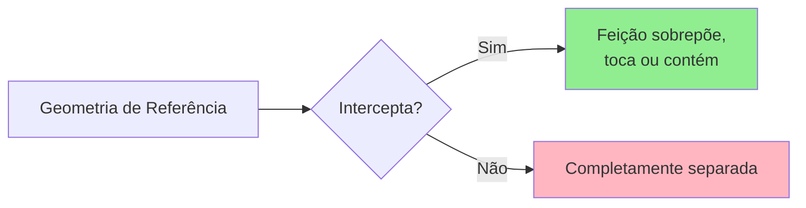
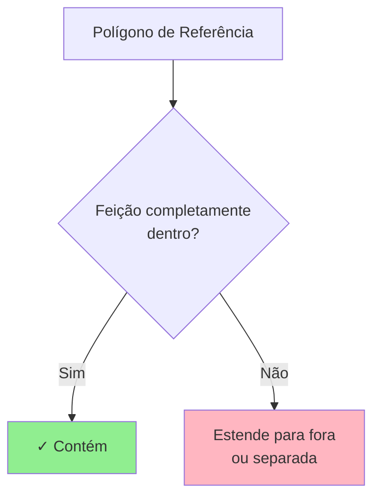
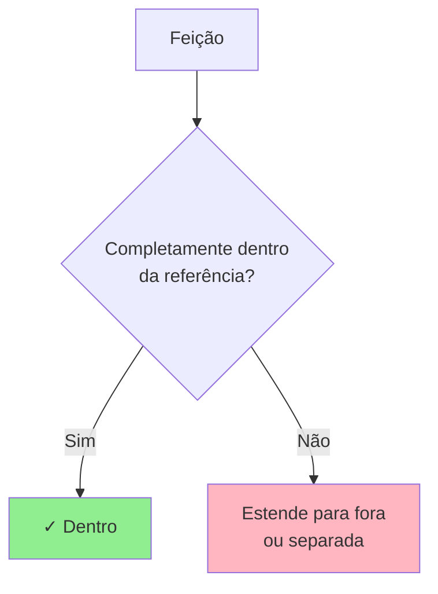
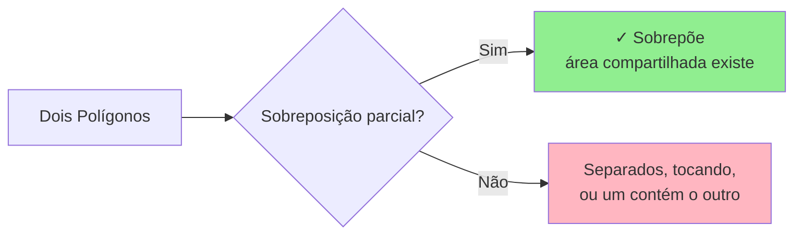
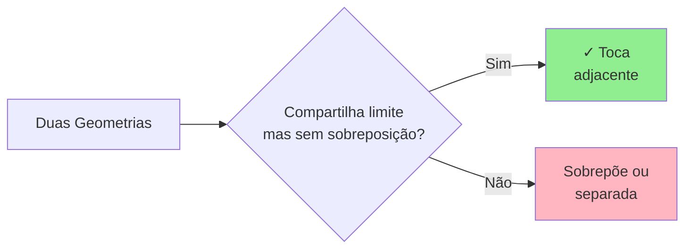
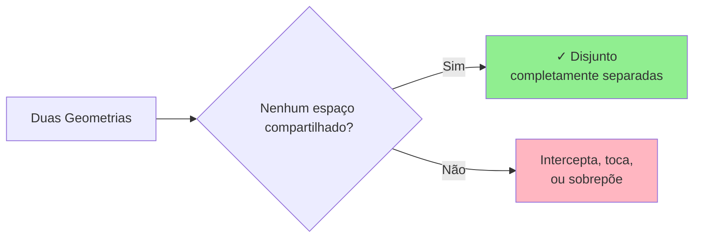
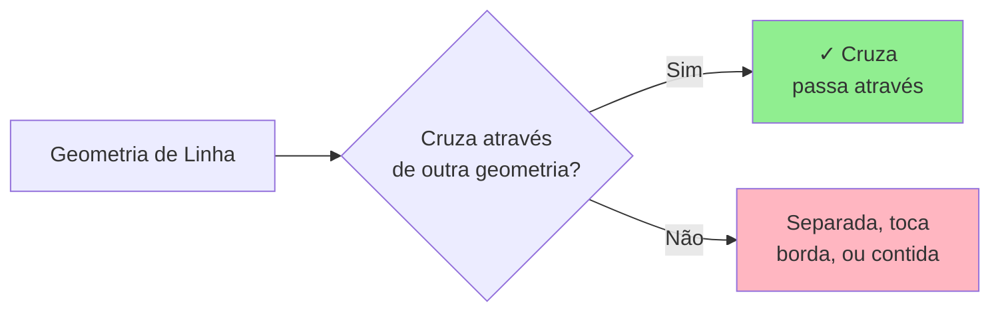
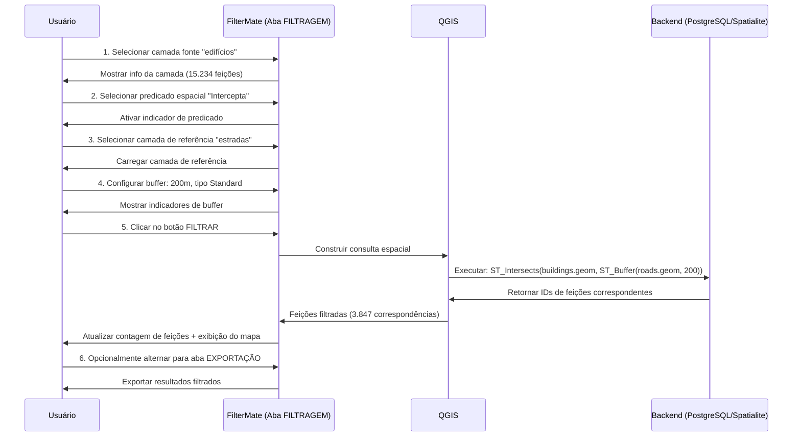

# Filtragem Geométrica

Filtre feições com base em seus relacionamentos espaciais com outras geometrias usando os predicados geométricos e o seletor de camada de referência da aba **FILTRAGEM**.

## Visão Geral

A filtragem geométrica no FilterMate permite selecionar feições com base em seus **relacionamentos espaciais** com uma camada de referência. Isso é configurado na mesma aba **FILTRAGEM** onde você configura filtros de atributos.

**Componentes principais na Aba FILTRAGEM**:
- **Predicados Espaciais**: Seleção múltipla de relacionamentos geométricos (Intercepta, Contém, Dentro, etc.)
- **Camada de Referência**: Escolher qual camada comparar
- **Operador de Combinação**: Usar E/OU quando múltiplos predicados são selecionados
- **Integração de Buffer**: Combinar com zonas de buffer para análise de proximidade

 

*Seleção múltipla de predicados espaciais na aba FILTRAGEM*

 

*Selecionar camada de referência para comparação espacial*

 

*Escolher E/OU para combinar múltiplos predicados*

### Casos de Uso Comuns

- **Contenção**: Encontrar parcelas dentro de um município
- **Interseção**: Identificar estradas cruzando uma planície de inundação
- **Proximidade**: Selecionar edifícios perto de uma estação de transporte (com buffer)
- **Adjacência**: Encontrar polígonos vizinhos

:::tip Localização
Toda filtragem geométrica é configurada na aba **FILTRAGEM**, junto com filtros de atributos. Não confunda com a aba **EXPLORAÇÃO**, que é para visualizar e selecionar feições da camada atual.
:::

## Predicados Espaciais

### Intercepta

Feições que **compartilham qualquer espaço** com a geometria de referência.



**Exemplos de Casos de Uso:**
- Estradas cruzando um distrito
- Propriedades tocando um rio
- Parcelas dentro ou sobrepondo uma zona

**Expressão:**
```sql
intersects($geometry, geometry(get_feature('zones', 'id', 1)))
```

### Contém

Geometria de referência **contém completamente** a feição (feição está inteiramente dentro).



**Exemplos de Casos de Uso:**
- Edifícios inteiramente dentro de uma parcela
- Parques completamente dentro dos limites da cidade
- Pontos dentro de polígonos

**Expressão:**
```sql
contains(
    geometry(get_feature('parcels', 'id', @selected_parcel_id)),
    $geometry
)
```

### Dentro

Feição está **completamente dentro** da geometria de referência (inverso de Contém).



**Exemplos de Casos de Uso:**
- Encontrar em qual distrito um ponto está
- Propriedades inteiramente dentro de uma zona
- Feições contidas por um limite

**Expressão:**
```sql
within($geometry, geometry(get_feature('districts', 'name', 'Centro')))
```

### Sobrepõe

Feições que **se sobrepõem parcialmente** (alguma área compartilhada, mas nenhuma contém a outra).



**Exemplos de Casos de Uso:**
- Zonas de uso do solo sobrepostas
- Reivindicações de propriedade conflitantes
- Limites administrativos cruzados

**Expressão:**
```sql
overlaps($geometry, geometry(get_feature('zones', 'type', 'comercial')))
```

### Toca

Feições que **compartilham um limite** mas não se sobrepõem.



**Exemplos de Casos de Uso:**
- Parcelas adjacentes
- Unidades administrativas vizinhas
- Segmentos de estrada conectados

**Expressão:**
```sql
touches($geometry, geometry(get_feature('parcels', 'id', @parcel_id)))
```

### Disjunto

Feições que **não compartilham nenhum espaço** (completamente separadas).



**Exemplos de Casos de Uso:**
- Feições fora de uma área restrita
- Regiões não adjacentes
- Feições isoladas

**Expressão:**
```sql
disjoint($geometry, geometry(get_feature('restricted', 'id', 1)))
```

### Cruza

Uma linha **cruza através** de um polígono ou outra linha.



**Exemplos de Casos de Uso:**
- Estradas cruzando limites de distrito
- Tubulações passando através de zonas
- Trilhas cruzando rios

**Expressão:**
```sql
crosses($geometry, geometry(get_feature('districts', 'name', 'Industrial')))
```

## Funções Geométricas

### Cálculos de Distância

```sql
-- Feições dentro de 500 metros
distance($geometry, geometry(get_feature('stations', 'id', 1))) < 500

-- Encontrar feições mais próximas
distance($geometry, @reference_geom) < @max_distance
```

### Área e Comprimento

```sql
-- Polígonos grandes (área em unidades do mapa)
area($geometry) > 10000

-- Estradas longas (comprimento em unidades do mapa)
length($geometry) > 1000

-- Perímetro
perimeter($geometry) > 500
```

### Operações de Centroide

```sql
-- Feições cujo centroide está em um polígono
within(
    centroid($geometry),
    geometry(get_feature('zones', 'type', 'residencial'))
)

-- Distância do centroide
distance(
    centroid($geometry),
    make_point(lon, lat)
) < 1000
```

## Combinando Filtros

### Espacial + Atributo

```sql
-- Edifícios residenciais perto de transporte
zone_type = 'residencial'
AND distance($geometry, geometry(get_feature('transit', 'id', 1))) < 500
```

### Múltiplas Condições Espaciais

```sql
-- Dentro do distrito mas não em zona restrita
within($geometry, geometry(get_feature('districts', 'id', 5)))
AND disjoint($geometry, geometry(get_feature('restricted', 'id', 1)))
```

### Cenários Complexos

```sql
-- Propriedades perto do rio mas fora da planície de inundação
distance($geometry, geometry(get_feature('rivers', 'name', 'Rio Principal'))) < 200
AND NOT within($geometry, geometry(get_feature('floodplain', 'risk', 'alto')))
AND property_type = 'residencial'
```

## Exemplo de Fluxo de Trabalho: Filtragem Geométrica

**Fluxo de trabalho completo para encontrar edifícios perto de estradas com buffer:**



### Passo a Passo: Filtro Geométrico Completo

**Cenário**: Encontrar edifícios a menos de 200m de estradas

<!-- <!-- *

<!-- <!-- *

<!-- <!-- *

<!-- <!-- *

<!-- <!-- *

**Lógica do Operador de Combinação**:
- **E**: Feição deve satisfazer TODOS os predicados selecionados
- **OU**: Feição deve satisfazer PELO MENOS UM predicado

```sql
-- Exemplo E: Deve interceptar E tocar
ST_Intersects(geom, ref) AND ST_Touches(geom, ref)

-- Exemplo OU: Pode interceptar OU tocar
ST_Intersects(geom, ref) OR ST_Touches(geom, ref)
```

## Comportamento Específico do Backend

### PostgreSQL (Mais Rápido)

```sql
-- Usa índice espacial GIST
ST_Intersects(geometry, reference_geometry)
```

- ✅ Suporte completo a índice espacial
- ✅ Otimizado para grandes conjuntos de dados
- ✅ Aceleração por hardware

### Spatialite (Rápido)

```sql
-- Usa índice espacial R-tree
ST_Intersects(geometry, reference_geometry)
```

- ✅ Índice espacial R-tree
- ✅ Bom desempenho para conjuntos de dados médios
- ⚠️ Mais lento que PostgreSQL para consultas complexas

### OGR (Fallback)

```sql
-- Sem índice espacial
-- Escaneia todas as feições
```

- ❌ Sem índice espacial
- ⚠️ Desempenho degrada com tamanho
- ✓ Compatibilidade universal

:::tip Dica de Desempenho
Para grandes conjuntos de dados com consultas espaciais frequentes, use **PostgreSQL** com índices GIST para melhor desempenho.
:::

## Exemplos Práticos

### Planejamento Urbano

#### Encontrar Parcelas Perto de Transporte
```sql
-- Dentro de 400m de distância a pé
distance(
    centroid($geometry),
    geometry(get_feature('metro_stations', 'line', 'Vermelha'))
) < 400
AND land_use = 'não desenvolvido'
```

#### Identificar Oportunidades de Desenvolvimento
```sql
-- Parcelas grandes, não em áreas protegidas
area($geometry) > 5000
AND disjoint($geometry, geometry(get_feature('protected_areas', 'status', 'ativo')))
AND zone = 'uso misto'
```

### Análise Ambiental

#### Impacto de Áreas Protegidas
```sql
-- Projetos interceptando zonas protegidas
intersects(
    $geometry,
    geometry(get_feature('protected', 'category', 'vida selvagem'))
)
AND project_status = 'proposto'
```

#### Análise de Bacia Hidrográfica
```sql
-- Propriedades dentro da bacia hidrográfica
within(
    $geometry,
    geometry(get_feature('watersheds', 'name', 'Bacia Principal'))
)
AND distance($geometry, geometry(get_feature('rivers', 'id', 1))) < 100
```

### Serviços de Emergência

#### Análise de Cobertura
```sql
-- Áreas NÃO cobertas por estações de bombeiros (>5km)
distance(
    centroid($geometry),
    aggregate('fire_stations', 'collect', $geometry)
) > 5000
```

#### Rotas de Evacuação
```sql
-- Estradas dentro da zona de evacuação
intersects(
    $geometry,
    buffer(geometry(get_feature('hazard', 'type', 'inundação')), 1000)
)
AND road_type IN ('rodovia', 'principal')
```

## Otimização de Desempenho

### 1. Usar Índices Espaciais

Garanta que índices espaciais existam:

**PostgreSQL:**
```sql
CREATE INDEX idx_geom ON table_name USING GIST (geometry);
```

**Spatialite:**
```sql
SELECT CreateSpatialIndex('table_name', 'geometry');
```

### 2. Simplificar Geometrias de Referência

```sql
-- Simplificar antes de filtrar (mais rápido)
intersects(
    $geometry,
    simplify(geometry(get_feature('complex_polygon', 'id', 1)), 10)
)
```

### 3. Filtrar Atributos Primeiro

```sql
-- ✅ Rápido: Filtrar por atributo primeiro
status = 'ativo'
AND intersects($geometry, @reference_geom)

-- ❌ Mais lento: Filtro espacial primeiro
intersects($geometry, @reference_geom)
AND status = 'ativo'
```

### 4. Usar Verificações de Caixa Delimitadora

```sql
-- Verificação rápida de caixa delimitadora antes de operação espacial cara
bbox($geometry, @reference_geom)
AND intersects($geometry, @reference_geom)
```

## Solução de Problemas

### Geometrias Inválidas

```sql
-- Verificar validade da geometria
is_valid($geometry)

-- Reparar geometrias inválidas (se necessário)
make_valid($geometry)
```

### Reprojeção SRC {#crs-reprojection}

FilterMate lida automaticamente com transformações de sistema de referência de coordenadas (SRC) ao filtrar camadas com projeções diferentes.

**Comportamento Automático**:
- Camadas alvo e de referência podem usar SRC diferentes
- FilterMate reprojeta em tempo real para operações espaciais
- Você verá o indicador 🔄 nos logs quando reprojeção ocorrer

**Melhores Práticas**:
1. **Usar SRC projetado** para cálculos de distância precisos (ex: EPSG:3857, zonas UTM locais)
2. **Evitar SRC geográfico** (EPSG:4326) para operações de buffer - usar metros em vez de graus
3. **Verificar resultados** após reprojeção com inspeção visual

**Exemplo**:
```
Camada A: EPSG:4326 (WGS84) - Coordenadas globais
Camada B: EPSG:31983 (SIRGAS 2000 UTM 23S) - Projeção Brasil
FilterMate: Reprojeta automaticamente para comparação ✓
```

:::tip Nota de Desempenho
Transformações SRC frequentes podem desacelerar operações em grandes conjuntos de dados. Para melhor desempenho, garanta que suas camadas compartilhem o mesmo SRC antes de filtrar.
:::

### Resultados Vazios

1. **Verificar compatibilidade SRC** - Garantir que camadas usem projeções compatíveis (veja [Reprojeção SRC](#crs-reprojection))
2. **Verificar geometria de referência** - Confirmar que feição de referência existe
3. **Testar predicados mais simples** - Tentar `intersects` antes de `contains`
4. **Inspecionar geometrias** - Verificar geometrias NULL ou inválidas

### Problemas de Desempenho

1. **Verificar índices espaciais** - Verificar se índices existem e estão atualizados
2. **Simplificar geometrias** - Reduzir contagem de vértices se possível
3. **Usar backend apropriado** - PostgreSQL para grandes conjuntos de dados
4. **Quebrar consultas complexas** - Dividir em múltiplos filtros mais simples

## Tópicos Relacionados

- [Operações de Buffer](./buffer-operations) - Configurar zonas de buffer na aba FILTRAGEM para análise de proximidade
- [Noções Básicas de Filtragem](./filtering-basics) - Combinar filtros geométricos com filtros de atributos
- [Visão Geral da Interface](./interface-overview) - Guia completo de componentes da aba FILTRAGEM
- [Exportar Feições](./export-features) - Exportar resultados filtrados da aba EXPORTAÇÃO

:::info Componentes da Aba FILTRAGEM
A aba FILTRAGEM combina três tipos de filtros:
1. **Filtros de atributos** - Construtor de expressões (veja [Noções Básicas de Filtragem](./filtering-basics))
2. **Filtros geométricos** - Predicados espaciais + camada de referência (esta página)
3. **Operações de buffer** - Zonas de distância (veja [Operações de Buffer](./buffer-operations))

Os três podem ser usados juntos em uma única operação de filtragem.
:::

## Próximos Passos

- **[Operações de Buffer](./buffer-operations)** - Adicionar zonas de proximidade baseadas em distância a filtros geométricos
- **[Exportar Feições](./export-features)** - Salvar resultados filtrados em vários formatos

**Fluxo de Trabalho Completo**: Veja [Guia do Primeiro Filtro](../getting-started/first-filter) para um exemplo completo combinando filtros de atributos, geométricos e buffers.
